# Abilities

**Abilities** are a major pillar of the combat system in Mewgenics. There are over 1000 abilities in the game[[1]](#cite_note-1).  
Not including basic attacks, 172 [Collarless](/wiki/Collarless "Collarless") abilities are available to all cats (108 active + 64 passive), and each class introduces an additional 75 abilities (50 active + 25 passive), with the exception of [Jester](/wiki/Jester "Jester"), which introduces 6 (4 active + 2 passive). This is summarized by the following table:

| Class | Active Abilities | Passive Abilities | Basic Attacks | Total |
| --- | --- | --- | --- | --- |
| [Collarless Icon.svg](/wiki/Collarless "Collarless") [Collarless](/wiki/Collarless "Collarless") | 108 | 64 | 3 | **175** |
| [Fighter Icon.svg](/wiki/Fighter "Fighter") [Fighter](/wiki/Fighter "Fighter")  [Hunter Icon.svg](/wiki/Hunter "Hunter") [Hunter](/wiki/Hunter "Hunter")  [Mage Icon.svg](/wiki/Mage "Mage") [Mage](/wiki/Mage "Mage")  [Tank Icon.svg](/wiki/Tank "Tank") [Tank](/wiki/Tank "Tank")  [Cleric Icon.svg](/wiki/Cleric "Cleric") [Cleric](/wiki/Cleric "Cleric")  [Thief Icon.svg](/wiki/Thief "Thief") [Thief](/wiki/Thief "Thief")  [Necromancer Icon.svg](/wiki/Necromancer "Necromancer") [Necromancer](/wiki/Necromancer "Necromancer")  [Butcher Icon.svg](/wiki/Butcher "Butcher") [Butcher](/wiki/Butcher "Butcher")  [Druid Icon.svg](/wiki/Druid "Druid") [Druid](/wiki/Druid "Druid")  [Psychic Icon.svg](/wiki/Psychic "Psychic") [Psychic](/wiki/Psychic "Psychic") | 50 | 25 | 1 | **76** |
| [Tinkerer Icon.svg](/wiki/Tinkerer "Tinkerer") [Tinkerer](/wiki/Tinkerer "Tinkerer")  [Monk Icon.svg](/wiki/Monk "Monk") [Monk](/wiki/Monk "Monk") | 50 | 25 | 2 | **77** |
| [Jester Icon.svg](/wiki/Jester "Jester") [Jester](/wiki/Jester "Jester") | 4 | 2 | 0 | **6** |
| **Total** | **712** | **366** | **17** | **1095** |

## Summary

Abilities fall into three categories:

Basic Attacks
:   Relatively simple abilities that each cat has exactly one of. They cost no mana to use and can be buffed or replaced by a number of different effects (including all Collars—see below). Can only be used once per turn normally, but can be refreshed in a number of ways.

Active Abilities, also known as Spells
:   Actions that cost 0 or more  [Mana](/wiki/Stats#Mana "Stats") to use and can be used any number of times per turn (unless otherwise stated). A cat cannot learn more than 4 spells and will be prompted to replace one when trying to learn a 5th.

    Starter Abilities
    :   12 classes receive a random spell when starting an [adventure](/wiki/Adventure "Adventure") from a pool of 10 starter spells.  [Collarless](/wiki/Collarless "Collarless") can receive any of the 108 spells it can receive on level up as a starter spell. [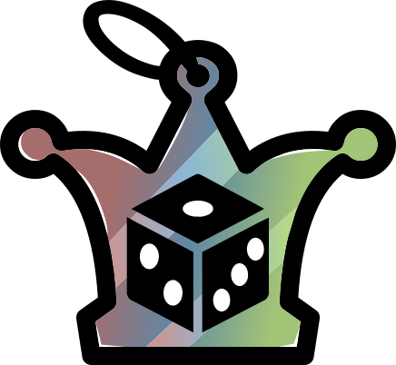](/wiki/Jester "Jester") [Jester](/wiki/Jester "Jester") may receive any non-Collarless spell as their starter spell.

    [Bonus Abilities](/wiki/Bonus_Abilities "Bonus Abilities")
    :   Abilities that exclusively occupy a bonus spell slot that can be granted by various Actives, Passives & Items. Some Bonus Abilities are unique and cannot be learned as regular spells, such as [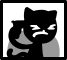](/wiki/Seppuku "Seppuku") [Seppuku](/wiki/Seppuku "Seppuku")    [Seppuku](/wiki/Seppuku "Seppuku")  Down yourself. . A cat or familiar can only have 1 Bonus Ability and they will overwrite each other contextually.

    [Replacement Abilities](/wiki/Replacement_Abilities "Replacement Abilities")
    :   Abilities which replace a spell or a cat's basic attack such as [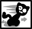](/wiki/Reposition "Reposition") [Reposition](/wiki/Reposition "Reposition")   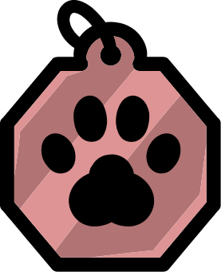 [Reposition](/wiki/Reposition "Reposition")  Move up to two tiles. , [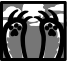](/wiki/Wolf_Claws "Wolf Claws") [Wolf Claws](/wiki/Wolf_Claws "Wolf Claws")   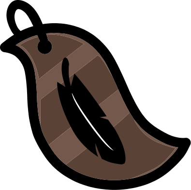 [Wolf Claws](/wiki/Wolf_Claws "Wolf Claws")  A 2-hit melee attack. , and 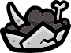 [Crown of Pestilence](/wiki/Crown_of_Pestilence "Crown of Pestilence")   [Crown of Pestilence](/wiki/Crown_of_Pestilence "Crown of Pestilence") (Head)  Your basic attack becomes Pestilence. .

    Familiar Abilities
    :   Abilities unique to familiars such as [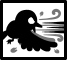](/wiki/Aeroblast "Aeroblast") [Aeroblast](/wiki/Aeroblast "Aeroblast")    [Aeroblast](/wiki/Aeroblast "Aeroblast")  A wind gust that deals 1 damage and 1 Knockback in a line. .

Passive Abilities
:   Passive effects that are or can always be in effect. A cat cannot learn more than 2 passive abilities and will be prompted to replace one when trying to learn a 3rd.  
    Unlike Actives, a class can start with any of their Passives, instead of small pool.

[Disorders](/wiki/Disorders "Disorders")
:   Functionally similar to Passive Abilities in that they apply a persistent passive effect, with usually both a negative and positive effect. They do not contribute to the passive ability cap. A cat cannot have more than 2 disorders at a time.

### Categories

Basic Attacks, Active Abilities, and Bonus Abilities have several different archetypes.

- 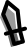 Melee abilities do [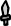](/wiki/Physical_Damage "Physical Damage") Physical Damage, typically to adjacent units, and generally scale off of [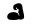](/wiki/Stats#Strength "Strength") [Strength](/wiki/Stats#Strength "Stats"). They use Reach-increases to target things from farther away.
  - Melee abilities will trigger "on-contact" effects, such as damage from thorns. However, using reach to attack from a non-adjacent tile will not trigger these effects.
- 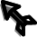 Ranged abilities also do  Physical Damage but generally scale off of [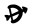](/wiki/Stats#Dexterity "Dexterity") [Dexterity](/wiki/Stats#Dexterity "Stats"). They use Range-increases to target things from farther away.
  - Ranged abilities will never trigger on-contact effects, even while adjacent to an enemy.
-  Magic abilities typically do  Magic Damage. Compared to Melee and Ranged, much more of these have no stat-scaling at all.
-  Heal abilities  Heal units or remove [Debuffs](/wiki/Debuffs "Debuffs"). Some of these abilities can also Revive units.
-  Defense abilities are of defensive utility: some grant  Shield,  Holy Shield, or defensive [Buffs](/wiki/Buffs "Buffs"); some make obstacles; and some push foes away.
-  Movement abilities move the user. The category has some overlap with others, but movement is the primary objective of these abilities.
-  Buff abilities generally give [Buffs](/wiki/Buffs "Buffs") (that aren't strictly defensive) without any direct  Healing.
-  Debuff abilities generally inflict [Debuffs](/wiki/Debuffs "Debuffs") without any direct damage.
-  Spawn abilities generate entities: some make [Familiars](/wiki/Familiars "Familiars") belonging to the user, some make [Pickups](/wiki/Pickups "Pickups"), and some make obstacles.
-  Misc abilities generally don't fit into the other categories but fit a special role or archetype for the [Class](/wiki/Class "Class") that has them. Abilities that have an "equal" number of buffs and debuffs also go into this category.
-  Unknown abilities comprise everything else. They typically have somewhat-niche use cases, or are more complex than Misc abilities.

## Classes

Collapse All

### [Collarless Icon.svg](/wiki/Collarless "Collarless") [Collarless](/wiki/Collarless "Collarless")

Since Collarless abilities are offered to all cats, they serve a variety of purposes.

- A few Collarless abilities can be regarded as inferior to alternatives; for example,  [CPR](/wiki/CPR "CPR")   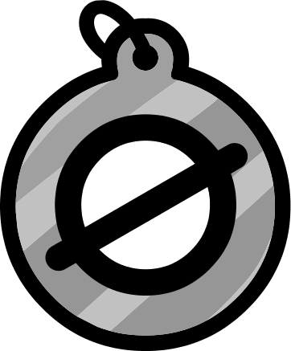 [CPR](/wiki/CPR "CPR")  Revive an adjacent body to 1 HP.  has nearly the same effect as [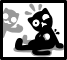](/wiki/Awaken "Awaken") [Awaken](/wiki/Awaken "Awaken")   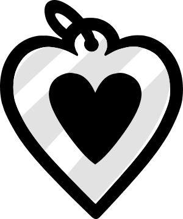 [Awaken](/wiki/Awaken "Awaken")  Revive a body to 1 HP. , but with reduced range, no  [Holy](/wiki/Elements#Holy "Elements") element, and increased mana cost. Others, like [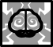](/wiki/Brainstorm "Brainstorm") [Brainstorm](/wiki/Brainstorm "Brainstorm")    [Brainstorm](/wiki/Brainstorm "Brainstorm")  Reduce the costs of your other spells by 1 mana.  and  [Skill Share](/wiki/Skill_Share "Skill Share")    [Skill Share](/wiki/Skill_Share "Skill Share")  Your other passive ability is shared with the other cats in your party at the start of each battle.  are rather unique. Leaving a cat Collarless serves to increase the probability of being offered them, as well as enable synergies with effects like  [Mind Stone](/wiki/Mind_Stone "Mind Stone")   [Mind Stone](/wiki/Mind_Stone "Mind Stone") (Trinket)  Your collarless spells cost -2 mana.  and  [Skill Stone](/wiki/Skill_Stone "Skill Stone")   [Skill Stone](/wiki/Skill_Stone "Skill Stone") (Trinket)  Spells that match your class cost -1 mana. .
- All abilities which cost coins instead of mana, like [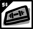](/wiki/Gym_Membership "Gym Membership") [Gym Membership](/wiki/Gym_Membership "Gym Membership")    [Gym Membership](/wiki/Gym_Membership "Gym Membership")  Spend 5 coins, gain All Stats Up.  
   (Castable once per turn.)   and [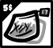](/wiki/Buy_Catnip "Buy Catnip") [Buy Catnip](/wiki/Buy_Catnip "Buy Catnip")    [Buy Catnip](/wiki/Buy_Catnip "Buy Catnip")  Spend 5 coins, gain 10 mana.  
   (Castable once per turn.)  , are Collarless.

| Basic Attack | Attack Effect | Description |
| --- | --- | --- |
| [FIGHTER Basic Melee.png](/wiki/File:FIGHTER_Basic_Melee.png)  **[Melee Attack](/wiki/Melee_Attack "Melee Attack")** | [UI Physical Damage Icon.svg](/wiki/Physical_Damage "Physical Damage") ⁠⁠ | Attack an adjacent unit. |
| [File:COLLARLESS Basic Short Ranged.png](/wiki/Special:Upload?wpDestFile=COLLARLESS_Basic_Short_Ranged.png "File:COLLARLESS Basic Short Ranged.png")  **[Short Shot](/wiki/Short_Shot "Short Shot")** | [UI Physical Damage Icon.svg](/wiki/Physical_Damage "Physical Damage") ⁠5(−5)2⁠ | Shoot a unit in your line of sight. |
| [File:COLLARLESS Basic Short Lobbed.png](/wiki/Special:Upload?wpDestFile=COLLARLESS_Basic_Short_Lobbed.png "File:COLLARLESS Basic Short Lobbed.png")  **[Short Lobbed Shot](/wiki/Short_Lobbed_Shot "Short Lobbed Shot")** | [UI Physical Damage Icon.svg](/wiki/Physical_Damage "Physical Damage") ⁠5(−5)2⁠ | Lob a shot over units and obstacles. |

### [Fighter Icon.svg](/wiki/Fighter "Fighter") [Fighter](/wiki/Fighter "Fighter")

Fighter abilities generally help to bring a cat into melee range, buff their damage, reward aggressive behavior, or increase their survivability.

- A large number of Fighter abilities deal  Melee damage which scales with  [Strength](/wiki/Stats#Strength "Stats"), but require them to get in close quarters with enemies.
- The  [Intelligence](/wiki/Stats#Intelligence "Stats") penalty Fighters receive can make affording the mana for expensive spells difficult, but a handful of Fighter abilities either reward lower Intelligence directly or make other spells more affordable, e.g. [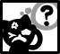](/wiki/Think_Too_Hard "Think Too Hard") [Think Too Hard](/wiki/Think_Too_Hard "Think Too Hard")    [Think Too Hard](/wiki/Think_Too_Hard "Think Too Hard")  Take damage equal to your Intelligence.  
  The next spell you cast this turn is free.  and [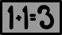](/wiki/Math%3F "Math?") [Math?](/wiki/Math%3F "Math?")    [Math?](/wiki/Math%3F "Math?")  Your spells cost 3 mana to cast, but each can be cast only once per turn. .

| Basic Attack | Attack Effect | Description |
| --- | --- | --- |
| [FIGHTER Basic Melee.png](/wiki/File:FIGHTER_Basic_Melee.png)  **[Melee Attack](/wiki/Melee_Attack "Melee Attack")** | [UI Physical Damage Icon.svg](/wiki/Physical_Damage "Physical Damage") ⁠⁠ | Attack an adjacent unit. |

### [Hunter Icon.svg](/wiki/Hunter "Hunter") [Hunter](/wiki/Hunter "Hunter")

Hunters rely on  Ranged damage which scales with  [Dexterity](/wiki/Stats#Dexterity "Stats"). Their basic attack can hit targets at a distance but also has a minimum range. The penalties they receive to  [Speed](/wiki/Stats#Speed "Stats") and  [Constitution](/wiki/Stats#Constitution "Stats") incentivize them to camp out away from enemies, and a number of Hunter abilities support this playstyle, including many ranged attacks.

- The decreased damage scaling of  Ranged damage compared to  Melee damage is ameliorated by several abilities which grant a  [Bonus Attack](/wiki/Status_Effects#Bonus_Attack "Status Effects"), e.g. [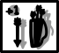](/wiki/Arrowsmith "Arrowsmith") [Arrowsmith](/wiki/Arrowsmith "Arrowsmith")   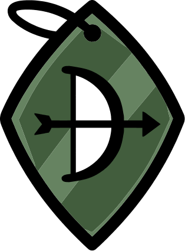 [Arrowsmith](/wiki/Arrowsmith "Arrowsmith")  Gain +1 Bonus Attack at the start of your next turn.  and [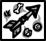](/wiki/Craft_Arrow "Craft Arrow") [Craft Arrow](/wiki/Craft_Arrow "Craft Arrow")    [Craft Arrow](/wiki/Craft_Arrow "Craft Arrow")  Collect an adjacent pickup and gain +1 Bonus Attack instead of its normal effects. .
- Hunters also receive a bonus to  [Luck](/wiki/Stats#Luck "Stats"), which increases their chance of getting critical hits. Abilities like [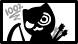](/wiki/Bullseye_(Ability) "Bullseye (Ability)") [Bullseye](/wiki/Bullseye_(Ability) "Bullseye (Ability)")  "Bullseye (Ability)")   [Bullseye](/wiki/Bullseye_(Ability) "Bullseye (Ability)")  Your ranged attacks never miss.  
  +25% critical hit chance.  and [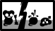](/wiki/Luck_Swing "Luck Swing") [Luck Swing](/wiki/Luck_Swing "Luck Swing")    [Luck Swing](/wiki/Luck_Swing "Luck Swing")  +50% critical hit chance but +25% chance to miss.  grant additional  [Crit Chance Up](/wiki/Status_Effects#Crit_Chance_Up "Status Effects").
- A variety of Hunter abilities spawn traps, familiars, or alter the physical environment, e.g. by creating  [Brambles](/wiki/Tiles#Bramble_Tile "Tiles"), which help to control the approach of enemies or distract them.

| Basic Attack | Attack Effect | Description |
| --- | --- | --- |
| [HUNTER Basic Ranged.png](/wiki/File:HUNTER_Basic_Ranged.png)  **[Lobbed Shot](/wiki/Lobbed_Shot "Lobbed Shot")** | [UI Physical Damage Icon.svg](/wiki/Physical_Damage "Physical Damage") ⁠4(−5)2⁠ | Lob a shot over units and obstacles. |

### [Mage Icon.svg](/wiki/Mage "Mage") [Mage](/wiki/Mage "Mage")

Mage abilities are diverse, but more deal  Magic damage than any other class.

- Mage abilities cost less mana on average than either Psychic or Tinkerer abilities. Several help the caster and allies cast more spells by granting mana directly or reducing the cost.
- Mage abilities target a variety of shapes and sizes, ranging from cones, e.g. [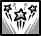](/wiki/Mega_Blast "Mega Blast") [Mega Blast](/wiki/Mega_Blast "Mega Blast")   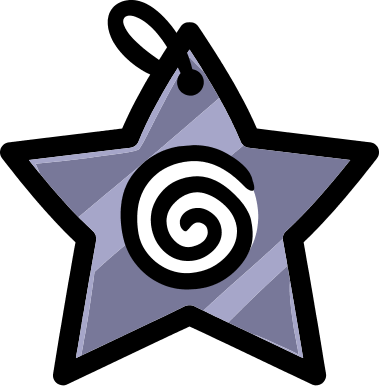 [Mega Blast](/wiki/Mega_Blast "Mega Blast")  Deal high damage in a cone. , to X-shapes, e.g. [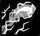](/wiki/Firebolt "Firebolt") [Firebolt](/wiki/Firebolt "Firebolt")    [Firebolt](/wiki/Firebolt "Firebolt")  Cast a fire/electric spell that inflicts Burn 1 and has a 15% chance to inflict Stun in an X shaped area. , to wide lines, e.g. [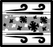](/wiki/Blizzard "Blizzard") [Blizzard](/wiki/Blizzard "Blizzard")    [Blizzard](/wiki/Blizzard "Blizzard")  Deal ice damage in a wide line with Knockback 1 that inflicts Slow and has a 15% chance to freeze. , to the whole map, e.g. [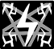](/wiki/Forbidden_Fulmination "Forbidden Fulmination") [Forbidden Fulmination](/wiki/Forbidden_Fulmination "Forbidden Fulmination")    [Forbidden Fulmination](/wiki/Forbidden_Fulmination "Forbidden Fulmination")  Strike all enemies with lightning, inflicting Stun. There will be permanent consequences for casting this spell…  
   (Castable once per battle.)  .
- Mages have many abilities with  [Fire](/wiki/Elements#Fire "Elements"),  [Ice](/wiki/Elements#Ice "Elements"), and  [Electric](/wiki/Elements#Electric "Elements") elements, and correspondingly many abilities which apply or interact with  [Burn](/wiki/Status_Effects#Burn "Status Effects"),  [Freeze](/wiki/Status_Effects#Freeze "Status Effects"), [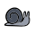](/wiki/Status_Effects#Slow "Status Effects") [Slow](/wiki/Status_Effects#Slow "Status Effects"), and  [Stun](/wiki/Status_Effects#Stun "Status Effects").

| Basic Attack | Attack Effect | Description |
| --- | --- | --- |
| [MAGE Basic Magic Short Ranged.png](/wiki/File:MAGE_Basic_Magic_Short_Ranged.png)  **[Magic Dart](/wiki/Magic_Dart "Magic Dart")** | [UI Magic Damage Icon.svg](/wiki/Magic_Damage "Magic Damage") ⁠5(−5)2⁠ | Shoot a charged projectile within your line of sight. This attack counts as both magical and physical. |
| [MAGE Basic Magic Missile.png](/wiki/File:MAGE_Basic_Magic_Missile.png)  **[Magic Missile](/wiki/Magic_Missile "Magic Missile")** | [UI Magic Damage Icon.svg](/wiki/Magic_Damage "Magic Damage") ⁠3(−5)2⁠ | Shoot an infinite-range projectile that cant miss.  - Only available while having the passive [ABILITY Paw Missile.svg](/wiki/Paw_Missile "Paw Missile") [Paw Missile](/wiki/Paw_Missile "Paw Missile") [ABILITY Paw Missile.svg](/wiki/Paw_Missile "Paw Missile")  Mage [Paw Missile](/wiki/Paw_Missile "Paw Missile")  Your basic attack is Magic Missile. (its damage scales with [Intelligence](/wiki/Stats#Intelligence "Intelligence")Intelligence). . |

### [Tank Icon.svg](/wiki/Tank "Tank") [Tank](/wiki/Tank "Tank")

Many Tank abilities increase a cat's survivability, help them to take damage in place of allies, or reward them for doing so.

- Tank abilities have the third lowest average mana cost of all classes, after Collarless and Thief.
- Tank attacks often apply knockback or can be used to move enemies around.
- Several confer status effects that encourage tanking damage, such as  [Thorns](/wiki/Status_Effects#Thorns "Status Effects") (as in [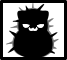](/wiki/Pincushion "Pincushion") [Pincushion](/wiki/Pincushion "Pincushion")   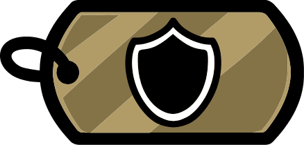 [Pincushion](/wiki/Pincushion "Pincushion")  Gain +3 Thorns.   
  This spell uses up your movement action. ), and  [Brace](/wiki/Status_Effects#Brace "Status Effects") (as in  [Steelskin](/wiki/Steelskin "Steelskin")    [Steelskin](/wiki/Steelskin "Steelskin")  Gain +99 Brace until your next turn, then disable this spell until you take a total of 25 damage. ).
- Tanks also have a near monopoly on abilities which pertain to [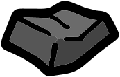](/wiki/Objects#Rock "Objects") [Rocks](/wiki/Objects#Rock "Objects") or apply  [Petrify](/wiki/Status_Effects#Petrify "Status Effects").

| Basic Attack | Attack Effect | Description |
| --- | --- | --- |
| [TANK Push Attack.png](/wiki/File:TANK_Push_Attack.png)  **[Push Attack](/wiki/Push_Attack "Push Attack")** | [UI Physical Damage Icon.svg](/wiki/Physical_Damage "Physical Damage") ⁠⁠ | Dash forward one space, then melee attack with knockback. |
| [ABILITY Suplex.svg](/wiki/File:ABILITY_Suplex.svg)  **[Suplex](/wiki/Suplex "Suplex")** | [UI Physical Damage Icon.svg](/wiki/Physical_Damage "Physical Damage") ⁠⁠ | Grab a unit in front of you and slam it into the tile behind you.  - Only available while having the passive [ABILITY Wrestlemaniac.svg](/wiki/Wrestlemaniac "Wrestlemaniac") [Wrestlemaniac](/wiki/Wrestlemaniac "Wrestlemaniac") [ABILITY Wrestlemaniac.svg](/wiki/Wrestlemaniac "Wrestlemaniac")  Tank [Wrestlemaniac](/wiki/Wrestlemaniac "Wrestlemaniac")  +2 [Speed](/wiki/Stats#Speed "Speed")Speed Your basic attack becomes [Suplex](/wiki/Suplex "Suplex") when adjacent to enemies. You gain the ability [Toss](/wiki/Toss "Toss"). . |

### [Cleric Icon.svg](/wiki/Cleric "Cleric") [Cleric](/wiki/Cleric "Cleric")

Nearly half of the healing abilities in the game are Cleric abilities. Alongside a litany of abilities which revive, grant  [Holy Shield](/wiki/Keywords#Holy_Shield "Keywords"), clear debuffs, and grant various stat ups, only a minority are not directly supportive in nature.

- Out of the 8 abilities which grant  [The Alpha](/wiki/Status_Effects#The_Alpha "Status Effects"), 6 are Cleric abilities.
- Because Clerics receive a penalty to  [Speed](/wiki/Stats#Speed "Stats") and sometimes have to rely on their short range basic attack to heal allies, several Cleric abilities function to bring them and their allies closer, e.g.[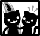](/wiki/Buddy_Up "Buddy Up") [Buddy Up](/wiki/Buddy_Up "Buddy Up")    [Buddy Up](/wiki/Buddy_Up "Buddy Up")  Jump to an open tile next to an ally. , [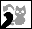](/wiki/Call_Over "Call Over") [Call Over](/wiki/Call_Over "Call Over")    [Call Over](/wiki/Call_Over "Call Over")  Make an ally move toward you. ,  [Emergency](/wiki/Emergency "Emergency")    [Emergency](/wiki/Emergency "Emergency")  Run next to the ally with the most missing health. Trample all in the way. , etc.
- The relatively few offensive Cleric abilities inflict a variety of debuffs, including  [Charmed](/wiki/Status_Effects#Charmed "Status Effects"),  [Blind](/wiki/Status_Effects#Blind "Status Effects"), and [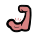](/wiki/Status_Effects#Weakness "Status Effects") [Weakness](/wiki/Status_Effects#Weakness "Status Effects"), as well as some unique ones: [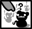](/wiki/Heretic_Mark "Heretic Mark") [Heretic Mark](/wiki/Heretic_Mark "Heretic Mark")    [Heretic Mark](/wiki/Heretic_Mark "Heretic Mark")  Inflict Ostracized 2 on a unit.  is the only source of  [Ostracized](/wiki/Status_Effects#Ostracized "Status Effects"), and [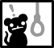](/wiki/Witch_Hunt "Witch Hunt") [Witch Hunt](/wiki/Witch_Hunt "Witch Hunt")    [Witch Hunt](/wiki/Witch_Hunt "Witch Hunt")  Put a bounty on a unit. When that unit dies, its killer gains All Stats Up.  is the only source of  [Stat Bounty](/wiki/Status_Effects#Stat_Bounty "Status Effects").

| Basic Attack | Attack Effect | Description |
| --- | --- | --- |
| [CLERIC Melee Attack Heal.png](/wiki/File:CLERIC_Melee_Attack_Heal.png)  **[Melee Attack / Heal](/wiki/Melee_Attack_/_Heal "Melee Attack / Heal")** | [UI Physical Heal Icon.svg](/wiki/Physical_Heal "Physical Heal") ⁠⁠ | Heals allied units but damages enemies.  - [Element Holy Icon.svg](/wiki/Elements#Holy "Elements") [Holy](/wiki/Elements#Holy "Elements") |
| [CLERIC Basic Medic Ranged.png](/wiki/File:CLERIC_Basic_Medic_Ranged.png)  **[Ranged Attack / Heal](/wiki/Ranged_Attack_/_Heal "Ranged Attack / Heal")** | [UI Physical Heal Icon.svg](/wiki/Physical_Heal "Physical Heal") ⁠5(−5)2⁠ | Heals allied units but damages enemies.  - [Element Holy Icon.svg](/wiki/Elements#Holy "Elements") [Holy](/wiki/Elements#Holy "Elements") - Only available while having the passive [ABILITY Ranged Medic.svg](/wiki/Ranged_Medic "Ranged Medic") [Ranged Medic](/wiki/Ranged_Medic "Ranged Medic") [ABILITY Ranged Medic.svg](/wiki/Ranged_Medic "Ranged Medic")  Cleric [Ranged Medic](/wiki/Ranged_Medic "Ranged Medic")  +2 [Dexterity](/wiki/Stats#Dexterity "Dexterity")Dexterity Your basic attack is a ranged lobbed attack that heals allies and damages enemies. . |

### [Thief Icon.svg](/wiki/Thief "Thief") [Thief](/wiki/Thief "Thief")

Thieves utilize both ranged and melee attacks and have very high mobility, which makes them particularly good at collecting pickups, killing birds, getting backstabs, and general positioning.

| Basic Attack | Attack Effect | Description |
| --- | --- | --- |
| [THIEF Basic Straight Shot.png](/wiki/File:THIEF_Basic_Straight_Shot.png)  **[Nail Throw](/wiki/Nail_Throw "Nail Throw")** | [UI Physical Damage Icon.svg](/wiki/Physical_Damage "Physical Damage") ⁠5(−5)2⁠ | Attack a unit in a straight line. |
| [ABILITY Shank (Active).svg](/wiki/File:ABILITY_Shank_(Active).svg)  **[Shank](/wiki/Shank_(Active) "Shank (Active)")** | [UI Physical Damage Icon.svg](/wiki/Physical_Damage "Physical Damage") ⁠⁠ | An attack that hits 2 times from behind.  - Only available while having the passive [ABILITY Shank (Passive).svg](/wiki/Shank_(Passive) "Shank (Passive)") [Shank](/wiki/Shank_(Passive) "Shank (Passive)") [ABILITY Shank (Passive).svg](/wiki/Shank_(Passive) "Shank (Passive)")  Thief [Shank](/wiki/Shank_(Passive) "Shank (Passive)")  When behind and adjacent to an enemy, your basic attack is a melee attack that hits twice. . |

### [Necromancer Icon.svg](/wiki/Necromancer "Necromancer") [Necromancer](/wiki/Necromancer "Necromancer")

Necromancer is a high-health class that makes up for its lack of damage with their self-sustainability. With Necromancer on a team, allies are free to shuffle off the mortal coil; they continue to serve a purpose even postmortem.

| Basic Attack | Attack Effect | Description |
| --- | --- | --- |
| [NECROMANCER Leech Shot.png](/wiki/File:NECROMANCER_Leech_Shot.png)  **[Leech Shot](/wiki/Leech_Shot "Leech Shot")** | [UI Physical Damage Icon.svg](/wiki/Physical_Damage "Physical Damage") ⁠3(−5)2⁠ | A lobbed attack that inflicts +1 [STATUS Leeches Icon.svg](/wiki/Status_Effects#Leeches "Status Effects") [Leech](/wiki/Status_Effects#Leeches "Status Effects"). |
| [ABILITY Haunt.svg](/wiki/File:ABILITY_Haunt.svg)  **[Haunt](/wiki/Haunt "Haunt")** | [UI Magic Damage Icon.svg](/wiki/Magic_Damage "Magic Damage") 5 | Damage any unit and inflict [STATUS Fear Icon.svg](/wiki/Status_Effects#Fear "Status Effects") [Fear](/wiki/Status_Effects#Fear "Status Effects").  Castable while downed.   - Only available by having the passive [ABILITY Torpor.svg](/wiki/Torpor "Torpor") [Torpor](/wiki/Torpor "Torpor") [ABILITY Torpor.svg](/wiki/Torpor "Torpor")  Necromancer [Torpor](/wiki/Torpor "Torpor")  While you're downed, your basic attack is Haunt. Your body gains +6 corpse HP.  while downed. |

### [Tinkerer Icon.svg](/wiki/Tinkerer "Tinkerer") [Tinkerer](/wiki/Tinkerer "Tinkerer")

Tinkerer brings an arsenal of robots and weapons to the battlefield, enabling several distinct fighting styles: dealing damage from a safe distance, piloting a giant mech, or jumping in the fight with giant explosions!

| Basic Attack | Attack Effect | Description |
| --- | --- | --- |
| [TINKERER Tinkerer Craft.png](/wiki/File:TINKERER_Tinkerer_Craft.png)  **[Craft Weapon](/wiki/Craft_Weapon "Craft Weapon")** | N/A | Craft and equip a random temporary weapon. |
| [TINKERER Tinkerer Throw.png](/wiki/File:TINKERER_Tinkerer_Throw.png)  **[Throw Weapon](/wiki/Throw_Weapon "Throw Weapon")** | [UI Physical Damage Icon.svg](/wiki/Physical_Damage "Physical Damage") ⁠5(−5)2⁠ | Throw your weapon at a unit.  This breaks the weapon. |
| [ABILITY Hone.svg](/wiki/File:ABILITY_Hone.svg)  **[Hone](/wiki/Hone "Hone")** | N/A | Repair 1 use to your weapon and give it +1 damage for the rest of the battle.  - Only available by having the passive [ABILITY Blacksmith.svg](/wiki/Blacksmith "Blacksmith") [Blacksmith](/wiki/Blacksmith "Blacksmith") [ABILITY Blacksmith.svg](/wiki/Blacksmith "Blacksmith")  Tinkerer [Blacksmith](/wiki/Blacksmith "Blacksmith")  If you have a weapon, your basic attack becomes [ABILITY Hone.svg](/wiki/Hone "Hone") [Hone](/wiki/Hone "Hone") [ABILITY Hone.svg](/wiki/Hone "Hone")  Tinkerer [Hone](/wiki/Hone "Hone")  Repair 1 use to your weapon and give it +1 damage for the rest of the battle. .  while holding a weapon. |

### [Butcher Icon.svg](/wiki/Butcher "Butcher") [Butcher](/wiki/Butcher "Butcher")

The Butcher is a class focused on primarily outputting damage and taking punishment. Its innate Meat Hook and unique ability to attack diagonally allows a team to have a great deal of control over positioning even during chapter one. The Butcher's abilities focus on generating food pickups, utilizing and consuming collectibles, and softening up its targets.

| Basic Attack | Attack Effect | Description |
| --- | --- | --- |
| [BUTCHER Basic Butcher Melee.png](/wiki/File:BUTCHER_Basic_Butcher_Melee.png)  **[Cleave](/wiki/Cleave_(Basic_Attack) "Cleave (Basic Attack)")** | [UI Physical Damage Icon.svg](/wiki/Physical_Damage "Physical Damage") ⁠⁠ | Attack a unit adjacent or diagonally with [STATUS Cleave Icon.svg](/wiki/Keywords#Cleave "Keywords") [Cleave](/wiki/Keywords#Cleave "Keywords"). |
| [BUTCHER Basic Butcher Melee Wide Spin.png](/wiki/File:BUTCHER_Basic_Butcher_Melee_Wide_Spin.png)  **[Spin Cleave](/wiki/Spin_Cleave "Spin Cleave")** | [UI Physical Damage Icon.svg](/wiki/Physical_Damage "Physical Damage") ⁠⁠ | Attack everything around you with [STATUS Cleave Icon.svg](/wiki/Keywords#Cleave "Keywords") [Cleave](/wiki/Keywords#Cleave "Keywords").  - Only available while having the passive [ABILITY Spin to Win.svg](/wiki/Spin_to_Win "Spin to Win") [Spin to Win](/wiki/Spin_to_Win "Spin to Win") [ABILITY Spin to Win.svg](/wiki/Spin_to_Win "Spin to Win")  Butcher [Spin to Win](/wiki/Spin_to_Win "Spin to Win")  Your basic attack is a 3x3 tile spin attack with Cleave. . |

### [Druid Icon.svg](/wiki/Druid "Druid") [Druid](/wiki/Druid "Druid")

Druid is a supportive class focused on providing versatile utility. While its signature crow familiar helps control the battlefield, Druid is free to either hole up in a corner and provide support and summons, or transform into one of its various game-plan-defining animal forms.

| Basic Attack | Attack Effect | Description |
| --- | --- | --- |
| [DRUID Basic Druid Ability.png](/wiki/File:DRUID_Basic_Druid_Ability.png)  **[Sing](/wiki/Sing "Sing")** | [UI Heal Icon.svg](/wiki/Heal "Heal") 1 | Heal and give +1 [STATUS Damage Up Icon.svg](/wiki/Status_Effects#Damage_Up "Status Effects") [Damage Up (Temporary)](/wiki/Status_Effects#Damage_Up "Status Effects") to units in a wide area.  - [Element Holy Icon.svg](/wiki/Elements#Holy "Elements") [Holy](/wiki/Elements#Holy "Elements") and [Element Music Icon.svg](/wiki/Elements#Music "Elements") [Music](/wiki/Elements#Music "Elements") |

### [Psychic Icon.svg](/wiki/Psychic "Psychic") [Psychic](/wiki/Psychic "Psychic")

Psychic is all about manipulating the enemy! With positioning, movement, and powerful status effects, Psychics can easily control the battlefield. They can also deal massive damage utilising repeated casts of low cost spells.

| Basic Attack | Attack Effect | Description |
| --- | --- | --- |
| [PSYCHIC Basic Psychic Pull.png](/wiki/File:PSYCHIC_Basic_Psychic_Pull.png)  **[Psychic Pull](/wiki/Psychic_Pull "Psychic Pull")** | [UI Magic Damage Icon.svg](/wiki/Magic_Damage "Magic Damage") 2 | Pull a unit toward you from anywhere dealing low damage.  - [Element Gravity Icon.svg](/wiki/Elements#Gravity "Elements") [Gravity](/wiki/Elements#Gravity "Elements") |

### [Monk Icon.svg](/wiki/Monk "Monk") [Monk](/wiki/Monk "Monk")

Monks are versatile fighters, able to transition between  Melee and  Ranged with abilities that reward a clever use of both. Monks typically benefit from not wearing armour to enables their most powerful abilities.

| Basic Attack | Attack Effect | Description |
| --- | --- | --- |
| [MONK Basic Monk Melee.png](/wiki/File:MONK_Basic_Monk_Melee.png)  **[Melee Attack](/wiki/Melee_Attack_(Monk) "Melee Attack (Monk)")** | [UI Physical Damage Icon.svg](/wiki/Physical_Damage "Physical Damage") ⁠3(−5)2⁠ | Attack an adjacent unit. |
| [MONK Basic Monk Ranged.png](/wiki/File:MONK_Basic_Monk_Ranged.png)  **[Lobbed Shot](/wiki/Lobbed_Shot_(Monk) "Lobbed Shot (Monk)")** | [UI Physical Damage Icon.svg](/wiki/Physical_Damage "Physical Damage") ⁠5(−5)4⁠ | Lob a shot over units and obstacles. |

### [Jester Icon.svg](/wiki/Jester "Jester") [Jester](/wiki/Jester "Jester")

Random is the name of the game! Jester can use any attack, ability, and passive from other classes, as well as a few unique and powerful ones.

| Basic Attack | Description |
| --- | --- |
| **Variable** | Can have the basic attack of any other class, with the exception of [Collarless Icon.svg](/wiki/Collarless "Collarless") [Collarless](/wiki/Collarless "Collarless"), [Monk Icon.svg](/wiki/Monk "Monk") [Monk](/wiki/Monk "Monk"),[Tinkerer Icon.svg](/wiki/Tinkerer "Tinkerer") [Tinkerer](/wiki/Tinkerer "Tinkerer") and [Druid Icon.svg](/wiki/Druid "Druid") [Druid](/wiki/Druid "Druid"). |

## Active and Passive Abilities

> \*\*Data table:\*\* This content is stored in the `abilities` SQLite table.
> Query with `query\_db("abilities", filters={})`.
> Columns: name, class, type, description, attributes, icon\_path

## References

1. [↑](#cite_ref-1) <https://x.com/TylerGlaiel/status/1776394337481629950>