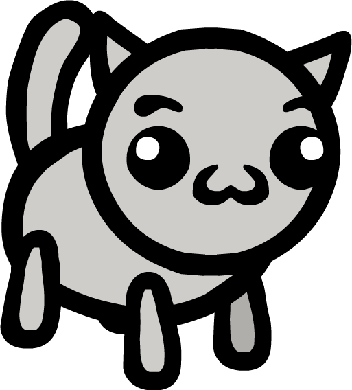
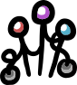
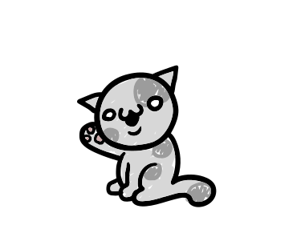
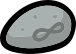
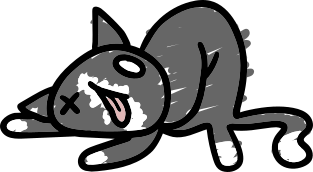
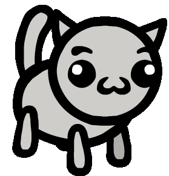
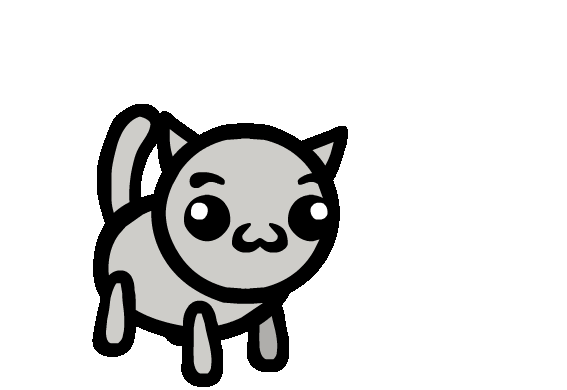
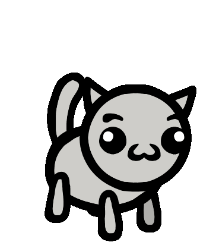

# Collarless

Collarless

It's a cat!

Stat Modifiers

Buffs

None

Debuffs

None

Level up Stats

Any Stat

Details

Collar

> “
>
> Meow meow meow!
>
> — A collarless cat when embarking on an adventure

**Collarless** is the [class](/wiki/Class "Class") all cats have before they are given collars.

## Overview

Collarless cats receive no positive or negative stat changes, and only learn Collarless abilities, which are also offered to all other classes. Therefore Collarless cats have the smallest ability pool of all classes. Although it can be difficult for Collarless cats to fill a particular role, Collarless abilities serve a wide variety of purposes including offense, support, and utility, and typically interact with fundamental mechanics that are generally useful for all cats.

The Collarless class is unique in that it can be "assigned" to cats without the use of a collar, allowing the player to depart with any number of Collarless cats. This is not possible for other classes unless the player buys a [Blank Collar](/wiki/Blank_Collar "Blank Collar") from [Tracy](/wiki/Tracy "Tracy") or departs with a cat that already has a collar—possible if, for example, a cat is transformed into a kitten mid-adventure, allowing it to return home without being retired.

### Basic Action

Collarless cats are unusual for having three different possible starting attacks. These are the Melee Attack (akin to the [Fighter's](/wiki/Fighter "Fighter") Basic Attack), the Short Shot (which travels in a straight line and is interrupted by obstacles), and the Short Lobbed Shot (which flies over obstacles in an arc).

### Tips

- Collarless cats find it much easier to fill their spell slots with Collarless active abilities, which allow them to get the full benefit from  [Mind Stone](/wiki/Mind_Stone "Mind Stone")   [Mind Stone](/wiki/Mind_Stone "Mind Stone") (Trinket)  Your collarless spells cost -2 mana.  and  [Steven Stone](/wiki/Steven_Stone "Steven Stone")   [Steven Stone](/wiki/Steven_Stone "Steven Stone") (Trinket)  +2 Charisma  
  Your collarless spells cost -2 mana. . Similarly, other classes don't get the mana reduction from  [Skill Stone](/wiki/Skill_Stone "Skill Stone")   [Skill Stone](/wiki/Skill_Stone "Skill Stone") (Trinket)  Spells that match your class cost -1 mana.  on their Collarless abilities, but Collarless cats do.
- Many Collarless passive abilities are useful on their own, but can be combined with  [Skill Share](/wiki/Skill_Share "Skill Share")    [Skill Share](/wiki/Skill_Share "Skill Share")  Your other passive ability is shared with the other cats in your party at the start of each battle.  to share with all other adventuring cats, effectively giving each party member a third passive ability slot. The upgraded version of  [Skill Share](/wiki/Skill_Share "Skill Share")    [Skill Share](/wiki/Skill_Share "Skill Share")  Your other passive ability is shared with the other cats in your party at the start of each battle.  is useful for breeding: it guarantees the other passive is inherited by all of the cat's children.
- Collarless cats can access the abilities of other classes in a few ways:
  - The "[Class]'s Soul" passive abilities (e.g.  [Mage's Soul](/wiki/Mage%27s_Soul "Mage's Soul")    [Mage's Soul](/wiki/Mage%27s_Soul "Mage's Soul")  +2 Intelligence,+2 Charisma,-1 Constitution,-1 Strength  
    Mage abilities are offered when you level up. )
  - The "Path of the [Class]" active abilities (e.g.  [Path of the Fighter](/wiki/Path_of_the_Fighter "Path of the Fighter")    [Path of the Fighter](/wiki/Path_of_the_Fighter "Path of the Fighter")  Your Intelligence becomes 0 until the end of the battle, then this spell becomes a random Fighter spell permanently. )
  - Items such as  [Crown of Chaos](/wiki/Crown_of_Chaos "Crown of Chaos")   [Crown of Chaos](/wiki/Crown_of_Chaos "Crown of Chaos") (Head)  +2 level up Rerolls. Abilities from all classes are offered when you level up. ,  [Chaos Controller](/wiki/Chaos_Controller "Chaos Controller")   [Chaos Controller](/wiki/Chaos_Controller "Chaos Controller") (Head)  Abilities from all classes are offered when you level up. You can reroll your levelup options thrice.  or  [Chaos Device](/wiki/Chaos_Device "Chaos Device")   [Chaos Device](/wiki/Chaos_Device "Chaos Device") (Head)  Side Quest Item. When any cat levels up they are offered abilities from all classes.  which offer abilities from any class on levelup.
  - Certain birth defects that offer abilities from the four basic classes (e.g.  [Forked Tail Birth Defect](/wiki/Mutations#tail.704 "Mutations")  [Forked Tail Birth Defect](/wiki/Mutations "Mutations") (tail.704) Hunter abilities are also offered when you level up.**Debuffs:** -2 Luck).

### Stray Cat Events

[Events](/wiki/Events "Events") mid-adventure can add new cats to the team. They are always Collarless.

Cats from events will always be level 0, meaning they lack their first passive ability and their second active ability. Their first level up will randomly grant a passive and allow the choice of an active ability from a standard array of four. Because they also get a level-up stat bonus at Level 1, something standard cats do not get, event cats are marginally more powerful.

Cats from events do *not* qualify for completion marks, nor for their corresponding unlocks. Accordingly, they do not prevent solo-cat achievements. They do return to the [House](/wiki/House "House") like a standard cat at the end of an adventure, however.

If the party has four cats, a fifth "bonus" cat cannot increase their level and cannot be equipped with [items](/wiki/Items "Items") until a slot in the 4 cat party opens up. Non-party bonus cats will not be retired upon return to the house and will be eligible to go on another run.

The  ["A cat!" event](/wiki/Events#A_cat! "Events") event will act as a bonus life, and can only occur after a cat of the party has permanently died. It has a 50% chance to occur on any  Event Node after this happens, and can only occur once per adventure. It will also grant a  [Neverstone](/wiki/Neverstone "Neverstone")   [Neverstone](/wiki/Neverstone "Neverstone") (Trinket)  Never level up. .

Other events that grant additional cats can occur any time and multiple times in a run:

-  ["The cat makes a new friend!" blessing](/wiki/Events#Blessing! "Events").
-  ["Dead Cat" event](/wiki/Events#Dead_Cat "Events")
-  ["Cats in Heat" event](/wiki/Events#Cats_in_Heat "Events")

## Abilities

Other classes can have Collarless Abilities offered to them when leveling up. Roughly one-in-four options provided will be Collarless (lower Luck means more Collarless abilities)[[citation needed](/wiki/Category:Citation_needed "Category:Citation needed")].

### Basic Attacks

| Name | | Status Dealt | Description |
| --- | --- | --- | --- |
| [ABILITY Melee Attack.svg](/wiki/Melee_Attack "Melee Attack") | [Melee Attack (Collarless)](/wiki/Melee_Attack "Melee Attack") | 5[UI Physical Damage Icon.svg](/wiki/Physical_Damage "Physical Damage") | Attack an adjacent unit. |
| [ABILITY Short Shot.svg](/wiki/Short_Shot "Short Shot") | [Short Shot](/wiki/Short_Shot "Short Shot") | 5[UI Physical Damage Icon.svg](/wiki/Physical_Damage "Physical Damage") | Shoot a unit in your line of sight. |
| [ABILITY Short Lobbed Shot.svg](/wiki/Short_Lobbed_Shot "Short Lobbed Shot") | [Short Lobbed Shot](/wiki/Short_Lobbed_Shot "Short Lobbed Shot") | 5[UI Physical Damage Icon.svg](/wiki/Physical_Damage "Physical Damage") | Lob a shot over units and obstacles. |

- Melee Attack effectively has a weight of 2, making it 50/50 chance of melee or ranged basic attack.

### Active Abilities

| Collarless Active Abilities | | | | |
| --- | --- | --- | --- | --- |
| Name | | Description | Mana Cost | Upgraded Description |
| [ABILITY Barf Ball.svg](/wiki/Barf_Ball "Barf Ball") | [Barf Ball](/wiki/Barf_Ball "Barf Ball") | A ranged attack that deals damage equal to half your [Constitution](/wiki/Stats#Constitution "Constitution")Constitution, rounded up. | [UI Mana Cost Icon.svg](/wiki/Mana_Cost "Mana Cost") 6 | A ranged attack that deals damage equal to half your [Constitution](/wiki/Stats#Constitution "Constitution")Constitution, rounded up.  (This spell costs less.) |
| [ABILITY BBQ.svg](/wiki/BBQ "BBQ") | [BBQ](/wiki/BBQ "BBQ") | Spawn a cooked meat pickup. | [UI Mana Cost Icon.svg](/wiki/Mana_Cost "Mana Cost") 5 | Spawn a big cooked meat pickup. |
| [ABILITY Block.svg](/wiki/Block "Block") | [Block](/wiki/Block "Block") | Gain +2 [UI Shield Icon.svg](/wiki/Shield "Shield"). | [UI Mana Cost Icon.svg](/wiki/Mana_Cost "Mana Cost") 5 | Gain +5 [UI Shield Icon.svg](/wiki/Shield "Shield"). |
| [ABILITY Blow.svg](/wiki/Blow "Blow") | [Blow](/wiki/Blow "Blow") | Blow units in a cone back 1 tile. | [UI Mana Cost Icon.svg](/wiki/Mana_Cost "Mana Cost") 4 | Blow units in a larger cone back 1 tile. |
| [ABILITY Blow Kiss.svg](/wiki/Blow_Kiss "Blow Kiss") | [Blow Kiss](/wiki/Blow_Kiss "Blow Kiss") | Heal another unit by 1 HP at infinite range. | [UI Mana Cost Icon.svg](/wiki/Mana_Cost "Mana Cost") 4 | Heal another unit by 2 HP at infinite range. |
| [ABILITY Boost.svg](/wiki/Boost "Boost") | [Boost](/wiki/Boost "Boost") | Gain +1 Magic Damage until end of turn. | [UI Mana Cost Icon.svg](/wiki/Mana_Cost "Mana Cost") 3 | Gain +1 Magic Damage until end of turn.  (This spell costs less.) |
| [ABILITY Borrow Mana.svg](/wiki/Borrow_Mana "Borrow Mana") | [Borrow Mana](/wiki/Borrow_Mana "Borrow Mana") | Steal up to 5 mana from an ally.  (Castable once per turn.) | [UI Mana Cost Icon.svg](/wiki/Mana_Cost "Mana Cost") 0 | Steal all of an ally's mana.  (Castable once per turn.) |
| [ABILITY Brace.svg](/wiki/Brace "Brace") | [Brace](/wiki/Brace "Brace") | Gain +1 temporary Brace until your next turn. | [UI Mana Cost Icon.svg](/wiki/Mana_Cost "Mana Cost") 3 | Gain +1 temporary Brace and +1 temporary Thorns until your next turn. |
| [ABILITY Brainstorm.svg](/wiki/Brainstorm "Brainstorm") | [Brainstorm](/wiki/Brainstorm "Brainstorm") | Reduce the costs of your other spells by 1 mana. | [UI Mana Cost Icon.svg](/wiki/Mana_Cost "Mana Cost") 7 | Reduce the cost of ALL of your spells by 1 mana. |
| [ABILITY Burgeoning Barrier.svg](/wiki/Burgeoning_Barrier "Burgeoning Barrier") | [Burgeoning Barrier](/wiki/Burgeoning_Barrier "Burgeoning Barrier") | Gain 0 [UI Shield Icon.svg](/wiki/Shield "Shield"). Increase this spell's [UI Shield Icon.svg](/wiki/Shield "Shield") by 2 at the end of each turn.  (Castable once per battle.) | [UI Mana Cost Icon.svg](/wiki/Mana_Cost "Mana Cost") 0 | Gain 0 [UI Shield Icon.svg](/wiki/Shield "Shield"). Increase this spell's [UI Shield Icon.svg](/wiki/Shield "Shield") by 3 at the end of each turn.  (Castable once per battle.) |
| [ABILITY Burgeoning Battery.svg](/wiki/Burgeoning_Battery "Burgeoning Battery") | [Burgeoning Battery](/wiki/Burgeoning_Battery "Burgeoning Battery") | Gain 0 mana. Increase this spell's mana gain by 2 at the end of each turn.  (Castable once per battle.) | [UI Mana Cost Icon.svg](/wiki/Mana_Cost "Mana Cost") 0 | Gain 0 mana. Increase this spell's mana gain by 3 at the end of each turn.  (Castable once per battle.) |
| [ABILITY Burgeoning Blast.svg](/wiki/Burgeoning_Blast "Burgeoning Blast") | [Burgeoning Blast](/wiki/Burgeoning_Blast "Burgeoning Blast") | A spell that deals 0 damage. Increase this spell's damage by 2 at the end of each turn.  (Castable once per battle.) | [UI Mana Cost Icon.svg](/wiki/Mana_Cost "Mana Cost") 0 | A spell that deals 0 damage. Increase this spell's damage by 3 at the end of each turn.  (Castable once per battle.) |
| [ABILITY Burst.svg](/wiki/Burst "Burst") | [Burst](/wiki/Burst "Burst") | Fire a magical blast.  (Castable once per battle.) | [UI Mana Cost Icon.svg](/wiki/Mana_Cost "Mana Cost") 7 | Fire a magical blast.  (This spell costs 0 mana. Castable once per battle.) |
| [ABILITY Butt Scoot.svg](/wiki/Butt_Scoot "Butt Scoot") | [Butt Scoot](/wiki/Butt_Scoot "Butt Scoot") | Move 1 tile, leaving a maggot familiar behind you. | [UI Mana Cost Icon.svg](/wiki/Mana_Cost "Mana Cost") 4 | Move up to 3 tiles, leaving a maggot familiar behind you. |
| [ABILITY Buy Catnip.svg](/wiki/Buy_Catnip "Buy Catnip") | [Buy Catnip](/wiki/Buy_Catnip "Buy Catnip") | Spend 5 coins, gain 10 mana.  (Castable once per turn.) | [UI Mana Cost Icon.svg](/wiki/Mana_Cost "Mana Cost") 0 | Spend 5 coins, gain 15 mana.  (Castable once per turn.) |
| [ABILITY Cat Nap.svg](/wiki/Cat_Nap "Cat Nap") | [Cat Nap](/wiki/Cat_Nap "Cat Nap") | Remove all of your debuffs, then fall asleep. | [UI Mana Cost Icon.svg](/wiki/Mana_Cost "Mana Cost") 2 | Remove all of your debuffs, gain All Stats Up, then fall asleep. |
| [ABILITY Claws Out.svg](/wiki/Claws_Out "Claws Out") | [Claws Out](/wiki/Claws_Out "Claws Out") | Gain +1 Thorns. | [UI Mana Cost Icon.svg](/wiki/Mana_Cost "Mana Cost") 4 | Gain +1 Thorns.  (This spell costs less.) |
| [ABILITY Cold Shoulder.svg](/wiki/Cold_Shoulder "Cold Shoulder") | [Cold Shoulder](/wiki/Cold_Shoulder "Cold Shoulder") | Deal 1 ice damage and inflict Slow 1 at infinite range. | [UI Mana Cost Icon.svg](/wiki/Mana_Cost "Mana Cost") 6 | Deal 1 ice damage and inflict Slow 1 at infinite range.  (This spell costs less.) |
| [ABILITY Confusion.svg](/wiki/Confusion "Confusion") | [Confusion](/wiki/Confusion_(Ability) "Confusion (Ability)") | Inflict Confusion 2 on a unit. | [UI Mana Cost Icon.svg](/wiki/Mana_Cost "Mana Cost") 5 | Inflict Confusion 4 on units in an area. |
| [ABILITY Copycat.svg](/wiki/Copycat "Copycat") | [Copycat](/wiki/Copycat "Copycat") | This spell is a copy of the most recent spell an allied cat cast. | [UI Mana Cost Icon.svg](/wiki/Mana_Cost "Mana Cost") 5 | This spell is an upgraded copy of the most recent spell an allied cat cast. |
| [ABILITY CPR.svg](/wiki/CPR "CPR") | [CPR](/wiki/CPR "CPR") | Revive an adjacent body to 1 HP. | [UI Mana Cost Icon.svg](/wiki/Mana_Cost "Mana Cost") 6 | Revive an adjacent body to 5 HP.  (This spell costs less.) |
| [ABILITY Dart.svg](/wiki/Dart "Dart") | [Dart](/wiki/Dart "Dart") | Throw a nail that ignores shield. | [UI Mana Cost Icon.svg](/wiki/Mana_Cost "Mana Cost") 5 | Throw a stronger nail that ignores shield.  (This spell costs less.) |
| [ABILITY Desecrate.svg](/wiki/Desecrate "Desecrate") | [Desecrate](/wiki/Desecrate "Desecrate") | Destroy a body. | [UI Mana Cost Icon.svg](/wiki/Mana_Cost "Mana Cost") 0 | Destroy a body and gain 2 mana. |
| [ABILITY Dexterous Hit.svg](/wiki/Dexterous_Hit "Dexterous Hit") | [Dexterous Hit](/wiki/Dexterous_Hit "Dexterous Hit") | A melee attack that deals damage equal to half your [Dexterity](/wiki/Stats#Dexterity "Dexterity")Dexterity, rounded up. | [UI Mana Cost Icon.svg](/wiki/Mana_Cost "Mana Cost") 6 | A melee attack that deals damage equal to half your [Dexterity](/wiki/Stats#Dexterity "Dexterity")Dexterity, rounded up.  (This spell costs less.) |
| [ABILITY Doll Up.svg](/wiki/Doll_Up "Doll Up") | [Doll Up](/wiki/Doll_Up "Doll Up") | Gain +1 [Charisma](/wiki/Stats#Charisma "Charisma")Charisma. | [UI Mana Cost Icon.svg](/wiki/Mana_Cost "Mana Cost") 2 | Gain +1 [Charisma](/wiki/Stats#Charisma "Charisma")Charisma. Bonus Passive: You have a chance to inflict Charm on units that contact or attack you. This chance increases with your [Charisma](/wiki/Stats#Charisma "Charisma")Charisma. |
| [ABILITY Dump.svg](/wiki/Dump "Dump") | [Dump](/wiki/Dump "Dump") | Spawn a poop on an adjacent tile. | [UI Mana Cost Icon.svg](/wiki/Mana_Cost "Mana Cost") 3 | Spawn a poop on an adjacent tile. Inflict Poison 3 and a 15% chance to Stun if you poop on a unit. |
| [ABILITY Feather Feet.svg](/wiki/Feather_Feet "Feather Feet") | [Feather Feet](/wiki/Feather_Feet "Feather Feet") | Gain +1 [Speed](/wiki/Stats#Speed "Speed")Speed. | [UI Mana Cost Icon.svg](/wiki/Mana_Cost "Mana Cost") 4 | Gain +1 [Speed](/wiki/Stats#Speed "Speed")Speed. Bonus Passive: You're unaffected by tile effects. |
| [ABILITY Find a Rock.svg](/wiki/Find_a_Rock "Find a Rock") | [Find a Rock](/wiki/Find_a_Rock "Find a Rock") | Dig up a small rock. | [UI Mana Cost Icon.svg](/wiki/Mana_Cost "Mana Cost") 4 | Dig up a small rock.  (This spell costs less.) |
| [ABILITY Flex.svg](/wiki/Flex "Flex") | [Flex](/wiki/Flex "Flex") | Gain +1 temporary Brace until your next turn and deal 1 knockback to each adjacent unit. | [UI Mana Cost Icon.svg](/wiki/Mana_Cost "Mana Cost") 5 | Gain +1 temporary Brace until your next turn and deal 3 knockback to each adjacent unit.  (This spell costs less.) |
| [ABILITY Focus.svg](/wiki/Focus "Focus") | [Focus](/wiki/Focus "Focus") | Gain +1 [Dexterity](/wiki/Stats#Dexterity "Dexterity")Dexterity. | [UI Mana Cost Icon.svg](/wiki/Mana_Cost "Mana Cost") 4 | Gain +1 [Dexterity](/wiki/Stats#Dexterity "Dexterity")Dexterity. Bonus Passive: +25% critical hit chance. |
| [ABILITY Forbidden Fart.svg](/wiki/Forbidden_Fart "Forbidden Fart") | [Forbidden Fart](/wiki/Forbidden_Fart "Forbidden Fart") | Damage, Inflict Poison 4 and Knock Up nearby units. There will be permanent consequences for casting this spell…  (Castable once per turn.) | [UI Mana Cost Icon.svg](/wiki/Mana_Cost "Mana Cost") 0 | Damage, Inflict Poison 6 and Knock Up nearby units in a larger area. There will be permanent consequences for casting this spell…  (Castable once per turn.) |
| [ABILITY Gamble.svg](/wiki/Gamble "Gamble") | [Gamble](/wiki/Gamble "Gamble") | Gain +2% critical hit chance. If your next attack is critical, deal +100% more damage and spawn coins. | [UI Mana Cost Icon.svg](/wiki/Mana_Cost "Mana Cost") 2 | Gain +2% critical hit chance. If your next attack is critical, deal +200% more damage and spawn more coins. |
| [ABILITY Gym Membership.svg](/wiki/Gym_Membership "Gym Membership") | [Gym Membership](/wiki/Gym_Membership "Gym Membership") | Spend 5 coins, gain All Stats Up.  (Castable once per turn.) | [UI Mana Cost Icon.svg](/wiki/Mana_Cost "Mana Cost") 0 | Spend 5 coins, gain All Stats Up and refresh your basic attack and movement actions.  (Castable once per turn.) |
| [ABILITY Healing Bolt.svg](/wiki/Healing_Bolt "Healing Bolt") | [Healing Bolt](/wiki/Healing_Bolt "Healing Bolt") | A lightning bolt that heals and has a chance to Stun. | [UI Mana Cost Icon.svg](/wiki/Mana_Cost "Mana Cost") 7 | A lightning bolt that heals allies and has a chance to Stun enemies. |
| [ABILITY Hire Hitman.svg](/wiki/Hire_Hitman "Hire Hitman") | [Hire Hitman](/wiki/Hire_Hitman "Hire Hitman") | Spend 7 coins, summon a bounty hunter.  (Castable once per turn.) | [UI Mana Cost Icon.svg](/wiki/Mana_Cost "Mana Cost") 0 | Spend 7 coins, summon a bounty hunter with All Stats Up 2.  (Castable once per turn.) |
| [ABILITY Hiss.svg](/wiki/Hiss "Hiss") | [Hiss](/wiki/Hiss "Hiss") | Adjacent units move away from you. You have a 25% chance to inflict Fear on them. | [UI Mana Cost Icon.svg](/wiki/Mana_Cost "Mana Cost") 6 | Adjacent units move away from you. Inflict fear on them. |
| [ABILITY Hop.svg](/wiki/Hop "Hop") | [Hop](/wiki/Hop "Hop") | Hop up to 2 tiles away. | [UI Mana Cost Icon.svg](/wiki/Mana_Cost "Mana Cost") 3 | Hop up to 4 tiles away. |
| [ABILITY Hose Off.svg](/wiki/Hose_Off "Hose Off") | [Hose Off](/wiki/Hose_Off "Hose Off") | Spray a unit with water, cleansing its debuffs and making a puddle.  (Castable once per battle.) | [UI Mana Cost Icon.svg](/wiki/Mana_Cost "Mana Cost") 5 | Spray a unit with water, cleansing its debuffs and making a puddle.  (This spell costs 0 mana. Castable once per battle.) |
| [ABILITY Hunt.svg](/wiki/Hunt "Hunt") | [Hunt](/wiki/Hunt "Hunt") | A ranged attack that turns anything it kills into meat. | [UI Mana Cost Icon.svg](/wiki/Mana_Cost "Mana Cost") 6 | A stronger ranged attack that turns anything it kills into meat. |
| [ABILITY Interchange.svg](/wiki/Interchange "Interchange") | [Interchange](/wiki/Interchange "Interchange") | Exchange your movement action for an additional basic attack, and vice versa. | [UI Mana Cost Icon.svg](/wiki/Mana_Cost "Mana Cost") 3 | Exchange your movement action for an additional basic attack, and vice versa.  (This spell costs 0 mana the first time you cast it each turn.) |
| [ABILITY Invert.svg](/wiki/Invert "Invert") | [Invert](/wiki/Invert "Invert") | Swap your highest and lowest stats.  (Ties are chosen at random) | [UI Mana Cost Icon.svg](/wiki/Mana_Cost "Mana Cost") 2 | Swap a unit's highest and lowest stats.  (Ties are chosen at random) |
| [ABILITY Itch.svg](/wiki/Itch "Itch") | [Itch](/wiki/Itch "Itch") | Deal 1 damage to yourself. 50% chance to spawn a friendly flea. | [UI Mana Cost Icon.svg](/wiki/Mana_Cost "Mana Cost") 3 | Deal 1 damage to yourself. Spawn a friendly flea. |
| [ABILITY Knead.svg](/wiki/Knead "Knead") | [Knead](/wiki/Knead "Knead") | Knead another unit. Allies gain +1 Damage, enemies gain Weakness 1. | [UI Mana Cost Icon.svg](/wiki/Mana_Cost "Mana Cost") 5 | Knead another unit. Allies gain +2 Damage, enemies gain Weakness 2. |
| [ABILITY Landscape.svg](/wiki/Landscape "Landscape") | [Landscape](/wiki/Landscape "Landscape") | Turn an adjacent tile into a small grass tile. | [UI Mana Cost Icon.svg](/wiki/Mana_Cost "Mana Cost") 1 | Turn any tile into a small grass tile. |
| [ABILITY Lick.svg](/wiki/Lick "Lick") | [Lick](/wiki/Lick "Lick") | Heal an adjacent unit by 2 HP. | [UI Mana Cost Icon.svg](/wiki/Mana_Cost "Mana Cost") 4 | Heal an adjacent unit by 2 HP. Healed enemies gain Confusion 3. |
| [ABILITY Look at me!.svg](/wiki/Look_at_me! "Look at me!") | [Look at me!](/wiki/Look_at_me! "Look at me!") | Each unit turns to face you. | [UI Mana Cost Icon.svg](/wiki/Mana_Cost "Mana Cost") 2 | Each unit turns to face you. 20% chance to Confuse enemies. |
| [ABILITY Magnet.svg](/wiki/Magnet "Magnet") | [Magnet](/wiki/Magnet "Magnet") | Pull a pickup one tile toward you.  (Castable once per turn.) | [UI Mana Cost Icon.svg](/wiki/Mana_Cost "Mana Cost") 0 | Pull a pickup all the way toward you.  (Castable once per turn) |
| [ABILITY Make a Wish.svg](/wiki/Make_a_Wish "Make a Wish") | [Make a Wish](/wiki/Make_a_Wish "Make a Wish") | Spend a coin to spawn a random pickup on a random tile.  (Castable once per turn.) | [UI Mana Cost Icon.svg](/wiki/Mana_Cost "Mana Cost") 0 | Spend a coin to spawn a random pickup on an empty tile of your choice.  (Castable once per turn.) |
| [ABILITY Meow.svg](/wiki/Meow "Meow") | [Meow](/wiki/Meow "Meow") | Your closest ally moves toward you. | [UI Mana Cost Icon.svg](/wiki/Mana_Cost "Mana Cost") 2 | A target ally moves toward you. |
| [ABILITY Metabolize.svg](/wiki/Metabolize "Metabolize") | [Metabolize](/wiki/Metabolize "Metabolize") | Gain +1 [Constitution](/wiki/Stats#Constitution "Constitution")Constitution. | [UI Mana Cost Icon.svg](/wiki/Mana_Cost "Mana Cost") 3 | Gain +1 [Constitution](/wiki/Stats#Constitution "Constitution")Constitution. Bonus Passive: +3 Health Regeneration. |
| [ABILITY Metronome (Ability).svg](/wiki/Metronome "Metronome") | [Metronome](/wiki/Metronome_(Ability) "Metronome (Ability)") | Cast a random spell. | [UI Mana Cost Icon.svg](/wiki/Mana_Cost "Mana Cost") 5 | Cast a random upgraded spell. |
| [ABILITY Minihook.svg](/wiki/Minihook "Minihook") | [Minihook](/wiki/Minihook "Minihook") | Pull a unit towards you. | [UI Mana Cost Icon.svg](/wiki/Mana_Cost "Mana Cost") 3 | Pull a unit towards you. Deal 1 damage and inflict 1 Bleed on them. |
| [ABILITY Nerf.svg](/wiki/Nerf "Nerf") | [Nerf](/wiki/Nerf "Nerf") | Inflict -1 Damage on a unit. | [UI Mana Cost Icon.svg](/wiki/Mana_Cost "Mana Cost") 4 | Inflict -1 Damage and -1 [Constitution](/wiki/Stats#Constitution "Constitution")Constitution on a unit. |
| [ABILITY Number One.svg](/wiki/Number_One "Number One") | [Number One](/wiki/Number_One "Number One") | Spawn "water" tiles in an area around yourself. | [UI Mana Cost Icon.svg](/wiki/Mana_Cost "Mana Cost") 2 | Spawn "water" tiles in a larger area around yourself. |
| [ABILITY Over There!.svg](/wiki/Over_There! "Over There!") | [Over There!](/wiki/Over_There! "Over There!") | Adjacent units turn away from you. | [UI Mana Cost Icon.svg](/wiki/Mana_Cost "Mana Cost") 2 | Units within three tiles of you turn away from you. |
| [ABILITY Path of the Butcher.svg](/wiki/Path_of_the_Butcher "Path of the Butcher") | [Path of the Butcher](/wiki/Path_of_the_Butcher "Path of the Butcher") | Collect an adjacent food pickup, then this spell becomes a random Butcher spell permanently. | [UI Mana Cost Icon.svg](/wiki/Mana_Cost "Mana Cost") 1 | Transform this spell into a random upgraded Butcher spell permanently. |
| [ABILITY Path of the Cleric.svg](/wiki/Path_of_the_Cleric "Path of the Cleric") | [Path of the Cleric](/wiki/Path_of_the_Cleric "Path of the Cleric") | Give an enemy All Stats Up and fully heal it, then this spell becomes a random Cleric spell permanently. | [UI Mana Cost Icon.svg](/wiki/Mana_Cost "Mana Cost") 0 | Transform this spell into a random upgraded Cleric spell permanently. |
| [ABILITY Path of the Druid.svg](/wiki/Path_of_the_Druid "Path of the Druid") | [Path of the Druid](/wiki/Path_of_the_Druid "Path of the Druid") | Plant flowers on the tile you're standing on, then this spell becomes a random Druid spell permanently. Castable only if you're standing on a grass tile. | [UI Mana Cost Icon.svg](/wiki/Mana_Cost "Mana Cost") 2 | Transform this spell into a random upgraded Druid spell permanently. |
| [ABILITY Path of the Fighter.svg](/wiki/Path_of_the_Fighter "Path of the Fighter") | [Path of the Fighter](/wiki/Path_of_the_Fighter "Path of the Fighter") | Your [Intelligence](/wiki/Stats#Intelligence "Intelligence")Intelligence becomes 0 until the end of the battle, then this spell becomes a random Fighter spell permanently. | [UI Mana Cost Icon.svg](/wiki/Mana_Cost "Mana Cost") 0 | Transform this spell into a random upgraded Fighter spell permanently. |
| [ABILITY Path of the Hunter.svg](/wiki/Path_of_the_Hunter "Path of the Hunter") | [Path of the Hunter](/wiki/Path_of_the_Hunter "Path of the Hunter") | A lobbed attack that deals 1 damage. If this kills an enemy, this spell becomes a random Hunter spell permanently. | [UI Mana Cost Icon.svg](/wiki/Mana_Cost "Mana Cost") 5 | Transform this spell into a random upgraded Hunter spell permanently. |
| [ABILITY Path of the Jester.svg](/wiki/Path_of_the_Jester "Path of the Jester") | [Path of the Jester](/wiki/Path_of_the_Jester "Path of the Jester") | Gain 10 random stat ups and 5 random stat downs, then transform this spell into a random class spell permanently. | [UI Mana Cost Icon.svg](/wiki/Mana_Cost "Mana Cost") 0 | Gain 10 random stat ups, then transform this spell into a random upgraded class spell permanently. |
| [ABILITY Path of the Mage.svg](/wiki/Path_of_the_Mage "Path of the Mage") | [Path of the Mage](/wiki/Path_of_the_Mage "Path of the Mage") | Transform this spell into a random Mage spell permanently. | [UI Mana Cost Icon.svg](/wiki/Mana_Cost "Mana Cost") 12 | Transform this spell into a random upgraded Mage spell permanently. |
| [ABILITY Path of the Monk.svg](/wiki/Path_of_the_Monk "Path of the Monk") | [Path of the Monk](/wiki/Path_of_the_Monk "Path of the Monk") | Gain All Stats Down, then this spell becomes a random Monk spell permanently. | [UI Mana Cost Icon.svg](/wiki/Mana_Cost "Mana Cost") 0 | This spell becomes a random upgraded Monk spell permanently. |
| [ABILITY Path of the Necromancer.svg](/wiki/Path_of_the_Necromancer "Path of the Necromancer") | [Path of the Necromancer](/wiki/Path_of_the_Necromancer "Path of the Necromancer") | Destroy a corpse, then this spell becomes a random Necromancer spell permanently. | [UI Mana Cost Icon.svg](/wiki/Mana_Cost "Mana Cost") 0 | Transform this spell into a random Necromancer spell permanently. |
| [ABILITY Path of the Psychic.svg](/wiki/Path_of_the_Psychic "Path of the Psychic") | [Path of the Psychic](/wiki/Path_of_the_Psychic "Path of the Psychic") | This spell becomes a random Psychic spell permanently. Castable only if you have full mana. | [UI Mana Cost Icon.svg](/wiki/Mana_Cost "Mana Cost") 0 | Transform this spell into a random upgraded Psychic spell permanently. |
| [ABILITY Path of the Tank.svg](/wiki/Path_of_the_Tank "Path of the Tank") | [Path of the Tank](/wiki/Path_of_the_Tank "Path of the Tank") | Transform this spell into a random Tank spell permanently. Castable only if you have 5 or less health. | [UI Mana Cost Icon.svg](/wiki/Mana_Cost "Mana Cost") 0 | Transform this spell into a random upgraded Tank spell permanently. |
| [ABILITY Path of the Thief.svg](/wiki/Path_of_the_Thief "Path of the Thief") | [Path of the Thief](/wiki/Path_of_the_Thief "Path of the Thief") | A straight shot attack that deals 1 damage. If this makes a critical hit, this spell becomes a random Thief spell permanently. | [UI Mana Cost Icon.svg](/wiki/Mana_Cost "Mana Cost") 4 | Transform this spell into a random upgraded Thief spell permanently. |
| [ABILITY Path of the Tinkerer.svg](/wiki/Path_of_the_Tinkerer "Path of the Tinkerer") | [Path of the Tinkerer](/wiki/Path_of_the_Tinkerer "Path of the Tinkerer") | Destroy your weapon, then this spell becomes a random Tinkerer spell permanently. | [UI Mana Cost Icon.svg](/wiki/Mana_Cost "Mana Cost") 0 | Transform this spell into a random upgraded Tinkerer spell permanently. |
| [ABILITY Path Of The Void.svg](/wiki/Path_Of_The_Void "Path Of The Void") | [Path Of The Void](/wiki/Path_Of_The_Void "Path Of The Void") | Conjure a random Collarless spell into your bonus spell slot. | [UI Mana Cost Icon.svg](/wiki/Mana_Cost "Mana Cost") 1 | Conjure a random upgraded Collarless spell into your bonus spell slot. |
| [ABILITY Play Dead.svg](/wiki/Play_Dead "Play Dead") | [Play Dead](/wiki/Play_Dead "Play Dead") | Down yourself. You don't get injured. | [UI Mana Cost Icon.svg](/wiki/Mana_Cost "Mana Cost") 0 | Down yourself. You don't get injured. Revive at the end of the next round at full HP. |
| [ABILITY Ponder.svg](/wiki/Ponder "Ponder") | [Ponder](/wiki/Ponder "Ponder") | Gain +1 [Intelligence](/wiki/Stats#Intelligence "Intelligence")Intelligence. | [UI Mana Cost Icon.svg](/wiki/Mana_Cost "Mana Cost") 4 | Gain +1 [Intelligence](/wiki/Stats#Intelligence "Intelligence")Intelligence and conjure a random bonus ability. |
| [ABILITY Proliferate.svg](/wiki/Proliferate "Proliferate") | [Proliferate](/wiki/Proliferate "Proliferate") | Double a unit's Poison, Bleed, and Burn.  (Castable once per battle.) | [UI Mana Cost Icon.svg](/wiki/Mana_Cost "Mana Cost") 8 | Double a unit's Poison, Bleed, and Burn.  (This spell costs 0 mana. Castable once per battle.) |
| [ABILITY Purr.svg](/wiki/Purr "Purr") | [Purr](/wiki/Purr "Purr") | Remove 1 stack of a random debuff from yourself and all adjacent units. | [UI Mana Cost Icon.svg](/wiki/Mana_Cost "Mana Cost") 4 | Remove 1 stack of a random debuff from and heal 1 HP to yourself and all adjacent units. |
| [ABILITY Randomize.svg](/wiki/Randomize "Randomize") | [Randomize](/wiki/Randomize "Randomize") | Spawn a random tile anywhere. | [UI Mana Cost Icon.svg](/wiki/Mana_Cost "Mana Cost") 2 | Tiles in an area become random tiles. |
| [ABILITY Rat Roulette.svg](/wiki/Rat_Roulette "Rat Roulette") | [Rat Roulette](/wiki/Rat_Roulette "Rat Roulette") | Deal 1 damage to a random unit. If you kill that unit, take an extra turn. | [UI Mana Cost Icon.svg](/wiki/Mana_Cost "Mana Cost") 6 | Deal 2 damage to a random unit. If you kill that unit, take an extra turn.  (This spell costs less.) |
| [ABILITY Reach (Ability).svg](/wiki/Reach "Reach") | [Reach](/wiki/Reach_(Ability) "Reach (Ability)") | Your next basic attack has +1 range. | [UI Mana Cost Icon.svg](/wiki/Mana_Cost "Mana Cost") 4 | Your next basic attack has +3 range. |
| [ABILITY Reduce.svg](/wiki/Reduce "Reduce") | [Reduce](/wiki/Reduce "Reduce") | Gain +20% dodge chance, +4 [Speed](/wiki/Stats#Speed "Speed")Speed, and -2 Damage.  (Castable once per battle.) | [UI Mana Cost Icon.svg](/wiki/Mana_Cost "Mana Cost") 5 | Gain +20% dodge chance, +4 [Speed](/wiki/Stats#Speed "Speed")Speed, and -2 Damage.  (This spell costs 0 mana. Castable once per battle.) |
| [ABILITY Reflect.svg](/wiki/Reflect "Reflect") | [Reflect](/wiki/Reflect "Reflect") | Reflect the next projectile that hits you back at the attacker. | [UI Mana Cost Icon.svg](/wiki/Mana_Cost "Mana Cost") 6 | You or another unit reflects the next projectile that hits them back at the attacker. |
| [ABILITY Rest.svg](/wiki/Rest "Rest") | [Rest](/wiki/Rest "Rest") | Heal some HP, then fall asleep. | [UI Mana Cost Icon.svg](/wiki/Mana_Cost "Mana Cost") 2 | Heal a lot of HP, then fall asleep. |
| [ABILITY Roll.svg](/wiki/Roll "Roll") | [Roll](/wiki/Roll "Roll") | Roll up to three tiles in a straight line. | [UI Mana Cost Icon.svg](/wiki/Mana_Cost "Mana Cost") 4 | Roll up to ten tiles in a straight line. |
| [ABILITY Rouse.svg](/wiki/Rouse "Rouse") | [Rouse](/wiki/Rouse "Rouse") | Give an adjacent unit +2 Charge.  (Castable once per turn.) | [UI Mana Cost Icon.svg](/wiki/Mana_Cost "Mana Cost") 0 | Give any unit +2 Charge.  (Castable once per turn.) |
| [ABILITY Russian Shorthair Roulette.svg](/wiki/Russian_Shorthair_Roulette "Russian Shorthair Roulette") | [Russian Shorthair Roulette](/wiki/Russian_Shorthair_Roulette "Russian Shorthair Roulette") | There is a 1 in 6 chance this will kill you. If it doesn't, gain +1 to a random stat and 1-2 coins. | [UI Mana Cost Icon.svg](/wiki/Mana_Cost "Mana Cost") 2 | There is a 1 in 6 chance this will kill you. If it doesn't, gain +2 to a random stat and 2-4 coins. |
| [ABILITY Second Wind.svg](/wiki/Second_Wind "Second Wind") | [Second Wind](/wiki/Second_Wind "Second Wind") | Refresh your basic attack, movement, weapon, and trinket action.  (Castable once per battle.) | [UI Mana Cost Icon.svg](/wiki/Mana_Cost "Mana Cost") 8 | Refresh your basic attack, movement, weapon, and trinket action.  (This spell costs 0 mana. Castable once per battle.) |
| [ABILITY Sharpen Claws.svg](/wiki/Sharpen_Claws "Sharpen Claws") | [Sharpen Claws](/wiki/Sharpen_Claws "Sharpen Claws") | Gain +1 [Strength](/wiki/Stats#Strength "Strength")Strength. | [UI Mana Cost Icon.svg](/wiki/Mana_Cost "Mana Cost") 4 | Gain +1 [Strength](/wiki/Stats#Strength "Strength")Strength. Bonus Passive: Your basic attack inflicts Bleed. |
| [ABILITY Shift.svg](/wiki/Shift "Shift") | [Shift](/wiki/Shift "Shift") | Swap positions with an adjacent unit.  (Castable once per turn.) | [UI Mana Cost Icon.svg](/wiki/Mana_Cost "Mana Cost") 0 | Swap positions with any unit.  (Castable once per turn.) |
| [ABILITY Shrug It Off.svg](/wiki/Shrug_It_Off "Shrug It Off") | [Shrug It Off](/wiki/Shrug_It_Off "Shrug It Off") | Heal yourself HP equal to half your [Strength](/wiki/Stats#Strength "Strength")Strength, rounded up. | [UI Mana Cost Icon.svg](/wiki/Mana_Cost "Mana Cost") 6 | Heal yourself HP equal to half your [Strength](/wiki/Stats#Strength "Strength")Strength, rounded up.  (This spell costs less.) |
| [ABILITY Slip Through.svg](/wiki/Slip_Through "Slip Through") | [Slip Through](/wiki/Slip_Through "Slip Through") | Roll up to two tiles in a diagonal line. | [UI Mana Cost Icon.svg](/wiki/Mana_Cost "Mana Cost") 4 | Roll any number of tiles in a diagonal line. |
| [ABILITY Smack.svg](/wiki/Smack "Smack") | [Smack](/wiki/Smack "Smack") | A weak melee attack. | [UI Mana Cost Icon.svg](/wiki/Mana_Cost "Mana Cost") 5 | A weak melee attack with a chance to repeat. |
| [ABILITY Snacks.svg](/wiki/Snacks "Snacks") | [Snacks](/wiki/Snacks "Snacks") | Heal yourself or another unit within four tiles 1 HP. | [UI Mana Cost Icon.svg](/wiki/Mana_Cost "Mana Cost") 3 | Heal yourself or another unit 1 HP. 50% chance to also give +1 [Constitution](/wiki/Stats#Constitution "Constitution")Constitution. |
| [ABILITY Soothing Glow.svg](/wiki/Soothing_Glow "Soothing Glow") | [Soothing Glow](/wiki/Soothing_Glow "Soothing Glow") | Heal yourself 1. | [UI Mana Cost Icon.svg](/wiki/Mana_Cost "Mana Cost") 2 | Heal yourself 1 and gain +1 to a random stat. |
| [ABILITY Soul Reap.svg](/wiki/Soul_Reap "Soul Reap") | [Soul Reap](/wiki/Soul_Reap "Soul Reap") | Deal 1 damage to a unit within five tiles. If this kills it, gain 5 mana. | [UI Mana Cost Icon.svg](/wiki/Mana_Cost "Mana Cost") 3 | Deal 1 damage to any unit. If this kills it, gain 5 mana. |
| [ABILITY Spit.svg](/wiki/Spit "Spit") | [Spit](/wiki/Spit "Spit") | Spit attack with infinite range that deals 1 damage. | [UI Mana Cost Icon.svg](/wiki/Mana_Cost "Mana Cost") 4 | Spit attack with infinite range that deals 2 damage in an area. |
| [ABILITY Stack the Deck.svg](/wiki/Stack_the_Deck "Stack the Deck") | [Stack the Deck](/wiki/Stack_the_Deck "Stack the Deck") | Gain +1 [Luck](/wiki/Stats#Luck "Luck")Luck. | [UI Mana Cost Icon.svg](/wiki/Mana_Cost "Mana Cost") 4 | Gain +1 [Luck](/wiki/Stats#Luck "Luck")Luck. You have +99 [Luck](/wiki/Stats#Luck "Luck")Luck during your next action. |
| [ABILITY Steam Roller.svg](/wiki/Steam_Roller "Steam Roller") | [Steam Roller](/wiki/Steam_Roller "Steam Roller") | Trample over 1 tile. | [UI Mana Cost Icon.svg](/wiki/Mana_Cost "Mana Cost") 4 | Trample over 3 tiles. |
| [ABILITY Step.svg](/wiki/Step "Step") | [Step](/wiki/Step "Step") | Move one tile.  (Castable once per turn.) | [UI Mana Cost Icon.svg](/wiki/Mana_Cost "Mana Cost") 0 | Move two tiles.  (Castable once per turn.) |
| [ABILITY Stun.svg](/wiki/Stun "Stun") | [Stun](/wiki/Stun "Stun") | Chuck a rock at a unit, inflicting Stun on that unit.  (Castable once per battle.) | [UI Mana Cost Icon.svg](/wiki/Mana_Cost "Mana Cost") 5 | Chuck a rock at a unit, inflicting Stun on that unit.  (This spell costs 0 mana. Castable once per battle.) |
| [ABILITY Subway Ride.svg](/wiki/Subway_Ride "Subway Ride") | [Subway Ride](/wiki/Subway_Ride "Subway Ride") | Spend 5 coins, teleport to any tile.  (Castable once per turn.) | [UI Mana Cost Icon.svg](/wiki/Mana_Cost "Mana Cost") 0 | Spend 2 coins, teleport to any tile.  (Castable once per turn.) |
| [ABILITY Sudden Affliction.svg](/wiki/Sudden_Affliction "Sudden Affliction") | [Sudden Affliction](/wiki/Sudden_Affliction "Sudden Affliction") | Trigger the Poison, Bleed, and Burn effects on a unit. | [UI Mana Cost Icon.svg](/wiki/Mana_Cost "Mana Cost") 6 | Trigger the Poison, Bleed, and Burn effects on a unit. If that unit isn't Poisoned, Bleeding, or Burning, they gain 1 of each. |
| [ABILITY Sunburn.svg](/wiki/Sunburn "Sunburn") | [Sunburn](/wiki/Sunburn "Sunburn") | Inflicts Burn 1 and Blind 1 at infinite range. | [UI Mana Cost Icon.svg](/wiki/Mana_Cost "Mana Cost") 6 | Inflict Burn 1 and Blind 1 in an area at infinite range. |
| [ABILITY Super Crate Box.svg](/wiki/Super_Crate_Box "Super Crate Box") | [Super Crate Box](/wiki/Super_Crate_Box "Super Crate Box") | Spawn a crate on an adjacent tile. | [UI Mana Cost Icon.svg](/wiki/Mana_Cost "Mana Cost") 4 | Spawn a crate within range 5. |
| [ABILITY Swat.svg](/wiki/Swat "Swat") | [Swat](/wiki/Swat "Swat") | Knockback a unit 3 tiles. | [UI Mana Cost Icon.svg](/wiki/Mana_Cost "Mana Cost") 3 | Knockback a unit 10 tiles.  (This spell costs less.) |
| [ABILITY Toast.svg](/wiki/Toast "Toast") | [Toast](/wiki/Toast "Toast") | Inflict Burn 1 on an adjacent unit. | [UI Mana Cost Icon.svg](/wiki/Mana_Cost "Mana Cost") 3 | Inflict Burn 1 on a unit in range 5. |
| [ABILITY Trip.svg](/wiki/Trip "Trip") | [Trip](/wiki/Trip "Trip") | Immobilize an adjacent unit.  This only has a 25% chance to work on boss units and large enemies. | [UI Mana Cost Icon.svg](/wiki/Mana_Cost "Mana Cost") 4 | Immobilize a unit in range 4.  This only has a 25% chance to work on boss units and large enemies. |
| [ABILITY Tunnel.svg](/wiki/Tunnel "Tunnel") | [Tunnel](/wiki/Tunnel "Tunnel") | Dig to any open tile.  (Castable once per battle.) | [UI Mana Cost Icon.svg](/wiki/Mana_Cost "Mana Cost") 3 | Dig to any open tile.  (Castable once per battle. This spell costs 0 mana.) |
| [ABILITY Vet Visit.svg](/wiki/Vet_Visit "Vet Visit") | [Vet Visit](/wiki/Vet_Visit "Vet Visit") | Spend 5 coins, heal 10 HP.  (Castable once per turn.) | [UI Mana Cost Icon.svg](/wiki/Mana_Cost "Mana Cost") 0 | Spend 5 coins, heal 15 HP.  (Castable once per turn.) |
| [ABILITY Waste Time.svg](/wiki/Waste_Time "Waste Time") | [Waste Time](/wiki/Waste_Time "Waste Time") | Do nothing. | [UI Mana Cost Icon.svg](/wiki/Mana_Cost "Mana Cost") 1 | Gain 1 Charge. |
| [ABILITY Wet Hairball.svg](/wiki/Wet_Hairball "Wet Hairball") | [Wet Hairball](/wiki/Wet_Hairball "Wet Hairball") | Shoot a wet hairball that deals damage in an area. | [UI Mana Cost Icon.svg](/wiki/Mana_Cost "Mana Cost") 7 | Shoot a wet hairball that deals more damage in an area. |
| [ABILITY Zap.svg](/wiki/Zap "Zap") | [Zap](/wiki/Zap "Zap") | Deal 1 electric damage at infinite range. | [UI Mana Cost Icon.svg](/wiki/Mana_Cost "Mana Cost") 4 | Deal 1 electric damage with a 25% chance to Stun at infinite range. |

### Passive Abilities

| Collarless Passive Abilities | | | | |
| --- | --- | --- | --- | --- |
| Name | | Description | Mana Cost | Upgraded Description |
| [ABILITY 180.svg](/wiki/180 "180") | [180](/wiki/180 "180") | When you use your basic attack, turn around and use it again. | When you use your basic attack, turn around and use it again. Your basic attack inflicts [STATUS Confusion Icon.svg](/wiki/Status_Effects#Confusion "Status Effects") [Confusion](/wiki/Status_Effects#Confusion "Status Effects") 1. |
| [ABILITY Amped.svg](/wiki/Amped "Amped") | [Amped](/wiki/Amped "Amped") | Gain +1 [Speed](/wiki/Stats#Speed "Speed") [Speed](/wiki/Stats#Speed "Stats") at the end of your turn. | Gain +1 [Speed](/wiki/Stats#Speed "Speed") [Speed](/wiki/Stats#Speed "Stats") at the end of your turn. You can move an extra time each turn. |
| [ABILITY Amplify.svg](/wiki/Amplify "Amplify") | [Amplify](/wiki/Amplify "Amplify") | +1 Magic Damage. | +1 Magic Damage for every 3 [Charisma](/wiki/Stats#Charisma "Charisma")Charisma you have. |
| [ABILITY Animal Handler.svg](/wiki/Animal_Handler "Animal Handler") | [Animal Handler](/wiki/Animal_Handler "Animal Handler") | You start each battle with a random vermin familiar with boosted damage and health. | You start each battle with 3 random vermin familiars with boosted damage and health. |
| [ABILITY Bare Minimum.svg](/wiki/Bare_Minimum "Bare Minimum") | [Bare Minimum](/wiki/Bare_Minimum "Bare Minimum") | Your stats can't go below 5. | Your stats can't go below 7. |
| [ABILITY Butcher's Soul.svg](/wiki/Butcher%27s_Soul "Butcher's Soul") | [Butcher's Soul](/wiki/Butcher%27s_Soul "Butcher's Soul") | +3 [Constitution](/wiki/Stats#Constitution "Constitution")Constitution,+2 [Strength](/wiki/Stats#Strength "Strength")Strength,-2 [Speed](/wiki/Stats#Speed "Speed")Speed Butcher abilities are offered when you level up. | +6 [Constitution](/wiki/Stats#Constitution "Constitution")Constitution,+4 [Strength](/wiki/Stats#Strength "Strength")Strength,-4 [Speed](/wiki/Stats#Speed "Speed")Speed Butcher abilities are offered when you level up. |
| [ABILITY Careful.svg](/wiki/Careful "Careful") | [Careful](/wiki/Careful "Careful") | Damage you deal to other allies is reduced to 0. | Damage you deal to other allies is reduced to 0. You cannot inflict debuffs on other allies. You are careful in many other ways too. |
| [ABILITY Charming.svg](/wiki/Charming "Charming") | [Charming](/wiki/Charming "Charming") | +1 [Charisma](/wiki/Stats#Charisma "Charisma")Charisma You have a 25% chance to inflict [STATUS Charmed Icon.svg](/wiki/Status_Effects#Charmed "Status Effects") [Charmed](/wiki/Status_Effects#Charmed "Status Effects") on units that damage you. | +2 [Charisma](/wiki/Stats#Charisma "Charisma")Charisma You have a 40% chance to inflict [STATUS Charmed Icon.svg](/wiki/Status_Effects#Charmed "Status Effects") [Charmed](/wiki/Status_Effects#Charmed "Status Effects") on units that damage you. |
| [ABILITY Cleric's Soul.svg](/wiki/Cleric%27s_Soul "Cleric's Soul") | [Cleric's Soul](/wiki/Cleric%27s_Soul "Cleric's Soul") | +2 [Constitution](/wiki/Stats#Constitution "Constitution")Constitution, +2 [Charisma](/wiki/Stats#Charisma "Charisma")Charisma, -1 [Dexterity](/wiki/Stats#Dexterity "Dexterity")Dexterity, -1 [Speed](/wiki/Stats#Speed "Speed")Speed Cleric abilities are offered when you level up. | +4 [Constitution](/wiki/Stats#Constitution "Constitution")Constitution, +4 [Charisma](/wiki/Stats#Charisma "Charisma")Charisma, -2 [Dexterity](/wiki/Stats#Dexterity "Dexterity")Dexterity, -2 [Speed](/wiki/Stats#Speed "Speed")Speed Cleric abilities are offered when you level up. |
| [ABILITY Daunt.svg](/wiki/Daunt "Daunt") | [Daunt](/wiki/Daunt "Daunt") | Small enemies won't attack you. | Small enemies won't attack you. Inflict [STATUS Fear Icon.svg](/wiki/Status_Effects#Fear "Status Effects") [Fear](/wiki/Status_Effects#Fear "Status Effects") 1 on units that contact or attack you. |
| [ABILITY Dealer.svg](/wiki/Dealer "Dealer") | [Dealer](/wiki/Dealer "Dealer") | You can use consumables on other units. | You can use consumables on other units. Consumables you use have double the effect. |
| [ABILITY Death Boon.svg](/wiki/Death_Boon "Death Boon") | [Death Boon](/wiki/Death_Boon "Death Boon") | When you're downed, all allies gain [STATUS All Stats Up Icon.svg](/wiki/Status_Effects#All_Stats_Up "Status Effects") [All Stats Up](/wiki/Status_Effects#All_Stats_Up "Status Effects"). | When you're downed, all allies gain [STATUS All Stats Up Icon.svg](/wiki/Status_Effects#All_Stats_Up "Status Effects") [All Stats Up](/wiki/Status_Effects#All_Stats_Up "Status Effects") 2. |
| [ABILITY Death's Door.svg](/wiki/Death%27s_Door "Death's Door") | [Death's Door](/wiki/Death%27s_Door "Death's Door") | While you're at 1 HP, your spells cost 1 mana, but can only be cast once per turn. | While you're at 5 or fewer HP, your spells cost 1 mana, but can only be cast once per turn. |
| [ABILITY Deathproof.svg](/wiki/Deathproof "Deathproof") | [Deathproof](/wiki/Deathproof "Deathproof") | While downed, you have a 25% chance to revive with 1 HP at the end of each round. | While downed, you have a 33% chance to revive with 10 HP and [STATUS All Stats Up Icon.svg](/wiki/Status_Effects#All_Stats_Up "Status Effects") [All Stats Up](/wiki/Status_Effects#All_Stats_Up "Status Effects") at the end of each round. |
| [ABILITY Dirty Claws.svg](/wiki/Dirty_Claws "Dirty Claws") | [Dirty Claws](/wiki/Dirty_Claws "Dirty Claws") | Your physical attacks on Poisoned or Bleeding enemies inflict +1 [STATUS Poison Icon.svg](/wiki/Status_Effects#Poison "Status Effects") [Poison](/wiki/Status_Effects#Poison "Status Effects") and/or [STATUS Bleed Icon.svg](/wiki/Status_Effects#Bleed "Status Effects") [Bleed](/wiki/Status_Effects#Bleed "Status Effects"). | Your basic attack inflicts [STATUS Poison Icon.svg](/wiki/Status_Effects#Poison "Status Effects") [Poison](/wiki/Status_Effects#Poison "Status Effects") 1 and [STATUS Bleed Icon.svg](/wiki/Status_Effects#Bleed "Status Effects") [Bleed](/wiki/Status_Effects#Bleed "Status Effects") 1.  Your physical attacks on Poisoned or Bleeding enemies inflict +1 [STATUS Poison Icon.svg](/wiki/Status_Effects#Poison "Status Effects") [Poison](/wiki/Status_Effects#Poison "Status Effects") and/or [STATUS Bleed Icon.svg](/wiki/Status_Effects#Bleed "Status Effects") [Bleed](/wiki/Status_Effects#Bleed "Status Effects"). |
| [ABILITY Druid's Soul.svg](/wiki/Druid%27s_Soul "Druid's Soul") | [Druid's Soul](/wiki/Druid%27s_Soul "Druid's Soul") | +3 [Charisma](/wiki/Stats#Charisma "Charisma")Charisma,+1 [Luck](/wiki/Stats#Luck "Luck")Luck,-2 [Constitution](/wiki/Stats#Constitution "Constitution")Constitution Druid abilities are offered when you level up. | +6 [Charisma](/wiki/Stats#Charisma "Charisma")Charisma,+2 [Luck](/wiki/Stats#Luck "Luck")Luck,-4 [Constitution](/wiki/Stats#Constitution "Constitution")Constitution Druid abilities are offered when you level up. |
| [ABILITY E-Tank.svg](/wiki/E-Tank "E-Tank") | [E-Tank](/wiki/E-Tank "E-Tank") | Start each battle with +20 unfilled max health. | Start each battle with +50 unfilled max health. |
| [ABILITY Fast Footsies.svg](/wiki/Fast_Footsies "Fast Footsies") | [Fast Footsies](/wiki/Fast_Footsies "Fast Footsies") | +1 [Speed](/wiki/Stats#Speed "Speed")Speed You are immune to negative tile effects. | +3 [Speed](/wiki/Stats#Speed "Speed")Speed You are immune to negative tile effects. You can move through units and objects. |
| [ABILITY Fighter's Soul.svg](/wiki/Fighter%27s_Soul "Fighter's Soul") | [Fighter's Soul](/wiki/Fighter%27s_Soul "Fighter's Soul") | +2 [Strength](/wiki/Stats#Strength "Strength")Strength,+1 [Speed](/wiki/Stats#Speed "Speed")Speed,-1 [Intelligence](/wiki/Stats#Intelligence "Intelligence")Intelligence Fighter abilities are offered when you level up. | +4 [Strength](/wiki/Stats#Strength "Strength")Strength,+2 [Speed](/wiki/Stats#Speed "Speed")Speed,-2 [Intelligence](/wiki/Stats#Intelligence "Intelligence")Intelligence Fighter abilities are offered when you level up. |
| [ABILITY First Impression.svg](/wiki/First_Impression "First Impression") | [First Impression](/wiki/First_Impression "First Impression") | Start each battle with +1 Bonus Attack. | Start each battle with +2 Bonus Attacks and +2 Bonus Moves. |
| [ABILITY Furious.svg](/wiki/Furious "Furious") | [Furious](/wiki/Furious "Furious") | Gain +1 Damage each time you land a critical hit. +5% critical hit chance. | Gain +1 Damage and +5% critical hit chance each time you land a critical hit. +5% critical hit chance. |
| [ABILITY Gassy.svg](/wiki/Gassy "Gassy") | [Gassy](/wiki/Gassy_(Ability) "Gassy (Ability)") | Whenever you take damage, knock back all adjacent units. | Whenever you take damage, [STATUS Poison Icon.svg](/wiki/Status_Effects#Poison "Status Effects") [Poison](/wiki/Status_Effects#Poison "Status Effects") all adjacent units and knock them back 10 tiles. |
| [ABILITY Hot-Blooded.svg](/wiki/Hot-Blooded "Hot-Blooded") | [Hot-Blooded](/wiki/Hot-Blooded "Hot-Blooded") | [STATUS Burn Icon.svg](/wiki/Status_Effects#Burn "Status Effects") [Burn](/wiki/Status_Effects#Burn "Status Effects") you inflict is increased by 1. | [STATUS Burn Icon.svg](/wiki/Status_Effects#Burn "Status Effects") [Burn](/wiki/Status_Effects#Burn "Status Effects") you inflict is increased by 2. |
| [ABILITY Hunter's Soul.svg](/wiki/Hunter%27s_Soul "Hunter's Soul") | [Hunter's Soul](/wiki/Hunter%27s_Soul "Hunter's Soul") | +3 [Dexterity](/wiki/Stats#Dexterity "Dexterity")Dexterity,+2 [Luck](/wiki/Stats#Luck "Luck")Luck ,-1 [Constitution](/wiki/Stats#Constitution "Constitution")Constitution,-2 [Speed](/wiki/Stats#Speed "Speed")Speed Hunter abilities are offered when you level up. | +6 [Dexterity](/wiki/Stats#Dexterity "Dexterity")Dexterity,+4 [Luck](/wiki/Stats#Luck "Luck")Luck,-2 [Constitution](/wiki/Stats#Constitution "Constitution")Constitution,-4 [Speed](/wiki/Stats#Speed "Speed")Speed Hunter abilities are offered when you level up. |
| [ABILITY Infested.svg](/wiki/Infested "Infested") | [Infested](/wiki/Infested "Infested") | 50% chance to spawn a flea familiar when you end your turn. | Spawn 2-3 fleas at the start of each battle. 50% chance to spawn a flea familiar when you end your turn. |
| [ABILITY Jester's Soul.svg](/wiki/Jester%27s_Soul "Jester's Soul") | [Jester's Soul](/wiki/Jester%27s_Soul "Jester's Soul") | Abilities from any class are offered when you level up. You can reroll your level up options twice. | +2 [Strength](/wiki/Stats#Strength "Strength")Strength,+2 [Dexterity](/wiki/Stats#Dexterity "Dexterity")Dexterity,+2 [Constitution](/wiki/Stats#Constitution "Constitution")Constitution,+2 [Intelligence](/wiki/Stats#Intelligence "Intelligence")Intelligence,+2 [Charisma](/wiki/Stats#Charisma "Charisma")Charisma,+2 [Speed](/wiki/Stats#Speed "Speed")Speed,+2 [Luck](/wiki/Stats#Luck "Luck")Luck Abilities from any class are offered when you level up. You can reroll your level up options twice. |
| [ABILITY Late Bloomer.svg](/wiki/Late_Bloomer "Late Bloomer") | [Late Bloomer](/wiki/Late_Bloomer "Late Bloomer") | On your 5th turn, you gain [STATUS All Stats Up Icon.svg](/wiki/Status_Effects#All_Stats_Up "Status Effects") [All Stats Up](/wiki/Status_Effects#All_Stats_Up "Status Effects") 3. | On your 3rd turn, you gain [STATUS All Stats Up Icon.svg](/wiki/Status_Effects#All_Stats_Up "Status Effects") [All Stats Up](/wiki/Status_Effects#All_Stats_Up "Status Effects") 3. |
| [ABILITY Leader.svg](/wiki/Leader "Leader") | [Leader](/wiki/Leader "Leader") | Adjacent allies have +1 Damage and +1 Range. | All allies have +1 Damage and +1 Range. |
| [ABILITY Longshot.svg](/wiki/Longshot "Longshot") | [Longshot](/wiki/Longshot "Longshot") | +1 Range. | +2 Range. Your ranged attacks have +25% critical hit chance. |
| [ABILITY Luck Drain.svg](/wiki/Luck_Drain "Luck Drain") | [Luck Drain](/wiki/Luck_Drain "Luck Drain") | Gain +1 [Luck](/wiki/Stats#Luck "Luck")Luck whenever a unit is downed. | Gain +1 [Luck](/wiki/Stats#Luck "Luck")Luck whenever a unit is downed. Gain an extra +2 [Luck](/wiki/Stats#Luck "Luck")Luck whenever YOU down a unit. |
| [ABILITY Lucky.svg](/wiki/Lucky "Lucky") | [Lucky](/wiki/Lucky "Lucky") | +4 [Luck](/wiki/Stats#Luck "Luck")Luck | +7 [Luck](/wiki/Stats#Luck "Luck")Luck |
| [ABILITY Mage's Soul.svg](/wiki/Mage%27s_Soul "Mage's Soul") | [Mage's Soul](/wiki/Mage%27s_Soul "Mage's Soul") | +2 [Intelligence](/wiki/Stats#Intelligence "Intelligence")Intelligence,+2 [Charisma](/wiki/Stats#Charisma "Charisma")Charisma,-1 [Constitution](/wiki/Stats#Constitution "Constitution")Constitution,-1 [Strength](/wiki/Stats#Strength "Strength")Strength Mage abilities are offered when you level up. | +4 [Intelligence](/wiki/Stats#Intelligence "Intelligence")Intelligence,+4 [Charisma](/wiki/Stats#Charisma "Charisma")Charisma,-2 [Constitution](/wiki/Stats#Constitution "Constitution")Constitution,-2 [Strength](/wiki/Stats#Strength "Strength")Strength Mage abilities are offered when you level up. |
| [ABILITY Mange.svg](/wiki/Mange "Mange") | [Mange](/wiki/Mange "Mange") | Inflict [STATUS Poison Icon.svg](/wiki/Status_Effects#Poison "Status Effects") [Poison](/wiki/Status_Effects#Poison "Status Effects") 1 on units that contact you. | Inflict 1 [STATUS Poison Icon.svg](/wiki/Status_Effects#Poison "Status Effects") [Poison](/wiki/Status_Effects#Poison "Status Effects"), [STATUS Bleed Icon.svg](/wiki/Status_Effects#Bleed "Status Effects") [Bleed](/wiki/Status_Effects#Bleed "Status Effects"), [STATUS Bruise Icon.svg](/wiki/Status_Effects#Bruise "Status Effects") [Bruise](/wiki/Status_Effects#Bruise "Status Effects"), [STATUS Weakness Icon.svg](/wiki/Status_Effects#Weakness "Status Effects") [Weakness](/wiki/Status_Effects#Weakness "Status Effects"), and Leech on units that contact you. |
| [ABILITY Mania.svg](/wiki/Mania "Mania") | [Mania](/wiki/Mania "Mania") | 10% chance to restore all your mana at the start of your turn. | 25% chance to restore all your mana at the start of your turn. |
| [ABILITY Metal Detector.svg](/wiki/Metal_Detector "Metal Detector") | [Metal Detector](/wiki/Metal_Detector "Metal Detector") | 5% chance to spawn a coin when you move over a tile. | 10% chance to spawn a coin when you move over a tile. |
| [ABILITY Might of the Meek.svg](/wiki/Might_of_the_Meek "Might of the Meek") | [Might of the Meek](/wiki/Might_of_the_Meek "Might of the Meek") | Damage you deal that's 2 or less is always critical. | Damage you deal that's 3 or less is always critical. +50% Crit Damage. |
| [ABILITY Mini-Me.svg](/wiki/Mini-Me "Mini-Me") | [Mini-Me](/wiki/Mini-Me "Mini-Me") | Gain a half-sized copy of yourself that has 50% of your stats. The copy is AI controlled. | Gain a half-sized copy of yourself that has 50% of your stats and quarter-sized copy that has 25% of your stats. The copies are AI controlled. |
| [ABILITY Monk's Soul.svg](/wiki/Monk%27s_Soul "Monk's Soul") | [Monk's Soul](/wiki/Monk%27s_Soul "Monk's Soul") | +2 [Intelligence](/wiki/Stats#Intelligence "Intelligence")Intelligence,+2 [Charisma](/wiki/Stats#Charisma "Charisma")Charisma,-1 [Strength](/wiki/Stats#Strength "Strength")Strength,-1 [Dexterity](/wiki/Stats#Dexterity "Dexterity")Dexterity Monk abilities are offered when you level up. | +4 [Intelligence](/wiki/Stats#Intelligence "Intelligence")Intelligence,+4 [Charisma](/wiki/Stats#Charisma "Charisma")Charisma,-2 [Strength](/wiki/Stats#Strength "Strength")Strength,-2 [Dexterity](/wiki/Stats#Dexterity "Dexterity")Dexterity Monk abilities are offered when you level up. |
| [ABILITY Natural Healing.svg](/wiki/Natural_Healing "Natural Healing") | [Natural Healing](/wiki/Natural_Healing "Natural Healing") | You have +1 Health Regeneration | You have +2 Health Regeneration Adjacent allies gain +1 Health Regeneration |
| [ABILITY Necromancer's Soul.svg](/wiki/Necromancer%27s_Soul "Necromancer's Soul") | [Necromancer's Soul](/wiki/Necromancer%27s_Soul "Necromancer's Soul") | +2 [Constitution](/wiki/Stats#Constitution "Constitution")Constitution, +1 [Charisma](/wiki/Stats#Charisma "Charisma")Charisma, -2 [Strength](/wiki/Stats#Strength "Strength")Strength Necromancer abilities are offered when you level up. | +4 [Constitution](/wiki/Stats#Constitution "Constitution")Constitution, +2 [Charisma](/wiki/Stats#Charisma "Charisma")Charisma, -4 [Strength](/wiki/Stats#Strength "Strength")Strength Necromancer abilities are offered when you level up. |
| [ABILITY Overconfident.svg](/wiki/Overconfident "Overconfident") | [Overconfident](/wiki/Overconfident "Overconfident") | While at full HP, reduce the cost of your spells by 2, but take double damage. This can't reduce mana costs to less than 1. | While at full HP, reduce the cost of your spells by 2, but take double damage. This can't reduce mana costs to less than 1. When you cast a spell, heal 1 HP. |
| [ABILITY Patience.svg](/wiki/Patience "Patience") | [Patience](/wiki/Patience "Patience") | If you end your turn without taking any actions, gain an extra turn at the end of the round. You don't regenerate mana on your main turn if you pass it. | If you end your turn without taking any actions, gain an extra turn at the end of the round. |
| [QuestionMark.png](/wiki/Protection "Protection") | [Protection](/wiki/Protection_(Collarless) "Protection (Collarless)") | +1 [STATUS Holy Shield Icon.svg](/wiki/Keywords#Holy_Shield "Keywords") [Holy Shield](/wiki/Keywords#Holy_Shield "Keywords") | +3 [STATUS Holy Shield Icon.svg](/wiki/Keywords#Holy_Shield "Keywords") [Holy Shield](/wiki/Keywords#Holy_Shield "Keywords") |
| [ABILITY Psychic's Soul.svg](/wiki/Psychic%27s_Soul "Psychic's Soul") | [Psychic's Soul](/wiki/Psychic%27s_Soul "Psychic's Soul") | +1 [Intelligence](/wiki/Stats#Intelligence "Intelligence")Intelligence,+1 [Charisma](/wiki/Stats#Charisma "Charisma")Charisma,+1 [Speed](/wiki/Stats#Speed "Speed")Speed,-1 [Constitution](/wiki/Stats#Constitution "Constitution")Constitution Psychic abilities are offered when you level up. | +2 [Intelligence](/wiki/Stats#Intelligence "Intelligence")Intelligence,+2 [Charisma](/wiki/Stats#Charisma "Charisma")Charisma,+2 [Speed](/wiki/Stats#Speed "Speed")Speed,-2 [Constitution](/wiki/Stats#Constitution "Constitution")Constitution Psychic abilities are offered when you level up. |
| [ABILITY Pulp.svg](/wiki/Pulp "Pulp") | [Pulp](/wiki/Pulp "Pulp") | When you kill a unit or destroy a corpse, it becomes meat. | +4 Damage. When you kill a unit or destroy a corpse, it becomes meat. |
| [ABILITY Rockin'.svg](/wiki/Rockin%27 "Rockin'") | [Rockin'](/wiki/Rockin%27 "Rockin'") | Spawn 4 small rocks at the start of each battle. | Spawn 4 small rocks and 4 boulders at the start of each battle. |
| [ABILITY Santa Sangre.svg](/wiki/Santa_Sangre "Santa Sangre") | [Santa Sangre](/wiki/Santa_Sangre "Santa Sangre") | When you're downed, allies heal 12 HP. Excess healing is converted to Shield. | When you're downed, allies heal 20 HP. Excess healing is converted to Shield. |
| [ABILITY Scavenger.svg](/wiki/Scavenger "Scavenger") | [Scavenger](/wiki/Scavenger "Scavenger") | If your trinket slot is empty, equip a small consumable food item at the start of each battle. | If your trinket slot is empty, equip a big consumable food item at the start of each battle. |
| [ABILITY Self-Assured.svg](/wiki/Self-Assured "Self-Assured") | [Self-Assured](/wiki/Self-Assured "Self-Assured") | Gain a random stat up whenever you down a unit. | Gain [STATUS All Stats Up Icon.svg](/wiki/Status_Effects#All_Stats_Up "Status Effects") [All Stats Up](/wiki/Status_Effects#All_Stats_Up "Status Effects") whenever you down a unit. |
| [ABILITY Serial Killer.svg](/wiki/Serial_Killer "Serial Killer") | [Serial Killer](/wiki/Serial_Killer "Serial Killer") | After you kill 3 units, gain +6 [Speed](/wiki/Stats#Speed "Speed") [Speed](/wiki/Stats#Speed "Stats") and backstabs have 100% crit chance. | After you kill 3 units, gain +6 [Speed](/wiki/Stats#Speed "Speed") [Speed](/wiki/Stats#Speed "Stats"), backstabs have 100% crit chance, and gain an extra basic attack each turn. |
| [ABILITY Skill Share.svg](/wiki/Skill_Share "Skill Share") | [Skill Share](/wiki/Skill_Share "Skill Share") | Your other passive ability is shared with the other cats in your party at the start of each battle. | Your other passive ability is shared with the other cats in your party at the start of each battle. When breeding, your children will always inherit your other passive. |
| [ABILITY Slugger.svg](/wiki/Slugger "Slugger") | [Slugger](/wiki/Slugger "Slugger") | +1 Damage. | +3 Damage. |
| [ABILITY Strength in Numbers.svg](/wiki/Strength_in_Numbers "Strength in Numbers") | [Strength in Numbers](/wiki/Strength_in_Numbers "Strength in Numbers") | Your familiars have +1 Damage for each other familiar you have. | You and your familiars have +1 Damage for each other familiar you have. |
| [ABILITY Study.svg](/wiki/Study "Study") | [Study](/wiki/Study "Study") | Gain +1 [Intelligence](/wiki/Stats#Intelligence "Intelligence") [Intelligence](/wiki/Stats#Intelligence "Stats") whenever you hit a new type of unit with an attack or ability. | Gain +1 [Intelligence](/wiki/Stats#Intelligence "Intelligence") [Intelligence](/wiki/Stats#Intelligence "Stats") whenever you hit a new type of unit with an attack or ability. All enemies of that type become [STATUS Marked Icon.svg](/wiki/Status_Effects#Marked "Status Effects") [Marked](/wiki/Status_Effects#Marked "Status Effects"). |
| [ABILITY Tank's Soul.svg](/wiki/Tank%27s_Soul "Tank's Soul") | [Tank's Soul](/wiki/Tank%27s_Soul "Tank's Soul") | +4 [Constitution](/wiki/Stats#Constitution "Constitution")Constitution,-1 [Dexterity](/wiki/Stats#Dexterity "Dexterity")Dexterity,-1 [Intelligence](/wiki/Stats#Intelligence "Intelligence")Intelligence Tank abilities are offered when you level up. | +8 [Constitution](/wiki/Stats#Constitution "Constitution")Constitution -2 [Dexterity](/wiki/Stats#Dexterity "Dexterity")Dexterity,-2 [Intelligence](/wiki/Stats#Intelligence "Intelligence")Intelligence Tank abilities are offered when you level up. |
| [ABILITY Thief's Soul.svg](/wiki/Thief%27s_Soul "Thief's Soul") | [Thief's Soul](/wiki/Thief%27s_Soul "Thief's Soul") | +4 [Speed](/wiki/Stats#Speed "Speed")Speed,+1 [Luck](/wiki/Stats#Luck "Luck")Luck,-1 [Strength](/wiki/Stats#Strength "Strength")Strength,-1 [Constitution](/wiki/Stats#Constitution "Constitution")Constitution Thief abilities are offered when you level up. | +8 [Speed](/wiki/Stats#Speed "Speed")Speed,+2 [Luck](/wiki/Stats#Luck "Luck")Luck,-2 [Strength](/wiki/Stats#Strength "Strength")Strength,-2 [Constitution](/wiki/Stats#Constitution "Constitution")Constitution Thief abilities are offered when you level up. |
| [ABILITY Tinkerer's Soul.svg](/wiki/Tinkerer%27s_Soul "Tinkerer's Soul") | [Tinkerer's Soul](/wiki/Tinkerer%27s_Soul "Tinkerer's Soul") | +4 [Intelligence](/wiki/Stats#Intelligence "Intelligence")Intelligence,-1 [Charisma](/wiki/Stats#Charisma "Charisma")Charisma,-1 [Luck](/wiki/Stats#Luck "Luck")Luck Tinkerer abilities are offered when you level up. | +8 [Intelligence](/wiki/Stats#Intelligence "Intelligence")Intelligence,-2 [Charisma](/wiki/Stats#Charisma "Charisma")Charisma,-2 [Luck](/wiki/Stats#Luck "Luck")Luck Tinkerer abilities are offered when you level up. |
| [ABILITY Unrestricted.svg](/wiki/Unrestricted "Unrestricted") | [Unrestricted](/wiki/Unrestricted "Unrestricted") | Actions with a once per battle restriction can be cast once per turn instead. | Actions with a once per battle restriction can be cast once per turn instead. Actions with a once per turn restriction have a 50% chance to be castable again. |
| [ABILITY Unscarred.svg](/wiki/Unscarred "Unscarred") | [Unscarred](/wiki/Unscarred "Unscarred") | While at full hp you have 100% critical hit chance. | While at full hp you have 100% critical hit chance, +5 Mana Regeneration and +1 [STATUS All Stats Up Icon.svg](/wiki/Status_Effects#All_Stats_Up "Status Effects") [All Stats Up](/wiki/Status_Effects#All_Stats_Up "Status Effects"). |
| [ABILITY Void Soul.svg](/wiki/Void_Soul "Void Soul") | [Void Soul](/wiki/Void_Soul "Void Soul") | Only upgraded Collarless abilities are offered when you level up | Only upgraded Collarless abilities are offered when you level up. Collarless spells cost 1 less mana. |
| [ABILITY Whipcracker.svg](/wiki/Whipcracker "Whipcracker") | [Whipcracker](/wiki/Whipcracker "Whipcracker") | When you damage an ally they gain +1 Damage. | When you damage an ally they gain +1 Damage and +1 [Speed](/wiki/Stats#Speed "Speed") [Speed](/wiki/Stats#Speed "Stats"). |
| [ABILITY Wiggly.svg](/wiki/Wiggly "Wiggly") | [Wiggly](/wiki/Wiggly "Wiggly") | +25% [STATUS Dodge Chance Icon.svg](/wiki/Status_Effects#Dodge_Chance "Status Effects") [Dodge Chance](/wiki/Status_Effects#Dodge_Chance "Status Effects"). | +25% [STATUS Dodge Chance Icon.svg](/wiki/Status_Effects#Dodge_Chance "Status Effects") [Dodge Chance](/wiki/Status_Effects#Dodge_Chance "Status Effects") and +25% critical hit chance. |
| [ABILITY Worms.svg](/wiki/Worms "Worms") | [Worms](/wiki/Worms "Worms") | 50% chance to spawn a maggot familiar when you end your turn. | 50% chance to spawn a mutated maggot familiar when you end your turn |
| [ABILITY Zenkai Boost.svg](/wiki/Zenkai_Boost "Zenkai Boost") | [Zenkai Boost](/wiki/Zenkai_Boost "Zenkai Boost") | If you end battle with 1 HP, gain +1 to a random stat permanently and start the next battle at full HP with +3 [STATUS All Stats Up Icon.svg](/wiki/Status_Effects#All_Stats_Up "Status Effects") [All Stats Up](/wiki/Status_Effects#All_Stats_Up "Status Effects"). | If you end battle with 1 HP, gain +1 to 3 random stats permanently and start the next battle at full HP with +3 [STATUS All Stats Up Icon.svg](/wiki/Status_Effects#All_Stats_Up "Status Effects") [All Stats Up](/wiki/Status_Effects#All_Stats_Up "Status Effects"). |

### Supplementary Abilities

| Collarless Supplementary Abilities | | | | |
| --- | --- | --- | --- | --- |
| Name | | Description | Mana Cost | Upgraded Description |
| [ABILITY Barrage.svg](/wiki/Barrage "Barrage") | [Barrage](/wiki/Barrage "Barrage") | Fire the machine guns! | [UI Mana Cost Icon.svg](/wiki/Mana_Cost "Mana Cost") 5 |
| [ABILITY Break Circuit.svg](/wiki/Break_Circuit "Break Circuit") | [Break Circuit](/wiki/Contextual_Replacement_Abilities "Contextual Replacement Abilities") | Break out of short circuit | [UI Mana Cost Icon.svg](/wiki/Mana_Cost "Mana Cost") 6 |
| [ABILITY Stop Hitting Yourself.svg](/wiki/Stop_Hitting_Yourself "Stop Hitting Yourself") | [Stop Hitting Yourself](/wiki/Contextual_Replacement_Abilities "Contextual Replacement Abilities") | Command all the moon hands to attack the face. | [UI Mana Cost Icon.svg](/wiki/Mana_Cost "Mana Cost") 10 |
| [ABILITY Counterspell.svg](/wiki/Counterspell "Counterspell") | [Counterspell](/wiki/Counterspell "Counterspell") | Counter the next spell an enemy casts.    (Castable once per turn.) | [UI Mana Cost Icon.svg](/wiki/Mana_Cost "Mana Cost") 0 |
| [ABILITY Eject!.svg](/wiki/Eject! "Eject!") | [Eject!](/wiki/Eject! "Eject!") | Launch yourself out of the mech. Deal damage to units you land on and yourself. | [UI Mana Cost Icon.svg](/wiki/Mana_Cost "Mana Cost") 3 |
| [ABILITY Enter Mech.svg](/wiki/Enter_Mech "Enter Mech") | [Enter Mech](/wiki/Enter_Mech "Enter Mech") | Get in the mech suit. |
| [ABILITY Groom.svg](/wiki/Groom "Groom") | [Groom](/wiki/Groom "Groom") | Remove all of the debuffs on yourself or an adjacent unit. | [UI Mana Cost Icon.svg](/wiki/Mana_Cost "Mana Cost") 5 | Remove all of the debuffs and heal a little HP to yourself or an adjacent unit. |
| [ABILITY Spook.svg](/wiki/Spook "Spook") | [Spook](/wiki/Spook "Spook") | Deal damage to any unit. This has a 25% chance to inflict Fear.  Castable while downed. | [UI Mana Cost Icon.svg](/wiki/Mana_Cost "Mana Cost") 0 |
| [ABILITY Throw Weapon (Bonus).svg](/wiki/Throw_Weapon_(Bonus) "Throw Weapon (Bonus)") | [Throw Weapon (Bonus)](/wiki/Throw_Weapon_(Bonus) "Throw Weapon (Bonus)") | Throw your weapon at a unit. The weapon breaks.  (Castable once per turn.) | [UI Mana Cost Icon.svg](/wiki/Mana_Cost "Mana Cost") 0 |
| [ABILITY Thrusters.svg](/wiki/Thrusters "Thrusters") | [Thrusters](/wiki/Thrusters "Thrusters") | Dash forward and light fires in your path. | [UI Mana Cost Icon.svg](/wiki/Mana_Cost "Mana Cost") 5 |
| [ABILITY Trigger the Nuke.svg](/wiki/Trigger_the_Nuke "Trigger the Nuke") | [Trigger the Nuke](/wiki/Trigger_the_Nuke "Trigger the Nuke") | Explode the nuke and mass damage everything. | [UI Mana Cost Icon.svg](/wiki/Mana_Cost "Mana Cost") 0 |

## Unlocks

Collarless cats encountered mid-adventure do not award unlocks. Only cats present at the start of an adventure count for Collarless unlocks.

Unlike other classes,  Collarless has an additional set of unlocks for completing adventures with a team of only Collarless cats. For these, the player must depart with at least *one*  Collarless cat, and no cats of any other class. A single  Collarless cat will count.

| Reward | Condition |
| --- | --- |
| [ABILITY Metronome (Ability).svg](/wiki/Metronome_(Ability) "Metronome (Ability)") [Metronome](/wiki/Metronome_(Ability) "Metronome (Ability)") [ABILITY Metronome (Ability).svg](/wiki/Metronome_(Ability) "Metronome (Ability)")  Collarless [Metronome](/wiki/Metronome_(Ability) "Metronome (Ability)")  Cast a random spell. | Complete [CHAPTER The Caves.svg](/wiki/Caves "Caves") [Caves](/wiki/Caves "Caves") with a [Collarless Icon.svg](/wiki/Collarless "Collarless") Collarless cat. |
| [ABILITY Skill Share.svg](/wiki/Skill_Share "Skill Share") [Skill Share](/wiki/Skill_Share "Skill Share") [ABILITY Skill Share.svg](/wiki/Skill_Share "Skill Share")  Collarless [Skill Share](/wiki/Skill_Share "Skill Share")  Your other passive ability is shared with the other cats in your party at the start of each battle. | Complete [CHAPTER The Boneyard.svg](/wiki/Boneyard "Boneyard") [Boneyard](/wiki/Boneyard "Boneyard") with a [Collarless Icon.svg](/wiki/Collarless "Collarless") Collarless cat. |
| [ABILITY Path Of The Void.svg](/wiki/Path_Of_The_Void "Path Of The Void") [Path Of The Void](/wiki/Path_Of_The_Void "Path Of The Void") [ABILITY Path Of The Void.svg](/wiki/Path_Of_The_Void "Path Of The Void")  Collarless [Path Of The Void](/wiki/Path_Of_The_Void "Path Of The Void")  Conjure a random Collarless spell into your bonus spell slot. | Complete [CHAPTER The Core.svg](/wiki/The_Core "The Core") [The Core](/wiki/The_Core "The Core") with a [Collarless Icon.svg](/wiki/Collarless "Collarless") Collarless cat. |
| [ABILITY Void Soul.svg](/wiki/Void_Soul "Void Soul") [Void Soul](/wiki/Void_Soul "Void Soul") [ABILITY Void Soul.svg](/wiki/Void_Soul "Void Soul")  Collarless [Void Soul](/wiki/Void_Soul "Void Soul")  Only upgraded Collarless abilities are offered when you level up | Complete [CHAPTER The Moon.svg](/wiki/The_Moon "The Moon") [The Moon](/wiki/The_Moon "The Moon") with a [Collarless Icon.svg](/wiki/Collarless "Collarless") Collarless cat. |
| ITEM Lil' Kitty.svg [Lil' Kitty](/wiki/Lil%27_Kitty "Lil' Kitty") [ITEM Lil' Kitty.svg](/wiki/Lil%27_Kitty "Lil' Kitty")  [Lil' Kitty](/wiki/Lil%27_Kitty "Lil' Kitty") (Weapon)  Use: Spawn a Flea familiar. | Complete [CHAPTER The Jurassic.svg](/wiki/Jurassic "Jurassic") [Jurassic](/wiki/Jurassic "Jurassic") with a [Collarless Icon.svg](/wiki/Collarless "Collarless") Collarless cat. |
| ITEM Ball of Yarn.svg [Ball of Yarn](/wiki/Ball_of_Yarn "Ball of Yarn") [ITEM Ball of Yarn.svg](/wiki/Ball_of_Yarn "Ball of Yarn")  [Ball of Yarn](/wiki/Ball_of_Yarn "Ball of Yarn") (Trinket)  Spawn a Charmed Kitten with All Stats Up 2 at the start of each battle. | Complete [CHAPTER The End.svg](/wiki/The_End "The End") [The End](/wiki/The_End "The End") with a [Collarless Icon.svg](/wiki/Collarless "Collarless") Collarless cat. |
| ITEM Normal Ears.svg [Normal Ears](/wiki/Normal_Ears "Normal Ears") [ITEM Normal Ears.svg](/wiki/Normal_Ears "Normal Ears")  [Normal Ears](/wiki/Normal_Ears "Normal Ears") (Head)  +1 [Strength](/wiki/Stats#Strength "Strength")Strength, +1 [Dexterity](/wiki/Stats#Dexterity "Dexterity")Dexterity, +1 [Constitution](/wiki/Stats#Constitution "Constitution")Constitution, +1 [Intelligence](/wiki/Stats#Intelligence "Intelligence")Intelligence, +1 [Speed](/wiki/Stats#Speed "Speed")Speed, +1 [Charisma](/wiki/Stats#Charisma "Charisma")Charisma, +1 [Luck](/wiki/Stats#Luck "Luck")Luck | Defeat BOSS Throbbing King Icon.svg [The King](/wiki/Throbbing_King "Throbbing King")[BOSS Throbbing King Icon.svg](/wiki/Throbbing_King "Throbbing King") [Throbbing King](/wiki/Throbbing_King "Throbbing King") Follow his orders! OR ELSE! with a [Collarless Icon.svg](/wiki/Collarless "Collarless") Collarless cat. |
| ITEM Ordinary Whiskers.svg [Ordinary Whiskers](/wiki/Ordinary_Whiskers "Ordinary Whiskers") [ITEM Ordinary Whiskers.svg](/wiki/Ordinary_Whiskers "Ordinary Whiskers")  [Ordinary Whiskers](/wiki/Ordinary_Whiskers "Ordinary Whiskers") (Face)  +1 [Strength](/wiki/Stats#Strength "Strength")Strength, +1 [Dexterity](/wiki/Stats#Dexterity "Dexterity")Dexterity, +1 [Constitution](/wiki/Stats#Constitution "Constitution")Constitution, +1 [Intelligence](/wiki/Stats#Intelligence "Intelligence")Intelligence, +1 [Speed](/wiki/Stats#Speed "Speed")Speed, +1 [Charisma](/wiki/Stats#Charisma "Charisma")Charisma, +1 [Luck](/wiki/Stats#Luck "Luck")Luck | Defeat BOSS Organ Grinder Icon.svg [Chaos!](/wiki/Chaos! "Chaos!")[BOSS Organ Grinder Icon.svg](/wiki/Chaos! "Chaos!") [Chaos!](/wiki/Chaos! "Chaos!") Embrace chaos ! soahc ecarbmE with a [Collarless Icon.svg](/wiki/Collarless "Collarless") Collarless cat. |
| ITEM Mundane Collar.svg [Mundane Collar](/wiki/Mundane_Collar "Mundane Collar") [ITEM Mundane Collar.svg](/wiki/Mundane_Collar "Mundane Collar")  [Mundane Collar](/wiki/Mundane_Collar "Mundane Collar") (Neck)  +1 [UI Strength Icon.svg](/wiki/Strength "Strength"), +1 [UI Dexterity Icon.svg](/wiki/Dexterity "Dexterity"), +1 [UI Constitution Icon.svg](/wiki/Constitution "Constitution"), +1 [UI Intelligence Icon.svg](/wiki/Intelligence "Intelligence"), +1 [UI Speed Icon.svg](/wiki/Speed "Speed"), +1 [UI Charisma Icon.svg](/wiki/Charisma "Charisma"), +1 [UI Luck Icon.svg](/wiki/Luck "Luck") | Defeat BOSS The Creator Icon.svg [The Creator](/wiki/The_Creator "The Creator")[BOSS The Creator Icon.svg](/wiki/The_Creator "The Creator") [The Creator](/wiki/The_Creator "The Creator") Nosce te Ipsum!  with a [Collarless Icon.svg](/wiki/Collarless "Collarless") Collarless cat. |
| ITEM Skill Split.svg [Skill Split](/wiki/Skill_Split "Skill Split") [ITEM Skill Split.svg](/wiki/Skill_Split "Skill Split")  [Skill Split](/wiki/Skill_Split "Skill Split") (Trinket)  Gain a temporary copy of your first passive ability at the start of each battle. | Complete all areas with a [Collarless Icon.svg](/wiki/Collarless "Collarless") Collarless cat. |
|  |
| ITEM Copycat Hat.svg [Copycat Hat](/wiki/Copycat_Hat "Copycat Hat") [ITEM Copycat Hat.svg](/wiki/Copycat_Hat "Copycat Hat")  [Copycat Hat](/wiki/Copycat_Hat "Copycat Hat") (Head)  Copies your [trinket](/wiki/Trinket "Trinket")'s passive effects. | Defeat BOSS Throbbing King Icon.svg [The King](/wiki/Throbbing_King "Throbbing King")[BOSS Throbbing King Icon.svg](/wiki/Throbbing_King "Throbbing King") [Throbbing King](/wiki/Throbbing_King "Throbbing King") Follow his orders! OR ELSE! with only [Collarless Icon.svg](/wiki/Collarless "Collarless") Collarless cats. |
| ITEM Copycat Mask.svg [Copycat Mask](/wiki/Copycat_Mask "Copycat Mask") [ITEM Copycat Mask.svg](/wiki/Copycat_Mask "Copycat Mask")  [Copycat Mask](/wiki/Copycat_Mask "Copycat Mask") (Face)  Copies your trinket's passive effects. | Defeat BOSS Organ Grinder Icon.svg [Chaos!](/wiki/Chaos! "Chaos!")[BOSS Organ Grinder Icon.svg](/wiki/Chaos! "Chaos!") [Chaos!](/wiki/Chaos! "Chaos!") Embrace chaos ! soahc ecarbmE with only [Collarless Icon.svg](/wiki/Collarless "Collarless") Collarless cats. |
| ITEM Copycat Scarf.svg [Copycat Scarf](/wiki/Copycat_Scarf "Copycat Scarf") [ITEM Copycat Scarf.svg](/wiki/Copycat_Scarf "Copycat Scarf")  [Copycat Scarf](/wiki/Copycat_Scarf "Copycat Scarf") (Neck)  Copies your trinket's passive effects. | Defeat BOSS The Creator Icon.svg [The Creator](/wiki/The_Creator "The Creator")[BOSS The Creator Icon.svg](/wiki/The_Creator "The Creator") [The Creator](/wiki/The_Creator "The Creator") Nosce te Ipsum!  with only [Collarless Icon.svg](/wiki/Collarless "Collarless") Collarless cats. |

## Gallery

[Assets](#Assets-0)

- 

  Idle
- 

  Turn start
- 

  Victory

## Quotes

See [Cats/Quotes](/wiki/Cats/Quotes "Cats/Quotes").

## Trivia

- Collarless is a portmanteau of "collar" and "colorless," the latter being a reference to colorless mana in Magic: The Gathering.
  - Collarless is referred to as `Colorless` internally.
  - For this reason,  [Pebbles](/wiki/Pebbles "Pebbles") [Pebbles](/wiki/Pebbles "Pebbles") Its melee attack knocks units backwards.   
     Can throw rocks. appears to be the collarless equivalent of class-themed mini-bosses such as  [Fenrir](/wiki/Fenrir "Fenrir") [Fenrir](/wiki/Fenrir "Fenrir") Tosses bear traps!   
     Has an affinity for tall grass.   
     Knocks back Melee attackers. for  [Hunter](/wiki/Hunter "Hunter") and  [Magnus](/wiki/Magnus "Magnus") [Magnus](/wiki/Magnus "Magnus") Has a chain dash and spin attack that hits all adjacent units! for  [Fighter](/wiki/Fighter "Fighter"), as his internal nickname is Colorless Cat.
- The symbol for the Collarless class is the  [null sign](https://en.wikipedia.org/wiki/null_sign "wikipedia:null sign")  which can represent an empty set or absence of an element.
- The only [Elements](/wiki/Elements "Elements") missing from Collarless abilities are  [Earth](/wiki/Elements#Earth "Elements"),  [Gravity](/wiki/Elements#Gravity "Elements"), and  [Explosion](/wiki/Elements#Explosion "Elements"), tying it with  [Mage](/wiki/Mage "Mage") for the class with the most elemental diversity.
- When starting an adventure, other classes receive from a list of 10 starter abilities. Collarless is unique in that *every* Collarless draftable ability is a starter ability, meaning technically there are 108 Collarless starter abilities.
- The symbol on the  Collarless class collar is the letter [Ø](https://en.wikipedia.org/wiki/%C3%98_(disambiguation) "wikipedia:Ø (disambiguation)"), a letter that originates from Scandinavian languages and is often used to represent an  [empty set](https://en.wikipedia.org/wiki/empty_set "wikipedia:empty set")  in mathematics.

[View or edit this template](/wiki/Template:Navbox "Template:Navbox")

Classes

Collarless

[Fighter](/wiki/Fighter "Fighter")

[Hunter](/wiki/Hunter "Hunter")

[Mage](/wiki/Mage "Mage")

[Tank](/wiki/Tank "Tank")

[Cleric](/wiki/Cleric "Cleric")

[Thief](/wiki/Thief "Thief")

[Necromancer](/wiki/Necromancer "Necromancer")

[Tinkerer](/wiki/Tinkerer "Tinkerer")

[Butcher](/wiki/Butcher "Butcher")

[Druid](/wiki/Druid "Druid")

[Psychic](/wiki/Psychic "Psychic")

[Monk](/wiki/Monk "Monk")

[Jester](/wiki/Jester "Jester")