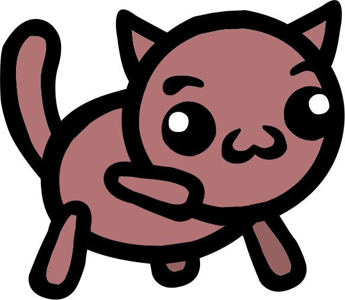
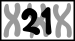
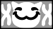
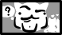
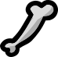
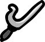
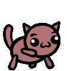
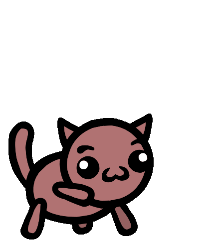
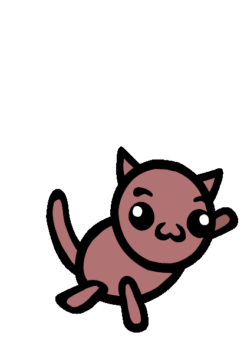

# Fighter

Fighter

Punch your way to victory! Fighters are great at doing big strong melee attacks and smashing things to pieces!

Stat Modifiers

Buffs

+2 Strength [STR](/wiki/Stats#Strength "Stats")  
+1 Speed [SPD](/wiki/Stats#Speed "Stats")

Debuffs

-1 Intelligence [INT](/wiki/Stats#Intelligence "Stats")

Level up Stats

Strength [STR](/wiki/Stats#Strength "Stats"), Constitution [CON](/wiki/Stats#Constitution "Stats"), Speed [SPD](/wiki/Stats#Speed "Stats")

Details

Collar

> “
>
> "Brawn over brains!"
>
> — A cat equipped with the Fighter collar when embarking on an adventure

The **Fighter** is a starting [class](/wiki/Class "Class").

## Overview

Fighters get +2  [Strength](/wiki/Stats#Strength "Stats") and +1  [Speed](/wiki/Stats#Speed "Stats"), but -1  [Intelligence](/wiki/Stats#Intelligence "Stats"). When leveling up, they can gain  [Strength](/wiki/Stats#Strength "Stats"),  [Constitution](/wiki/Stats#Constitution "Stats"), or  [Speed](/wiki/Stats#Speed "Stats").

Fighters are meant to do as much damage as possible, using their high  [Speed](/wiki/Stats#Speed "Stats") to get to the frontlines and then hitting hard thanks to their high  [Strength](/wiki/Stats#Strength "Stats"). They primarily excel at damaging single, high-health targets, but can effectively handle groups of enemies as well. They also have numerous ways of applying  [Bruise](/wiki/Status_Effects#Bruise "Status Effects"), further boosting their team's  Physical Damage. Fighters tend to be hearty units thanks to their sufficient  [Constitution](/wiki/Stats#Constitution "Stats"), as well as occasional  [Shield](/wiki/Keywords#Shield "Keywords") and  [Brace](/wiki/Status_Effects#Brace "Status Effects"). However, their lowered  [Intelligence](/wiki/Stats#Intelligence "Stats") causes them to regenerate less mana at the end of their turn compared to other cats, weakening their damage output during longer fights. Additionally, most Fighter abilities can only target adjacent enemies, potentially forcing Fighters into dangerous positions.

### Basic Action

A Fighter's basic action is **Melee Attack**. It is a  Melee attack that does  Physical Damage to an adjacent unit equal to the user's  [Strength](/wiki/Stats#Strength "Stats").

### Archetypes

- **Hyper Offense:** Using abilities and temporary buffs to deal as much damage to one target as possible.
  - Fighters have a myriad of powerful single-target damage abilities, such as  [Fury Swipes](/wiki/Fury_Swipes "Fury Swipes")    [Fury Swipes](/wiki/Fury_Swipes "Fury Swipes")  A weak melee attack that has a chance to hit multiple times. ,  [One-Two Punch](/wiki/One-Two_Punch "One-Two Punch")    [One-Two Punch](/wiki/One-Two_Punch "One-Two Punch")  A melee attack that hits twice. Each punch inflicts Bruise 1. , and  [Thunder Punch](/wiki/Thunder_Punch "Thunder Punch")    [Thunder Punch](/wiki/Thunder_Punch "Thunder Punch")  A melee attack that has a 25% chance to inflict Stun. .
  -  [Berserk](/wiki/Berserk "Berserk")    [Berserk](/wiki/Berserk "Berserk")  Gain +5 Strength and Bruise 5. This ability becomes Berserker Dash. ,  [Bloodzerk](/wiki/Bloodzerk "Bloodzerk")    [Bloodzerk](/wiki/Bloodzerk "Bloodzerk")  Drop to 1 HP.  
    Damage you deal to bleeding units has Lifesteal.  
    This spell becomes Lacerate. , and  [Zoomzerk](/wiki/Zoomzerk "Zoomzerk")    [Zoomzerk](/wiki/Zoomzerk "Zoomzerk")  Your movement action becomes a dash attack.  
    This ability becomes Reposition.  trade the fighter's survivability for increased damage.
  -  [Exert](/wiki/Exert "Exert")    [Exert](/wiki/Exert "Exert")  Refresh your basic attack and movement action.  
    Fall asleep at the end of the turn.  allows for multiple basic attacks and movements in a single turn.
  - Abilities like  [Punch Face](/wiki/Punch_Face "Punch Face")    [Punch Face](/wiki/Punch_Face "Punch Face")  Your basic attacks are critical if they hit the front of a unit.  and  [Vengeful](/wiki/Vengeful "Vengeful")    [Vengeful](/wiki/Vengeful "Vengeful")  Your basic attack is always critical on enemies that have damaged you.  can guarantee critical hits.

- **Low Intelligence:** Lowering the  [Intelligence](/wiki/Stats#Intelligence "Stats") stat as much as possible to reap benefit from low- [Intelligence](/wiki/Stats#Intelligence "Stats")-scaling abilities.
  - Abilities such as  [1D Chess](/wiki/1D_Chess "1D Chess")    [1D Chess](/wiki/1D_Chess "1D Chess")  Move toward the closest enemy. The dumber you are, the farther you move.  and  [Dumb Muscle](/wiki/Dumb_Muscle "Dumb Muscle")    [Dumb Muscle](/wiki/Dumb_Muscle "Dumb Muscle")  Lose 1 Intelligence each time you take damage.  
    If you have 4 or less Intelligence, gain +2 Strength and your basic attack inflicts Bruise. At 0 Intelligence, gain +100% critical hit chance.  are much stronger at low  [Intelligence](/wiki/Stats#Intelligence "Stats").
  -  [Thick Skull](/wiki/Thick_Skull "Thick Skull")    [Thick Skull](/wiki/Thick_Skull "Thick Skull")  All injuries you get are Concussions.  
    You get +3 Shield for each concussion you have. This caps at 30 Shield.  allows Fighters to consistently lower their  [Intelligence](/wiki/Stats#Intelligence "Stats") without risk of permanently lowering other important stats.
    - Alternatively, using  [Stoopzerk](/wiki/Stoopzerk "Stoopzerk")    [Stoopzerk](/wiki/Stoopzerk "Stoopzerk")  Your Intelligence becomes 0. You can attack an extra time each turn for the rest of the battle.  
      This ability becomes MORE ANGRIER!!!  at the start of a battle can immediately lower the Fighter's  [Intelligence](/wiki/Stats#Intelligence "Stats") to 0.
  - Certain disorders such as  [Down's Syndrome](/wiki/Down%27s_Syndrome "Down's Syndrome") [Down's Syndrome](/wiki/Down%27s_Syndrome "Down's Syndrome")  +3 Constitution, -8 Intelligence, +7 Charisma. ,  [Williams Syndrome](/wiki/Williams_Syndrome "Williams Syndrome") [Williams Syndrome](/wiki/Williams_Syndrome "Williams Syndrome")  -5 Intelligence, +10 Charisma  
    Your attacks may  [Charm](/wiki/Status_Effects#Charmed "Status Effects"). , and  [GIGACHAD](/wiki/GIGACHAD "GIGACHAD") [GIGACHAD](/wiki/GIGACHAD "GIGACHAD")  +8 Charisma -5 Intelligence  can drop the Fighter's  [Intelligence](/wiki/Stats#Intelligence "Stats") while boosting  [Constitution](/wiki/Stats#Constitution "Stats") and  [Charisma](/wiki/Stats#Charisma "Stats").
  -  [Think Too Hard](/wiki/Think_Too_Hard "Think Too Hard")    [Think Too Hard](/wiki/Think_Too_Hard "Think Too Hard")  Take damage equal to your Intelligence.  
    The next spell you cast this turn is free.  and  [Math?](/wiki/Math%3F "Math?")    [Math?](/wiki/Math%3F "Math?")  Your spells cost 3 mana to cast, but each can be cast only once per turn.  allow for spells to be used for free, making the lack of mana much less constricting.

- **Bodyguard:** Uses mobility and positioning moves to control the battlefield and pick fights with enemies.
  - Abilities such as  [Gravity Slam](/wiki/Gravity_Slam "Gravity Slam")    [Gravity Slam](/wiki/Gravity_Slam "Gravity Slam")  Jump to a tile and pull enemies toward you when you land.  and  [Taunt!](/wiki/Taunt! "Taunt!")    [Taunt!](/wiki/Taunt! "Taunt!")  All enemies within 3 tiles move toward you.  can pull enemies into favorable positions,.
  -  [Grapple](/wiki/Grapple "Grapple")    [Grapple](/wiki/Grapple "Grapple")  Immobilize an adjacent unit for as long as you remain adjacent. ,  [Ice Punch](/wiki/Ice_Punch "Ice Punch")    [Ice Punch](/wiki/Ice_Punch "Ice Punch")  A melee attack that inflicts Freeze. , and  [Sleeper Hold](/wiki/Sleeper_Hold "Sleeper Hold")    [Sleeper Hold](/wiki/Sleeper_Hold "Sleeper Hold")  Inflict Sleep on an adjacent unit.  can hold back a troublesome enemy from the rest of the party.

- **Mini-Tank/Counterattacker:** Built like the  [Tank](/wiki/Tank "Tank") class through focus on raising  [Constitution](/wiki/Stats#Constitution "Stats"),  [Shield](/wiki/Keywords#Shield "Keywords"), and  [Brace](/wiki/Status_Effects#Brace "Status Effects"), allowing them to shrug off hits on the front lines.
  - Extra tankiness allows for effective use of abilities like  [Breaking Point](/wiki/Breaking_Point "Breaking Point")    [Breaking Point](/wiki/Breaking_Point "Breaking Point")  Deal damage, knockback, and knockback damage equal to your Strength.  
    Reduce this spell's mana cost by 1 each time you take damage.  
     (Castable once per turn.)   and  [Hulk Up](/wiki/Hulk_Up "Hulk Up")    [Hulk Up](/wiki/Hulk_Up "Hulk Up")  When you take damage, gain +2 Speed.  that get stronger when taking damage.
  - Tanky Fighters can get extra mileage out of counterattack-focused abilities such as  [Counter](/wiki/Counter "Counter")    [Counter](/wiki/Counter "Counter")  Counterattack all attacks until your next turn. ,  [Vengeful](/wiki/Vengeful "Vengeful")    [Vengeful](/wiki/Vengeful "Vengeful")  Your basic attack is always critical on enemies that have damaged you. ,  [Patellar Reflex](/wiki/Patellar_Reflex "Patellar Reflex")    [Patellar Reflex](/wiki/Patellar_Reflex "Patellar Reflex")  When a unit damages you, counter-attack dealing 1 damage and inflicting  [Bruise](/wiki/Status_Effects#Bruise "Status Effects"). , and  [Hit Me](/wiki/Hit_Me "Hit Me")    [Hit Me](/wiki/Hit_Me "Hit Me")  When you take damage from an ally, basic attack in the direction you're facing.  
    Damage you take from allies is reduced to 1. .

- **Weapon Master:** Focuses on buffing or generating melee weapons.
  - Abilities like  [Stick!](/wiki/Stick! "Stick!")    [Stick!](/wiki/Stick! "Stick!")  Equip a temporary Stick!  
     (Your weapon slot must be empty.)  ,  [Boned](/wiki/Boned "Boned")    [Boned](/wiki/Boned "Boned")  When you kill a unit, if you don't have a weapon, gain a  [Bone Club](/wiki/Bone_Club "Bone Club")   [Bone Club](/wiki/Bone_Club "Bone Club") (Weapon)  Use: A melee attack.  
    This weapon has a 15% chance to break each time it's used. . , and  [Smash!](/wiki/Smash! "Smash!")    [Smash!](/wiki/Smash! "Smash!")  Your weapons deals triple damage, but they always break when you use them.  
    Three Sticks are added to your inventory.  can generate temporary weapons mid-combat.
    -  [Dual Wield](/wiki/Dual_Wield "Dual Wield")    [Dual Wield](/wiki/Dual_Wield "Dual Wield")  When you use your weapon, automatically use it again for free.  and  [Weapon Master](/wiki/Weapon_Master "Weapon Master")    [Weapon Master](/wiki/Weapon_Master "Weapon Master")  Your weapon and item abilities deal +2 Damage and get +25% critical chance. A pipe is added to your inventory.  can enhance the power of these weapons or get even more benefit from a powerful permanent weapon like  [Jitte](/wiki/Jitte "Jitte")   [Jitte](/wiki/Jitte "Jitte") (Weapon)  Use: A melee attack that deals damage equal to half your Strength rounded up, inflicts  [Weakness](/wiki/Status_Effects#Weakness "Status Effects") 1, and gives you +1 Strength and +1 HP on hit. .

## Abilities

### Basic Attack

| Name | | Status Dealt | Description |
| --- | --- | --- | --- |
| [ABILITY Melee Attack.svg](/wiki/Melee_Attack "Melee Attack") | [Melee Attack (Fighter)](/wiki/Melee_Attack "Melee Attack") | 5[UI Physical Damage Icon.svg](/wiki/Physical_Damage "Physical Damage") | Attack an adjacent unit. |

### Active Abilities

| Fighter Active Abilities | | | | |
| --- | --- | --- | --- | --- |
| Name | | Description | Mana Cost | Upgraded Description |
| [ABILITY 1D Chess.svg](/wiki/1D_Chess "1D Chess") | [1D Chess](/wiki/1D_Chess "1D Chess") | Move toward the closest enemy. The dumber you are, the farther you move. | [UI Mana Cost Icon.svg](/wiki/Mana_Cost "Mana Cost") 3 | Move toward the closest enemy. The dumber you are, the farther you move.  (This spell costs less.) |
| [ABILITY Assert Dominance.svg](/wiki/Assert_Dominance "Assert Dominance") | [Assert Dominance](/wiki/Assert_Dominance "Assert Dominance") | A weak melee attack. If this kills anything, you become the Alpha. If you are the Alpha, this spell deals 5 additional damage and inflicts Bruise. | [UI Mana Cost Icon.svg](/wiki/Mana_Cost "Mana Cost") 4 | A weak melee attack. If this kills anything, you become the Alpha and gain +2 [Strength](/wiki/Stats#Strength "Strength")Strength. If you are the Alpha, this spell deals 5 additional damage and inflicts Bruise. |
| [ABILITY Berserk.svg](/wiki/Berserk "Berserk") | [Berserk](/wiki/Berserk "Berserk") | Gain +5 [Strength](/wiki/Stats#Strength "Strength")Strength and Bruise 5. This ability becomes Berserker Dash. | [UI Mana Cost Icon.svg](/wiki/Mana_Cost "Mana Cost") 4 | Gain +7 [Strength](/wiki/Stats#Strength "Strength")Strength and Bruise 3. This ability becomes Berserker Dash+. |
| [ABILITY Big Punch.svg](/wiki/Big_Punch "Big Punch") | [Big Punch](/wiki/Big_Punch "Big Punch") | A melee attack. This spell's mana cost increases by 2 each time it's cast. | [UI Mana Cost Icon.svg](/wiki/Mana_Cost "Mana Cost") 3 | A melee attack. This spell's mana cost increases by 1 each time it's cast. |
| [ABILITY Bloodzerk.svg](/wiki/Bloodzerk "Bloodzerk") | [Bloodzerk](/wiki/Bloodzerk "Bloodzerk") | Drop to 1 HP. Damage you deal to bleeding units has Lifesteal. This spell becomes Lacerate. | [UI Mana Cost Icon.svg](/wiki/Mana_Cost "Mana Cost") 3 | Drop to 1 HP. Damage you deal to bleeding units has Lifesteal. This spell becomes Lacerate+.  (This spell costs 0 mana.) |
| [ABILITY Breaking Point.svg](/wiki/Breaking_Point "Breaking Point") | [Breaking Point](/wiki/Breaking_Point "Breaking Point") | Deal damage, knockback, and knockback damage equal to your [Strength](/wiki/Stats#Strength "Strength")Strength. Reduce this spell's mana cost by 1 each time you take damage.  (Castable once per turn.) | [UI Mana Cost Icon.svg](/wiki/Mana_Cost "Mana Cost") 15 | Deal damage, knockback, and knockback damage equal to your [Strength](/wiki/Stats#Strength "Strength")Strength. Reduce this spell's mana cost by 2 each time you take damage.  (Castable once per turn.) |
| [ABILITY Bull Rush.svg](/wiki/Bull_Rush "Bull Rush") | [Bull Rush](/wiki/Bull_Rush "Bull Rush") | Dash forward and attack with knockback. | [UI Mana Cost Icon.svg](/wiki/Mana_Cost "Mana Cost") 6 | Dash forward and attack with knockback. Repeat this if you hit something. |
| [ABILITY Chaos Rampage.svg](/wiki/Chaos_Rampage "Chaos Rampage") | [Chaos Rampage](/wiki/Chaos_Rampage "Chaos Rampage") | Take an extra turn. You have Madness 1 and Confusion 1 on that turn.  (This spell can't be cast on extra turns.) | [UI Mana Cost Icon.svg](/wiki/Mana_Cost "Mana Cost") 3 | Take an extra turn. You have Madness 1 on that turn.  (This spell can't be cast on extra turns.) |
| [ABILITY Confront.svg](/wiki/Confront "Confront") | [Confront](/wiki/Confront "Confront") | Move in front of an enemy. | [UI Mana Cost Icon.svg](/wiki/Mana_Cost "Mana Cost") 7 | Move in front of an enemy. Your next action has +30% critical chance.  (This spell costs less.) |
| [ABILITY Cosmic Punch.svg](/wiki/Cosmic_Punch "Cosmic Punch") | [Cosmic Punch](/wiki/Cosmic_Punch "Cosmic Punch") | Punch a unit into SPACE!  They will fall back down at the end of the round. | [UI Mana Cost Icon.svg](/wiki/Mana_Cost "Mana Cost") 5 | Punch a unit into SPACE!  They will fall back down at the end of the round. (This spell costs less.) |
| [ABILITY Counter.svg](/wiki/Counter "Counter") | [Counter](/wiki/Counter "Counter") | Counterattack all attacks until your next turn. | [UI Mana Cost Icon.svg](/wiki/Mana_Cost "Mana Cost") 6 | Preemptively counterattack all attacks until your next turn. |
| [ABILITY Enrage.svg](/wiki/Enrage "Enrage") | [Enrage](/wiki/Enrage "Enrage") | Give a unit +4 [Strength](/wiki/Stats#Strength "Strength")Strength and Confusion 2. | [UI Mana Cost Icon.svg](/wiki/Mana_Cost "Mana Cost") 3 | Give a unit on any tile +4 [Strength](/wiki/Stats#Strength "Strength")Strength and Confusion 2. |
| [ABILITY Exert.svg](/wiki/Exert "Exert") | [Exert](/wiki/Exert "Exert") | Refresh your basic attack and movement action. Fall asleep at the end of the turn. | [UI Mana Cost Icon.svg](/wiki/Mana_Cost "Mana Cost") 8 | Refresh your basic attack and movement action. Gain +2 [Strength](/wiki/Stats#Strength "Strength")Strength and +4 [Speed](/wiki/Stats#Speed "Speed")Speed until end of turn. Fall asleep at the end of the turn. |
| [ABILITY Exhausting Blow.svg](/wiki/Exhausting_Blow "Exhausting Blow") | [Exhausting Blow](/wiki/Exhausting_Blow "Exhausting Blow") | Dash forward one tile and attack with knockback.  (This spell's mana cost increases by 2 at the end of each of your turns.) | [UI Mana Cost Icon.svg](/wiki/Mana_Cost "Mana Cost") 2 | Dash forward any number of tiles and attack with knockback.  (This spell's mana cost increases by 2 at the end of each of your turns.) |
| [ABILITY Falcon Punch.svg](/wiki/Falcon_Punch "Falcon Punch") | [Falcon Punch](/wiki/Falcon_Punch "Falcon Punch") | Charge up a mega punch.  (This punch will be unleashed on your next turn.)   (Castable once per turn.) | [UI Mana Cost Icon.svg](/wiki/Mana_Cost "Mana Cost") 2 | Charge up a mega dash attack.  (This punch will be unleashed on your next turn.)   (Castable once per turn.) |
| [ABILITY Fire Punch.svg](/wiki/Fire_Punch "Fire Punch") | [Fire Punch](/wiki/Fire_Punch "Fire Punch") | A melee attack that inflicts Burn 3. | [UI Mana Cost Icon.svg](/wiki/Mana_Cost "Mana Cost") 7 | A melee attack that inflicts more Burn the more [Strength](/wiki/Stats#Strength "Strength")Strength you have. |
| [ABILITY Flex Off.svg](/wiki/Flex_Off "Flex Off") | [Flex Off](/wiki/Flex_Off "Flex Off") | You and each allied cat gain +2 [UI Shield Icon.svg](/wiki/Shield "Shield") and knockback adjacent units 2 tiles. | [UI Mana Cost Icon.svg](/wiki/Mana_Cost "Mana Cost") 8 | You and each allied cat gain +2 [UI Shield Icon.svg](/wiki/Shield "Shield"), +2 temporary Brace, and knockback adjacent units 2 tiles. |
| [ABILITY Fury Swipes.svg](/wiki/Fury_Swipes "Fury Swipes") | [Fury Swipes](/wiki/Fury_Swipes "Fury Swipes") | A weak melee attack that has a chance to hit multiple times. | [UI Mana Cost Icon.svg](/wiki/Mana_Cost "Mana Cost") 6 | A melee attack that has a chance to hit multiple times. |
| [ABILITY Grapple.svg](/wiki/Grapple "Grapple") | [Grapple](/wiki/Grapple "Grapple") | Immobilize an adjacent unit for as long as you remain adjacent. | [UI Mana Cost Icon.svg](/wiki/Mana_Cost "Mana Cost") 4 | Immobilize an adjacent unit for as long as you remain adjacent.  (This spell costs less.) |
| [ABILITY Gravity Slam.svg](/wiki/Gravity_Slam "Gravity Slam") | [Gravity Slam](/wiki/Gravity_Slam "Gravity Slam") | Jump to a tile and pull enemies toward you when you land. | [UI Mana Cost Icon.svg](/wiki/Mana_Cost "Mana Cost") 6 | Jump to a tile and pull enemies toward you when you land.  (This spell costs less.) |
| [ABILITY Huddle.svg](/wiki/Huddle "Huddle") | [Huddle](/wiki/Huddle "Huddle") | You and each allied cat give adjacent units +1 Damage and +2 [Speed](/wiki/Stats#Speed "Speed")Speed. | [UI Mana Cost Icon.svg](/wiki/Mana_Cost "Mana Cost") 6 | You and each allied cat give adjacent units +1 Damage and +2 [Speed](/wiki/Stats#Speed "Speed")Speed.  (This spell is free the first time it's cast each battle.) |
| [ABILITY Hurl.svg](/wiki/Hurl "Hurl") | [Hurl](/wiki/Hurl "Hurl") | Toss an adjacent unit at a random unit. | [UI Mana Cost Icon.svg](/wiki/Mana_Cost "Mana Cost") 5 | Toss an adjacent unit at a random unit.  (This spell costs less.) |
| [ABILITY Ice Punch.svg](/wiki/Ice_Punch "Ice Punch") | [Ice Punch](/wiki/Ice_Punch "Ice Punch") | A melee attack that inflicts Freeze. | [UI Mana Cost Icon.svg](/wiki/Mana_Cost "Mana Cost") 7 | A much stronger melee attack that inflicts Freeze. |
| [ABILITY Inhale.svg](/wiki/Inhale "Inhale") | [Inhale](/wiki/Inhale "Inhale") | Suck all units in a straight line 1 tile toward you. | [UI Mana Cost Icon.svg](/wiki/Mana_Cost "Mana Cost") 3 | Suck all units in a straight line 3 tiles toward you. |
| [ABILITY Juiced.svg](/wiki/Juiced "Juiced") | [Juiced](/wiki/Juiced "Juiced") | Your movement range is doubled until the end of the turn. | [UI Mana Cost Icon.svg](/wiki/Mana_Cost "Mana Cost") 4 | Your movement range is doubled and you get +4 [Strength](/wiki/Stats#Strength "Strength")Strength until the end of the turn. |
| [ABILITY Leap.svg](/wiki/Leap "Leap") | [Leap](/wiki/Leap "Leap") | Jump to an open tile within range, then inflict Bruise on all adjacent units. | [UI Mana Cost Icon.svg](/wiki/Mana_Cost "Mana Cost") 6 | Jump to an open tile within range, then damage and inflict Bruise on all adjacent units. |
| [ABILITY Meteor Slam.svg](/wiki/Meteor_Slam "Meteor Slam") | [Meteor Slam](/wiki/Meteor_Slam "Meteor Slam") | Jump up to 2 tiles. Damage, knockback, and inflict Burn 3 on the unit you land on and all adjacent units.  (Adjacent units take half damage.) | [UI Mana Cost Icon.svg](/wiki/Mana_Cost "Mana Cost") 10 | Jump up to 5 tiles. Damage, knockback, and inflict Burn 3 on the unit you land on and all adjacent units. |
| [ABILITY Mock.svg](/wiki/Mock "Mock") | [Mock](/wiki/Mock "Mock") | Force a unit to move towards you. RELOAD: Kill something. | [UI Mana Cost Icon.svg](/wiki/Mana_Cost "Mana Cost") 0 | Force a unit to move towards you. RELOAD: Kill something. Bonus Ability: Slap. |
| [ABILITY Muscle Memory.svg](/wiki/Muscle_Memory "Muscle Memory") | [Muscle Memory](/wiki/Muscle_Memory "Muscle Memory") | A melee attack that deals 8 damage.  (This spell's damage is reduced by 1 and mana cost is reduced by 2 each time it's cast.) | [UI Mana Cost Icon.svg](/wiki/Mana_Cost "Mana Cost") 8 | A melee attack that deals 8 damage and inflicts Bruise.  (This spell's damage is reduced by 1 and mana cost is reduced by 2 each time it's cast.) |
| [ABILITY Nip.svg](/wiki/Nip "Nip") | [Nip](/wiki/Nip "Nip") | Inflict Bruise on a unit. | [UI Mana Cost Icon.svg](/wiki/Mana_Cost "Mana Cost") 2 | Deal 1 damage and inflict Bruise on a unit. |
| [ABILITY One-Two Punch.svg](/wiki/One-Two_Punch "One-Two Punch") | [One-Two Punch](/wiki/One-Two_Punch "One-Two Punch") | A melee attack that hits twice. Each punch inflicts Bruise 1. | [UI Mana Cost Icon.svg](/wiki/Mana_Cost "Mana Cost") 8 | A melee attack that hits thrice! Each punch inflicts Bruise 1. |
| [ABILITY Paw Breaker.svg](/wiki/Paw_Breaker "Paw Breaker") | [Paw Breaker](/wiki/Paw_Breaker "Paw Breaker") | A huge punch that breaks your paw... (You get -1 [Strength](/wiki/Stats#Strength "Strength")Strength permanently.) | [UI Mana Cost Icon.svg](/wiki/Mana_Cost "Mana Cost") 5 | A huge punch that inflicts Bruise and Stun, and breaks your paw... (You get -1 [Strength](/wiki/Stats#Strength "Strength")Strength permanently.) |
| [ABILITY Poke.svg](/wiki/Poke "Poke") | [Poke](/wiki/Poke "Poke") | A melee attack that deals 1 damage. | [UI Mana Cost Icon.svg](/wiki/Mana_Cost "Mana Cost") 2 | A melee attack that deals 1 damage.  (This spell costs less.) |
| [ABILITY Push.svg](/wiki/Push "Push") | [Push](/wiki/Push "Push") | Knockback a unit 2 tiles. | [UI Mana Cost Icon.svg](/wiki/Mana_Cost "Mana Cost") 2 | Turn an adjacent unit around and knock it back 2 tiles. |
| [ABILITY Rage Punch.svg](/wiki/Rage_Punch "Rage Punch") | [Rage Punch](/wiki/Rage_Punch "Rage Punch") | A melee attack that increases its damage by 1 each time you take damage. | [UI Mana Cost Icon.svg](/wiki/Mana_Cost "Mana Cost") 4 | A melee attack that increases its damage by 1 each time you take damage.  (This spell starts at 5 damage.) |
| [ABILITY Ram.svg](/wiki/Ram "Ram") | [Ram](/wiki/Ram "Ram") | Knock back a unit 4 tiles, then dash forward and attack it. | [UI Mana Cost Icon.svg](/wiki/Mana_Cost "Mana Cost") 6 | Knock back a unit 10 tiles, then dash forward and attack it. |
| [ABILITY Side Slash.svg](/wiki/Side_Slash "Side Slash") | [Side Slash](/wiki/Side_Slash "Side Slash") | An attack that hits a half circle around you. | [UI Mana Cost Icon.svg](/wiki/Mana_Cost "Mana Cost") 7 | An attack that hits a half circle around you and inflicts Bruise. |
| [ABILITY Sleeper Hold.svg](/wiki/Sleeper_Hold "Sleeper Hold") | [Sleeper Hold](/wiki/Sleeper_Hold "Sleeper Hold") | Inflict Sleep on an adjacent unit. | [UI Mana Cost Icon.svg](/wiki/Mana_Cost "Mana Cost") 5 | Inflict Sleep and Bruise on an adjacent unit. |
| [ABILITY Spin.svg](/wiki/Spin "Spin") | [Spin](/wiki/Spin "Spin") | Attack everything around you 3 times. | [UI Mana Cost Icon.svg](/wiki/Mana_Cost "Mana Cost") 6 | Attack everything around you in a wide area 3 times. |
| [ABILITY Stick!.svg](/wiki/Stick! "Stick!") | [Stick!](/wiki/Stick! "Stick!") | Equip a temporary Stick!  (Your weapon slot must be empty.) | [UI Mana Cost Icon.svg](/wiki/Mana_Cost "Mana Cost") 5 | Equip a temporary Stick! Maybe even a big one?  (Your weapon slot must be empty.)   (This spell costs less.) |
| [ABILITY Stoopzerk.svg](/wiki/Stoopzerk "Stoopzerk") | [Stoopzerk](/wiki/Stoopzerk "Stoopzerk") | Your [Intelligence](/wiki/Stats#Intelligence "Intelligence")Intelligence becomes 0. You can attack an extra time each turn for the rest of the battle. This ability becomes MORE ANGRIER!!! | [UI Mana Cost Icon.svg](/wiki/Mana_Cost "Mana Cost") 6 | Your [Intelligence](/wiki/Stats#Intelligence "Intelligence")Intelligence becomes 0. You can attack an extra time each turn for the rest of the battle. This ability becomes MORE ANGRIER!!!+ |
| [ABILITY Sucker Punch.svg](/wiki/Sucker_Punch "Sucker Punch") | [Sucker Punch](/wiki/Sucker_Punch "Sucker Punch") | The next time an enemy moves through an adjacent tile, cancel its movement and attack it. | [UI Mana Cost Icon.svg](/wiki/Mana_Cost "Mana Cost") 5 | The next time an enemy moves through an adjacent tile, cancel its movement and attack it. Bonus Passive: While it's not your turn, your basic attack inflicts Bruise 2. |
| [ABILITY Synchro Spin.svg](/wiki/Synchro_Spin "Synchro Spin") | [Synchro Spin](/wiki/Synchro_Spin "Synchro Spin") | You and each allied cat do a spin attack at the same time. | [UI Mana Cost Icon.svg](/wiki/Mana_Cost "Mana Cost") 8 | You and each allied cat do a spin attack at the same time.  (This spell costs less.) |
| [ABILITY Tail Whip.svg](/wiki/Tail_Whip "Tail Whip") | [Tail Whip](/wiki/Tail_Whip "Tail Whip") | An attack that hits 2 tiles in front of and behind you. | [UI Mana Cost Icon.svg](/wiki/Mana_Cost "Mana Cost") 6 | An attack that hits 4 tiles in front of and behind you. |
| [ABILITY Taunt!.svg](/wiki/Taunt! "Taunt!") | [Taunt!](/wiki/Taunt! "Taunt!") | All enemies within 3 tiles move toward you. | [UI Mana Cost Icon.svg](/wiki/Mana_Cost "Mana Cost") 4 | All enemies within 5 tiles move toward you. |
| [ABILITY Think Too Hard.svg](/wiki/Think_Too_Hard "Think Too Hard") | [Think Too Hard](/wiki/Think_Too_Hard "Think Too Hard") | Take damage equal to your [Intelligence](/wiki/Stats#Intelligence "Intelligence")Intelligence. The next spell you cast this turn is free. | [UI Mana Cost Icon.svg](/wiki/Mana_Cost "Mana Cost") 2 | Take damage equal to your [Intelligence](/wiki/Stats#Intelligence "Intelligence")Intelligence, then your [Intelligence](/wiki/Stats#Intelligence "Intelligence")Intelligence becomes 0. The next spell you cast this turn is free. |
| [ABILITY Thunder Punch.svg](/wiki/Thunder_Punch "Thunder Punch") | [Thunder Punch](/wiki/Thunder_Punch "Thunder Punch") | A melee attack that has a 25% chance to inflict Stun. | [UI Mana Cost Icon.svg](/wiki/Mana_Cost "Mana Cost") 7 | A melee attack that inflicts Stun. |
| [ABILITY Tumble.svg](/wiki/Tumble "Tumble") | [Tumble](/wiki/Tumble "Tumble") | Move one tile diagonally. | [UI Mana Cost Icon.svg](/wiki/Mana_Cost "Mana Cost") 2 | Move two tiles diagonally. |
| [ABILITY Uppercut.svg](/wiki/Uppercut "Uppercut") | [Uppercut](/wiki/Uppercut "Uppercut") | Punch a unit into the air, lobbing it back 3 tiles. | [UI Mana Cost Icon.svg](/wiki/Mana_Cost "Mana Cost") 7 | Punch a unit into the air, lobbing it back 3 tiles. Refresh your movement action. |
| [ABILITY Zoomzerk.svg](/wiki/Zoomzerk "Zoomzerk") | [Zoomzerk](/wiki/Zoomzerk "Zoomzerk") | Your movement action becomes a dash attack. This ability becomes Reposition. | [UI Mana Cost Icon.svg](/wiki/Mana_Cost "Mana Cost") 0 | Your movement action becomes a dash attack. Restore all your mana. This ability becomes Reposition+. |

#### Starting Actives

| Fighter Starting Active Abilities | | | | |
| --- | --- | --- | --- | --- |
| Name | | Description | Mana Cost | Upgraded Description |
| [ABILITY Berserk.svg](/wiki/Berserk "Berserk") | [Berserk](/wiki/Berserk "Berserk") | Gain +5 [Strength](/wiki/Stats#Strength "Strength")Strength and Bruise 5. This ability becomes Berserker Dash. | [UI Mana Cost Icon.svg](/wiki/Mana_Cost "Mana Cost") 4 | Gain +7 [Strength](/wiki/Stats#Strength "Strength")Strength and Bruise 3. This ability becomes Berserker Dash+. |
| [ABILITY Bull Rush.svg](/wiki/Bull_Rush "Bull Rush") | [Bull Rush](/wiki/Bull_Rush "Bull Rush") | Dash forward and attack with knockback. | [UI Mana Cost Icon.svg](/wiki/Mana_Cost "Mana Cost") 6 | Dash forward and attack with knockback. Repeat this if you hit something. |
| [ABILITY Confront.svg](/wiki/Confront "Confront") | [Confront](/wiki/Confront "Confront") | Move in front of an enemy. | [UI Mana Cost Icon.svg](/wiki/Mana_Cost "Mana Cost") 7 | Move in front of an enemy. Your next action has +30% critical chance.  (This spell costs less.) |
| [ABILITY Counter.svg](/wiki/Counter "Counter") | [Counter](/wiki/Counter "Counter") | Counterattack all attacks until your next turn. | [UI Mana Cost Icon.svg](/wiki/Mana_Cost "Mana Cost") 6 | Preemptively counterattack all attacks until your next turn. |
| [ABILITY Exert.svg](/wiki/Exert "Exert") | [Exert](/wiki/Exert "Exert") | Refresh your basic attack and movement action. Fall asleep at the end of the turn. | [UI Mana Cost Icon.svg](/wiki/Mana_Cost "Mana Cost") 8 | Refresh your basic attack and movement action. Gain +2 [Strength](/wiki/Stats#Strength "Strength")Strength and +4 [Speed](/wiki/Stats#Speed "Speed")Speed until end of turn. Fall asleep at the end of the turn. |
| [ABILITY Fire Punch.svg](/wiki/Fire_Punch "Fire Punch") | [Fire Punch](/wiki/Fire_Punch "Fire Punch") | A melee attack that inflicts Burn 3. | [UI Mana Cost Icon.svg](/wiki/Mana_Cost "Mana Cost") 7 | A melee attack that inflicts more Burn the more [Strength](/wiki/Stats#Strength "Strength")Strength you have. |
| [ABILITY Fury Swipes.svg](/wiki/Fury_Swipes "Fury Swipes") | [Fury Swipes](/wiki/Fury_Swipes "Fury Swipes") | A weak melee attack that has a chance to hit multiple times. | [UI Mana Cost Icon.svg](/wiki/Mana_Cost "Mana Cost") 6 | A melee attack that has a chance to hit multiple times. |
| [ABILITY Side Slash.svg](/wiki/Side_Slash "Side Slash") | [Side Slash](/wiki/Side_Slash "Side Slash") | An attack that hits a half circle around you. | [UI Mana Cost Icon.svg](/wiki/Mana_Cost "Mana Cost") 7 | An attack that hits a half circle around you and inflicts Bruise. |
| [ABILITY Spin.svg](/wiki/Spin "Spin") | [Spin](/wiki/Spin "Spin") | Attack everything around you 3 times. | [UI Mana Cost Icon.svg](/wiki/Mana_Cost "Mana Cost") 6 | Attack everything around you in a wide area 3 times. |
| [ABILITY Stick!.svg](/wiki/Stick! "Stick!") | [Stick!](/wiki/Stick! "Stick!") | Equip a temporary Stick!  (Your weapon slot must be empty.) | [UI Mana Cost Icon.svg](/wiki/Mana_Cost "Mana Cost") 5 | Equip a temporary Stick! Maybe even a big one?  (Your weapon slot must be empty.)   (This spell costs less.) |

### Passive Abilities

| Fighter Passive Abilities | | | | |
| --- | --- | --- | --- | --- |
| Name | | Description | Mana Cost | Upgraded Description |
| [ABILITY Avenger.svg](/wiki/Avenger "Avenger") | [Avenger](/wiki/Avenger "Avenger") | When an allied cat is downed, gain [STATUS All Stats Up Icon.svg](/wiki/Status_Effects#All_Stats_Up "Status Effects") [All Stats Up](/wiki/Status_Effects#All_Stats_Up "Status Effects") 2 and heal 8. | When an allied cat is downed, gain [STATUS All Stats Up Icon.svg](/wiki/Status_Effects#All_Stats_Up "Status Effects") [All Stats Up](/wiki/Status_Effects#All_Stats_Up "Status Effects") 2, heal 50% of your max HP, and take an extra turn. |
| [ABILITY Boned.svg](/wiki/Boned "Boned") | [Boned](/wiki/Boned "Boned") | When you kill a unit, if you don't have a weapon, gain a ITEM Bone Club.svg [Bone Club](/wiki/Bone_Club "Bone Club") [ITEM Bone Club.svg](/wiki/Bone_Club "Bone Club")  [Bone Club](/wiki/Bone_Club "Bone Club") (Weapon)  Use: A melee attack. This weapon has a 15% chance to break each time it's used. . | When you kill a unit, if you don't have a weapon, gain a ITEM Bone Club.svg [Bone Club](/wiki/Bone_Club "Bone Club") [ITEM Bone Club.svg](/wiki/Bone_Club "Bone Club")  [Bone Club](/wiki/Bone_Club "Bone Club") (Weapon)  Use: A melee attack. This weapon has a 15% chance to break each time it's used. . Bonus Ability: Throw Weapon. |
| [ABILITY Dual Wield.svg](/wiki/Dual_Wield "Dual Wield") | [Dual Wield](/wiki/Dual_Wield "Dual Wield") | When you use your weapon, automatically use it again for free. | When you use your weapon, automatically use it again for free, and then again! for free! |
| [ABILITY Dumb Muscle.svg](/wiki/Dumb_Muscle "Dumb Muscle") | [Dumb Muscle](/wiki/Dumb_Muscle "Dumb Muscle") | Lose 1 [Intelligence](/wiki/Stats#Intelligence "Intelligence")Intelligence each time you take damage. If you have 4 or less [Intelligence](/wiki/Stats#Intelligence "Intelligence")Intelligence, gain +2 [Strength](/wiki/Stats#Strength "Strength")Strength and your basic attack inflicts Bruise. At 0 [Intelligence](/wiki/Stats#Intelligence "Intelligence")Intelligence, gain +100% critical hit chance. | Lose 2 [Intelligence](/wiki/Stats#Intelligence "Intelligence")Intelligence each time you take damage. If you have 4 or less [Intelligence](/wiki/Stats#Intelligence "Intelligence")Intelligence, gain +2 [Strength](/wiki/Stats#Strength "Strength")Strength and your basic attack inflicts Bruise. At 0 [Intelligence](/wiki/Stats#Intelligence "Intelligence")Intelligence, gain +100% critical hit chance. At -10 [Intelligence](/wiki/Stats#Intelligence "Intelligence")Intelligence, you can use your basic move and attack an additional time each turn. |
| [ABILITY Fervor.svg](/wiki/Fervor "Fervor") | [Fervor](/wiki/Fervor "Fervor") | When you down a unit, you heal 5 HP. | When you down a unit, you heal 50% of your HP. |
| [ABILITY Frenzy.svg](/wiki/Frenzy "Frenzy") | [Frenzy](/wiki/Frenzy "Frenzy") | When you down a unit, gain +2 [Strength](/wiki/Stats#Strength "Strength") [Strength](/wiki/Stats#Strength "Stats"). | When you down a unit, gain +2 [Strength](/wiki/Stats#Strength "Strength") [Strength](/wiki/Stats#Strength "Stats") and +2 [Speed](/wiki/Stats#Speed "Speed") [Speed](/wiki/Stats#Speed "Stats"). |
| [ABILITY Hamster Style.svg](/wiki/Hamster_Style "Hamster Style") | [Hamster Style](/wiki/Hamster_Style "Hamster Style") | -1 [Strength](/wiki/Stats#Strength "Strength")Strength,-1 [Constitution](/wiki/Stats#Constitution "Constitution")Constitution,+1 [Intelligence](/wiki/Stats#Intelligence "Intelligence")Intelligence +1 [STATUS Health Regen Icon.svg](/wiki/Status_Effects#Health_Regen "Status Effects") [Health Regeneration](/wiki/Status_Effects#Health_Regen "Status Effects"). Start with 2 Bonus Moves. | -1 [Strength](/wiki/Stats#Strength "Strength")Strength,-1 [Constitution](/wiki/Stats#Constitution "Constitution")Constitution,+1 [Intelligence](/wiki/Stats#Intelligence "Intelligence")Intelligence +2 [STATUS Health Regen Icon.svg](/wiki/Status_Effects#Health_Regen "Status Effects") [Health Regeneration](/wiki/Status_Effects#Health_Regen "Status Effects"). Start with 2 Bonus Moves. Your basic attack has a chance to attack multiple times. |
| [ABILITY Hit Me.svg](/wiki/Hit_Me "Hit Me") | [Hit Me](/wiki/Hit_Me "Hit Me") | When you take damage from an ally, basic attack in the direction you're facing. Damage you take from allies is reduced to 1. | When you take damage from an ally, basic attack in the direction you're facing. Damage you take from allies is reduced to 1. Whenever you take damage, gain +1 to a random stat. |
| [ABILITY Hulk Up.svg](/wiki/Hulk_Up "Hulk Up") | [Hulk Up](/wiki/Hulk_Up "Hulk Up") | When you take damage, gain +2 [Speed](/wiki/Stats#Speed "Speed")Speed. | +2 [Speed](/wiki/Stats#Speed "Speed")Speed When you take damage, gain +2 [Speed](/wiki/Stats#Speed "Speed")Speed and +10% dodge. This caps at 50%. |
| [ABILITY Math?.svg](/wiki/Math%3F "Math?") | [Math?](/wiki/Math%3F "Math?") | Your spells cost 3 mana to cast, but each can be cast only once per turn. | Your spells cost 0 mana to cast, but each can be cast only once per turn. |
| [ABILITY Merciless.svg](/wiki/Merciless "Merciless") | [Merciless](/wiki/Merciless "Merciless") | When you deal 10 or more damage in a single hit, gain +2 Shield and refresh your movement action. | When you deal 10 or more damage in a single hit, gain +2 Shield, [STATUS All Stats Up Icon.svg](/wiki/Status_Effects#All_Stats_Up "Status Effects") [All Stats Up](/wiki/Status_Effects#All_Stats_Up "Status Effects"), and refresh your movement action. |
| [ABILITY Most Valuable Cat.svg](/wiki/Most_Valuable_Cat "Most Valuable Cat") | [Most Valuable Cat](/wiki/Most_Valuable_Cat "Most Valuable Cat") | When you or an ally downs another unit, they become [STATUS The Alpha Icon.svg](/wiki/Status_Effects#The_Alpha "Status Effects") [The Alpha](/wiki/Status_Effects#The_Alpha "Status Effects"). If you're [STATUS The Alpha Icon.svg](/wiki/Status_Effects#The_Alpha "Status Effects") [The Alpha](/wiki/Status_Effects#The_Alpha "Status Effects"), take an extra turn at the end of each round. | You start the battle as [STATUS The Alpha Icon.svg](/wiki/Status_Effects#The_Alpha "Status Effects") [The Alpha](/wiki/Status_Effects#The_Alpha "Status Effects"). Whenever you or an ally downs another unit, they become [STATUS The Alpha Icon.svg](/wiki/Status_Effects#The_Alpha "Status Effects") [The Alpha](/wiki/Status_Effects#The_Alpha "Status Effects"). If you're [STATUS The Alpha Icon.svg](/wiki/Status_Effects#The_Alpha "Status Effects") [The Alpha](/wiki/Status_Effects#The_Alpha "Status Effects"), take an extra turn at the end of each round. |
| [ABILITY OVERPOWERED!!!.svg](/wiki/OVERPOWERED!!! "OVERPOWERED!!!") | [OVERPOWERED!!!](/wiki/OVERPOWERED!!! "OVERPOWERED!!!") | Excess damage you deal to units makes them explode, dealing the excess damage to units around it, except for you. | Excess damage you deal to units makes them explode, dealing the excess damage to units within 2 tiles of it, except for you. |
| [ABILITY Patellar Reflex.svg](/wiki/Patellar_Reflex "Patellar Reflex") | [Patellar Reflex](/wiki/Patellar_Reflex "Patellar Reflex") | When a unit damages you, counter-attack dealing 1 damage and inflicting [STATUS Bruise Icon.svg](/wiki/Status_Effects#Bruise "Status Effects") [Bruise](/wiki/Status_Effects#Bruise "Status Effects"). | When a unit damages you, counter-attack with your basic attack and inflict [STATUS Bruise Icon.svg](/wiki/Status_Effects#Bruise "Status Effects") [Bruise](/wiki/Status_Effects#Bruise "Status Effects"). |
| [ABILITY Punch Face.svg](/wiki/Punch_Face "Punch Face") | [Punch Face](/wiki/Punch_Face "Punch Face") | Your basic attacks are critical if they hit the front of a unit. | Your physical attacks are critical if they hit the front of a unit. |
| [ABILITY Rat Style.svg](/wiki/Rat_Style "Rat Style") | [Rat Style](/wiki/Rat_Style "Rat Style") | +2 [Speed](/wiki/Stats#Speed "Speed")Speed. +10% [STATUS Dodge Chance Icon.svg](/wiki/Status_Effects#Dodge_Chance "Status Effects") [Dodge Chance](/wiki/Status_Effects#Dodge_Chance "Status Effects"). | +4 [Speed](/wiki/Stats#Speed "Speed")Speed. +30% [STATUS Dodge Chance Icon.svg](/wiki/Status_Effects#Dodge_Chance "Status Effects") [Dodge Chance](/wiki/Status_Effects#Dodge_Chance "Status Effects"). |
| [ABILITY Scars.svg](/wiki/Scars "Scars") | [Scars](/wiki/Scars "Scars") | +1 [STATUS Brace Icon.svg](/wiki/Status_Effects#Brace "Status Effects") [Brace](/wiki/Status_Effects#Brace "Status Effects"). | +3 [STATUS Brace Icon.svg](/wiki/Status_Effects#Brace "Status Effects") [Brace](/wiki/Status_Effects#Brace "Status Effects"). |
| [ABILITY Shoulder Check.svg](/wiki/Shoulder_Check "Shoulder Check") | [Shoulder Check](/wiki/Shoulder_Check "Shoulder Check") | If you're facing a unit after you move, automatically attack it at 33% damage. | If you're facing a unit after you move, automatically attack the unit. |
| [ABILITY Skullcrack.svg](/wiki/Skullcrack "Skullcrack") | [Skullcrack](/wiki/Skullcrack "Skullcrack") | Your basic attack inflicts [STATUS Bruise Icon.svg](/wiki/Status_Effects#Bruise "Status Effects") [Bruise](/wiki/Status_Effects#Bruise "Status Effects"). | Your basic attack inflicts [STATUS Bruise Icon.svg](/wiki/Status_Effects#Bruise "Status Effects") [Bruise](/wiki/Status_Effects#Bruise "Status Effects") 2. |
| [ABILITY Smash!.svg](/wiki/Smash! "Smash!") | [Smash!](/wiki/Smash! "Smash!") | Your weapons deals triple damage, but they always break when you use them. Three Sticks are added to your inventory. | Your weapons deals triple damage, but they have a 50% chance to break when you use them. Three more Sticks are added to your inventory. |
| [ABILITY Thick Skull.svg](/wiki/Thick_Skull "Thick Skull") | [Thick Skull](/wiki/Thick_Skull "Thick Skull") | All injuries you get are Concussions. You get +3 Shield for each concussion you have. This caps at 30 Shield. | All injuries you get are Concussions. You get +3 Shield and +1 [Strength](/wiki/Stats#Strength "Strength") [Strength](/wiki/Stats#Strength "Stats") for each concussion you have. This caps at 30 Shield and 10 STRENGTH. |
| [ABILITY Turtle Style.svg](/wiki/Turtle_Style "Turtle Style") | [Turtle Style](/wiki/Turtle_Style "Turtle Style") | +4 [UI Shield Icon.svg](/wiki/Shield "Shield"),+2 [Constitution](/wiki/Stats#Constitution "Constitution")Constitution,-1 [Speed](/wiki/Stats#Speed "Speed")Speed | +4 [UI Shield Icon.svg](/wiki/Shield "Shield"),+2 [Constitution](/wiki/Stats#Constitution "Constitution")Constitution,-1 [Speed](/wiki/Stats#Speed "Speed")Speed +2 [STATUS Brace Icon.svg](/wiki/Status_Effects#Brace "Status Effects") [Brace](/wiki/Status_Effects#Brace "Status Effects") |
| [ABILITY Underdog.svg](/wiki/Underdog "Underdog") | [Underdog](/wiki/Underdog "Underdog") | You have +2 [Strength](/wiki/Stats#Strength "Strength") [Strength](/wiki/Stats#Strength "Stats") and +1 [STATUS Brace Icon.svg](/wiki/Status_Effects#Brace "Status Effects") [Brace](/wiki/Status_Effects#Brace "Status Effects") for each enemy adjacent to you. | You have +3 [Strength](/wiki/Stats#Strength "Strength") [Strength](/wiki/Stats#Strength "Stats") and +2 [STATUS Brace Icon.svg](/wiki/Status_Effects#Brace "Status Effects") [Brace](/wiki/Status_Effects#Brace "Status Effects") for each enemy adjacent to you. |
| [ABILITY Vengeful.svg](/wiki/Vengeful "Vengeful") | [Vengeful](/wiki/Vengeful "Vengeful") | Your basic attack is always critical on enemies that have damaged you. | Your basic attack is always critical on enemies units that have damaged you. Inflict [STATUS Marked Icon.svg](/wiki/Status_Effects#Marked "Status Effects") [Marked](/wiki/Status_Effects#Marked "Status Effects") on units that contact or attack you. |
| [ABILITY Weapon Master.svg](/wiki/Weapon_Master "Weapon Master") | [Weapon Master](/wiki/Weapon_Master "Weapon Master") | Your weapon and item abilities deal +2 Damage and get +25% critical chance. A pipe is added to your inventory. | Your weapon and item abilities deal +3 Damage and get +50% critical chance. If you don't have a weapon, gain a random temporary weapon at the beginning of the battle. |

### Supplementary Abilities

| Fighter Supplementary Abilities | | | | |
| --- | --- | --- | --- | --- |
| Name | | Description | Mana Cost | Upgraded Description |
| [ABILITY Berserker Dash.svg](/wiki/Berserker_Dash "Berserker Dash") | [Berserker Dash](/wiki/Berserker_Dash "Berserker Dash") | A short range dash attack. | [UI Mana Cost Icon.svg](/wiki/Mana_Cost "Mana Cost") 2 | A dash attack with infinite range. |
| [ABILITY Lacerate.svg](/wiki/Lacerate "Lacerate") | [Lacerate](/wiki/Lacerate "Lacerate") | A melee attack that inflicts Bleed 2. | [UI Mana Cost Icon.svg](/wiki/Mana_Cost "Mana Cost") 4 | A stronger melee attack that inflicts Bleed 2. |
| [ABILITY MORE ANGRIER!!!.svg](/wiki/MORE_ANGRIER!!! "MORE ANGRIER!!!") | [MORE ANGRIER!!!](/wiki/MORE_ANGRIER!!! "MORE ANGRIER!!!") | Lose all of your mana and gain that much [Strength](/wiki/Stats#Strength "Strength")Strength until the end of the turn. | [UI Mana Cost Icon.svg](/wiki/Mana_Cost "Mana Cost") All | Lose all of your mana and gain that much [Strength](/wiki/Stats#Strength "Strength")Strength, [Dexterity](/wiki/Stats#Dexterity "Dexterity")Dexterity, and [Speed](/wiki/Stats#Speed "Speed")Speed until the end of the turn. |
| [ABILITY Reposition.svg](/wiki/Reposition "Reposition") | [Reposition](/wiki/Reposition "Reposition") | Move up to two tiles. | [UI Mana Cost Icon.svg](/wiki/Mana_Cost "Mana Cost") 4 | Move up to two tiles. |
| [ABILITY Slap.svg](/wiki/Slap "Slap") | [Slap](/wiki/Slap "Slap") | A weak melee attack. RELOAD: Kill something. | [UI Mana Cost Icon.svg](/wiki/Mana_Cost "Mana Cost") 0 |

## Unlocks

| Reward | Condition |
| --- | --- |
| [ABILITY Paw Breaker.svg](/wiki/Paw_Breaker "Paw Breaker") [Paw Breaker](/wiki/Paw_Breaker "Paw Breaker") [ABILITY Paw Breaker.svg](/wiki/Paw_Breaker "Paw Breaker")  Fighter [Paw Breaker](/wiki/Paw_Breaker "Paw Breaker")  A huge punch that breaks your paw... (You get -1 [Strength](/wiki/Stats#Strength "Strength")Strength permanently.) | Complete [CHAPTER The Caves.svg](/wiki/Caves "Caves") [Caves](/wiki/Caves "Caves") with the [Fighter Icon.svg](/wiki/Fighter "Fighter") Fighter. |
| [ABILITY Dual Wield.svg](/wiki/Dual_Wield "Dual Wield") [Dual Wield](/wiki/Dual_Wield "Dual Wield") [ABILITY Dual Wield.svg](/wiki/Dual_Wield "Dual Wield")  Fighter [Dual Wield](/wiki/Dual_Wield "Dual Wield")  When you use your weapon, automatically use it again for free. | Complete [CHAPTER The Boneyard.svg](/wiki/Boneyard "Boneyard") [Boneyard](/wiki/Boneyard "Boneyard") with the [Fighter Icon.svg](/wiki/Fighter "Fighter") Fighter. |
| [ABILITY Path of the Fighter.svg](/wiki/Path_of_the_Fighter "Path of the Fighter") [Path of the Fighter](/wiki/Path_of_the_Fighter "Path of the Fighter") [ABILITY Path of the Fighter.svg](/wiki/Path_of_the_Fighter "Path of the Fighter")  Collarless [Path of the Fighter](/wiki/Path_of_the_Fighter "Path of the Fighter")  Your [Intelligence](/wiki/Stats#Intelligence "Intelligence")Intelligence becomes 0 until the end of the battle, then this spell becomes a random Fighter spell permanently. | Complete [CHAPTER The Core.svg](/wiki/The_Core "The Core") [The Core](/wiki/The_Core "The Core") with the [Fighter Icon.svg](/wiki/Fighter "Fighter") Fighter. |
| [ABILITY Fighter's Soul.svg](/wiki/Fighter%27s_Soul "Fighter's Soul") [Fighter's Soul](/wiki/Fighter%27s_Soul "Fighter's Soul") [ABILITY Fighter's Soul.svg](/wiki/Fighter%27s_Soul "Fighter's Soul")  Collarless [Fighter's Soul](/wiki/Fighter%27s_Soul "Fighter's Soul")  +2 [Strength](/wiki/Stats#Strength "Strength")Strength,+1 [Speed](/wiki/Stats#Speed "Speed")Speed,-1 [Intelligence](/wiki/Stats#Intelligence "Intelligence")Intelligence Fighter abilities are offered when you level up. | Complete [CHAPTER The Moon.svg](/wiki/The_Moon "The Moon") [The Moon](/wiki/The_Moon "The Moon") with the [Fighter Icon.svg](/wiki/Fighter "Fighter") Fighter. |
| ITEM Battle Axe.svg [Battle Axe](/wiki/Battle_Axe "Battle Axe") [ITEM Battle Axe.svg](/wiki/Battle_Axe "Battle Axe")  [Battle Axe](/wiki/Battle_Axe "Battle Axe") (Weapon)  Use: A melee spin attack. This uses up both your movement and attack action. | Complete [CHAPTER The Jurassic.svg](/wiki/Jurassic "Jurassic") [Jurassic](/wiki/Jurassic "Jurassic") with the [Fighter Icon.svg](/wiki/Fighter "Fighter") Fighter. |
| ITEM Rage Juice.svg [Rage Juice](/wiki/Rage_Juice "Rage Juice") [ITEM Rage Juice.svg](/wiki/Rage_Juice "Rage Juice")  [Rage Juice](/wiki/Rage_Juice "Rage Juice") (Trinket)  Use: Gain +4 [Strength](/wiki/Stats#Strength "Strength")Strength, +4 [Speed](/wiki/Stats#Speed "Speed")Speed, Brace 2 and Madness for the rest of the battle.  (Usable once per battle.) | Complete [CHAPTER The End.svg](/wiki/The_End "The End") [The End](/wiki/The_End "The End") with the [Fighter Icon.svg](/wiki/Fighter "Fighter") Fighter. |
| ITEM Fighter's Helm.svg [Fighter's Helm](/wiki/Fighter%27s_Helm "Fighter's Helm") [ITEM Fighter's Helm.svg](/wiki/Fighter%27s_Helm "Fighter's Helm")  [Fighter's Helm](/wiki/Fighter%27s_Helm "Fighter's Helm") (Head)  +2 [UI Shield Icon.svg](/wiki/Shield "Shield") +15% chance to refresh your basic attack, movement, weapon and trinket actions when you get a kill. | Defeat BOSS Throbbing King Icon.svg [The King](/wiki/Throbbing_King "Throbbing King")[BOSS Throbbing King Icon.svg](/wiki/Throbbing_King "Throbbing King") [Throbbing King](/wiki/Throbbing_King "Throbbing King") Follow his orders! OR ELSE! with the [Fighter Icon.svg](/wiki/Fighter "Fighter") Fighter. |
| ITEM Fighter's Scar.svg [Fighter's Scar](/wiki/Fighter%27s_Scar "Fighter's Scar") [ITEM Fighter's Scar.svg](/wiki/Fighter%27s_Scar "Fighter's Scar")  [Fighter's Scar](/wiki/Fighter%27s_Scar "Fighter's Scar") (Face)  +2 [UI Shield Icon.svg](/wiki/Shield "Shield") +15% chance to refresh your basic attack, movement, weapon and trinket actions when you get a kill. | Defeat BOSS Organ Grinder Icon.svg [Chaos!](/wiki/Chaos! "Chaos!")[BOSS Organ Grinder Icon.svg](/wiki/Chaos! "Chaos!") [Chaos!](/wiki/Chaos! "Chaos!") Embrace chaos ! soahc ecarbmE with the [Fighter Icon.svg](/wiki/Fighter "Fighter") Fighter. |
| ITEM Fighter's Shoulder Pad.svg [Fighter's Shoulder Pad](/wiki/Fighter%27s_Shoulder_Pad "Fighter's Shoulder Pad") [ITEM Fighter's Shoulder Pad.svg](/wiki/Fighter%27s_Shoulder_Pad "Fighter's Shoulder Pad")  [Fighter's Shoulder Pad](/wiki/Fighter%27s_Shoulder_Pad "Fighter's Shoulder Pad") (Neck)  +2 [UI Shield Icon.svg](/wiki/Shield "Shield") +15% chance to refresh your basic attack, movement, weapon and trinket actions when you get a kill. | Defeat BOSS The Creator Icon.svg [The Creator](/wiki/The_Creator "The Creator")[BOSS The Creator Icon.svg](/wiki/The_Creator "The Creator") [The Creator](/wiki/The_Creator "The Creator") Nosce te Ipsum!  with the [Fighter Icon.svg](/wiki/Fighter "Fighter") Fighter. |
| ITEM Steroids.svg [Steroids](/wiki/Steroids "Steroids") [ITEM Steroids.svg](/wiki/Steroids "Steroids")  [Steroids](/wiki/Steroids "Steroids") (Trinket)  Use: Gain +1 [Strength](/wiki/Stats#Strength "Strength")Strength, permanently. For the rest of the adventure, you have a +2% chance to gain [STATUS Madness Icon.svg](/wiki/Status_Effects#Madness "Status Effects") [Madness](/wiki/Status_Effects#Madness "Status Effects") at the start of each turn. | Complete all areas with the [Fighter Icon.svg](/wiki/Fighter "Fighter") Fighter. |

## Gallery

[Assets](#Assets-0)

- 

  Idle
- 

  Turn start
- 

  Victory

## Quotes

See [Cats/Quotes](/wiki/Cats/Quotes "Cats/Quotes").

## Trivia

-  [Magnus](/wiki/Magnus "Magnus") [Magnus](/wiki/Magnus "Magnus") Has a chain dash and spin attack that hits all adjacent units! is the [Mini-Boss](/wiki/Mini-Boss "Mini-Boss") representing this class.
- This class is a reference to the Fighter class in *Dungeons & Dragons*, which likewise also prioritizes damage and combat versatility.
- The Fighter's victory animation is a nod to Ryu’s [Shoryuken](https://streetfighter.fandom.com/wiki/Shoryuken) uppercut from Street Fighter.
- The Fighter's basic attack uniquely changes its animation depending on how high the cat's  [Strength](/wiki/Stats#Strength "Stats") is.
  - At < 10  [Strength](/wiki/Stats#Strength "Stats"), it is a simple cat-like swipe.
  - At 10-19  [Strength](/wiki/Stats#Strength "Stats"), it is a more deliberate, hard-hitting punch, similar to  [Big Punch](/wiki/Big_Punch "Big Punch")    [Big Punch](/wiki/Big_Punch "Big Punch")  A melee attack.  
    This spell's mana cost increases by 2 each time it's cast. .
  - At 20+  [Strength](/wiki/Stats#Strength "Stats"), it is a slow, crushing downwards chop, similar to  [Backbreaker](/wiki/Backbreaker "Backbreaker")    [Backbreaker](/wiki/Backbreaker "Backbreaker")  A melee attack that Immobilizes. .
- The Fighter has 14 **Team Name Adjectives** and 12 **Team Name Nouns**.
- Fighter has a pool of "complicated abilities" that cannot appear as [level up](/wiki/Adventure#Level_Ups "Adventure") ability options on the first adventure with a Fighter.
  -  [Falcon Punch](/wiki/Falcon_Punch "Falcon Punch")    [Falcon Punch](/wiki/Falcon_Punch "Falcon Punch")  Charge up a mega punch.  
     (This punch will be unleashed on your next turn.)   
     (Castable once per turn.)
  -  [Exert](/wiki/Exert "Exert")    [Exert](/wiki/Exert "Exert")  Refresh your basic attack and movement action.  
    Fall asleep at the end of the turn.  (also a Starting Active)
  -  [Mock](/wiki/Mock "Mock")    [Mock](/wiki/Mock "Mock")  Force a unit to move towards you.  
    RELOAD: Kill something.
  -  [Stoopzerk](/wiki/Stoopzerk "Stoopzerk")    [Stoopzerk](/wiki/Stoopzerk "Stoopzerk")  Your Intelligence becomes 0. You can attack an extra time each turn for the rest of the battle.  
    This ability becomes MORE ANGRIER!!!
  -  [Grapple](/wiki/Grapple "Grapple")    [Grapple](/wiki/Grapple "Grapple")  Immobilize an adjacent unit for as long as you remain adjacent.
  -  [Think Too Hard](/wiki/Think_Too_Hard "Think Too Hard")    [Think Too Hard](/wiki/Think_Too_Hard "Think Too Hard")  Take damage equal to your Intelligence.  
    The next spell you cast this turn is free.
  -  [Zoomzerk](/wiki/Zoomzerk "Zoomzerk")    [Zoomzerk](/wiki/Zoomzerk "Zoomzerk")  Your movement action becomes a dash attack.  
    This ability becomes Reposition.
  -  [Bloodzerk](/wiki/Bloodzerk "Bloodzerk")    [Bloodzerk](/wiki/Bloodzerk "Bloodzerk")  Drop to 1 HP.  
    Damage you deal to bleeding units has Lifesteal.  
    This spell becomes Lacerate.
  -  [Exhausting Blow](/wiki/Exhausting_Blow "Exhausting Blow")    [Exhausting Blow](/wiki/Exhausting_Blow "Exhausting Blow")  Dash forward one tile and attack with knockback.  
     (This spell's mana cost increases by 2 at the end of each of your turns.)
  -  [Chaos Rampage](/wiki/Chaos_Rampage "Chaos Rampage")    [Chaos Rampage](/wiki/Chaos_Rampage "Chaos Rampage")  Take an extra turn. You have Madness 1 and Confusion 1 on that turn.  
     (This spell can't be cast on extra turns.)
  -  [Meteor Slam](/wiki/Meteor_Slam "Meteor Slam")    [Meteor Slam](/wiki/Meteor_Slam "Meteor Slam")  Jump up to 2 tiles.  
    Damage, knockback, and inflict Burn 3 on the unit you land on and all adjacent units.  
     (Adjacent units take half damage.)
  -  [Muscle Memory](/wiki/Muscle_Memory "Muscle Memory")    [Muscle Memory](/wiki/Muscle_Memory "Muscle Memory")  A melee attack that deals 8 damage.  
     (This spell's damage is reduced by 1 and mana cost is reduced by 2 each time it's cast.)
  -  [Huddle](/wiki/Huddle "Huddle")    [Huddle](/wiki/Huddle "Huddle")  You and each allied cat give adjacent units +1 Damage and +2 Speed.
  -  [Breaking Point](/wiki/Breaking_Point "Breaking Point")    [Breaking Point](/wiki/Breaking_Point "Breaking Point")  Deal damage, knockback, and knockback damage equal to your Strength.  
    Reduce this spell's mana cost by 1 each time you take damage.  
     (Castable once per turn.)
  -  [Assert Dominance](/wiki/Assert_Dominance "Assert Dominance")    [Assert Dominance](/wiki/Assert_Dominance "Assert Dominance")  A weak melee attack. If this kills anything, you become the Alpha. If you are the Alpha, this spell deals 5 additional damage and inflicts Bruise.
  -  [Shoulder Check](/wiki/Shoulder_Check "Shoulder Check")    [Shoulder Check](/wiki/Shoulder_Check "Shoulder Check")  If you're facing a unit after you move, automatically attack it at 33% damage.
  -  [Dumb Muscle](/wiki/Dumb_Muscle "Dumb Muscle")    [Dumb Muscle](/wiki/Dumb_Muscle "Dumb Muscle")  Lose 1 Intelligence each time you take damage.  
    If you have 4 or less Intelligence, gain +2 Strength and your basic attack inflicts Bruise. At 0 Intelligence, gain +100% critical hit chance.
  -  [Thick Skull](/wiki/Thick_Skull "Thick Skull")    [Thick Skull](/wiki/Thick_Skull "Thick Skull")  All injuries you get are Concussions.  
    You get +3 Shield for each concussion you have. This caps at 30 Shield.
  -  [Most Valuable Cat](/wiki/Most_Valuable_Cat "Most Valuable Cat")    [Most Valuable Cat](/wiki/Most_Valuable_Cat "Most Valuable Cat")  When you or an ally downs another unit, they become  [The Alpha](/wiki/Status_Effects#The_Alpha "Status Effects").  
    If you're  [The Alpha](/wiki/Status_Effects#The_Alpha "Status Effects"), take an extra turn at the end of each round.
  -  [Hit Me](/wiki/Hit_Me "Hit Me")    [Hit Me](/wiki/Hit_Me "Hit Me")  When you take damage from an ally, basic attack in the direction you're facing.  
    Damage you take from allies is reduced to 1.

[View or edit this template](/wiki/Template:Navbox "Template:Navbox")

Classes

[Collarless](/wiki/Collarless "Collarless")

Fighter

[Hunter](/wiki/Hunter "Hunter")

[Mage](/wiki/Mage "Mage")

[Tank](/wiki/Tank "Tank")

[Cleric](/wiki/Cleric "Cleric")

[Thief](/wiki/Thief "Thief")

[Necromancer](/wiki/Necromancer "Necromancer")

[Tinkerer](/wiki/Tinkerer "Tinkerer")

[Butcher](/wiki/Butcher "Butcher")

[Druid](/wiki/Druid "Druid")

[Psychic](/wiki/Psychic "Psychic")

[Monk](/wiki/Monk "Monk")

[Jester](/wiki/Jester "Jester")