# Hunter

Hunter

[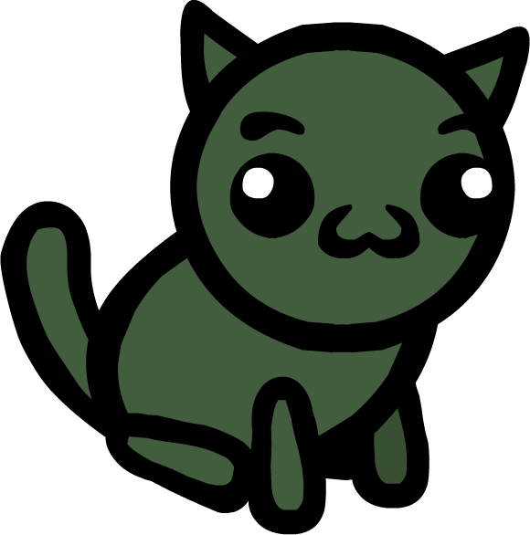](/wiki/File:CLASS_Hunter.png)

Shoot things from afar! Hunters are great at hitting things from a distance while stay out of danger themselves!

Stat Modifiers

Buffs

+3 Dexterity [DEX](/wiki/Stats#Dexterity "Stats")  
+2 Luck [LCK](/wiki/Stats#Luck "Stats")

Debuffs

-1 Constitution [CON](/wiki/Stats#Constitution "Stats")  
-2 Speed [SPD](/wiki/Stats#Speed "Stats")

Level up Stats

Dexterity [DEX](/wiki/Stats#Dexterity "Stats"), Speed [SPD](/wiki/Stats#Speed "Stats"), Intelligence [INT](/wiki/Stats#Intelligence "Stats")

Details

Collar

> “
>
> "Let my arrows find their mark!"
>
> — A cat equipped with the Hunter collar when embarking on an adventure

The **Hunter** is a starting [class](/wiki/Class "Class").

## Overview

Hunters get +3  [Dexterity](/wiki/Stats#Dexterity "Stats") and +2  [Luck](/wiki/Stats#Luck "Stats"), but -2  [Speed](/wiki/Stats#Speed "Stats") and -1  [Constitution](/wiki/Stats#Constitution "Stats") as well. When leveling up, they can gain  [Dexterity](/wiki/Stats#Dexterity "Stats"),  [Speed](/wiki/Stats#Speed "Stats"), or  [Intelligence](/wiki/Stats#Intelligence "Stats").

Hunters are meant to attack from a distance. Most of their attacks take advantage of their high  [Dexterity](/wiki/Stats#Dexterity "Stats") and can be shot past obstacles and even allies, letting them stay safe behind cover while still fighting. Maintaining distance is especially important due to Hunters not being able to attack up close by default, as well as their compromised  [Constitution](/wiki/Stats#Constitution "Stats"). If a Hunter needs to be moved, it must be done with caution, as their lowered  [Speed](/wiki/Stats#Speed "Stats") gives them limited movement options outside of abilities.

### Basic Action

A Hunter's basic action is **Lobbed Shot**. It deals damage to a unit based on the user's  [Dexterity](/wiki/Stats#Dexterity "Stats"), with a base damage (at 4-to-6 DEX) of **4**. It has long range and can be used on units over obstacles, but has a blind spot within 2 tiles of the Hunter.

### Archetypes

- **Marksman:** Applies  [Marked](/wiki/Status_Effects#Marked "Status Effects") to ensure all attacks from the Hunter and its allies deal extra damage to a target and never miss.
  -  "Marked (Ability)") [Marked](/wiki/Marked_(Ability) "Marked (Ability)")  "Marked (Ability)")   [Marked](/wiki/Marked_(Ability) "Marked (Ability)")  Inflict Marked on a unit.  or  [Persistent Hunt](/wiki/Persistent_Hunt "Persistent Hunt")    [Persistent Hunt](/wiki/Persistent_Hunt "Persistent Hunt")  Inflict Marked 5 on a unit.   
    RELOAD: Kill an enemy.  are easy ways to apply  [Marked](/wiki/Status_Effects#Marked "Status Effects") for the whole team.  "Bullseye (Ability)") [Bullseye](/wiki/Bullseye_(Ability) "Bullseye (Ability)")  "Bullseye (Ability)")   [Bullseye](/wiki/Bullseye_(Ability) "Bullseye (Ability)")  Your ranged attacks never miss.  
    +25% critical hit chance.  works similarly, but is only applicable for the Ranger.
  - Without the risk of missing, inaccurate spells like  [Heavy Shot](/wiki/Heavy_Shot "Heavy Shot")    [Heavy Shot](/wiki/Heavy_Shot "Heavy Shot")  Shoot a high damage shot with a 70% chance to miss.  and  [Arrow Flurry](/wiki/Arrow_Flurry "Arrow Flurry")    [Arrow Flurry](/wiki/Arrow_Flurry "Arrow Flurry")  Shoot 5 weak shots, each one has a 50% chance to miss.  can deal extreme damage.

- **Sniper:** Punishes enemies from long-range while hiding elsewhere.
  -  [Scout Me](/wiki/Scout_Me "Scout Me")    [Scout Me](/wiki/Scout_Me "Scout Me")  Until next turn, allied cats gain a bonus ability that can let you shoot a tile of their choice.  
     (Castable once per turn.)   and  [Spotters](/wiki/Spotters "Spotters")    [Spotters](/wiki/Spotters "Spotters")  Your basic attack can target tiles adjacent to allies.  allow Hunters to target enemies that may otherwise be out of range.
  -  [Hedge In](/wiki/Hedge_In "Hedge In")    [Hedge In](/wiki/Hedge_In "Hedge In")  Spawn bear traps on each adjacent tile.  and  [Take Aim](/wiki/Take_Aim "Take Aim")    [Take Aim](/wiki/Take_Aim "Take Aim")  Gain +1 range and damage at the start of each turn. You lose this when you move.  reward Hunters for staying in one place.  [Terrain Walk](/wiki/Terrain_Walk "Terrain Walk")    [Terrain Walk](/wiki/Terrain_Walk "Terrain Walk")  Teleport to any grass or water tile.  can help reposition quickly in an emergency.

- **Herd Thinner:** Attacks many units at once.
  -  [Scatter Shot](/wiki/Scatter_Shot "Scatter Shot")    [Scatter Shot](/wiki/Scatter_Shot "Scatter Shot")  Fire a bunch of shots randomly in an area.  or  [Split Shot](/wiki/Split_Shot "Split Shot")    [Split Shot](/wiki/Split_Shot "Split Shot")  Your basic attack has +1 area but deals 50% less damage.  allow Hunters to hit many targets at once. Passives like  [Rubber Arrows](/wiki/Rubber_Arrows "Rubber Arrows")    [Rubber Arrows](/wiki/Rubber_Arrows "Rubber Arrows")  Your projectiles bounce to another enemy within 3 tiles.  or  [Tower Defense](/wiki/Tower_Defense "Tower Defense")    [Tower Defense](/wiki/Tower_Defense "Tower Defense")  When an enemy comes within range, shoot them for 1 damage.  can further extend their area control.
    - Units that take up several tiles can take damage multiple times at once, dealing absurd damage.

- **Familiars:** Spawns familiars, then bolster them with abilities.
  - Hunters have access to a variety of familiars for different purposes, through abilities like  [Spawn Pooter Friend](/wiki/Spawn_Pooter_Friend "Spawn Pooter Friend")    [Spawn Pooter Friend](/wiki/Spawn_Pooter_Friend "Spawn Pooter Friend")  Spawn a pooter familiar. ,  [Flea Shot](/wiki/Flea_Shot "Flea Shot")    [Flea Shot](/wiki/Flea_Shot "Flea Shot")  Shoot a flea at a unit. , and  [Call of the Wild](/wiki/Call_of_the_Wild "Call of the Wild")    [Call of the Wild](/wiki/Call_of_the_Wild "Call of the Wild")  Spawn a charmed Tom Tom. .
  - Abilities like  [Brood Mother](/wiki/Brood_Mother "Brood Mother")    [Brood Mother](/wiki/Brood_Mother "Brood Mother")  Your familiars and units you  [Charm](/wiki/Status_Effects#Charmed "Status Effects") gain +2  [Damage](/wiki/Status_Effects#Damage_Up "Status Effects") and +5 HP. ,  [Tainted Mother](/wiki/Tainted_Mother "Tainted Mother")    [Tainted Mother](/wiki/Tainted_Mother "Tainted Mother")  Your familiars and units you  [Charm](/wiki/Status_Effects#Charmed "Status Effects") gain +4  [Speed](/wiki/Stats#Speed "Stats") and inflict  [Poison](/wiki/Status_Effects#Poison "Status Effects") and  [Bleed](/wiki/Status_Effects#Bleed "Status Effects"). , or  [Slop the Pigs](/wiki/Slop_the_Pigs "Slop the Pigs")    [Slop the Pigs](/wiki/Slop_the_Pigs "Slop the Pigs")  Each familiar in an area gains All Stats Up and heals 4 HP. Other units in the area gain +1 Constitution and heal 2 HP.  can strengthen and heal familiars.
    - Many of these abilities can also buff  [Charmed](/wiki/Status_Effects#Charmed "Status Effects") enemies, obtainable through spells like  [Cupid's Arrow](/wiki/Cupid%27s_Arrow "Cupid's Arrow")    [Cupid's Arrow](/wiki/Cupid%27s_Arrow "Cupid's Arrow")  A shot that damages and inflicts Charm.  or  [Pheromones](/wiki/Pheromones "Pheromones")    [Pheromones](/wiki/Pheromones "Pheromones")  Inflict Charm on a unit. If it's an enemy, it takes an extra turn immediately. .

- **Trapper:** Sets up traps on the battlefield to control enemy movement.
  - Abilities like  [Web Trap](/wiki/Web_Trap "Web Trap")    [Web Trap](/wiki/Web_Trap "Web Trap")  Set a trap that webs non-bug units that walk through it.  and  [Bear Trap](/wiki/Bear_Trap "Bear Trap")    [Bear Trap](/wiki/Bear_Trap "Bear Trap")  Set a trap within 5 tiles that damages and immobilizes units that walk over it.  can immobilize enemies, and  [Bear Trap](/wiki/Bear_Trap "Bear Trap")    [Bear Trap](/wiki/Bear_Trap "Bear Trap")  Set a trap within 5 tiles that damages and immobilizes units that walk over it.  allows for enemies to be directed to specific tiles.
  -  [Hazardous](/wiki/Hazardous "Hazardous")    [Hazardous](/wiki/Hazardous "Hazardous")  Tile damage and effects are doubled.  and  [Tricky Traps](/wiki/Tricky_Traps "Tricky Traps")    [Tricky Traps](/wiki/Tricky_Traps "Tricky Traps")  Damage and effects from your traps are doubled.  greatly increase trap damage, while  "Traps (Ability)") [Traps](/wiki/Traps_(Ability) "Traps (Ability)")  "Traps (Ability)")   [Traps](/wiki/Traps_(Ability) "Traps (Ability)")  Your basic attack spawns a bear trap if you shoot an empty tile.  
    Whenever one of your traps triggers, gain +2  [Dexterity](/wiki/Stats#Dexterity "Stats").  will increase  [Dexterity](/wiki/Stats#Dexterity "Stats") for each trap activated.
  -  [Diversion](/wiki/Diversion "Diversion")    [Diversion](/wiki/Diversion "Diversion")  Shoot a pebble. All enemies within 3 tiles move toward it.  can force enemies into traps.

### Tips

- Even if nothing comes together through level-ups, Hunters can still pick up a wide array of damaging abilities, and can spam them if enough  [Mana](/wiki/Stats#Mana "Stats") is stockpiled.

## Abilities

### Basic Attack

| Name | | Status Dealt | Description |
| --- | --- | --- | --- |
| [ABILITY Lobbed Shot (Hunter).svg](/wiki/Lobbed_Shot_(Hunter) "Lobbed Shot (Hunter)") | [Lobbed Shot (Hunter)](/wiki/Lobbed_Shot_(Hunter) "Lobbed Shot (Hunter)") | 4[UI Physical Damage Icon.svg](/wiki/Physical_Damage "Physical Damage") | Lob a shot over units and obstacles. |

### Active Abilities

| Hunter Active Abilities | | | | |
| --- | --- | --- | --- | --- |
| Name | | Description | Mana Cost | Upgraded Description |
| [ABILITY Arrow Flurry.svg](/wiki/Arrow_Flurry "Arrow Flurry") | [Arrow Flurry](/wiki/Arrow_Flurry "Arrow Flurry") | Shoot 5 weak shots, each one has a 50% chance to miss. | [UI Mana Cost Icon.svg](/wiki/Mana_Cost "Mana Cost") 8 | Shoot 5 weak shots, each one has a 50% chance to miss and 50% chance to crit! |
| [ABILITY Arrowsmith.svg](/wiki/Arrowsmith "Arrowsmith") | [Arrowsmith](/wiki/Arrowsmith "Arrowsmith") | Gain +1 Bonus Attack at the start of your next turn. | [UI Mana Cost Icon.svg](/wiki/Mana_Cost "Mana Cost") 5 | You or another unit gains +1 Bonus Attack at the start of their next turn. |
| [ABILITY Bait Trap.svg](/wiki/Bait_Trap "Bait Trap") | [Bait Trap](/wiki/Bait_Trap "Bait Trap") | Set a bait trap that attracts enemies. | [UI Mana Cost Icon.svg](/wiki/Mana_Cost "Mana Cost") 5 | Set a bait trap that attracts enemies and inflicts Poison and Slow when eaten. |
| [ABILITY Ball of Spiders.svg](/wiki/Ball_of_Spiders "Ball of Spiders") | [Ball of Spiders](/wiki/Ball_of_Spiders "Ball of Spiders") | Throw a spider egg that spawns 3 spiderlings on impact. | [UI Mana Cost Icon.svg](/wiki/Mana_Cost "Mana Cost") 9 | Throw a stronger spider egg that spawns 3 spiderlings on impact. |
| [ABILITY Bear Trap.svg](/wiki/Bear_Trap "Bear Trap") | [Bear Trap](/wiki/Bear_Trap "Bear Trap") | Set a trap within 5 tiles that damages and immobilizes units that walk over it. | [UI Mana Cost Icon.svg](/wiki/Mana_Cost "Mana Cost") 5 | Set a trap on any tile that damages and immobilizes units that walk over it. |
| [ABILITY Bomb Shot.svg](/wiki/Bomb_Shot "Bomb Shot") | [Bomb Shot](/wiki/Bomb_Shot "Bomb Shot") | Toss a bomb that explodes and knocks units away. | [UI Mana Cost Icon.svg](/wiki/Mana_Cost "Mana Cost") 7 | Toss a large bomb that explodes and knocks units away. |
| [ABILITY Bounce Shot.svg](/wiki/Bounce_Shot "Bounce Shot") | [Bounce Shot](/wiki/Bounce_Shot "Bounce Shot") | Shoot a projectile that bounces everything adjacent to it back 3 tiles. | [UI Mana Cost Icon.svg](/wiki/Mana_Cost "Mana Cost") 3 | Shoot a projectile that bounces everything adjacent to it back 3 tiles. They take 5 damage if they collide with something. |
| [ABILITY Bramble Shot.svg](/wiki/Bramble_Shot "Bramble Shot") | [Bramble Shot](/wiki/Bramble_Shot "Bramble Shot") | Fire a shot that spawns brambles in an area. | [UI Mana Cost Icon.svg](/wiki/Mana_Cost "Mana Cost") 7 | Fire a shot that spawns brambles in a large area. |
| [ABILITY Call of the Wild.svg](/wiki/Call_of_the_Wild "Call of the Wild") | [Call of the Wild](/wiki/Call_of_the_Wild "Call of the Wild") | Spawn a charmed Tom Tom. | [UI Mana Cost Icon.svg](/wiki/Mana_Cost "Mana Cost") 9 | Spawn a charmed Tom Tom on any tile. |
| [ABILITY Chaos Shot.svg](/wiki/Chaos_Shot "Chaos Shot") | [Chaos Shot](/wiki/Chaos_Shot "Chaos Shot") | Shoot a random unit within range. | [UI Mana Cost Icon.svg](/wiki/Mana_Cost "Mana Cost") 3 | Shoot a random unit within range, twice! |
| [ABILITY Charm Trap.svg](/wiki/Charm_Trap "Charm Trap") | [Charm Trap](/wiki/Charm_Trap "Charm Trap") | Spawn a trap that deals damage and inflicts Charm 1. | [UI Mana Cost Icon.svg](/wiki/Mana_Cost "Mana Cost") 6 | Spawn a trap that deals damage and inflicts Charm 1.  (This spell costs less.) |
| [ABILITY Collect Pelt.svg](/wiki/Collect_Pelt "Collect Pelt") | [Collect Pelt](/wiki/Collect_Pelt "Collect Pelt") | Destroy a body. Equip a piece of Cat Hide armor to an empty armor slot. | [UI Mana Cost Icon.svg](/wiki/Mana_Cost "Mana Cost") 4 | Destroy a body. Create a big food pickup and equip a piece of Cat Hide armor to an empty armor slot. |
| [ABILITY Craft Arrow.svg](/wiki/Craft_Arrow "Craft Arrow") | [Craft Arrow](/wiki/Craft_Arrow "Craft Arrow") | Collect an adjacent pickup and gain +1 Bonus Attack instead of its normal effects. | [UI Mana Cost Icon.svg](/wiki/Mana_Cost "Mana Cost") 2 | Collect all pickups within two tiles of you. Gain +1 Bonus Attack for each pickup instead of their normal effects.  (This spell costs 1 mana.) |
| [ABILITY Cross Shot.svg](/wiki/Cross_Shot "Cross Shot") | [Cross Shot](/wiki/Cross_Shot "Cross Shot") | Shoot four projectiles in an X shape. | [UI Mana Cost Icon.svg](/wiki/Mana_Cost "Mana Cost") 7 | Shoot four penetrating projectiles in an X shape. |
| [ABILITY Cupid's Arrow.svg](/wiki/Cupid%27s_Arrow "Cupid's Arrow") | [Cupid's Arrow](/wiki/Cupid%27s_Arrow "Cupid's Arrow") | A shot that damages and inflicts Charm. | [UI Mana Cost Icon.svg](/wiki/Mana_Cost "Mana Cost") 12 | A shot that damages and inflicts Charm 2.  (This spell costs less.) |
| [ABILITY Diversion.svg](/wiki/Diversion "Diversion") | [Diversion](/wiki/Diversion "Diversion") | Shoot a pebble. All enemies within 3 tiles move toward it. | [UI Mana Cost Icon.svg](/wiki/Mana_Cost "Mana Cost") 4 | Shoot a pebble. All enemies within 3 tiles move toward it and gain Confusion. |
| [ABILITY Egg Sac Trap.svg](/wiki/Egg_Sac_Trap "Egg Sac Trap") | [Egg Sac Trap](/wiki/Egg_Sac_Trap "Egg Sac Trap") | Spawn a spider egg trap that inflicts Infested 4. | [UI Mana Cost Icon.svg](/wiki/Mana_Cost "Mana Cost") 5 | Spawn a spider egg trap that deals damage and inflicts Infested 4. |
| [ABILITY Extend.svg](/wiki/Extend "Extend") | [Extend](/wiki/Extend "Extend") | Give a unit +3 range and reach until the end of their next turn. | [UI Mana Cost Icon.svg](/wiki/Mana_Cost "Mana Cost") 3 | Give a unit +20 range and reach until the end of their next turn. |
| [ABILITY Fire Shot.svg](/wiki/Fire_Shot "Fire Shot") | [Fire Shot](/wiki/Fire_Shot "Fire Shot") | Shoot a projectile that inflicts Burn 2 and lights fires. | [UI Mana Cost Icon.svg](/wiki/Mana_Cost "Mana Cost") 7 | Shoot a projectile with infinite range that inflicts Burn 4 and lights fires. |
| [ABILITY Flea Shot.svg](/wiki/Flea_Shot "Flea Shot") | [Flea Shot](/wiki/Flea_Shot "Flea Shot") | Shoot a flea at a unit. | [UI Mana Cost Icon.svg](/wiki/Mana_Cost "Mana Cost") 6 | Shoot a [UI Champion Icon.svg](/wiki/Champion "Champion")flea at a unit. |
| [ABILITY Focus Shot.svg](/wiki/Focus_Shot "Focus Shot") | [Focus Shot](/wiki/Focus_Shot "Focus Shot") | Aim at a unit. On your next turn, shoot a projectile that always crits and ignores shield at that unit. | [UI Mana Cost Icon.svg](/wiki/Mana_Cost "Mana Cost") 7 | Shoot a projectile that always crits and ignores shield. |
| [ABILITY Hail of Nails.svg](/wiki/Hail_of_Nails "Hail of Nails") | [Hail of Nails](/wiki/Hail_of_Nails "Hail of Nails") | An attack that hits all units in a perpendicular line. | [UI Mana Cost Icon.svg](/wiki/Mana_Cost "Mana Cost") 9 | An attack that hits and Immobilizes all units in a perpendicular line. |
| [ABILITY Heavy Shot.svg](/wiki/Heavy_Shot "Heavy Shot") | [Heavy Shot](/wiki/Heavy_Shot "Heavy Shot") | Shoot a high damage shot with a 70% chance to miss. | [UI Mana Cost Icon.svg](/wiki/Mana_Cost "Mana Cost") 4 | Shoot a high damage shot with a 70% chance to miss and a 50% chance to crit.  (This spell has increased range.) |
| [ABILITY Hedge In.svg](/wiki/Hedge_In "Hedge In") | [Hedge In](/wiki/Hedge_In "Hedge In") | Spawn bear traps on each adjacent tile. | [UI Mana Cost Icon.svg](/wiki/Mana_Cost "Mana Cost") 4 | Spawn bear traps on each tile exactly 2 tiles away. |
| [ABILITY Infest.svg](/wiki/Infest "Infest") | [Infest](/wiki/Infest "Infest") | Toss a spider egg that deals low damage and inflicts Infested. | [UI Mana Cost Icon.svg](/wiki/Mana_Cost "Mana Cost") 4 | Toss a spider egg that deals low damage and inflicts Infested 2. |
| [ABILITY Last Hit.svg](/wiki/Last_Hit "Last Hit") | [Last Hit](/wiki/Last_Hit "Last Hit") | Deal 1 damage to a unit. If this kills it, refresh your basic attack. | [UI Mana Cost Icon.svg](/wiki/Mana_Cost "Mana Cost") 3 | Deal 1 damage to a unit. If this kills it, refresh your basic attack. This ignores shield and can't miss.  (This spell costs less.) |
| [ABILITY Line Shot.svg](/wiki/Line_Shot "Line Shot") | [Line Shot](/wiki/Line_Shot "Line Shot") | An attack that hits all units in a straight line. | [UI Mana Cost Icon.svg](/wiki/Mana_Cost "Mana Cost") 7 | A stronger attack that hits all units in a straight line. |
| [ABILITY Marked.svg](/wiki/Marked "Marked") | [Marked](/wiki/Marked_(Ability) "Marked (Ability)") | Inflict Marked on a unit. | [UI Mana Cost Icon.svg](/wiki/Mana_Cost "Mana Cost") 5 | Inflict Marked on a unit and all other units of the same type. |
| [ABILITY Needle Shot.svg](/wiki/Needle_Shot "Needle Shot") | [Needle Shot](/wiki/Needle_Shot "Needle Shot") | Shoot a needle that deals damage, gives Thorns, and ignores shield. | [UI Mana Cost Icon.svg](/wiki/Mana_Cost "Mana Cost") 2 | Shoot a needle that deals damage, gives Thorns, and ignores shield. This deals extra damage to enemies and gives extra Thorns to allies. |
| [ABILITY Persistent Hunt.svg](/wiki/Persistent_Hunt "Persistent Hunt") | [Persistent Hunt](/wiki/Persistent_Hunt "Persistent Hunt") | Inflict Marked 5 on a unit.  RELOAD: Kill an enemy. | [UI Mana Cost Icon.svg](/wiki/Mana_Cost "Mana Cost") 0 | Inflict Marked 5 on a unit. RELOAD: Kill an enemy. This spell starts reloaded. |
| [ABILITY Pheromones.svg](/wiki/Pheromones "Pheromones") | [Pheromones](/wiki/Pheromones "Pheromones") | Inflict Charm on a unit. If it's an enemy, it takes an extra turn immediately. | [UI Mana Cost Icon.svg](/wiki/Mana_Cost "Mana Cost") 5 | Inflict Charm on a unit. It takes an extra turn immediately. |
| [ABILITY Picnic.svg](/wiki/Picnic "Picnic") | [Picnic](/wiki/Picnic "Picnic") | You and adjacent units each heal 5 HP. | [UI Mana Cost Icon.svg](/wiki/Mana_Cost "Mana Cost") 7 | You and adjacent units each heal 5 HP and gain +1 Damage. |
| [ABILITY Poison Lace.svg](/wiki/Poison_Lace "Poison Lace") | [Poison Lace](/wiki/Poison_Lace "Poison Lace") | Give yourself or an adjacent unit +1 Poison Lace. | [UI Mana Cost Icon.svg](/wiki/Mana_Cost "Mana Cost") 5 | Give yourself or any other unit +1 Poison Lace. |
| [ABILITY Scatter Shot.svg](/wiki/Scatter_Shot "Scatter Shot") | [Scatter Shot](/wiki/Scatter_Shot "Scatter Shot") | Fire a bunch of shots randomly in an area. | [UI Mana Cost Icon.svg](/wiki/Mana_Cost "Mana Cost") 10 | Fire a bunch of shots randomly in a large area. |
| [ABILITY Scout Me.svg](/wiki/Scout_Me "Scout Me") | [Scout Me](/wiki/Scout_Me "Scout Me") | Until next turn, allied cats gain a bonus ability that can let you shoot a tile of their choice.  (Castable once per turn.) | [UI Mana Cost Icon.svg](/wiki/Mana_Cost "Mana Cost") 7 | Until next turn, allied cats gain a bonus ability that can let you shoot a tile of their choice.  (Castable once per turn. This spell costs 0 mana.) |
| [ABILITY Sentry Mode.svg](/wiki/Sentry_Mode "Sentry Mode") | [Sentry Mode](/wiki/Sentry_Mode "Sentry Mode") | The next time an enemy ends movement in your basic attack range, attack it. | [UI Mana Cost Icon.svg](/wiki/Mana_Cost "Mana Cost") 6 | Until your next turn, whenever an enemy ends movement in your basic attack range, attack it. |
| [ABILITY Shards.svg](/wiki/Shards "Shards") | [Shards](/wiki/Shards "Shards") | Shoot a projectile that spawns glass. | [UI Mana Cost Icon.svg](/wiki/Mana_Cost "Mana Cost") 3 | Shoot a projectile that spawns glass in an area and inflicts Bleed 2. |
| [ABILITY Slop the Pigs.svg](/wiki/Slop_the_Pigs "Slop the Pigs") | [Slop the Pigs](/wiki/Slop_the_Pigs "Slop the Pigs") | Each familiar in an area gains All Stats Up and heals 4 HP. Other units in the area gain +1 [Constitution](/wiki/Stats#Constitution "Constitution")Constitution and heal 2 HP. | [UI Mana Cost Icon.svg](/wiki/Mana_Cost "Mana Cost") 6 | Each familiar in an area gains All Stats Up and heals 4 HP. Other units in the area gain +1 [Constitution](/wiki/Stats#Constitution "Constitution")Constitution and heal 2 HP.  (This spell costs less.) |
| [ABILITY Snipe.svg](/wiki/Snipe "Snipe") | [Snipe](/wiki/Snipe "Snipe") | Fire a shot exactly 6 tiles away that ignores shield and can't miss. | [UI Mana Cost Icon.svg](/wiki/Mana_Cost "Mana Cost") 6 | Fire a stronger shot exactly 6 tiles away that ignores shield, can't miss, and has a 50% chance to crit. |
| [ABILITY Soothing Shot.svg](/wiki/Soothing_Shot "Soothing Shot") | [Soothing Shot](/wiki/Soothing_Shot "Soothing Shot") | A ranged shot that heals and inflicts Charmed 1. | [UI Mana Cost Icon.svg](/wiki/Mana_Cost "Mana Cost") 7 | A ranged shot that heals and inflicts Charmed 2. Against allies this cleanses debuffs and inflicts Charmed 1 instead. |
| [ABILITY Spawn Maggot Friend.svg](/wiki/Spawn_Maggot_Friend "Spawn Maggot Friend") | [Spawn Maggot Friend](/wiki/Spawn_Maggot_Friend "Spawn Maggot Friend") | Spawn a maggot familiar. | [UI Mana Cost Icon.svg](/wiki/Mana_Cost "Mana Cost") 3 | Spawn a [UI Champion Icon.svg](/wiki/Champion "Champion") maggot familiar. |
| [ABILITY Spawn Pooter Friend.svg](/wiki/Spawn_Pooter_Friend "Spawn Pooter Friend") | [Spawn Pooter Friend](/wiki/Spawn_Pooter_Friend "Spawn Pooter Friend") | Spawn a pooter familiar. | [UI Mana Cost Icon.svg](/wiki/Mana_Cost "Mana Cost") 7 | Spawn 2 pooter familiars. |
| [ABILITY Spike Trap.svg](/wiki/Spike_Trap "Spike Trap") | [Spike Trap](/wiki/Spike_Trap "Spike Trap") | Set a trap that deals 8 damage. | [UI Mana Cost Icon.svg](/wiki/Mana_Cost "Mana Cost") 6 | Set a trap that deals 13 damage. |
| [ABILITY Stake Out.svg](/wiki/Stake_Out "Stake Out") | [Stake Out](/wiki/Stake_Out "Stake Out") | End your turn. On your next turn, your ranged abilities deal double damage.  (Castable only if you haven't taken any other actions this turn.) | [UI Mana Cost Icon.svg](/wiki/Mana_Cost "Mana Cost") 3 | End your turn. On your next turn, your ranged abilities deal double damage.  (Costs 0 mana. Castable only if you haven't taken any other actions this turn other than your movement action.) |
| [ABILITY Summon Brambles.svg](/wiki/Summon_Brambles "Summon Brambles") | [Summon Brambles](/wiki/Summon_Brambles "Summon Brambles") | Spawn brambles on any tile. | [UI Mana Cost Icon.svg](/wiki/Mana_Cost "Mana Cost") 4 | Spawn brambles in an area. |
| [ABILITY Tactical Retreat.svg](/wiki/Tactical_Retreat "Tactical Retreat") | [Tactical Retreat](/wiki/Tactical_Retreat "Tactical Retreat") | Teleport up to 5 tiles away. Set a bear trap on the tile you teleported from. | [UI Mana Cost Icon.svg](/wiki/Mana_Cost "Mana Cost") 6 | Teleport up to 5 tiles away. Set a baited bear trap on the tile you teleported from. |
| [ABILITY Terrain Walk.svg](/wiki/Terrain_Walk "Terrain Walk") | [Terrain Walk](/wiki/Terrain_Walk "Terrain Walk") | Teleport to any grass or water tile. | [UI Mana Cost Icon.svg](/wiki/Mana_Cost "Mana Cost") 4 | Teleport to any grass or water tile. Gain Stealth. |
| [ABILITY Twin Shot.svg](/wiki/Twin_Shot "Twin Shot") | [Twin Shot](/wiki/Twin_Shot "Twin Shot") | Shoot twice. | [UI Mana Cost Icon.svg](/wiki/Mana_Cost "Mana Cost") 9 | Shoot thrice. |
| [ABILITY Vivisect.svg](/wiki/Vivisect "Vivisect") | [Vivisect](/wiki/Vivisect "Vivisect") | A melee attack that spawns a baited bear trap if it kills a unit or destroys a body. | [UI Mana Cost Icon.svg](/wiki/Mana_Cost "Mana Cost") 4 | A lobbed attack that spawns a baited bear trap if it kills a unit or destroys a body. |
| [ABILITY Web Trap.svg](/wiki/Web_Trap "Web Trap") | [Web Trap](/wiki/Web_Trap "Web Trap") | Set a trap that webs non-bug units that walk through it. | [UI Mana Cost Icon.svg](/wiki/Mana_Cost "Mana Cost") 4 | Set a web trap on any tile that webs non-bug units that walk through it. |

#### Starting Actives

| Hunter Starting Active Abilities | | | | |
| --- | --- | --- | --- | --- |
| Name | | Description | Mana Cost | Upgraded Description |
| [ABILITY Bait Trap.svg](/wiki/Bait_Trap "Bait Trap") | [Bait Trap](/wiki/Bait_Trap "Bait Trap") | Set a bait trap that attracts enemies. | [UI Mana Cost Icon.svg](/wiki/Mana_Cost "Mana Cost") 5 | Set a bait trap that attracts enemies and inflicts Poison and Slow when eaten. |
| [ABILITY Bear Trap.svg](/wiki/Bear_Trap "Bear Trap") | [Bear Trap](/wiki/Bear_Trap "Bear Trap") | Set a trap within 5 tiles that damages and immobilizes units that walk over it. | [UI Mana Cost Icon.svg](/wiki/Mana_Cost "Mana Cost") 5 | Set a trap on any tile that damages and immobilizes units that walk over it. |
| [ABILITY Bramble Shot.svg](/wiki/Bramble_Shot "Bramble Shot") | [Bramble Shot](/wiki/Bramble_Shot "Bramble Shot") | Fire a shot that spawns brambles in an area. | [UI Mana Cost Icon.svg](/wiki/Mana_Cost "Mana Cost") 7 | Fire a shot that spawns brambles in a large area. |
| [ABILITY Flea Shot.svg](/wiki/Flea_Shot "Flea Shot") | [Flea Shot](/wiki/Flea_Shot "Flea Shot") | Shoot a flea at a unit. | [UI Mana Cost Icon.svg](/wiki/Mana_Cost "Mana Cost") 6 | Shoot a [UI Champion Icon.svg](/wiki/Champion "Champion")flea at a unit. |
| [ABILITY Heavy Shot.svg](/wiki/Heavy_Shot "Heavy Shot") | [Heavy Shot](/wiki/Heavy_Shot "Heavy Shot") | Shoot a high damage shot with a 70% chance to miss. | [UI Mana Cost Icon.svg](/wiki/Mana_Cost "Mana Cost") 4 | Shoot a high damage shot with a 70% chance to miss and a 50% chance to crit.  (This spell has increased range.) |
| [ABILITY Marked.svg](/wiki/Marked "Marked") | [Marked](/wiki/Marked_(Ability) "Marked (Ability)") | Inflict Marked on a unit. | [UI Mana Cost Icon.svg](/wiki/Mana_Cost "Mana Cost") 5 | Inflict Marked on a unit and all other units of the same type. |
| [ABILITY Needle Shot.svg](/wiki/Needle_Shot "Needle Shot") | [Needle Shot](/wiki/Needle_Shot "Needle Shot") | Shoot a needle that deals damage, gives Thorns, and ignores shield. | [UI Mana Cost Icon.svg](/wiki/Mana_Cost "Mana Cost") 2 | Shoot a needle that deals damage, gives Thorns, and ignores shield. This deals extra damage to enemies and gives extra Thorns to allies. |
| [ABILITY Scatter Shot.svg](/wiki/Scatter_Shot "Scatter Shot") | [Scatter Shot](/wiki/Scatter_Shot "Scatter Shot") | Fire a bunch of shots randomly in an area. | [UI Mana Cost Icon.svg](/wiki/Mana_Cost "Mana Cost") 10 | Fire a bunch of shots randomly in a large area. |
| [ABILITY Spawn Pooter Friend.svg](/wiki/Spawn_Pooter_Friend "Spawn Pooter Friend") | [Spawn Pooter Friend](/wiki/Spawn_Pooter_Friend "Spawn Pooter Friend") | Spawn a pooter familiar. | [UI Mana Cost Icon.svg](/wiki/Mana_Cost "Mana Cost") 7 | Spawn 2 pooter familiars. |
| [ABILITY Terrain Walk.svg](/wiki/Terrain_Walk "Terrain Walk") | [Terrain Walk](/wiki/Terrain_Walk "Terrain Walk") | Teleport to any grass or water tile. | [UI Mana Cost Icon.svg](/wiki/Mana_Cost "Mana Cost") 4 | Teleport to any grass or water tile. Gain Stealth. |

### Passive Abilities

| Hunter Passive Abilities | | | | |
| --- | --- | --- | --- | --- |
| Name | | Description | Mana Cost | Upgraded Description |
| [ABILITY Animal Control.svg](/wiki/Animal_Control "Animal Control") | [Animal Control](/wiki/Animal_Control "Animal Control") | Your basic attack causes units to immediately attack an enemy in range. | Your basic attack causes units to immediately attack an enemy in range. Your basic attack can heal allies. |
| [ABILITY Brood Mother.svg](/wiki/Brood_Mother "Brood Mother") | [Brood Mother](/wiki/Brood_Mother "Brood Mother") | Your familiars and units you [STATUS Charmed Icon.svg](/wiki/Status_Effects#Charmed "Status Effects") [Charm](/wiki/Status_Effects#Charmed "Status Effects") gain +2 [STATUS Damage Up Icon.svg](/wiki/Status_Effects#Damage_Up "Status Effects") [Damage](/wiki/Status_Effects#Damage_Up "Status Effects") and +5 HP. | Your familiars and units you [STATUS Charmed Icon.svg](/wiki/Status_Effects#Charmed "Status Effects") [Charm](/wiki/Status_Effects#Charmed "Status Effects") gain +3 [STATUS Damage Up Icon.svg](/wiki/Status_Effects#Damage_Up "Status Effects") [Damage](/wiki/Status_Effects#Damage_Up "Status Effects"), +10 HP, and inflict [STATUS Poison Icon.svg](/wiki/Status_Effects#Poison "Status Effects") [Poison](/wiki/Status_Effects#Poison "Status Effects"). |
| [ABILITY Bullseye.svg](/wiki/Bullseye "Bullseye") | [Bullseye](/wiki/Bullseye_(Ability) "Bullseye (Ability)") | Your ranged attacks never miss. +25% critical hit chance. | Your ranged attacks never miss. +25% critical hit chance. Gain +1 [Luck](/wiki/Stats#Luck "Luck")Luck each time you make a critical hit. |
| [ABILITY Catch Projectiles.svg](/wiki/Catch_Projectiles "Catch Projectiles") | [Catch Projectiles](/wiki/Catch_Projectiles "Catch Projectiles") | 33% chance to block enemy projectiles and a 100% chance to block allied projectiles. If you block a projectile, gain +1 [STATUS Bonus Attack Icon.svg](/wiki/Status_Effects#Bonus_Attack "Status Effects") [Bonus Attack](/wiki/Status_Effects#Bonus_Attack "Status Effects"). | 50% chance to block enemy projectiles and a 100% chance to block allied projectiles. If you block a projectile, gain +1 [STATUS Bonus Attack Icon.svg](/wiki/Status_Effects#Bonus_Attack "Status Effects") [Bonus Attack](/wiki/Status_Effects#Bonus_Attack "Status Effects") and +1 [STATUS All Stats Up Icon.svg](/wiki/Status_Effects#All_Stats_Up "Status Effects") [All Stats Up](/wiki/Status_Effects#All_Stats_Up "Status Effects"). |
| [ABILITY Fleabag.svg](/wiki/Fleabag "Fleabag") | [Fleabag](/wiki/Fleabag "Fleabag") | At the end of your turn, spawn Flea familiars equal to the number of enemies you've killed this battle. | At the end of your turn, spawn Flea familiars equal to the number of enemies you've killed this battle plus two. |
| [ABILITY Gravity Falls.svg](/wiki/Gravity_Falls "Gravity Falls") | [Gravity Falls](/wiki/Gravity_Falls "Gravity Falls") | Your basic attack deals +1 damage for each tile you shoot beyond range 3. | +2 range. Your basic attack deals +1 damage for each tile you shoot beyond range 3. |
| [ABILITY Hazardous.svg](/wiki/Hazardous "Hazardous") | [Hazardous](/wiki/Hazardous "Hazardous") | Tile damage and effects are doubled. | Tile damage and effects are doubled. Allies are immune to tile damage and effects. |
| [ABILITY Host.svg](/wiki/Host "Host") | [Host](/wiki/Host_(Ability) "Host (Ability)") | Start each battle with 2 tiny spider familiars. A spider egg parasite is added to your inventory. You can unequip parasites freely. | Start each battle with 2 tiny spider familiars. A spider webber parasite is added to your inventory. You can unequip parasites freely. |
| [ABILITY Hunter's Boon.svg](/wiki/Hunter%27s_Boon "Hunter's Boon") | [Hunter's Boon](/wiki/Hunter%27s_Boon "Hunter's Boon") | When you kill an enemy, gain 5 mana. | When you kill an enemy, restore all your mana. |
| [ABILITY Luck Swing.svg](/wiki/Luck_Swing "Luck Swing") | [Luck Swing](/wiki/Luck_Swing "Luck Swing") | +50% critical hit chance but +25% chance to miss. | +3 [Luck](/wiki/Stats#Luck "Luck")Luck +50% critical hit chance but +25% chance to miss. |
| [ABILITY Quiver.svg](/wiki/Quiver "Quiver") | [Quiver](/wiki/Quiver "Quiver") | Save unused basic attacks for future turns. | Save unused basic attacks for future turns. If you haven't attacked this battle, the number you save is doubled. |
| [ABILITY Rubber Arrows.svg](/wiki/Rubber_Arrows "Rubber Arrows") | [Rubber Arrows](/wiki/Rubber_Arrows "Rubber Arrows") | Your projectiles bounce to another enemy within 3 tiles. | Your projectiles bounce to another enemy within 4 tiles, twice! |
| [ABILITY Sleep Darts.svg](/wiki/Sleep_Darts "Sleep Darts") | [Sleep Darts](/wiki/Sleep_Darts "Sleep Darts") | At the start of each battle, you and all allies that don't have weapons gains a temporary ITEM Sleep Dart.svg [Sleep Dart](/wiki/Sleep_Dart "Sleep Dart") [ITEM Sleep Dart.svg](/wiki/Sleep_Dart "Sleep Dart")  [Sleep Dart](/wiki/Sleep_Dart "Sleep Dart") (Weapon)  Use: A straight ranged attack that inflicts [STATUS Sleep Icon.svg](/wiki/Status_Effects#Sleep "Status Effects") [Sleep](/wiki/Status_Effects#Sleep "Status Effects") 1. . | At the start of each battle, you and all allies that don't have weapons gains a temporary ITEM Sleep Dart.svg [Sleep Dart](/wiki/Sleep_Dart "Sleep Dart") [ITEM Sleep Dart.svg](/wiki/Sleep_Dart "Sleep Dart")  [Sleep Dart](/wiki/Sleep_Dart "Sleep Dart") (Weapon)  Use: A straight ranged attack that inflicts [STATUS Sleep Icon.svg](/wiki/Status_Effects#Sleep "Status Effects") [Sleep](/wiki/Status_Effects#Sleep "Status Effects") 1.  with 2 uses. |
| [ABILITY Sniper.svg](/wiki/Sniper "Sniper") | [Sniper](/wiki/Sniper "Sniper") | Critical hits deal +100% more damage and have a 25% chance to inflict [STATUS Stun Icon.svg](/wiki/Status_Effects#Stun "Status Effects") [Stun](/wiki/Status_Effects#Stun "Status Effects"). | Critical hits deal +200% more damage and have a 33% chance to inflict [STATUS Stun Icon.svg](/wiki/Status_Effects#Stun "Status Effects") [Stun](/wiki/Status_Effects#Stun "Status Effects"). |
| [ABILITY Split Shot.svg](/wiki/Split_Shot "Split Shot") | [Split Shot](/wiki/Split_Shot "Split Shot") | Your basic attack has +1 area but deals 50% less damage. | Your basic attack has +2 area but deals 50% less damage. |
| [ABILITY Spotters.svg](/wiki/Spotters "Spotters") | [Spotters](/wiki/Spotters "Spotters") | Your basic attack can target tiles adjacent to allies. | Your basic attack and spells can target tiles adjacent to allies. |
| [ABILITY Survivalist.svg](/wiki/Survivalist "Survivalist") | [Survivalist](/wiki/Survivalist "Survivalist") | 4 healing consumables and a full water bottle are added to your inventory. You can use consumables on allies. Store +2 food at the end of each battle. | 4 large healing consumables are added to your inventory. You can use consumables on allies. Store +20 food at the end of each battle. |
| [ABILITY Tainted Mother.svg](/wiki/Tainted_Mother "Tainted Mother") | [Tainted Mother](/wiki/Tainted_Mother "Tainted Mother") | Your familiars and units you [STATUS Charmed Icon.svg](/wiki/Status_Effects#Charmed "Status Effects") [Charm](/wiki/Status_Effects#Charmed "Status Effects") gain +4 [Speed](/wiki/Stats#Speed "Speed") [Speed](/wiki/Stats#Speed "Stats") and inflict [STATUS Poison Icon.svg](/wiki/Status_Effects#Poison "Status Effects") [Poison](/wiki/Status_Effects#Poison "Status Effects") and [STATUS Bleed Icon.svg](/wiki/Status_Effects#Bleed "Status Effects") [Bleed](/wiki/Status_Effects#Bleed "Status Effects"). | Your familiars and units you [STATUS Charmed Icon.svg](/wiki/Status_Effects#Charmed "Status Effects") [Charm](/wiki/Status_Effects#Charmed "Status Effects") gain +4 [Speed](/wiki/Stats#Speed "Speed") [Speed](/wiki/Stats#Speed "Stats") and inflict [STATUS Poison Icon.svg](/wiki/Status_Effects#Poison "Status Effects") [Poison](/wiki/Status_Effects#Poison "Status Effects") and [STATUS Bleed Icon.svg](/wiki/Status_Effects#Bleed "Status Effects") [Bleed](/wiki/Status_Effects#Bleed "Status Effects"). Start each battle with 4 fly familiars. |
| [ABILITY Take Aim.svg](/wiki/Take_Aim "Take Aim") | [Take Aim](/wiki/Take_Aim "Take Aim") | Gain +1 range and damage at the start of each turn. You lose this when you move. | Gain +2 range and damage at the start of each turn. You lose this when you move. |
| [ABILITY Talk to Animals.svg](/wiki/Talk_to_Animals "Talk to Animals") | [Talk to Animals](/wiki/Talk_to_Animals "Talk to Animals") | Your basic attack inflicts [STATUS Charmed Icon.svg](/wiki/Status_Effects#Charmed "Status Effects") [Charm](/wiki/Status_Effects#Charmed "Status Effects") 5 the first time you use it each battle. | Your basic attack inflicts [STATUS Charmed Icon.svg](/wiki/Status_Effects#Charmed "Status Effects") [Charm](/wiki/Status_Effects#Charmed "Status Effects") 5 the first time you use it each battle. Your basic attack has a 25% chance to inflict [STATUS Charmed Icon.svg](/wiki/Status_Effects#Charmed "Status Effects") [Charm](/wiki/Status_Effects#Charmed "Status Effects") 1. |
| [ABILITY Thorn Arrows.svg](/wiki/Thorn_Arrows "Thorn Arrows") | [Thorn Arrows](/wiki/Thorn_Arrows "Thorn Arrows") | Your basic attack spawns brambles. | Your basic attack spawns brambles in an area. |
| [ABILITY Thrill of the Hunt.svg](/wiki/Thrill_of_the_Hunt "Thrill of the Hunt") | [Thrill of the Hunt](/wiki/Thrill_of_the_Hunt "Thrill of the Hunt") | At the end of each battle, if you killed at least 3 enemies, gain +1 [Dexterity](/wiki/Stats#Dexterity "Dexterity") [Dexterity](/wiki/Stats#Dexterity "Stats") permanently and find a random consumable item. | At the end of each battle, if you killed at least 3 enemies, gain +1 [Dexterity](/wiki/Stats#Dexterity "Dexterity") [Dexterity](/wiki/Stats#Dexterity "Stats") permanently and find a random consumable item. +1 Range and Health Regen for every 5 [Dexterity](/wiki/Stats#Dexterity "Dexterity") [Dexterity](/wiki/Stats#Dexterity "Stats") you have. |
| [ABILITY Tower Defense.svg](/wiki/Tower_Defense "Tower Defense") | [Tower Defense](/wiki/Tower_Defense "Tower Defense") | When an enemy comes within range, shoot them for 1 damage. | When an enemy comes within range, use your basic attack on them. |
| [ABILITY Traps (Ability).svg](/wiki/Traps "Traps") | [Traps](/wiki/Traps_(Ability) "Traps (Ability)") | Your basic attack spawns a bear trap if you shoot an empty tile. Whenever one of your traps triggers, gain +2 [Dexterity](/wiki/Stats#Dexterity "Dexterity") [Dexterity](/wiki/Stats#Dexterity "Stats"). | Your basic attack spawns a bear trap if you shoot an empty tile. Whenever one of your traps triggers, gain +2 [Dexterity](/wiki/Stats#Dexterity "Dexterity") [Dexterity](/wiki/Stats#Dexterity "Stats") and +1 [STATUS Bonus Attack Icon.svg](/wiki/Status_Effects#Bonus_Attack "Status Effects") [Bonus Attack](/wiki/Status_Effects#Bonus_Attack "Status Effects"). |
| [ABILITY Tricky Traps.svg](/wiki/Tricky_Traps "Tricky Traps") | [Tricky Traps](/wiki/Tricky_Traps "Tricky Traps") | Damage and effects from your traps are doubled. | Damage and effects from your traps are doubled. Allies don't trigger your traps. |

### Supplementary Abilities

| Hunter Supplementary Abilities | | | | |
| --- | --- | --- | --- | --- |
| Name | | Description | Mana Cost | Upgraded Description |
| [ABILITY Shoot Here!.svg](/wiki/Shoot_Here! "Shoot Here!") | [Shoot Here!](/wiki/Shoot_Here! "Shoot Here!") | Instructs your friend to shoot an adjacent tile!  (Castable once per turn.) | [UI Mana Cost Icon.svg](/wiki/Mana_Cost "Mana Cost") 0 |

## Unlocks

| Reward | Condition |
| --- | --- |
| [ABILITY Ball of Spiders.svg](/wiki/Ball_of_Spiders "Ball of Spiders") [Ball of Spiders](/wiki/Ball_of_Spiders "Ball of Spiders") [ABILITY Ball of Spiders.svg](/wiki/Ball_of_Spiders "Ball of Spiders")  Hunter [Ball of Spiders](/wiki/Ball_of_Spiders "Ball of Spiders")  Throw a spider egg that spawns 3 spiderlings on impact. | Complete [CHAPTER The Caves.svg](/wiki/Caves "Caves") [Caves](/wiki/Caves "Caves") with the [Hunter Icon.svg](/wiki/Hunter "Hunter") Hunter. |
| [ABILITY Thrill of the Hunt.svg](/wiki/Thrill_of_the_Hunt "Thrill of the Hunt") [Thrill of the Hunt](/wiki/Thrill_of_the_Hunt "Thrill of the Hunt") [ABILITY Thrill of the Hunt.svg](/wiki/Thrill_of_the_Hunt "Thrill of the Hunt")  Hunter [Thrill of the Hunt](/wiki/Thrill_of_the_Hunt "Thrill of the Hunt")  At the end of each battle, if you killed at least 3 enemies, gain +1 [Dexterity](/wiki/Stats#Dexterity "Dexterity") [Dexterity](/wiki/Stats#Dexterity "Stats") permanently and find a random consumable item. | Complete [CHAPTER The Boneyard.svg](/wiki/Boneyard "Boneyard") [Boneyard](/wiki/Boneyard "Boneyard") with the [Hunter Icon.svg](/wiki/Hunter "Hunter") Hunter. |
| [ABILITY Path of the Hunter.svg](/wiki/Path_of_the_Hunter "Path of the Hunter") [Path of the Hunter](/wiki/Path_of_the_Hunter "Path of the Hunter") [ABILITY Path of the Hunter.svg](/wiki/Path_of_the_Hunter "Path of the Hunter")  Collarless [Path of the Hunter](/wiki/Path_of_the_Hunter "Path of the Hunter")  A lobbed attack that deals 1 damage. If this kills an enemy, this spell becomes a random Hunter spell permanently. | Complete [CHAPTER The Core.svg](/wiki/The_Core "The Core") [The Core](/wiki/The_Core "The Core") with the [Hunter Icon.svg](/wiki/Hunter "Hunter") Hunter. |
| [ABILITY Hunter's Soul.svg](/wiki/Hunter%27s_Soul "Hunter's Soul") [Hunter's Soul](/wiki/Hunter%27s_Soul "Hunter's Soul") [ABILITY Hunter's Soul.svg](/wiki/Hunter%27s_Soul "Hunter's Soul")  Collarless [Hunter's Soul](/wiki/Hunter%27s_Soul "Hunter's Soul")  +3 [Dexterity](/wiki/Stats#Dexterity "Dexterity")Dexterity,+2 [Luck](/wiki/Stats#Luck "Luck")Luck ,-1 [Constitution](/wiki/Stats#Constitution "Constitution")Constitution,-2 [Speed](/wiki/Stats#Speed "Speed")Speed Hunter abilities are offered when you level up. | Complete [CHAPTER The Moon.svg](/wiki/The_Moon "The Moon") [The Moon](/wiki/The_Moon "The Moon") with the [Hunter Icon.svg](/wiki/Hunter "Hunter") Hunter. |
| ITEM Arrow of Infinity.svg [Arrow of Infinity](/wiki/Arrow_of_Infinity "Arrow of Infinity") [ITEM Arrow of Infinity.svg](/wiki/Arrow_of_Infinity "Arrow of Infinity")  [Arrow of Infinity](/wiki/Arrow_of_Infinity "Arrow of Infinity") (Weapon)  Use: Your next basic attack has +5 range, +100% Crit Chance, ignores shield and can't miss.  (Usable once per battle.) | Complete [CHAPTER The Jurassic.svg](/wiki/Jurassic "Jurassic") [Jurassic](/wiki/Jurassic "Jurassic") with the [Hunter Icon.svg](/wiki/Hunter "Hunter") Hunter. |
| ITEM Hunter's Flute.svg [Hunter's Flute](/wiki/Hunter%27s_Flute "Hunter's Flute") [ITEM Hunter's Flute.svg](/wiki/Hunter%27s_Flute "Hunter's Flute")  [Hunter's Flute](/wiki/Hunter%27s_Flute "Hunter's Flute") (Trinket)  Spawn 2-3 random familiars on adjacent tiles.  (Usable once per battle.) | Complete [CHAPTER The End.svg](/wiki/The_End "The End") [The End](/wiki/The_End "The End") with the [Hunter Icon.svg](/wiki/Hunter "Hunter") Hunter. |
| ITEM Hunter's Cap.svg [Hunter's Cap](/wiki/Hunter%27s_Cap "Hunter's Cap") [ITEM Hunter's Cap.svg](/wiki/Hunter%27s_Cap "Hunter's Cap")  [Hunter's Cap](/wiki/Hunter%27s_Cap "Hunter's Cap") (Head)  +1 [Luck](/wiki/Stats#Luck "Luck")Luck Your familiars gain [STATUS All Stats Up Icon.svg](/wiki/Status_Effects#All_Stats_Up "Status Effects") [All Stats Up](/wiki/Status_Effects#All_Stats_Up "Status Effects"). | Defeat BOSS Throbbing King Icon.svg [The King](/wiki/Throbbing_King "Throbbing King")[BOSS Throbbing King Icon.svg](/wiki/Throbbing_King "Throbbing King") [Throbbing King](/wiki/Throbbing_King "Throbbing King") Follow his orders! OR ELSE! with the [Hunter Icon.svg](/wiki/Hunter "Hunter") Hunter. |
| ITEM Hunter's Monocle.svg [Hunter's Monocle](/wiki/Hunter%27s_Monocle "Hunter's Monocle") [ITEM Hunter's Monocle.svg](/wiki/Hunter%27s_Monocle "Hunter's Monocle")  [Hunter's Monocle](/wiki/Hunter%27s_Monocle "Hunter's Monocle") (Face)  +2 range. | Defeat BOSS Organ Grinder Icon.svg [Chaos!](/wiki/Chaos! "Chaos!")[BOSS Organ Grinder Icon.svg](/wiki/Chaos! "Chaos!") [Chaos!](/wiki/Chaos! "Chaos!") Embrace chaos ! soahc ecarbmE with the [Hunter Icon.svg](/wiki/Hunter "Hunter") Hunter. |
| ITEM Hunter's Quiver.svg [Hunter's Quiver](/wiki/Hunter%27s_Quiver "Hunter's Quiver") [ITEM Hunter's Quiver.svg](/wiki/Hunter%27s_Quiver "Hunter's Quiver")  [Hunter's Quiver](/wiki/Hunter%27s_Quiver "Hunter's Quiver") (Neck)  Start each battle with 2 bonus attacks. | Defeat BOSS The Creator Icon.svg [The Creator](/wiki/The_Creator "The Creator")[BOSS The Creator Icon.svg](/wiki/The_Creator "The Creator") [The Creator](/wiki/The_Creator "The Creator") Nosce te Ipsum!  with the [Hunter Icon.svg](/wiki/Hunter "Hunter") Hunter. |
| ITEM Bag of Seeds.svg [Bag of Seeds](/wiki/Bag_of_Seeds "Bag of Seeds") [ITEM Bag of Seeds.svg](/wiki/Bag_of_Seeds "Bag of Seeds")  [Bag of Seeds](/wiki/Bag_of_Seeds "Bag of Seeds") (Trinket)  Use: Spawn grass, flowers, or brambles on an adjacent tile. | Complete all areas with the [Hunter Icon.svg](/wiki/Hunter "Hunter") Hunter. |

## Gallery

[Assets](#Assets-0)

- [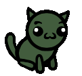](/wiki/File:CLASS_Hunter_Idle.gif "Idle")

  Idle
- [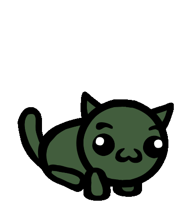](/wiki/File:CLASS_Hunter_Start.gif "Turn start")

  Turn start
- [Victory](/wiki/Special:Upload?wpDestFile=CLASS_Hunter_Victory.gif "File:CLASS Hunter Victory.gif")

  Victory

## Quotes

See [Cats/Quotes](/wiki/Cats/Quotes "Cats/Quotes").

## Trivia

-  [Fenrir](/wiki/Fenrir "Fenrir") [Fenrir](/wiki/Fenrir "Fenrir") Tosses bear traps!   
   Has an affinity for tall grass.   
   Knocks back Melee attackers. is the [Mini-Boss](/wiki/Mini-Boss "Mini-Boss") representing this class.
- Upon winning a battle, the Hunter will do a pawstand on the tip of their bow and meow.
- The Hunter has 12 **Team Name Adjectives** and 13 **Team Name Nouns**.
- In the game's code, seventeen Hunter abilities are tagged as "complicated", this prevents them from showing up on the first run played as that class:
  -  [Extend](/wiki/Extend "Extend")    [Extend](/wiki/Extend "Extend")  Give a unit +3 range and reach until the end of their next turn.
  -  [Last Hit](/wiki/Last_Hit "Last Hit")    [Last Hit](/wiki/Last_Hit "Last Hit")  Deal 1 damage to a unit. If this kills it, refresh your basic attack.
  -  [Stake Out](/wiki/Stake_Out "Stake Out")    [Stake Out](/wiki/Stake_Out "Stake Out")  End your turn. On your next turn, your ranged abilities deal double damage.  
     (Castable only if you haven't taken any other actions this turn.)
  -  [Diversion](/wiki/Diversion "Diversion")    [Diversion](/wiki/Diversion "Diversion")  Shoot a pebble. All enemies within 3 tiles move toward it.
  -  [Scout Me](/wiki/Scout_Me "Scout Me")    [Scout Me](/wiki/Scout_Me "Scout Me")  Until next turn, allied cats gain a bonus ability that can let you shoot a tile of their choice.  
     (Castable once per turn.)
  -  [Bounce Shot](/wiki/Bounce_Shot "Bounce Shot")    [Bounce Shot](/wiki/Bounce_Shot "Bounce Shot")  Shoot a projectile that bounces everything adjacent to it back 3 tiles.
  -  [Vivisect](/wiki/Vivisect "Vivisect")    [Vivisect](/wiki/Vivisect "Vivisect")  A melee attack that spawns a baited bear trap if it kills a unit or destroys a body.
  -  [Slop the Pigs](/wiki/Slop_the_Pigs "Slop the Pigs")    [Slop the Pigs](/wiki/Slop_the_Pigs "Slop the Pigs")  Each familiar in an area gains All Stats Up and heals 4 HP. Other units in the area gain +1 Constitution and heal 2 HP.
  -  [Egg Sac Trap](/wiki/Egg_Sac_Trap "Egg Sac Trap")    [Egg Sac Trap](/wiki/Egg_Sac_Trap "Egg Sac Trap")  Spawn a spider egg trap that inflicts Infested 4.
  -  [Persistent Hunt](/wiki/Persistent_Hunt "Persistent Hunt")    [Persistent Hunt](/wiki/Persistent_Hunt "Persistent Hunt")  Inflict Marked 5 on a unit.   
    RELOAD: Kill an enemy.
  -  [Hazardous](/wiki/Hazardous "Hazardous")    [Hazardous](/wiki/Hazardous "Hazardous")  Tile damage and effects are doubled.
  -  "Traps (Ability)") [Traps](/wiki/Traps_(Ability) "Traps (Ability)")  "Traps (Ability)")   [Traps](/wiki/Traps_(Ability) "Traps (Ability)")  Your basic attack spawns a bear trap if you shoot an empty tile.  
    Whenever one of your traps triggers, gain +2  [Dexterity](/wiki/Stats#Dexterity "Stats").
  -  [Catch Projectiles](/wiki/Catch_Projectiles "Catch Projectiles")    [Catch Projectiles](/wiki/Catch_Projectiles "Catch Projectiles")  33% chance to block enemy projectiles and a 100% chance to block allied projectiles. If you block a projectile, gain +1  [Bonus Attack](/wiki/Status_Effects#Bonus_Attack "Status Effects").
  -  "Host (Ability)") [Host](/wiki/Host_(Ability) "Host (Ability)")  "Host (Ability)")   [Host](/wiki/Host_(Ability) "Host (Ability)")  Start each battle with 2 tiny spider familiars. A spider egg parasite is added to your inventory. You can unequip parasites freely.
  -  [Sleep Darts](/wiki/Sleep_Darts "Sleep Darts")    [Sleep Darts](/wiki/Sleep_Darts "Sleep Darts")  At the start of each battle, you and all allies that don't have weapons gains a temporary 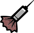 [Sleep Dart](/wiki/Sleep_Dart "Sleep Dart")   [Sleep Dart](/wiki/Sleep_Dart "Sleep Dart") (Weapon)  Use: A straight ranged attack that inflicts  [Sleep](/wiki/Status_Effects#Sleep "Status Effects") 1. .
  -  [Survivalist](/wiki/Survivalist "Survivalist")    [Survivalist](/wiki/Survivalist "Survivalist")  4 healing consumables and a full water bottle are added to your inventory.  
    You can use consumables on allies.  
    Store +2 food at the end of each battle.

[View or edit this template](/wiki/Template:Navbox "Template:Navbox")

Classes

[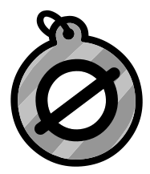](/wiki/Collarless "Collarless")

[Collarless](/wiki/Collarless "Collarless")

[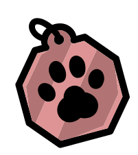](/wiki/Fighter "Fighter")

[Fighter](/wiki/Fighter "Fighter")

[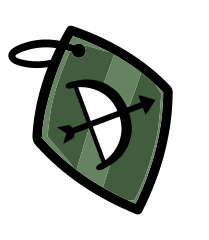](/wiki/Hunter "Hunter")

Hunter

[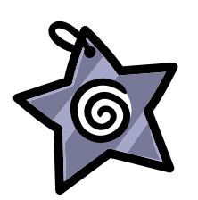](/wiki/Mage "Mage")

[Mage](/wiki/Mage "Mage")

[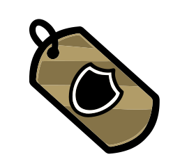](/wiki/Tank "Tank")

[Tank](/wiki/Tank "Tank")

[Cleric](/wiki/Cleric "Cleric")

[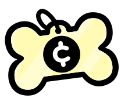](/wiki/Thief "Thief")

[Thief](/wiki/Thief "Thief")

[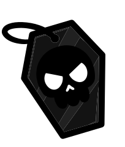](/wiki/Necromancer "Necromancer")

[Necromancer](/wiki/Necromancer "Necromancer")

[Tinkerer](/wiki/Tinkerer "Tinkerer")

[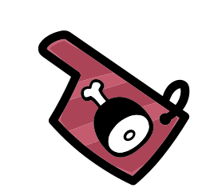](/wiki/Butcher "Butcher")

[Butcher](/wiki/Butcher "Butcher")

[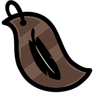](/wiki/Druid "Druid")

[Druid](/wiki/Druid "Druid")

[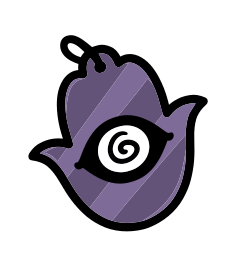](/wiki/Psychic "Psychic")

[Psychic](/wiki/Psychic "Psychic")

[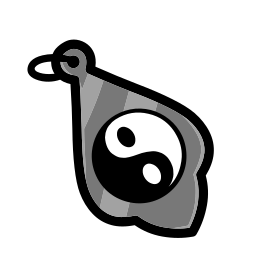](/wiki/Monk "Monk")

[Monk](/wiki/Monk "Monk")

[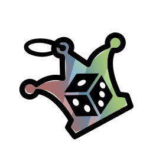](/wiki/Jester "Jester")

[Jester](/wiki/Jester "Jester")