# Classes

**Classes** are an integral property of adventuring [cats](/wiki/Cats "Cats"), which apply [stat](/wiki/Stat "Stat") modifiers and determine which abilities are offered from post combat rewards. Newborn cats start out  [Collarless](/wiki/Collarless "Collarless"), but may become a different class by assigning the corresponding collar (if it is unlocked) when beginning a new adventure. If no collar is assigned, the cat will receive no stat modifiers and will only be offered Collarless abilities which are offered to all cats.

Initially, only five classes are available:  [Collarless](/wiki/Collarless "Collarless"),  [Fighter](/wiki/Fighter "Fighter"),  [Hunter](/wiki/Hunter "Hunter"),  [Mage](/wiki/Mage "Mage"), and  [Tank](/wiki/Tank "Tank"). Additional classes are unlocked by beating areas for the first time and then talking to  [Butch](/wiki/Butch "Butch"), who will award that area's corresponding collar.

## Classes

| Name | | Stat Modifiers | Description | Unlock Method |
| --- | --- | --- | --- | --- |
| [Collarless Icon.svg](/wiki/Collarless "Collarless") | [Collarless](/wiki/Collarless "Collarless") | None | It's a cat! | Available at the start |
| [Fighter Icon.svg](/wiki/Fighter "Fighter") | [Fighter](/wiki/Fighter "Fighter") | +2 [Strength](/wiki/Stats#Strength "Strength")Strength [STR](/wiki/Stats#Strength "Stats") +1 [Speed](/wiki/Stats#Speed "Speed")Speed [SPD](/wiki/Stats#Speed "Stats")   ---   -1 [Intelligence](/wiki/Stats#Intelligence "Intelligence")Intelligence [INT](/wiki/Stats#Intelligence "Stats") | Punch your way to victory! Fighters are great at doing big strong melee attacks and smashing things to pieces! | Available at the start |
| [Hunter Icon.svg](/wiki/Hunter "Hunter") | [Hunter](/wiki/Hunter "Hunter") | +3 [Dexterity](/wiki/Stats#Dexterity "Dexterity")Dexterity [DEX](/wiki/Stats#Dexterity "Stats") +2 [Luck](/wiki/Stats#Luck "Luck")Luck [LCK](/wiki/Stats#Luck "Stats")   ---   -1 [Constitution](/wiki/Stats#Constitution "Constitution")Constitution [CON](/wiki/Stats#Constitution "Stats") -2 [Speed](/wiki/Stats#Speed "Speed")Speed [SPD](/wiki/Stats#Speed "Stats") | Shoot things from afar! Hunters are great at hitting things from a distance while stay out of danger themselves! | Available at the start |
| [Mage Icon.svg](/wiki/Mage "Mage") | [Mage](/wiki/Mage "Mage") | +2 [Intelligence](/wiki/Stats#Intelligence "Intelligence")Intelligence [INT](/wiki/Stats#Intelligence "Stats") +2 [Charisma](/wiki/Stats#Charisma "Charisma")Charisma [CHA](/wiki/Stats#Charisma "Stats")   ---   -1 [Constitution](/wiki/Stats#Constitution "Constitution")Constitution [CON](/wiki/Stats#Constitution "Stats") -1 [Strength](/wiki/Stats#Strength "Strength")Strength [STR](/wiki/Stats#Strength "Stats") | Blast your foes! Mages are great at casting all sorts of crazy spells and dealing elemental damage! | Available at the start |
| [Tank Icon.svg](/wiki/Tank "Tank") | [Tank](/wiki/Tank "Tank") | +4 [Constitution](/wiki/Stats#Constitution "Constitution")Constitution [CON](/wiki/Stats#Constitution "Stats")   ---   -1 [Dexterity](/wiki/Stats#Dexterity "Dexterity")Dexterity [DEX](/wiki/Stats#Dexterity "Stats") -1 [Intelligence](/wiki/Stats#Intelligence "Intelligence")Intelligence [INT](/wiki/Stats#Intelligence "Stats") | Get in the way! Tanks are great at absorbing damage and pushing enemies around! | Available at the start |
| [Cleric Icon.svg](/wiki/Cleric "Cleric") | [Cleric](/wiki/Cleric "Cleric") | +2 [Charisma](/wiki/Stats#Charisma "Charisma")Charisma [CHA](/wiki/Stats#Charisma "Stats") +2 [Constitution](/wiki/Stats#Constitution "Constitution")Constitution [CON](/wiki/Stats#Constitution "Stats")   ---   -1 [Dexterity](/wiki/Stats#Dexterity "Dexterity")Dexterity [DEX](/wiki/Stats#Dexterity "Stats") -1 [Speed](/wiki/Stats#Speed "Speed")Speed [SPD](/wiki/Stats#Speed "Stats") | Be the best friend! Clerics are great at keeping your team alive and helping them recover from taking hits! | Beating [CHAPTER The Alley.svg](/wiki/Alley "Alley") [Alley](/wiki/Alley "Alley") |
| [Thief Icon.svg](/wiki/Thief "Thief") | [Thief](/wiki/Thief "Thief") | +4 [Speed](/wiki/Stats#Speed "Speed")Speed [SPD](/wiki/Stats#Speed "Stats") +1 [Luck](/wiki/Stats#Luck "Luck")Luck [LCK](/wiki/Stats#Luck "Stats")   ---   -1 [Strength](/wiki/Stats#Strength "Strength")Strength [STR](/wiki/Stats#Strength "Stats") -1 [Constitution](/wiki/Stats#Constitution "Constitution")Constitution [CON](/wiki/Stats#Constitution "Stats") | Attack from the shadows! Thieves are great at evading hits, collecting coins and striking from behind! | Beating [CHAPTER The Sewers.svg](/wiki/Sewers "Sewers") [Sewers](/wiki/Sewers "Sewers") |
| [Necromancer Icon.svg](/wiki/Necromancer "Necromancer") | [Necromancer](/wiki/Necromancer "Necromancer") | +2 [Constitution](/wiki/Stats#Constitution "Constitution")Constitution [CON](/wiki/Stats#Constitution "Stats") +1 [Charisma](/wiki/Stats#Charisma "Charisma")Charisma [CHA](/wiki/Stats#Charisma "Stats")   ---   -2 [Strength](/wiki/Stats#Strength "Strength")Strength [STR](/wiki/Stats#Strength "Stats") | Rise from the dead! Necromancers are great at playing with corpses and leeching life from enemies! | Beating [CHAPTER The Boneyard.svg](/wiki/Boneyard "Boneyard") [Boneyard](/wiki/Boneyard "Boneyard") |
| [Tinkerer Icon.svg](/wiki/Tinkerer "Tinkerer") | [Tinkerer](/wiki/Tinkerer "Tinkerer") | +4 [Intelligence](/wiki/Stats#Intelligence "Intelligence")Intelligence [INT](/wiki/Stats#Intelligence "Stats")   ---   -1 [Luck](/wiki/Stats#Luck "Luck")Luck [LCK](/wiki/Stats#Luck "Stats") -1 [Charisma](/wiki/Stats#Charisma "Charisma")Charisma [CHA](/wiki/Stats#Charisma "Stats") | A crafty inventor! Tinkerers are great at crafting temporary weapons and using all sorts of crazy gadgets! | Beating [CHAPTER The Bunker.svg](/wiki/Bunker "Bunker") [Bunker](/wiki/Bunker "Bunker") |
| [Butcher Icon.svg](/wiki/Butcher "Butcher") | [Butcher](/wiki/Butcher "Butcher") | +3 [Constitution](/wiki/Stats#Constitution "Constitution")Constitution [CON](/wiki/Stats#Constitution "Stats") +2 [Strength](/wiki/Stats#Strength "Strength")Strength [STR](/wiki/Stats#Strength "Stats")   ---   -2 [Speed](/wiki/Stats#Speed "Speed")Speed [SPD](/wiki/Stats#Speed "Stats") | Meat Meat Meat Meat Meat! Butchers are great at cleaving chunks of meat off of things and have a hook to pull stuff towards them! | Beating [CHAPTER The Core.svg](/wiki/The_Core "The Core") [The Core](/wiki/The_Core "The Core") |
| [Druid Icon.svg](/wiki/Druid "Druid") | [Druid](/wiki/Druid "Druid") | +3 [Charisma](/wiki/Stats#Charisma "Charisma")Charisma [CHA](/wiki/Stats#Charisma "Stats") +1 [Luck](/wiki/Stats#Luck "Luck")Luck [LCK](/wiki/Stats#Luck "Stats")   ---   -2 [Constitution](/wiki/Stats#Constitution "Constitution")Constitution [CON](/wiki/Stats#Constitution "Stats") | One with nature! Druids are great at summoning animal friends and come with a special Crow counterpart! | Beating [CHAPTER The Crater.svg](/wiki/The_Crater "The Crater") [The Crater](/wiki/The_Crater "The Crater") |
| [Psychic Icon.svg](/wiki/Psychic "Psychic") | [Psychic](/wiki/Psychic "Psychic") | +1 [Intelligence](/wiki/Stats#Intelligence "Intelligence")Intelligence [INT](/wiki/Stats#Intelligence "Stats") +1 [Charisma](/wiki/Stats#Charisma "Charisma")Charisma [CHA](/wiki/Stats#Charisma "Stats") +1 [Speed](/wiki/Stats#Speed "Speed")Speed [SPD](/wiki/Stats#Speed "Stats") +5 [Mana](/wiki/Stats#Mana "Mana")Mana [MP](/wiki/Stats#Mana "Stats")   ---   -1 [Constitution](/wiki/Stats#Constitution "Constitution")Constitution [CON](/wiki/Stats#Constitution "Stats") | Clear your mind! Psychics are great at manipulating things from afar and moving objects with their minds! Psychics also have +5 starting mana. | Beating [CHAPTER The Moon.svg](/wiki/The_Moon "The Moon") [The Moon](/wiki/The_Moon "The Moon") |
| [Monk Icon.svg](/wiki/Monk "Monk") | [Monk](/wiki/Monk "Monk") | +2 [Intelligence](/wiki/Stats#Intelligence "Intelligence")Intelligence [INT](/wiki/Stats#Intelligence "Stats") +2 [Charisma](/wiki/Stats#Charisma "Charisma")Charisma [CHA](/wiki/Stats#Charisma "Stats")   ---   -1 [Strength](/wiki/Stats#Strength "Strength")Strength [STR](/wiki/Stats#Strength "Stats") -1 [Dexterity](/wiki/Stats#Dexterity "Dexterity")Dexterity [DEX](/wiki/Stats#Dexterity "Stats") | A versatile combat master! Monks can switch between ranged and melee stances and attack twice per turn! | Beating [CHAPTER The Lab.svg](/wiki/The_Lab "The Lab") [The Lab](/wiki/The_Lab "The Lab") |
| [Jester Icon.svg](/wiki/Jester "Jester") | [Jester](/wiki/Jester "Jester") | +1 [Level Up Reroll](/wiki/Stats#Level_Up_Reroll "Level Up Reroll")Level Up Reroll [Level Up Reroll](/wiki/Stats#Level_Up_Reroll "Stats")   ---   None | You can be anything! Jesters have no limits! | Beating [CHAPTER The Rift.svg](/wiki/The_Rift "The Rift") [The Rift](/wiki/The_Rift "The Rift") |

## Unlocks

|  | Mark | [Collarless Icon.svg](/wiki/Collarless "Collarless") | [Fighter Icon.svg](/wiki/Fighter "Fighter") | [Hunter Icon.svg](/wiki/Hunter "Hunter") | [Mage Icon.svg](/wiki/Mage "Mage") | [Tank Icon.svg](/wiki/Tank "Tank") | [Cleric Icon.svg](/wiki/Cleric "Cleric") | [Thief Icon.svg](/wiki/Thief "Thief") | [Necromancer Icon.svg](/wiki/Necromancer "Necromancer") | [Tinkerer Icon.svg](/wiki/Tinkerer "Tinkerer") | [Butcher Icon.svg](/wiki/Butcher "Butcher") | [Druid Icon.svg](/wiki/Druid "Druid") | [Psychic Icon.svg](/wiki/Psychic "Psychic") | [Monk Icon.svg](/wiki/Monk "Monk") | [Jester Icon.svg](/wiki/Jester "Jester") |
| --- | --- | --- | --- | --- | --- | --- | --- | --- | --- | --- | --- | --- | --- | --- | --- |
| Complete [CHAPTER The Caves.svg](/wiki/Caves "Caves") [Caves](/wiki/Caves "Caves") | [CompletionMark Caves.svg](/wiki/File:CompletionMark_Caves.svg) | [Collarless CAVES.jpg](/wiki/Metronome "Metronome") | [Fighter CAVES.jpg](/wiki/Paw_Breaker "Paw Breaker") | [Hunter CAVES.jpg](/wiki/Ball_of_Spiders "Ball of Spiders") | [Mage CAVES.jpg](/wiki/Hyper_Beam "Hyper Beam") | [Tank CAVES.jpg](/wiki/Suplex "Suplex") | [Cleric CAVES.jpg](/wiki/Ethereal "Ethereal") | [Thief CAVES.jpg](/wiki/Nail_Flurry "Nail Flurry") | [Necromancer CAVES.jpg](/wiki/Summon_Shade "Summon Shade") | [Tinkerer CAVES.jpg](/wiki/Mech_Suit "Mech Suit") | [Butcher CAVES.jpg](/wiki/Slice_and_Dice "Slice and Dice") | [Druid CAVES.jpg](/wiki/Summon_Bear "Summon Bear") | [Psychic CAVES.jpg](/wiki/Supernova "Supernova") | [Monk CAVES.jpg](/wiki/Hundred_Hand_Slap "Hundred Hand Slap") | [Jester CAVES.jpg](/wiki/Jester#Active_Abilities "Jester") |
| Complete [CHAPTER The Boneyard.svg](/wiki/Boneyard "Boneyard") [Boneyard](/wiki/Boneyard "Boneyard") | [CompletionMark Boneyard.svg](/wiki/File:CompletionMark_Boneyard.svg) | [Collarless BONEYARD.jpg](/wiki/Skill_Share "Skill Share") | [Fighter BONEYARD.jpg](/wiki/Dual_Wield "Dual Wield") | [Hunter BONEYARD.jpg](/wiki/Thrill_of_the_Hunt "Thrill of the Hunt") | [Mage BONEYARD.jpg](/wiki/Three "Three") | [Tank BONEYARD.jpg](/wiki/Bouncer "Bouncer") | [Cleric BONEYARD.jpg](/wiki/Evil_Patron "Evil Patron") | [Thief BONEYARD.jpg](/wiki/First_Strike "First Strike") | [Necromancer BONEYARD.jpg](/wiki/Servus_Mortem "Servus Mortem") | [Tinkerer BONEYARD.jpg](/wiki/Armor_Specialist "Armor Specialist") | [Butcher BONEYARD.jpg](/wiki/Indigestion "Indigestion") | [Druid BONEYARD.jpg](/wiki/Suicide_Squad "Suicide Squad") | [Psychic BONEYARD.jpg](/wiki/Gravity_Well "Gravity Well") | [Monk BONEYARD.jpg](/wiki/Unstoppable "Unstoppable") | [Jester BONEYARD.jpg](/wiki/Jester#Passive_Abilities "Jester") |
| Complete [CHAPTER The Core.svg](/wiki/The_Core "The Core") [The Core](/wiki/The_Core "The Core") | [CompletionMark Core.svg](/wiki/File:CompletionMark_Core.svg) | [Collarless CORE.jpg](/wiki/Path_Of_The_Void "Path Of The Void") | [Fighter CORE.jpg](/wiki/Path_of_the_Fighter "Path of the Fighter") | [Hunter CORE.jpg](/wiki/Path_of_the_Hunter "Path of the Hunter") | [Mage CORE.jpg](/wiki/Path_of_the_Mage "Path of the Mage") | [Tank CORE.jpg](/wiki/Path_of_the_Tank "Path of the Tank") | [Cleric CORE.jpg](/wiki/Path_of_the_Cleric "Path of the Cleric") | [Thief CORE.jpg](/wiki/Path_of_the_Thief "Path of the Thief") | [Necromancer CORE.jpg](/wiki/Path_of_the_Necromancer "Path of the Necromancer") | [Tinkerer CORE.jpg](/wiki/Path_of_the_Tinkerer "Path of the Tinkerer") | [Butcher CORE.jpg](/wiki/Path_of_the_Butcher "Path of the Butcher") | [Druid CORE.jpg](/wiki/Path_of_the_Druid "Path of the Druid") | [Psychic CORE.jpg](/wiki/Path_of_the_Psychic "Path of the Psychic") | [Monk CORE.jpg](/wiki/Path_of_the_Monk "Path of the Monk") | [Jester CORE.jpg](/wiki/Path_of_the_Jester "Path of the Jester") |
| Complete [CHAPTER The Moon.svg](/wiki/The_Moon "The Moon") [The Moon](/wiki/The_Moon "The Moon") | [CompletionMark Moon.svg](/wiki/File:CompletionMark_Moon.svg) | [Collarless MOON.jpg](/wiki/Void_Soul "Void Soul") | [Fighter MOON.jpg](/wiki/Fighter%27s_Soul "Fighter's Soul") | [Hunter MOON.jpg](/wiki/Hunter%27s_Soul "Hunter's Soul") | [Mage MOON.jpg](/wiki/Mage%27s_Soul "Mage's Soul") | [Tank MOON.jpg](/wiki/Tank%27s_Soul "Tank's Soul") | [Cleric MOON.jpg](/wiki/Cleric%27s_Soul "Cleric's Soul") | [Thief MOON.jpg](/wiki/Thief%27s_Soul "Thief's Soul") | [Necromancer MOON.jpg](/wiki/Necromancer%27s_Soul "Necromancer's Soul") | [Tinkerer MOON.jpg](/wiki/Tinkerer%27s_Soul "Tinkerer's Soul") | [Butcher MOON.jpg](/wiki/Butcher%27s_Soul "Butcher's Soul") | [Druid MOON.jpg](/wiki/Druid%27s_Soul "Druid's Soul") | [Psychic MOON.jpg](/wiki/Psychic%27s_Soul "Psychic's Soul") | [Monk MOON.jpg](/wiki/Monk%27s_Soul "Monk's Soul") | [Jester MOON.jpg](/wiki/Jester%27s_Soul "Jester's Soul") |
| Complete [CHAPTER The Jurassic.svg](/wiki/Jurassic "Jurassic") [Jurassic](/wiki/Jurassic "Jurassic") | [CompletionMark Jurassic.svg](/wiki/File:CompletionMark_Jurassic.svg) | [Collarless JURASSIC.jpg](/wiki/Lil%27_Kitty "Lil' Kitty") | [Fighter JURASSIC.jpg](/wiki/Battle_Axe "Battle Axe") | [Hunter JURASSIC.jpg](/wiki/Arrow_of_Infinity "Arrow of Infinity") | [Mage JURASSIC.jpg](/wiki/Staff_of_Flame "Staff of Flame") | [Tank JURASSIC.jpg](/wiki/Girder "Girder") | [Cleric JURASSIC.jpg](/wiki/Anointing_Oil "Anointing Oil") | [Thief JURASSIC.jpg](/wiki/Laced_Needle "Laced Needle") | [Necromancer JURASSIC.jpg](/wiki/Staff_of_the_Underworld "Staff of the Underworld") | [Tinkerer JURASSIC.jpg](/wiki/Ball-Peen_Hammer "Ball-Peen Hammer") | [Butcher JURASSIC.jpg](/wiki/Butcher%27s_Cleaver "Butcher's Cleaver") | [Druid JURASSIC.jpg](/wiki/Rain_Staff "Rain Staff") | [Psychic JURASSIC.jpg](/wiki/Bent_Spoon "Bent Spoon") | [Monk JURASSIC.jpg](/wiki/Bo "Bo") | [Jester JURASSIC.jpg](/wiki/Ninny_Stick "Ninny Stick") |
| Complete [CHAPTER The End.svg](/wiki/The_End "The End") [The End](/wiki/The_End "The End") | [CompletionMark End.svg](/wiki/File:CompletionMark_End.svg) | [Collarless THEEND.jpg](/wiki/Ball_of_Yarn "Ball of Yarn") | [Fighter THEEND.jpg](/wiki/Rage_Juice "Rage Juice") | [Hunter THEEND.jpg](/wiki/Hunter%27s_Flute "Hunter's Flute") | [Mage THEEND.jpg](/wiki/Ring_of_Frost "Ring of Frost") | [Tank THEEND.jpg](/wiki/Tank_Juice "Tank Juice") | [Cleric THEEND.jpg](/wiki/Holy_Water "Holy Water") | [Thief THEEND.jpg](/wiki/Lucky_Coin_Purse "Lucky Coin Purse") | [Necromancer THEEND.jpg](/wiki/Satanic_Bible "Satanic Bible") | [Tinkerer THEEND.jpg](/wiki/Scrap_Bag "Scrap Bag") | [Butcher THEEND.jpg](/wiki/Cookbook "Cookbook") | [Druid THEEND.jpg](/wiki/Druid%27s_Whistle "Druid's Whistle") | [Psychic THEEND.jpg](/wiki/Tarot_Deck "Tarot Deck") | [Monk THEEND.jpg](/wiki/Empty_Hand "Empty Hand") | [Jester THEEND.jpg](/wiki/Toy_Gun "Toy Gun") |
| Defeat the BOSS Throbbing King Icon.svg [Throbbing King](/wiki/Throbbing_King "Throbbing King")[BOSS Throbbing King Icon.svg](/wiki/Throbbing_King "Throbbing King") [Throbbing King](/wiki/Throbbing_King "Throbbing King") Follow his orders! OR ELSE! | [CompletionMark Throbbing.svg](/wiki/File:CompletionMark_Throbbing.svg) | [Collarless KING.jpg](/wiki/Normal_Ears "Normal Ears") | [Fighter KING.jpg](/wiki/Fighter%27s_Helm "Fighter's Helm") | [Hunter KING.jpg](/wiki/Hunter%27s_Cap "Hunter's Cap") | [Mage KING.jpg](/wiki/Mage%27s_Hat "Mage's Hat") | [Tank KING.jpg](/wiki/Tank%27s_Helmet "Tank's Helmet") | [Cleric KING.jpg](/wiki/Cleric%27s_Mitre "Cleric's Mitre") | [Thief KING.jpg](/wiki/Thief%27s_Hood "Thief's Hood") | [Necromancer KING.jpg](/wiki/Spider_Hat "Spider Hat") | [Tinkerer KING.jpg](/wiki/Scrapper%27s_Hat "Scrapper's Hat") | [Butcher KING.jpg](/wiki/Flesh_Shroud "Flesh Shroud") | [Druid KING.jpg](/wiki/Mushroom_Hat "Mushroom Hat") | [Psychic KING.jpg](/wiki/Tinfoil_Hat "Tinfoil Hat") | [Monk KING.jpg](/wiki/Head_Brand "Head Brand") | [Jester KING.jpg](/wiki/Cap_and_Bells "Cap and Bells") |
| Defeat BOSS Organ Grinder Icon.svg [Chaos!](/wiki/Chaos! "Chaos!")[BOSS Organ Grinder Icon.svg](/wiki/Chaos! "Chaos!") [Chaos!](/wiki/Chaos! "Chaos!") Embrace chaos ! soahc ecarbmE | [CompletionMark Rift.svg](/wiki/File:CompletionMark_Rift.svg) | [Collarless CHAOS.jpg](/wiki/Ordinary_Whiskers "Ordinary Whiskers") | [Fighter CHAOS.jpg](/wiki/Fighter%27s_Scar "Fighter's Scar") | [Hunter CHAOS.jpg](/wiki/Hunter%27s_Monocle "Hunter's Monocle") | [Mage CHAOS.jpg](/wiki/Mage%27s_Robe "Mage's Robe") | [Tank CHAOS.jpg](/wiki/Tank%27s_Tattoo "Tank's Tattoo") | [Cleric CHAOS.jpg](/wiki/Cleric%27s_Tears "Cleric's Tears") | [Thief CHAOS.jpg](/wiki/Thief%27s_Tattoo "Thief's Tattoo") | [Necromancer CHAOS.jpg](/wiki/Death_Mask "Death Mask") | [Tinkerer CHAOS.jpg](/wiki/Scrapper%27s_Mask "Scrapper's Mask") | [Butcher CHAOS.jpg](/wiki/Iron_Jaw "Iron Jaw") | [Druid CHAOS.jpg](/wiki/Greenman_Mask "Greenman Mask") | [Psychic CHAOS.jpg](/wiki/Mystic_Eye "Mystic Eye") | [Monk CHAOS.jpg](/wiki/Face_Brand "Face Brand") | [Jester CHAOS.jpg](/wiki/Clown_Makeup "Clown Makeup") |
| Defeat BOSS The Creator Icon.svg [The Creator](/wiki/The_Creator "The Creator")[BOSS The Creator Icon.svg](/wiki/The_Creator "The Creator") [The Creator](/wiki/The_Creator "The Creator") Nosce te Ipsum! | [CompletionMark Infinite.svg](/wiki/File:CompletionMark_Infinite.svg) | [Collarless CREATOR.jpg](/wiki/Mundane_Collar "Mundane Collar") | [Fighter CREATOR.jpg](/wiki/Fighter%27s_Shoulder_Pad "Fighter's Shoulder Pad") | [Hunter CREATOR.jpg](/wiki/Hunter%27s_Quiver "Hunter's Quiver") | [Mage CREATOR.jpg](/wiki/Mage%27s_Scarf "Mage's Scarf") | [Tank CREATOR.jpg](/wiki/Tank%27s_Pads "Tank's Pads") | [Cleric CREATOR.jpg](/wiki/Cleric%27s_Relic "Cleric's Relic") | [Thief CREATOR.jpg](/wiki/Thief%27s_Cloak "Thief's Cloak") | [Necromancer CREATOR.jpg](/wiki/Leech_Necklace "Leech Necklace") | [Tinkerer CREATOR.jpg](/wiki/Scrapper%27s_Backpack "Scrapper's Backpack") | [Butcher CREATOR.jpg](/wiki/Hooked_Necklace "Hooked Necklace") | [Druid CREATOR.jpg](/wiki/Ring_of_Mushrooms "Ring of Mushrooms") | [Psychic CREATOR.jpg](/wiki/Diviner%27s_Cloth "Diviner's Cloth") | [Monk CREATOR.jpg](/wiki/Prayer_Beads "Prayer Beads") | [Jester CREATOR.jpg](/wiki/Ruffle "Ruffle") |
| Complete all areas | [CompletionMark All.svg](/wiki/File:CompletionMark_All.svg) | [Collarless ALL.jpg](/wiki/Skill_Split "Skill Split") | [Fighter ALL.jpg](/wiki/Steroids "Steroids") | [Hunter ALL.jpg](/wiki/Bag_of_Seeds "Bag of Seeds") | [Mage ALL.jpg](/wiki/Spell_Book "Spell Book") | [Tank ALL.jpg](/wiki/Tank_Toy "Tank Toy") | [Cleric ALL.jpg](/wiki/Prayer_Card "Prayer Card") | [Thief ALL.jpg](/wiki/Bag_o%27_Bags "Bag o' Bags") | [Necromancer ALL.jpg](/wiki/Cambion_Conception_(Item) "Cambion Conception (Item)") | [Tinkerer ALL.jpg](/wiki/Fireworks "Fireworks") | [Butcher ALL.jpg](/wiki/Sack_o%27_Meat "Sack o' Meat") | [Druid ALL.jpg](/wiki/Tiny_Cage "Tiny Cage") | [Psychic ALL.jpg](/wiki/Friendship_Bracelet "Friendship Bracelet") | [Monk ALL.jpg](/wiki/Tiny_Pebble "Tiny Pebble") | [Jester ALL.jpg](/wiki/Joker_Card "Joker Card") |

|  | Mark | Only [Collarless Icon.svg](/wiki/Collarless "Collarless") [Collarless](/wiki/Collarless "Collarless") cats on team |
| --- | --- | --- |
| Defeat the BOSS Throbbing King Icon.svg [Throbbing King](/wiki/Throbbing_King "Throbbing King")[BOSS Throbbing King Icon.svg](/wiki/Throbbing_King "Throbbing King") [Throbbing King](/wiki/Throbbing_King "Throbbing King") Follow his orders! OR ELSE! | [CompletionMark Throbbing Mono.svg](/wiki/File:CompletionMark_Throbbing_Mono.svg) | [MonoCollarless KING.jpg](/wiki/Copycat_Hat "Copycat Hat") |
| Defeat BOSS Organ Grinder Icon.svg [Chaos!](/wiki/Chaos! "Chaos!")[BOSS Organ Grinder Icon.svg](/wiki/Chaos! "Chaos!") [Chaos!](/wiki/Chaos! "Chaos!") Embrace chaos ! soahc ecarbmE | [CompletionMark Rift Mono.svg](/wiki/File:CompletionMark_Rift_Mono.svg) | [MonoCollarless CHAOS.jpg](/wiki/Copycat_Mask "Copycat Mask") |
| Defeat BOSS The Creator Icon.svg [The Creator](/wiki/The_Creator "The Creator")[BOSS The Creator Icon.svg](/wiki/The_Creator "The Creator") [The Creator](/wiki/The_Creator "The Creator") Nosce te Ipsum! | [CompletionMark Infinite Mono.svg](/wiki/File:CompletionMark_Infinite_Mono.svg) | [MonoCollarless CREATOR.jpg](/wiki/Copycat_Scarf "Copycat Scarf") |

## Trivia

- The [Minibosses](/wiki/Minibosses "Minibosses") for every [Act's](/wiki/Act "Act") first [Chapter](/wiki/Chapter "Chapter") are all cats that represent one of the classes. Generally, these minibosses are based on the classes that were unlocked in the previous Act, though there are some exceptions.
  - 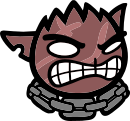 [Magnus](/wiki/Magnus "Magnus") [Magnus](/wiki/Magnus "Magnus") Has a chain dash and spin attack that hits all adjacent units! represents the  [Fighter](/wiki/Fighter "Fighter")
  - 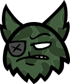 [Fenrir](/wiki/Fenrir "Fenrir") [Fenrir](/wiki/Fenrir "Fenrir") Tosses bear traps!   
     Has an affinity for tall grass.   
     Knocks back Melee attackers. represents the  [Hunter](/wiki/Hunter "Hunter")
  - 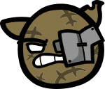 [Maisie](/wiki/Maisie "Maisie") [Maisie](/wiki/Maisie "Maisie") Protects her kittens when they are attacked. represents the  [Tank](/wiki/Tank "Tank")
  - 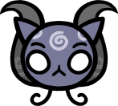 [Lucy](/wiki/Lucy "Lucy") [Lucy](/wiki/Lucy "Lucy") Her powerful spells take time to charge up. represents the  [Mage](/wiki/Mage "Mage")
  - 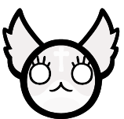 [Marshmallow](/wiki/Marshmallow "Marshmallow") [Marshmallow](/wiki/Marshmallow "Marshmallow") Her lick attack Charms units. represents the  [Cleric](/wiki/Cleric "Cleric")
  - 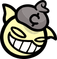 [Dack](/wiki/Dack "Dack") [Dack](/wiki/Dack "Dack") His ranged attacks scatter held coins.  
    Has a melee attack that inflicts Poison.  
    Seeks coin pickups.  
    Gains a Backflip every time he collects a coin. represents the  [Thief](/wiki/Thief "Thief")
  - 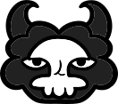 [Morana](/wiki/Morana "Morana") [Morana](/wiki/Morana "Morana") Its ranged attack inflicts leech.   
     Reanimates Dead Bodies.   
     Revives through dead bodies. represents the  [Necromancer](/wiki/Necromancer "Necromancer")
  - 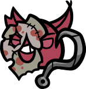 [Gein](/wiki/Gein "Gein") [Gein](/wiki/Gein "Gein") *Hooks and pulls units that end their movement in range, inflicting Bleed.*  
    *Does a melee spin attack that spawns meat.*  
    *Seeks meat pickups.*  
    *Trample.* represents the  [Butcher](/wiki/Butcher "Butcher") (unlocked by completing [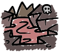](/wiki/The_Core "The Core") [The Core](/wiki/The_Core "The Core") instead of an Act 1 chapter)
  - 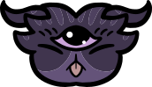 [Alice](/wiki/Alice "Alice") [Alice](/wiki/Alice "Alice") Has a psychic choke attack that inflicts Bruise on a unit in her line of sight.  
     Knocks back any enemy within her line of sight that casts a spell. represents the  [Psychic](/wiki/Psychic "Psychic")
  - 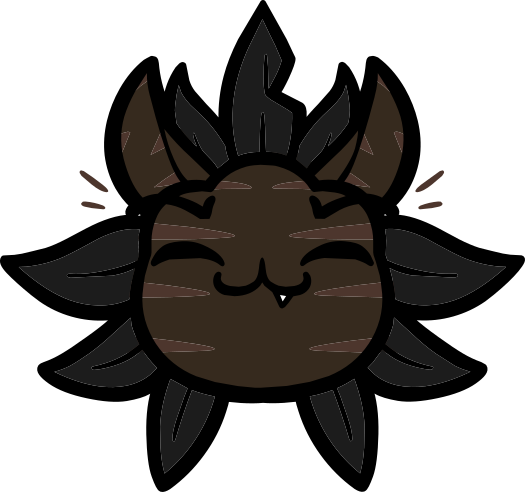 [Draven](/wiki/Draven "Draven") [Draven](/wiki/Draven "Draven") Heals and buffs his crows.  
     Enters Squirrel Form once his crows die. represents the  [Druid](/wiki/Druid "Druid")
  - 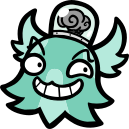 [Franklin](/wiki/Franklin "Franklin") [Franklin](/wiki/Franklin "Franklin") Spawns robots and crafts weapons. Enters a Mech when at low HP. represents the  [Tinkerer](/wiki/Tinkerer "Tinkerer")
  - 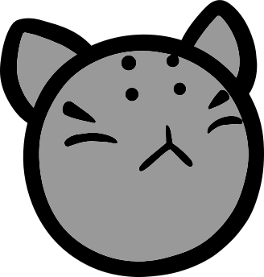 [Chan Hung](/wiki/Chan_Hung "Chan Hung") [Chan Hung](/wiki/Chan_Hung "Chan Hung") Uses his own actions every time one of his enemies uses an action.  
     Has a different response for move, attack/weapon, and spell/trinket. represents the  [Monk](/wiki/Monk "Monk") (unlocked by completing [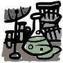](/wiki/The_Lab "The Lab") [The Lab](/wiki/The_Lab "The Lab") instead of an Act 2 chapter)
  -  [Arthur](/wiki/Arthur "Arthur") [Arthur](/wiki/Arthur "Arthur") Who knows what he will do!? represents the  [Jester](/wiki/Jester "Jester") (unlocked after completing [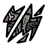](/wiki/The_Rift "The Rift") [The Rift](/wiki/The_Rift "The Rift"), can appear in any Act)
  - 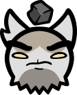 [Pebbles](/wiki/Pebbles "Pebbles") [Pebbles](/wiki/Pebbles "Pebbles") Its melee attack knocks units backwards.   
     Can throw rocks. represents the  [Collarless](/wiki/Collarless "Collarless") class despite being considered a Boss and not a Mini-Boss.
- 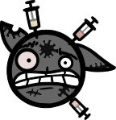 [Spun Cat](/wiki/Spun_Cat "Spun Cat") [Spun Cat](/wiki/Spun_Cat "Spun Cat") Has a random class basic attack that inflicts a randomly assigned debuff. has class themed variants for every class except for the  [Jester](/wiki/Jester "Jester")
- Most of the classes in *Mewgenics* are either directly comparable or strikingly similar to the various classes from *Dungeons & Dragons*.[[1]](#cite_note-1)
  - Direct analogues include:
    -  [Fighter](/wiki/Fighter "Fighter")
    -  [Cleric](/wiki/Cleric "Cleric")
    -  [Druid](/wiki/Druid "Druid")
    -  [Monk](/wiki/Monk "Monk")
  - Different in name, but very similar in function/themeing/playstyle:
    -  [Mage](/wiki/Mage "Mage"): Wizard
    -  [Hunter](/wiki/Hunter "Hunter"): Ranger
    -  [Thief](/wiki/Thief "Thief"): Rogue
    -  [Necromancer](/wiki/Necromancer "Necromancer"): A subclass of Wizard
    -  [Tinkerer](/wiki/Tinkerer "Tinkerer"): Artificer
    -  [Druid](/wiki/Druid "Druid"): Bard, in addition to Druid
    -  [Psychic](/wiki/Psychic "Psychic"): Mystic
- The  [Collarless](/wiki/Collarless "Collarless") class is a portmanteau of "collar" and "colorless," the latter being a reference to the colorless mana type in *Magic: The Gathering.*[[2]](#cite_note-2)

## Color Palettes

The color palettes used by each class.

| Class | Primary Color | Shade | Shade | Iris Color |
| --- | --- | --- | --- | --- |
| [Fighter Icon.svg](/wiki/Fighter "Fighter") [Fighter](/wiki/Fighter "Fighter") | `#B17373` | `#9F6565` | `#8D5959` | `#E88C8C` |
| [Hunter Icon.svg](/wiki/Hunter "Hunter") [Hunter](/wiki/Hunter "Hunter") | `#425D3D` | `#375133` | `#2F432B` | `#9CCB8D` |
| [Mage Icon.svg](/wiki/Mage "Mage") [Mage](/wiki/Mage "Mage") | `#787899` | `#9493B8` | `#CAC8DA` | `#AFAFE6` |
| [Tank Icon.svg](/wiki/Tank "Tank") [Tank](/wiki/Tank "Tank") | `#857348` | `#645431` | `#53472B` | `#ECECEC` |
| [Cleric Icon.svg](/wiki/Cleric "Cleric") [Cleric](/wiki/Cleric "Cleric") | `#FDFDFD` | `#F6F4F4` | `#F2EFEF` | `#ECECEC` |
| [Thief Icon.svg](/wiki/Thief "Thief") [Thief](/wiki/Thief "Thief") | `#FFFBB5` | `#EBE7A3` | `#D8D5A0` | `#FFFBB5` |
| [Necromancer Icon.svg](/wiki/Necromancer "Necromancer") [Necromancer](/wiki/Necromancer "Necromancer") | `#131313` | `#1B1B1B` | `#212121` | `#723B3C` |
| [Tinkerer Icon.svg](/wiki/Tinkerer "Tinkerer") [Tinkerer](/wiki/Tinkerer "Tinkerer") | `#B5EADC` | `#97DFCB` | `#79CEB7` | `#7CD6B5` |
| [Butcher Icon.svg](/wiki/Butcher "Butcher") [Butcher](/wiki/Butcher "Butcher") | `#AC4457` | `#8F3747` | `#7C2F3C` | `#B6576B` |
| [Druid Icon.svg](/wiki/Druid "Druid") [Druid](/wiki/Druid "Druid") | `#5B4237` | `#4D362D` | `#3A2922` | `#A0C197` |
| [Psychic Icon.svg](/wiki/Psychic "Psychic") [Psychic](/wiki/Psychic "Psychic") | `#645379` | `#4E415F` | `#40354E` | `#997DBB` |
| [Monk Icon.svg](/wiki/Monk "Monk") [Monk](/wiki/Monk "Monk") | `#787878` | `#3B3B3B` | `#A2A2A2` | `#DCDCDC` |

## References

1. [↑](#cite_ref-1) <https://www.dndbeyond.com/classes?srsltid=AfmBOoozEmn3R3UZW0EGYs7F91XNC0-rw_TV0fztzM7cdB-Vta_7Y7jA>
2. [↑](#cite_ref-2) <https://mtg.fandom.com/wiki/Colorless>