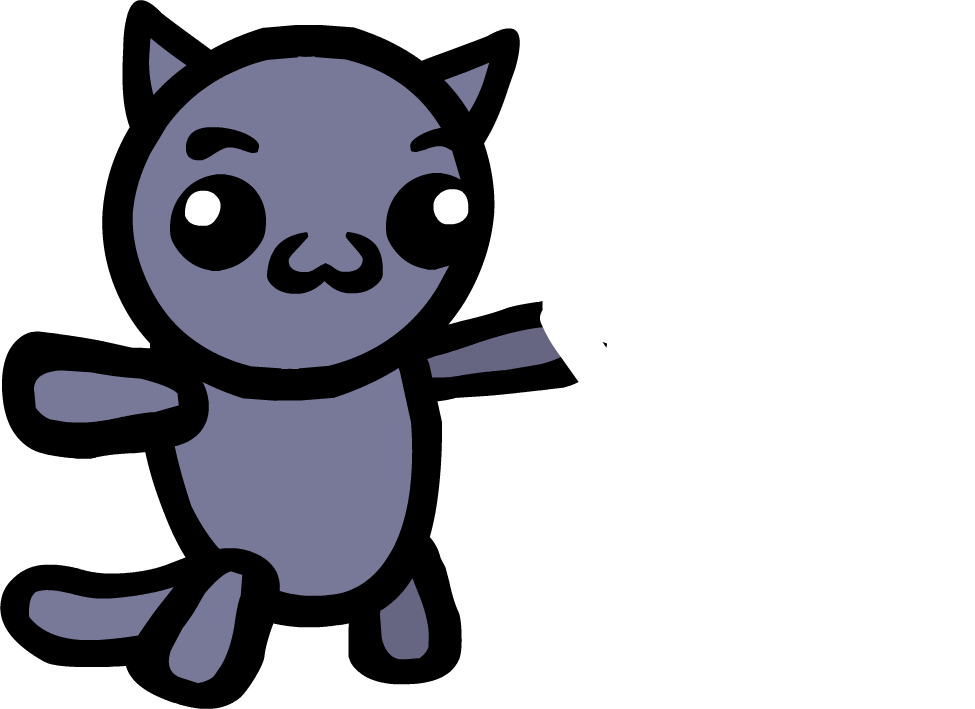
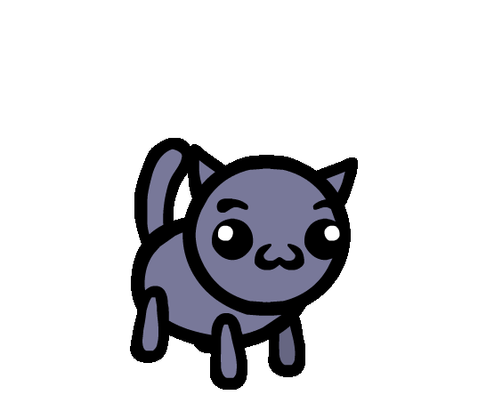

# Mage

Mage

Blast your foes! Mages are great at casting all sorts of crazy spells and dealing elemental damage!

Stat Modifiers

Buffs

+2 Intelligence [INT](/wiki/Stats#Intelligence "Stats")  
+2 Charisma [CHA](/wiki/Stats#Charisma "Stats")

Debuffs

-1 Constitution [CON](/wiki/Stats#Constitution "Stats")  
-1 Strength [STR](/wiki/Stats#Strength "Stats")

Level up Stats

Intelligence [INT](/wiki/Stats#Intelligence "Stats"), Charisma [CHA](/wiki/Stats#Charisma "Stats"), Dexterity [DEX](/wiki/Stats#Dexterity "Stats")

Details

Collar

> “
>
> "My paws crackle with energy!"
>
> — A cat equipped with the Mage collar when embarking on an adventure

The **Mage** is a starting [class](/wiki/Class "Class").

## Overview

Mages get +2  [Intelligence](/wiki/Stats#Intelligence "Stats") and +2  [Charisma](/wiki/Stats#Charisma "Stats"), but -1  [Constitution](/wiki/Stats#Constitution "Stats") and -1  [Strength](/wiki/Stats#Strength "Stats") as well. When leveling up, they can gain  [Intelligence](/wiki/Stats#Intelligence "Stats"),  [Charisma](/wiki/Stats#Charisma "Stats"), or  [Dexterity](/wiki/Stats#Dexterity "Stats").

Mages are usually ranged attackers with some support capabilities. They often cast more spells than other classes due to their high  [Intelligence](/wiki/Stats#Intelligence "Stats") and  [Charisma](/wiki/Stats#Charisma "Stats"). Their spells usually lack high base damage, but their offensive output can balloon with strategic use of  Mana, giving themselves  [Magic Damage Up](/wiki/Status_Effects#Magic_Damage_Up "Status Effects"), or abusing elemental spells—of which they have a wide variety. Alternatively, these elemental spells can be used to manipulate the environment to the team's liking. However, as they have low  [Constitution](/wiki/Stats#Constitution "Stats") and few ways of improving their survivability, Mages are among the frailest classes in the game and can be downed especially easily.

### Basic Action

A Mage's basic attack is **Magic Dart**. It deals both  Physical Magic Damage that scales with  [Dexterity](/wiki/Stats#Dexterity "Stats") to a unit within Range 3. It has a base damage (at 4-to-6 DEX) of 5.

Being both physical and magical, Magic Dart is affected by stacks of  [Magic Damage Up](/wiki/Status_Effects#Magic_Damage_Up "Status Effects"), while still reaping the benefits of being a physical attack ( [Bruise](/wiki/Status_Effects#Bruise "Status Effects"), Critical Hits, etc).

The  [Paw Missile](/wiki/Paw_Missile "Paw Missile")    [Paw Missile](/wiki/Paw_Missile "Paw Missile")  Your basic attack is Magic Missile.  
(its damage scales with Intelligence).  passive replaces Magic Dart with a basic attack version of **Magic Missile**, which has infinite range, ignores obstacles, and never misses. It only deals  Magic Damage; but unlike most attacks, it scales with  [Intelligence](/wiki/Stats#Intelligence "Stats"), much like how most ranged abilities scale with  [Dexterity](/wiki/Stats#Dexterity "Stats"). It has a base damage (at 4-to-6 INT) of 3.

### Archetypes

- **Artillery:** Expends large amounts of Mana to damage multiple foes from medium-to-long range.
  - Abilities like  [Bolt](/wiki/Bolt "Bolt")    [Bolt](/wiki/Bolt "Bolt")  A lightning bolt that has a 25% chance to Stun. ,  [Lightning Surge](/wiki/Lightning_Surge "Lightning Surge")    [Lightning Surge](/wiki/Lightning_Surge "Lightning Surge")  An electric spell that increases its range and damage by 2 every turn, and its stun chance by 10%. , and  [Tri-Attack](/wiki/Tri-Attack "Tri-Attack")    [Tri-Attack](/wiki/Tri-Attack "Tri-Attack")  A Fire / Ice / Electric spell that inflicts Burn 1, Slow 1, and has a 5% chance to inflict Stun.  deal high damage with the added bonus of inflicting  [Stun](/wiki/Status_Effects#Stun "Status Effects").
  -  [Hyper Beam](/wiki/Hyper_Beam "Hyper Beam")    [Hyper Beam](/wiki/Hyper_Beam "Hyper Beam")  Target a tile. At the start of your next turn, unleash an extremely high damage mega beam on that tile.  
     (Castable once per turn.)   and  [Mega Blast](/wiki/Mega_Blast "Mega Blast")    [Mega Blast](/wiki/Mega_Blast "Mega Blast")  Deal high damage in a cone.  have some of the highest base damage out of all spells.

- **Elementalist:** Uses elemental (ex.  [Fire](/wiki/Elements#Fire "Elements"),  [Water](/wiki/Elements#Water "Elements"),  [Electric](/wiki/Elements#Electric "Elements")) spells for various elemental interactions.
  -  [Cryo-Heal](/wiki/Cryo-Heal "Cryo-Heal")    [Cryo-Heal](/wiki/Cryo-Heal "Cryo-Heal")  Heal and inflict Freeze 1 on a unit in range 3.  and  [Frost Blast](/wiki/Frost_Blast "Frost Blast")    [Frost Blast](/wiki/Frost_Blast "Frost Blast")  Shoot a blast of ice in a line that freezes the first unit it hits.  consistently inflict  [Freeze](/wiki/Status_Effects#Freeze "Status Effects") for crowd control or massive damage with  [Shatter](/wiki/Shatter "Shatter")    [Shatter](/wiki/Shatter "Shatter")  A melee attack that instantly kills frozen units. If used on a boss, it instead removes Frozen to deal 15 damage and inflict Slow 2. .
  - Abilities like  [Wall of Fire](/wiki/Wall_of_Fire "Wall of Fire")    [Wall of Fire](/wiki/Wall_of_Fire "Wall of Fire")  A fire spell that inflicts Burn 1 and spawns fires in a perpendicular line.  and  [Burning Paws](/wiki/Burning_Paws "Burning Paws")    [Burning Paws](/wiki/Burning_Paws "Burning Paws")  Your basic action inflicts  [Burn](/wiki/Status_Effects#Burn "Status Effects") 1.  inflict  [Burn](/wiki/Status_Effects#Burn "Status Effects"), which can be increased with  [Wind](/wiki/Elements#Wind "Elements") spells like  [Gust](/wiki/Gust "Gust")    [Gust](/wiki/Gust "Gust")  Knock back each unit adjacent to a chosen tile 1 space. .

- **Mana Master:** Boosts allies' mana regeneration with or makes their spells cost less.
  -  [Inspire](/wiki/Inspire "Inspire")    [Inspire](/wiki/Inspire "Inspire")  Give 2 mana to a unit. ,  [Mana Meld](/wiki/Mana_Meld "Mana Meld")    [Mana Meld](/wiki/Mana_Meld "Mana Meld")  Give all of your mana to a unit in range 3. , and  [Magic Guru](/wiki/Magic_Guru "Magic Guru")    [Magic Guru](/wiki/Magic_Guru "Magic Guru")  Your allies have +1 Mana Regeneration. When an ally spends 7+ mana to cast a spell, they gain  [All Stats Up](/wiki/Status_Effects#All_Stats_Up "Status Effects").  give allies more mana.
  -  [Teach](/wiki/Teach "Teach")    [Teach](/wiki/Teach "Teach")  Reduce the cost of another unit's spells by 1 until the end of their turn.  gives allies  [Insight](/wiki/Status_Effects#Insight "Status Effects"), lowering their spells'  Mana Costs.
  - "Number" passives like  [One](/wiki/One "One")    [One](/wiki/One "One")  When you end your turn, if you cast exactly 1 spell, double cast your next spell.  and  [Four](/wiki/Four "Four")    [Four](/wiki/Four "Four")  When you end your turn, if you have exactly 4 mana, gain +1  [Intelligence](/wiki/Stats#Intelligence "Stats") and +1 Magic Damage.  provide buffs with careful usage of spells and mana.

- **Firecracker:** Gives self  [Magic Damage Up](/wiki/Status_Effects#Magic_Damage_Up "Status Effects"), then unleashes a flurry of weak magical attacks.
  - Abilities like  [Corrupt](/wiki/Corrupt "Corrupt")    [Corrupt](/wiki/Corrupt "Corrupt")  Injure yourself, then gain +3 Magic Damage.  and  [Resonance](/wiki/Resonance "Resonance")    [Resonance](/wiki/Resonance "Resonance")  When you cast a spell gain +1 Magic Damage for the rest of the turn.  can provide high amounts of  [Magic Damage Up](/wiki/Status_Effects#Magic_Damage_Up "Status Effects").
  - Abilities like  [Divide](/wiki/Divide "Divide")    [Divide](/wiki/Divide "Divide")  Lose Damage equal to half of your basic attack's damage, rounded up. For the rest of the battle, you can attack an extra time each turn.  
     (This can't be cast if your basic attack's damage is 1 or less.)   and  [Light Up the Stage](/wiki/Light_Up_the_Stage "Light Up the Stage")    [Light Up the Stage](/wiki/Light_Up_the_Stage "Light Up the Stage")  At the end of your turn, emit a  [Sparkle](/wiki/Keywords#Sparkle "Keywords") for each turn you've taken.  can spam weak projectiles, which are individually buffed by  [Magic Damage Up](/wiki/Status_Effects#Magic_Damage_Up "Status Effects").

- **Glass Cannon:** Uses self-destructive abilities to obtain mana and deal high damage.
  -  [Black Magic](/wiki/Black_Magic "Black Magic")    [Black Magic](/wiki/Black_Magic "Black Magic")  Drop to 1 HP. Gain mana equal to the HP lost.  
     (Castable once per turn.)   and  [Deal with the Devil](/wiki/Deal_with_the_Devil "Deal with the Devil")    [Deal with the Devil](/wiki/Deal_with_the_Devil "Deal with the Devil")  Injure yourself, then restore 15 mana.  
     (Castable once per battle.)   provide high mana at the cost of weakening survivability.
  - "Forbidden" spells such as  [Forbidden Flame](/wiki/Forbidden_Flame "Forbidden Flame")    [Forbidden Flame](/wiki/Forbidden_Flame "Forbidden Flame")  Damage all enemies and burn the entire map. There will be permanent consequences for casting this spell…  
     (Castable once per battle.)   and  [Forbidden Frost](/wiki/Forbidden_Frost "Forbidden Frost")    [Forbidden Frost](/wiki/Forbidden_Frost "Forbidden Frost")  Apply Freeze 2 to each unit except for yourself and 1 other chosen unit.  
    Deal 5 Damage to enemies and heal each ally 5 HP.  
    There will be permanent consequences for casting this spell…  
     (Castable once per battle.)   are free to use with extremely powerful effects at the cost of inflicting [Disorders](/wiki/Disorders "Disorders") on use.

## Abilities

### Basic Attacks

| Name | | Status Dealt | Description |
| --- | --- | --- | --- |
| [ABILITY Magic Dart.svg](/wiki/Magic_Dart "Magic Dart") | [Magic Dart](/wiki/Magic_Dart "Magic Dart") | 5[UI Physical Magic Damage Icon.svg](/wiki/Physical_Magic_Damage "Physical Magic Damage") | Shoot a projectile. This attack counts as both physical and magical. |
| [ABILITY Magic Missile.svg](/wiki/Magic_Missile "Magic Missile") | [Magic Missile (Basic Attack)](/wiki/Magic_Missile "Magic Missile") | 3[UI Magic Damage Icon.svg](/wiki/Magic_Damage "Magic Damage") | Shoot an infinite-range projectile that can't miss.  (This attack's damage scales with your [Intelligence](/wiki/Stats#Intelligence "Intelligence")Intelligence)   From: [ABILITY Paw Missile.svg](/wiki/Paw_Missile "Paw Missile") [Paw Missile](/wiki/Paw_Missile "Paw Missile") [ABILITY Paw Missile.svg](/wiki/Paw_Missile "Paw Missile")  Mage [Paw Missile](/wiki/Paw_Missile "Paw Missile")  Your basic attack is Magic Missile. (its damage scales with [Intelligence](/wiki/Stats#Intelligence "Intelligence")Intelligence). |

### Active Abilities

| Mage Active Abilities | | | | |
| --- | --- | --- | --- | --- |
| Name | | Description | Mana Cost | Upgraded Description |
| [ABILITY Absorb.svg](/wiki/Absorb "Absorb") | [Absorb](/wiki/Absorb "Absorb") | Spend all of your mana and heal that much HP. | [UI Mana Cost Icon.svg](/wiki/Mana_Cost "Mana Cost") All | Spend all of your mana and heal that much HP. Excess healing is converted into [UI Shield Icon.svg](/wiki/Shield "Shield"). |
| [ABILITY Black Magic.svg](/wiki/Black_Magic "Black Magic") | [Black Magic](/wiki/Black_Magic "Black Magic") | Drop to 1 HP. Gain mana equal to the HP lost.  (Castable once per turn.) | [UI Mana Cost Icon.svg](/wiki/Mana_Cost "Mana Cost") 0 | Drop to 1 HP. Gain mana equal to the HP lost and gain All Stats Up 2.  (Castable once per turn.) |
| [ABILITY Blizzard.svg](/wiki/Blizzard "Blizzard") | [Blizzard](/wiki/Blizzard "Blizzard") | Deal ice damage in a wide line with Knockback 1 that inflicts Freeze. | [UI Mana Cost Icon.svg](/wiki/Mana_Cost "Mana Cost") 12 | Deal more ice damage in a wide line with Knockback 10 that inflicts Freeze. |
| [ABILITY Bolt.svg](/wiki/Bolt "Bolt") | [Bolt](/wiki/Bolt "Bolt") | A lightning bolt that has a 25% chance to Stun. | [UI Mana Cost Icon.svg](/wiki/Mana_Cost "Mana Cost") 7 | A stronger lightning bolt that has a 50% chance to Stun. |
| [ABILITY Chain Lightning.svg](/wiki/Chain_Lightning "Chain Lightning") | [Chain Lightning](/wiki/Chain_Lightning "Chain Lightning") | Shoot lightning that chains randomly to other nearby units up to 2 tiles away. | [UI Mana Cost Icon.svg](/wiki/Mana_Cost "Mana Cost") 7 | Shoot lightning that chains randomly to other nearby enemies up to 3 tiles away. |
| [ABILITY Chaos Teleport.svg](/wiki/Chaos_Teleport "Chaos Teleport") | [Chaos Teleport](/wiki/Chaos_Teleport "Chaos Teleport") | Teleport to a random tile. | [UI Mana Cost Icon.svg](/wiki/Mana_Cost "Mana Cost") 1 | Teleport to a random tile. Deal damage to units adjacent to the tile you teleport to. |
| [ABILITY Chill.svg](/wiki/Chill "Chill") | [Chill](/wiki/Chill "Chill") | Inflict Slow on a unit. | [UI Mana Cost Icon.svg](/wiki/Mana_Cost "Mana Cost") 3 | Inflict Slow on units in an area. |
| [ABILITY Corrupt.svg](/wiki/Corrupt "Corrupt") | [Corrupt](/wiki/Corrupt "Corrupt") | Injure yourself, then gain +3 Magic Damage. | [UI Mana Cost Icon.svg](/wiki/Mana_Cost "Mana Cost") 5 | Injure yourself, then gain +3 Magic Damage and emit a Sparkle. |
| [ABILITY Crescendo.svg](/wiki/Crescendo "Crescendo") | [Crescendo](/wiki/Crescendo "Crescendo") | This spell gains +1 damage, range and area, and -1 mana cost each time you cast a spell. This spell resets after you cast it. | [UI Mana Cost Icon.svg](/wiki/Mana_Cost "Mana Cost") 6 | This spell gains +1 damage, range and area, and -1 mana cost each time you cast a spell. This spell loses half its boosts after you cast it. |
| [ABILITY Cryo-Heal.svg](/wiki/Cryo-Heal "Cryo-Heal") | [Cryo-Heal](/wiki/Cryo-Heal "Cryo-Heal") | Heal and inflict Freeze 1 on a unit in range 3. | [UI Mana Cost Icon.svg](/wiki/Mana_Cost "Mana Cost") 8 | Heal and inflict Freeze 1 on any unit.  (This spell costs less.) |
| [ABILITY Deal with the Devil.svg](/wiki/Deal_with_the_Devil "Deal with the Devil") | [Deal with the Devil](/wiki/Deal_with_the_Devil "Deal with the Devil") | Injure yourself, then restore 15 mana.  (Castable once per battle.) | [UI Mana Cost Icon.svg](/wiki/Mana_Cost "Mana Cost") 0 | Injure yourself, then restore all your mana.  (Castable once per battle.) |
| [ABILITY Divide.svg](/wiki/Divide "Divide") | [Divide](/wiki/Divide "Divide") | Lose Damage equal to half of your basic attack's damage, rounded up. For the rest of the battle, you can attack an extra time each turn.  (This can't be cast if your basic attack's damage is 1 or less.) | [UI Mana Cost Icon.svg](/wiki/Mana_Cost "Mana Cost") 3 | Lose Damage equal to 1/3rd of your basic attack's damage, rounded up. For the rest of the battle, you can attack an extra time each turn.  (This can't be cast if your basic attack's damage is 1 or less.) |
| [ABILITY Energy Blast.svg](/wiki/Energy_Blast "Energy Blast") | [Energy Blast](/wiki/Energy_Blast "Energy Blast") | A high damage spell that hits a single target. | [UI Mana Cost Icon.svg](/wiki/Mana_Cost "Mana Cost") 7 | A high damage spell that hits a single target and deals extra damage equal to your [Intelligence](/wiki/Stats#Intelligence "Intelligence")Intelligence. |
| [ABILITY Fire Blast.svg](/wiki/Fire_Blast "Fire Blast") | [Fire Blast](/wiki/Fire_Blast "Fire Blast") | A fireblast that inflicts Burn 2 in an area. | [UI Mana Cost Icon.svg](/wiki/Mana_Cost "Mana Cost") 7 | A more damaging fireblast that inflicts Burn 3 in an area. |
| [ABILITY Fire Surge.svg](/wiki/Fire_Surge "Fire Surge") | [Fire Surge](/wiki/Fire_Surge "Fire Surge") | A fire spell that increases its range, area, damage, and Burn by 1 every turn. | [UI Mana Cost Icon.svg](/wiki/Mana_Cost "Mana Cost") 5 | A fire spell that increases its range, area, damage, and Burn by 1 every turn. Starts stronger. |
| [ABILITY Firebolt.svg](/wiki/Firebolt "Firebolt") | [Firebolt](/wiki/Firebolt "Firebolt") | Cast a fire/electric spell that inflicts Burn 1 and has a 15% chance to inflict Stun in an X shaped area. | [UI Mana Cost Icon.svg](/wiki/Mana_Cost "Mana Cost") 8 | Cast a fire/electric spell that inflicts Burn 2 and has a 30% chance to inflict Stun in an X shaped area. |
| [ABILITY Forbidden Flame.svg](/wiki/Forbidden_Flame "Forbidden Flame") | [Forbidden Flame](/wiki/Forbidden_Flame "Forbidden Flame") | Damage all enemies and burn the entire map. There will be permanent consequences for casting this spell…  (Castable once per battle.) | [UI Mana Cost Icon.svg](/wiki/Mana_Cost "Mana Cost") 0 | Heavily damage all enemies and burn the entire map. There will be permanent consequences for casting this spell…  (Castable once per battle.) |
| [ABILITY Forbidden Flood.svg](/wiki/Forbidden_Flood "Forbidden Flood") | [Forbidden Flood](/wiki/Forbidden_Flood "Forbidden Flood") | Knock back and damage all enemies, then flood the entire map. There will be permanent consequences for casting this spell…  (Castable once per battle.) | [UI Mana Cost Icon.svg](/wiki/Mana_Cost "Mana Cost") 0 | Knock back and damage all enemies, heal all allies, then flood the entire map. There will be permanent consequences for casting this spell…  (Castable once per battle.) |
| [ABILITY Forbidden Frost.svg](/wiki/Forbidden_Frost "Forbidden Frost") | [Forbidden Frost](/wiki/Forbidden_Frost "Forbidden Frost") | Apply Freeze 2 to each unit except for yourself and 1 other chosen unit. Deal 5 Damage to enemies and heal each ally 5 HP. There will be permanent consequences for casting this spell…  (Castable once per battle.) | [UI Mana Cost Icon.svg](/wiki/Mana_Cost "Mana Cost") 0 | Apply Freeze 2 to each unit except for yourself and 1 other chosen unit. Deal 10 Damage to enemies and fully heal each ally. There will be permanent consequences for casting this spell…  (Castable once per battle.) |
| [ABILITY Forbidden Fulmination.svg](/wiki/Forbidden_Fulmination "Forbidden Fulmination") | [Forbidden Fulmination](/wiki/Forbidden_Fulmination "Forbidden Fulmination") | Strike all enemies with lightning, inflicting Stun. There will be permanent consequences for casting this spell…  (Castable once per battle.) | [UI Mana Cost Icon.svg](/wiki/Mana_Cost "Mana Cost") 0 | Strike all enemies with lightning, inflicting Stun 2. There will be permanent consequences for casting this spell…  (Castable once per battle.) |
| [ABILITY Freezer Burn.svg](/wiki/Freezer_Burn "Freezer Burn") | [Freezer Burn](/wiki/Freezer_Burn "Freezer Burn") | Cast a fire/ice spell that inflicts Burn 2, Slow 2 and Knockback 2 on all units around you. | [UI Mana Cost Icon.svg](/wiki/Mana_Cost "Mana Cost") 8 | Cast a fire/ice spell that inflicts Burn 3, Slow 3 and Knockback 3 on all units around you in a larger area. |
| [ABILITY Frost Blast.svg](/wiki/Frost_Blast "Frost Blast") | [Frost Blast](/wiki/Frost_Blast "Frost Blast") | Shoot a blast of ice in a line that freezes the first unit it hits. | [UI Mana Cost Icon.svg](/wiki/Mana_Cost "Mana Cost") 4 | Shoot a blast of ice in a line that freezes every unit it hits. |
| [ABILITY Gust.svg](/wiki/Gust "Gust") | [Gust](/wiki/Gust "Gust") | Knock back each unit adjacent to a chosen tile 1 space. | [UI Mana Cost Icon.svg](/wiki/Mana_Cost "Mana Cost") 3 | Knock back each unit adjacent to a chosen tile 3 spaces, at infinite range. |
| [ABILITY Homing Blasts.svg](/wiki/Homing_Blasts "Homing Blasts") | [Homing Blasts](/wiki/Homing_Blasts "Homing Blasts") | Shoot 3 Magic Missiles at random enemies. | [UI Mana Cost Icon.svg](/wiki/Mana_Cost "Mana Cost") 7 | Shoot 4 Magic Missiles at random enemies. |
| [ABILITY Hyper Beam.svg](/wiki/Hyper_Beam "Hyper Beam") | [Hyper Beam](/wiki/Hyper_Beam "Hyper Beam") | Target a tile. At the start of your next turn, unleash an extremely high damage mega beam on that tile.  (Castable once per turn.) | [UI Mana Cost Icon.svg](/wiki/Mana_Cost "Mana Cost") 3 | Target a tile. At the start of your next turn, unleash an extremely high damage mega beam on that tile. |
| [ABILITY Ice Surge.svg](/wiki/Ice_Surge "Ice Surge") | [Ice Surge](/wiki/Ice_Surge "Ice Surge") | An ice spell that increases its range and Slow every turn. At 2 turns, it gains Immobilize 1. At 3 turns, it gains Freeze 1.  (Current turns: 0) | [UI Mana Cost Icon.svg](/wiki/Mana_Cost "Mana Cost") 5 | An ice spell that increases its range, damage, and Slow every turn. At 2 turns, it gains Immobilize 1. At 3 turns, it gains Freeze 1.  (Current turns: 0) |
| [ABILITY Icicle Zapper.svg](/wiki/Icicle_Zapper "Icicle Zapper") | [Icicle Zapper](/wiki/Icicle_Zapper "Icicle Zapper") | Shoot an ice/electric bolt in a straight line. It inflicts Slow 2, has a 25% chance to Stun and a 25% chance to Freeze. | [UI Mana Cost Icon.svg](/wiki/Mana_Cost "Mana Cost") 8 | Shoot 2 ice/electric bolts in a straight line. They inflict Slow 2, have a 25% chance to Stun and a 25% chance to Freeze. |
| [ABILITY Inferno.svg](/wiki/Inferno "Inferno") | [Inferno](/wiki/Inferno "Inferno") | Deal fire damage and inflict Burn 3 to all units in a large circle around you. | [UI Mana Cost Icon.svg](/wiki/Mana_Cost "Mana Cost") 12 | Deal more fire damage and inflict Burn 5 to all units in a large circle around you. |
| [ABILITY Inspire.svg](/wiki/Inspire "Inspire") | [Inspire](/wiki/Inspire "Inspire") | Give 2 mana to a unit. | [UI Mana Cost Icon.svg](/wiki/Mana_Cost "Mana Cost") 3 | Give 4 mana to a unit. |
| [ABILITY Jolt.svg](/wiki/Jolt "Jolt") | [Jolt](/wiki/Jolt "Jolt") | Shoot a lightning bolt that deals 1 damage and knocks the unit it hits 3 tiles in the direction it's facing. | [UI Mana Cost Icon.svg](/wiki/Mana_Cost "Mana Cost") 3 | Shoot a lightning bolt that deals 2 damage and knocks the unit it hits 6 tiles in the direction it's facing. |
| [ABILITY Lightning Surge.svg](/wiki/Lightning_Surge "Lightning Surge") | [Lightning Surge](/wiki/Lightning_Surge "Lightning Surge") | An electric spell that increases its range and damage by 2 every turn, and its stun chance by 10%. | [UI Mana Cost Icon.svg](/wiki/Mana_Cost "Mana Cost") 5 | An electric spell that increases its range and damage by 3 every turn, and its stun chance by 10%. |
| [ABILITY Magic Missile.svg](/wiki/Magic_Missile "Magic Missile") | [Magic Missile](/wiki/Magic_Missile "Magic Missile") | Shoot an infinite-range projectile that can't miss. | [UI Mana Cost Icon.svg](/wiki/Mana_Cost "Mana Cost") 5 | Shoot an infinite-range projectile that can't miss. Emit 3 Sparkles. |
| [ABILITY Magnify.svg](/wiki/Magnify "Magnify") | [Magnify](/wiki/Magnify "Magnify") | Your basic attack gains +1 range and area until the end of the turn. | [UI Mana Cost Icon.svg](/wiki/Mana_Cost "Mana Cost") 5 | Your basic attack gains +2 range and +1 area until the end of the turn.  (This spell costs less.) |
| [ABILITY Mana Meld.svg](/wiki/Mana_Meld "Mana Meld") | [Mana Meld](/wiki/Mana_Meld "Mana Meld") | Give all of your mana to a unit in range 3. | [UI Mana Cost Icon.svg](/wiki/Mana_Cost "Mana Cost") All | Give all of your mana plus 2 to a unit. |
| [ABILITY Mega Blast.svg](/wiki/Mega_Blast "Mega Blast") | [Mega Blast](/wiki/Mega_Blast "Mega Blast") | Deal high damage in a cone. | [UI Mana Cost Icon.svg](/wiki/Mana_Cost "Mana Cost") 13 | Deal high damage in a larger cone. |
| [ABILITY Meteor Storm.svg](/wiki/Meteor_Storm "Meteor Storm") | [Meteor Storm](/wiki/Meteor_Storm "Meteor Storm") | Summon meteors that hit random tiles in a large area. These meteors have a chance to stun, spawn fires, or leave rocks behind. | [UI Mana Cost Icon.svg](/wiki/Mana_Cost "Mana Cost") 10 | Summon meteors that hit random tiles in a larger area. These meteors have a chance to stun, spawn fires, or leave rocks behind. |
| [ABILITY Replicate.svg](/wiki/Replicate "Replicate") | [Replicate](/wiki/Replicate "Replicate") | The next spell you cast is cast twice. | [UI Mana Cost Icon.svg](/wiki/Mana_Cost "Mana Cost") 5 | The next spell you or another unit casts is cast twice. |
| [ABILITY Shatter.svg](/wiki/Shatter "Shatter") | [Shatter](/wiki/Shatter "Shatter") | A melee attack that instantly kills frozen units. If used on a boss, it instead removes Frozen to deal 15 damage and inflict Slow 2. | [UI Mana Cost Icon.svg](/wiki/Mana_Cost "Mana Cost") 4 | A spell that instantly kills frozen units in an area. If used on a boss, it instead removes Frozen to deal 15 damage and inflict Slow 2. |
| [ABILITY Smolder.svg](/wiki/Smolder "Smolder") | [Smolder](/wiki/Smolder "Smolder") | Inflict Burn 1 and +1 [Speed](/wiki/Stats#Speed "Speed")Speed to a unit in range. | [UI Mana Cost Icon.svg](/wiki/Mana_Cost "Mana Cost") 3 | Inflict Burn 1 and +1 [Speed](/wiki/Stats#Speed "Speed")Speed to any unit.  (This spell costs less.) |
| [ABILITY Surf.svg](/wiki/Surf "Surf") | [Surf](/wiki/Surf "Surf") | A water spell that deals damage and knockback in a large area. | [UI Mana Cost Icon.svg](/wiki/Mana_Cost "Mana Cost") 7 | A water spell that deals more damage and knockback in a larger area. |
| [ABILITY Switch.svg](/wiki/Switch "Switch") | [Switch](/wiki/Switch "Switch") | Switch positions with any unit. | [UI Mana Cost Icon.svg](/wiki/Mana_Cost "Mana Cost") 5 | Switch positions with any unit.  (This spell costs less.) |
| [ABILITY Teach.svg](/wiki/Teach "Teach") | [Teach](/wiki/Teach "Teach") | Reduce the cost of another unit's spells by 1 until the end of their turn. | [UI Mana Cost Icon.svg](/wiki/Mana_Cost "Mana Cost") 5 | Reduce the cost of a unit's spells by 1 until the end of their turn. This can target yourself. |
| [ABILITY Telefrag.svg](/wiki/Telefrag "Telefrag") | [Telefrag](/wiki/Telefrag "Telefrag") | Teleport onto a unit, dealing damage to yourself and that unit. | [UI Mana Cost Icon.svg](/wiki/Mana_Cost "Mana Cost") 6 | Teleport onto a unit, dealing damage to that unit. |
| [ABILITY Teleport.svg](/wiki/Teleport "Teleport") | [Teleport](/wiki/Teleport "Teleport") | Teleport to any tile. | [UI Mana Cost Icon.svg](/wiki/Mana_Cost "Mana Cost") 6 | Teleport to any tile.  (This spell costs less.) |
| [ABILITY Thunderburst.svg](/wiki/Thunderburst "Thunderburst") | [Thunderburst](/wiki/Thunderburst "Thunderburst") | Shoot lightning bolts in eight directions with a 15% chance to Stun. | [UI Mana Cost Icon.svg](/wiki/Mana_Cost "Mana Cost") 12 | Shoot stronger lightning bolts in eight directions with a 25% chance to Stun. |
| [ABILITY Tri-Attack.svg](/wiki/Tri-Attack "Tri-Attack") | [Tri-Attack](/wiki/Tri-Attack "Tri-Attack") | A Fire / Ice / Electric spell that inflicts Burn 1, Slow 1, and has a 5% chance to inflict Stun. | [UI Mana Cost Icon.svg](/wiki/Mana_Cost "Mana Cost") 7 | A Fire / Ice / Electric spell that inflicts Burn 1, Slow 1, and has a 5% chance to inflict Stun in an area. |
| [ABILITY Wall of Fire.svg](/wiki/Wall_of_Fire "Wall of Fire") | [Wall of Fire](/wiki/Wall_of_Fire "Wall of Fire") | A fire spell that inflicts Burn 1 and spawns fires in a perpendicular line. | [UI Mana Cost Icon.svg](/wiki/Mana_Cost "Mana Cost") 8 | A fire spell that damages, inflicts Burn 3 and spawns fires in a perpendicular line. |
| [ABILITY Warp.svg](/wiki/Warp "Warp") | [Warp](/wiki/Warp "Warp") | Teleport diagonally any distance. | [UI Mana Cost Icon.svg](/wiki/Mana_Cost "Mana Cost") 4 | Teleport diagonally any distance.  (This spell costs less.) |
| [ABILITY Whirlpool.svg](/wiki/Whirlpool "Whirlpool") | [Whirlpool](/wiki/Whirlpool "Whirlpool") | Create a whirlpool that spins units and inflicts Confusion on them. | [UI Mana Cost Icon.svg](/wiki/Mana_Cost "Mana Cost") 7 | Create a larger whirlpool that spins units and inflicts Confusion on them. |
| [ABILITY Wind Slash.svg](/wiki/Wind_Slash "Wind Slash") | [Wind Slash](/wiki/Wind_Slash "Wind Slash") | A wind spell that hits an entire line with Knockback 1. | [UI Mana Cost Icon.svg](/wiki/Mana_Cost "Mana Cost") 4 | A wind spell that hits a wide line with Knockback 2. |

#### Starting Actives

| Mage Starting Active Abilities | | | | |
| --- | --- | --- | --- | --- |
| Name | | Description | Mana Cost | Upgraded Description |
| [ABILITY Absorb.svg](/wiki/Absorb "Absorb") | [Absorb](/wiki/Absorb "Absorb") | Spend all of your mana and heal that much HP. | [UI Mana Cost Icon.svg](/wiki/Mana_Cost "Mana Cost") All | Spend all of your mana and heal that much HP. Excess healing is converted into [UI Shield Icon.svg](/wiki/Shield "Shield"). |
| [ABILITY Bolt.svg](/wiki/Bolt "Bolt") | [Bolt](/wiki/Bolt "Bolt") | A lightning bolt that has a 25% chance to Stun. | [UI Mana Cost Icon.svg](/wiki/Mana_Cost "Mana Cost") 7 | A stronger lightning bolt that has a 50% chance to Stun. |
| [ABILITY Fire Blast.svg](/wiki/Fire_Blast "Fire Blast") | [Fire Blast](/wiki/Fire_Blast "Fire Blast") | A fireblast that inflicts Burn 2 in an area. | [UI Mana Cost Icon.svg](/wiki/Mana_Cost "Mana Cost") 7 | A more damaging fireblast that inflicts Burn 3 in an area. |
| [ABILITY Frost Blast.svg](/wiki/Frost_Blast "Frost Blast") | [Frost Blast](/wiki/Frost_Blast "Frost Blast") | Shoot a blast of ice in a line that freezes the first unit it hits. | [UI Mana Cost Icon.svg](/wiki/Mana_Cost "Mana Cost") 4 | Shoot a blast of ice in a line that freezes every unit it hits. |
| [ABILITY Inspire.svg](/wiki/Inspire "Inspire") | [Inspire](/wiki/Inspire "Inspire") | Give 2 mana to a unit. | [UI Mana Cost Icon.svg](/wiki/Mana_Cost "Mana Cost") 3 | Give 4 mana to a unit. |
| [ABILITY Magic Missile.svg](/wiki/Magic_Missile "Magic Missile") | [Magic Missile](/wiki/Magic_Missile "Magic Missile") | Shoot an infinite-range projectile that can't miss. | [UI Mana Cost Icon.svg](/wiki/Mana_Cost "Mana Cost") 5 | Shoot an infinite-range projectile that can't miss. Emit 3 Sparkles. |
| [ABILITY Mega Blast.svg](/wiki/Mega_Blast "Mega Blast") | [Mega Blast](/wiki/Mega_Blast "Mega Blast") | Deal high damage in a cone. | [UI Mana Cost Icon.svg](/wiki/Mana_Cost "Mana Cost") 13 | Deal high damage in a larger cone. |
| [ABILITY Surf.svg](/wiki/Surf "Surf") | [Surf](/wiki/Surf "Surf") | A water spell that deals damage and knockback in a large area. | [UI Mana Cost Icon.svg](/wiki/Mana_Cost "Mana Cost") 7 | A water spell that deals more damage and knockback in a larger area. |
| [ABILITY Warp.svg](/wiki/Warp "Warp") | [Warp](/wiki/Warp "Warp") | Teleport diagonally any distance. | [UI Mana Cost Icon.svg](/wiki/Mana_Cost "Mana Cost") 4 | Teleport diagonally any distance.  (This spell costs less.) |
| [ABILITY Wind Slash.svg](/wiki/Wind_Slash "Wind Slash") | [Wind Slash](/wiki/Wind_Slash "Wind Slash") | A wind spell that hits an entire line with Knockback 1. | [UI Mana Cost Icon.svg](/wiki/Mana_Cost "Mana Cost") 4 | A wind spell that hits a wide line with Knockback 2. |

### Passive Abilities

| Mage Passive Abilities | | | | |
| --- | --- | --- | --- | --- |
| Name | | Description | Mana Cost | Upgraded Description |
| [ABILITY Burning Paws.svg](/wiki/Burning_Paws "Burning Paws") | [Burning Paws](/wiki/Burning_Paws "Burning Paws") | Your basic action inflicts [STATUS Burn Icon.svg](/wiki/Status_Effects#Burn "Status Effects") [Burn](/wiki/Status_Effects#Burn "Status Effects") 1. | Your basic action inflicts [STATUS Burn Icon.svg](/wiki/Status_Effects#Burn "Status Effects") [Burn](/wiki/Status_Effects#Burn "Status Effects") 3. |
| [ABILITY Charge Up.svg](/wiki/Charge_Up "Charge Up") | [Charge Up](/wiki/Charge_Up "Charge Up") | If you end your turn with 0 mana, the next spell you cast is free | If you end your turn with 0 mana, gain +1 Magic Damage and the next spell you cast is free. |
| [ABILITY Elemental Attunement.svg](/wiki/Elemental_Attunement "Elemental Attunement") | [Elemental Attunement](/wiki/Elemental_Attunement "Elemental Attunement") | Casting elemental spells imbues your basic attack with those elements and relevant effects for the rest of the battle. | Casting elemental spells imbues your basic attack with those elements and relevant effects for the rest of the battle. Elemental spells cost -2 mana. |
| [ABILITY Epiphany.svg](/wiki/Epiphany "Epiphany") | [Epiphany](/wiki/Epiphany "Epiphany") | +5 starting mana. +5 Mana Regeneration.  Lose all unspent mana at the end of each of your turns. | +20 starting mana. +5 Mana Regeneration.  Lose all unspent mana at the end of each of your turns. |
| [ABILITY Fire Aspect.svg](/wiki/Fire_Aspect "Fire Aspect") | [Fire Aspect](/wiki/Fire_Aspect "Fire Aspect") | Fire immunity. Inflict [STATUS Burn Icon.svg](/wiki/Status_Effects#Burn "Status Effects") [Burn](/wiki/Status_Effects#Burn "Status Effects") 1 on units that contact you. Your Fire element damage is increased by 1 and inflicts +1 [STATUS Burn Icon.svg](/wiki/Status_Effects#Burn "Status Effects") [Burn](/wiki/Status_Effects#Burn "Status Effects"). | Fire immunity. Inflict [STATUS Burn Icon.svg](/wiki/Status_Effects#Burn "Status Effects") [Burn](/wiki/Status_Effects#Burn "Status Effects") 3 on units that contact you. Your Fire element damage is increased by 2 and inflicts +3 [STATUS Burn Icon.svg](/wiki/Status_Effects#Burn "Status Effects") [Burn](/wiki/Status_Effects#Burn "Status Effects"). |
| [ABILITY Five.svg](/wiki/Five "Five") | [Five](/wiki/Five "Five") | When you end your turn with exactly 5 mana, gain +5 Shield and temporarily gain +5 [STATUS Kinetic Spikes Icon.svg](/wiki/Status_Effects#Kinetic_Spikes "Status Effects") [Kinetic Spikes](/wiki/Status_Effects#Kinetic_Spikes "Status Effects") until the end of your next turn . | When you end your turn with exactly 5 mana, gain +5 Shield, heal 5 HP and temporarily gain +5 [STATUS Kinetic Spikes Icon.svg](/wiki/Status_Effects#Kinetic_Spikes "Status Effects") [Kinetic Spikes](/wiki/Status_Effects#Kinetic_Spikes "Status Effects") and +5 Damage until the end of your next turn. |
| [ABILITY Force Field.svg](/wiki/Force_Field "Force Field") | [Force Field](/wiki/Force_Field "Force Field") | +1 [STATUS Holy Shield Icon.svg](/wiki/Keywords#Holy_Shield "Keywords") [Holy Shield](/wiki/Keywords#Holy_Shield "Keywords") At the start of every third turn, gain +1 [STATUS Holy Shield Icon.svg](/wiki/Keywords#Holy_Shield "Keywords") [Holy Shield](/wiki/Keywords#Holy_Shield "Keywords"). | +1 [STATUS Holy Shield Icon.svg](/wiki/Keywords#Holy_Shield "Keywords") [Holy Shield](/wiki/Keywords#Holy_Shield "Keywords") At the start of every other turn, gain +1 [STATUS Holy Shield Icon.svg](/wiki/Keywords#Holy_Shield "Keywords") [Holy Shield](/wiki/Keywords#Holy_Shield "Keywords"). |
| [ABILITY Four.svg](/wiki/Four "Four") | [Four](/wiki/Four "Four") | When you end your turn, if you have exactly 4 mana, gain +1 [Intelligence](/wiki/Stats#Intelligence "Intelligence") [Intelligence](/wiki/Stats#Intelligence "Stats") and +1 Magic Damage. | When you end your turn, if you have exactly 4 mana, gain +1 [Intelligence](/wiki/Stats#Intelligence "Intelligence") [Intelligence](/wiki/Stats#Intelligence "Stats"), +1 Magic Damage, +1 [STATUS Kinetic Spikes Icon.svg](/wiki/Status_Effects#Kinetic_Spikes "Status Effects") [Kinetic Spikes](/wiki/Status_Effects#Kinetic_Spikes "Status Effects"), and +1 [STATUS Holy Shield Icon.svg](/wiki/Keywords#Holy_Shield "Keywords") [Holy Shield](/wiki/Keywords#Holy_Shield "Keywords"). |
| [ABILITY Ice Aspect.svg](/wiki/Ice_Aspect "Ice Aspect") | [Ice Aspect](/wiki/Ice_Aspect "Ice Aspect") | Ice immunity. You can damage frozen units. Units that contact you take 1 Ice Damage, [STATUS Slow Icon.svg](/wiki/Status_Effects#Slow "Status Effects") [Slow](/wiki/Status_Effects#Slow "Status Effects") 2, and have a 5% chance to [STATUS Freeze Icon.svg](/wiki/Status_Effects#Freeze "Status Effects") [Freeze](/wiki/Status_Effects#Freeze "Status Effects"). | +2 [STATUS Brace Icon.svg](/wiki/Status_Effects#Brace "Status Effects") [Brace](/wiki/Status_Effects#Brace "Status Effects"). Ice immunity. You can damage frozen units. Units that contact you take 3 Ice Damage, [STATUS Slow Icon.svg](/wiki/Status_Effects#Slow "Status Effects") [Slow](/wiki/Status_Effects#Slow "Status Effects") 2, and have a 15% chance to [STATUS Freeze Icon.svg](/wiki/Status_Effects#Freeze "Status Effects") [Freeze](/wiki/Status_Effects#Freeze "Status Effects"). |
| [ABILITY Ice Paws.svg](/wiki/Ice_Paws "Ice Paws") | [Ice Paws](/wiki/Ice_Paws "Ice Paws") | Your basic attack deals Ice Damage, inflicts [STATUS Slow Icon.svg](/wiki/Status_Effects#Slow "Status Effects") [Slow](/wiki/Status_Effects#Slow "Status Effects") 1, and has a 15% chance to [STATUS Freeze Icon.svg](/wiki/Status_Effects#Freeze "Status Effects") [Freeze](/wiki/Status_Effects#Freeze "Status Effects"). | Your basic attack deals Ice Damage, inflicts [STATUS Slow Icon.svg](/wiki/Status_Effects#Slow "Status Effects") [Slow](/wiki/Status_Effects#Slow "Status Effects") 2, and has a 50% chance to [STATUS Freeze Icon.svg](/wiki/Status_Effects#Freeze "Status Effects") [Freeze](/wiki/Status_Effects#Freeze "Status Effects"). |
| [ABILITY Latent Energy.svg](/wiki/Latent_Energy "Latent Energy") | [Latent Energy](/wiki/Latent_Energy "Latent Energy") | When an ally spends mana, Gain +2 [STATUS Magic Damage Up Icon.svg](/wiki/Status_Effects#Magic_Damage_Up "Status Effects") [Magic Damage](/wiki/Status_Effects#Magic_Damage_Up "Status Effects") until the next time you use magic. | When an ally spends mana, Gain +2 [STATUS Magic Damage Up Icon.svg](/wiki/Status_Effects#Magic_Damage_Up "Status Effects") [Magic Damage](/wiki/Status_Effects#Magic_Damage_Up "Status Effects") until the next time you use magic, and gain +2 mana. |
| [ABILITY Learn From Me.svg](/wiki/Learn_From_Me "Learn From Me") | [Learn From Me](/wiki/Learn_From_Me "Learn From Me") | When you cast a spell, all allied cats gain that spell in their bonus slot. | When you cast a spell, all allied cats gain the upgraded version of that spell in their bonus slot. |
| [ABILITY Light Up the Stage.svg](/wiki/Light_Up_the_Stage "Light Up the Stage") | [Light Up the Stage](/wiki/Light_Up_the_Stage "Light Up the Stage") | At the end of your turn, emit a [STATUS Sparkle Icon.svg](/wiki/Keywords#Sparkle "Keywords") [Sparkle](/wiki/Keywords#Sparkle "Keywords") for each turn you've taken. | At the end of your turn, emit a [STATUS Sparkle Icon.svg](/wiki/Keywords#Sparkle "Keywords") [Sparkle](/wiki/Keywords#Sparkle "Keywords") for each turn you've taken and gain +1 [STATUS Kinetic Spikes Icon.svg](/wiki/Status_Effects#Kinetic_Spikes "Status Effects") [Kinetic Spikes](/wiki/Status_Effects#Kinetic_Spikes "Status Effects"). |
| [ABILITY Lightning Aspect.svg](/wiki/Lightning_Aspect "Lightning Aspect") | [Lightning Aspect](/wiki/Lightning_Aspect "Lightning Aspect") | Electric immunity. When you deal Electric Damage, gain +1 [STATUS Charge Icon.svg](/wiki/Status_Effects#Charge "Status Effects") [Charge](/wiki/Status_Effects#Charge "Status Effects"). | Electric immunity. When you deal Electric Damage, gain +1 [STATUS Charge Icon.svg](/wiki/Status_Effects#Charge "Status Effects") [Charge](/wiki/Status_Effects#Charge "Status Effects") for each point of damage dealt. |
| [ABILITY Lightning Paws.svg](/wiki/Lightning_Paws "Lightning Paws") | [Lightning Paws](/wiki/Lightning_Paws "Lightning Paws") | Your basic attack deals +1 Electric Damage and has a 10% chance to [STATUS Stun Icon.svg](/wiki/Status_Effects#Stun "Status Effects") [Stun](/wiki/Status_Effects#Stun "Status Effects"). | Your basic attack deals +2 Electric Damage and has a 33% chance to [STATUS Stun Icon.svg](/wiki/Status_Effects#Stun "Status Effects") [Stun](/wiki/Status_Effects#Stun "Status Effects"). |
| [ABILITY Long Cast.svg](/wiki/Long_Cast "Long Cast") | [Long Cast](/wiki/Long_Cast "Long Cast") | Tile-targeted spells gain +3 Range. | +1 Magic Damage. Tile-targeted spells gain +5 Range. |
| [ABILITY Magic Guru.svg](/wiki/Magic_Guru "Magic Guru") | [Magic Guru](/wiki/Magic_Guru "Magic Guru") | Your allies have +1 Mana Regeneration. When an ally spends 7+ mana to cast a spell, they gain [STATUS All Stats Up Icon.svg](/wiki/Status_Effects#All_Stats_Up "Status Effects") [All Stats Up](/wiki/Status_Effects#All_Stats_Up "Status Effects"). | Your allies have +1 Mana Regeneration. When an ally spends 7+ mana to cast a spell, they gain [STATUS All Stats Up Icon.svg](/wiki/Status_Effects#All_Stats_Up "Status Effects") [All Stats Up](/wiki/Status_Effects#All_Stats_Up "Status Effects"). When you spend mana, each ally gains +1 mana. |
| [ABILITY One.svg](/wiki/One "One") | [One](/wiki/One "One") | When you end your turn, if you cast exactly 1 spell, double cast your next spell. | When you end your turn, if you cast exactly 1 spell, double cast your next 2 spells. |
| [ABILITY Overload.svg](/wiki/Overload "Overload") | [Overload](/wiki/Overload "Overload") | When you cast a spell, deal 1 random elemental damage to adjacent tiles. | When you cast a spell, deal 2 tri-elemental damage to adjacent tiles. |
| [ABILITY Paw Missile.svg](/wiki/Paw_Missile "Paw Missile") | [Paw Missile](/wiki/Paw_Missile "Paw Missile") | Your basic attack is Magic Missile. (its damage scales with [Intelligence](/wiki/Stats#Intelligence "Intelligence")Intelligence). | Your basic attack is Magic Missile. (its damage scales with [Intelligence](/wiki/Stats#Intelligence "Intelligence")Intelligence). Emit 4 Sparkles when you use your basic attack. |
| [ABILITY Resonance.svg](/wiki/Resonance "Resonance") | [Resonance](/wiki/Resonance "Resonance") | When you cast a spell gain +1 Magic Damage for the rest of the turn. | When you cast a spell gain +1 Magic Damage and +1 Damage for the rest of the turn. |
| [ABILITY Splash Damage.svg](/wiki/Splash_Damage "Splash Damage") | [Splash Damage](/wiki/Splash_Damage "Splash Damage") | Your basic attack deals 2 Magic splash damage. | +2 Range. Your basic attack deals 2 Magic splash damage in a wide area. |
| [MAGE Synthesize.png](/wiki/Synthesize "Synthesize") | [Synthesize](/wiki/Synthesize_(Mage) "Synthesize (Mage)") | Gain +1 [Intelligence](/wiki/Stats#Intelligence "Intelligence") [Intelligence](/wiki/Stats#Intelligence "Stats") at the start of each turn. | Gain +1 [Intelligence](/wiki/Stats#Intelligence "Intelligence") [Intelligence](/wiki/Stats#Intelligence "Stats") at the start of each turn. Your spells cost 25% less mana. |
| [ABILITY Three.svg](/wiki/Three "Three") | [Three](/wiki/Three "Three") | Every 3rd spell you cast in a turn is cast twice. | The first spell and every 3rd spell you cast is cast twice. |
| [ABILITY Two.svg](/wiki/Two "Two") | [Two](/wiki/Two "Two") | When you end your turn, if you cast exactly 2 spells, gain +1 Bonus Attack. When you end your turn, if you have exactly 2 mana, gain +1 Bonus Attack. | When you end your turn, if you cast exactly 2 spells, gain +1 Bonus Attack and Movement. When you end your turn, if you have exactly 2 mana, gain +1 Bonus Attack and Movement. |

## Unlocks

| Reward | Condition |
| --- | --- |
| [ABILITY Hyper Beam.svg](/wiki/Hyper_Beam "Hyper Beam") [Hyper Beam](/wiki/Hyper_Beam "Hyper Beam") [ABILITY Hyper Beam.svg](/wiki/Hyper_Beam "Hyper Beam")  Mage [Hyper Beam](/wiki/Hyper_Beam "Hyper Beam")  Target a tile. At the start of your next turn, unleash an extremely high damage mega beam on that tile.  (Castable once per turn.) | Complete [CHAPTER The Caves.svg](/wiki/Caves "Caves") [Caves](/wiki/Caves "Caves") with the [Mage Icon.svg](/wiki/Mage "Mage") Mage. |
| [ABILITY Three.svg](/wiki/Three "Three") [Three](/wiki/Three "Three") [ABILITY Three.svg](/wiki/Three "Three")  Mage [Three](/wiki/Three "Three")  Every 3rd spell you cast in a turn is cast twice. | Complete [CHAPTER The Boneyard.svg](/wiki/Boneyard "Boneyard") [Boneyard](/wiki/Boneyard "Boneyard") with the [Mage Icon.svg](/wiki/Mage "Mage") Mage. |
| [ABILITY Path of the Mage.svg](/wiki/Path_of_the_Mage "Path of the Mage") [Path of the Mage](/wiki/Path_of_the_Mage "Path of the Mage") [ABILITY Path of the Mage.svg](/wiki/Path_of_the_Mage "Path of the Mage")  Collarless [Path of the Mage](/wiki/Path_of_the_Mage "Path of the Mage")  Transform this spell into a random Mage spell permanently. | Complete [CHAPTER The Core.svg](/wiki/The_Core "The Core") [The Core](/wiki/The_Core "The Core") with the [Mage Icon.svg](/wiki/Mage "Mage") Mage. |
| [ABILITY Mage's Soul.svg](/wiki/Mage%27s_Soul "Mage's Soul") [Mage's Soul](/wiki/Mage%27s_Soul "Mage's Soul") [ABILITY Mage's Soul.svg](/wiki/Mage%27s_Soul "Mage's Soul")  Collarless [Mage's Soul](/wiki/Mage%27s_Soul "Mage's Soul")  +2 [Intelligence](/wiki/Stats#Intelligence "Intelligence")Intelligence,+2 [Charisma](/wiki/Stats#Charisma "Charisma")Charisma,-1 [Constitution](/wiki/Stats#Constitution "Constitution")Constitution,-1 [Strength](/wiki/Stats#Strength "Strength")Strength Mage abilities are offered when you level up. | Complete [CHAPTER The Moon.svg](/wiki/The_Moon "The Moon") [The Moon](/wiki/The_Moon "The Moon") with the [Mage Icon.svg](/wiki/Mage "Mage") Mage. |
| ITEM Staff of Flame.svg [Staff of Flame](/wiki/Staff_of_Flame "Staff of Flame") [ITEM Staff of Flame.svg](/wiki/Staff_of_Flame "Staff of Flame")  [Staff of Flame](/wiki/Staff_of_Flame "Staff of Flame") (Weapon)  Use: A fire attack that inflicts [STATUS Burn Icon.svg](/wiki/Status_Effects#Burn "Status Effects") [Burn](/wiki/Status_Effects#Burn "Status Effects") 5.  (Usable once per battle.) | Complete [CHAPTER The Jurassic.svg](/wiki/Jurassic "Jurassic") [Jurassic](/wiki/Jurassic "Jurassic") with the [Mage Icon.svg](/wiki/Mage "Mage") Mage. |
| ITEM Ring of Frost.svg [Ring of Frost](/wiki/Ring_of_Frost "Ring of Frost") [ITEM Ring of Frost.svg](/wiki/Ring_of_Frost "Ring of Frost")  [Ring of Frost](/wiki/Ring_of_Frost "Ring of Frost") (Trinket)  Freezes tiles you walk over. +25% chance to inflict [STATUS Freeze Icon.svg](/wiki/Status_Effects#Freeze "Status Effects") [Freeze](/wiki/Status_Effects#Freeze "Status Effects") on units that contact or attack you. Your [Element Ice Icon.svg](/wiki/Elements#Ice "Elements") [Ice Element](/wiki/Elements#Ice "Elements") damage is increased by 1. | Complete [CHAPTER The End.svg](/wiki/The_End "The End") [The End](/wiki/The_End "The End") with the [Mage Icon.svg](/wiki/Mage "Mage") Mage. |
| ITEM Mage's Hat.svg [Mage's Hat](/wiki/Mage%27s_Hat "Mage's Hat") [ITEM Mage's Hat.svg](/wiki/Mage%27s_Hat "Mage's Hat")  [Mage's Hat](/wiki/Mage%27s_Hat "Mage's Hat") (Head)  +1 [Intelligence](/wiki/Stats#Intelligence "Intelligence")Intelligence Gain +1 Charge each time you cast a spell. | Defeat BOSS Throbbing King Icon.svg [The King](/wiki/Throbbing_King "Throbbing King")[BOSS Throbbing King Icon.svg](/wiki/Throbbing_King "Throbbing King") [Throbbing King](/wiki/Throbbing_King "Throbbing King") Follow his orders! OR ELSE! with the [Mage Icon.svg](/wiki/Mage "Mage") Mage. |
| ITEM Mage's Robe.svg [Mage's Robe](/wiki/Mage%27s_Robe "Mage's Robe") [ITEM Mage's Robe.svg](/wiki/Mage%27s_Robe "Mage's Robe")  [Mage's Robe](/wiki/Mage%27s_Robe "Mage's Robe") (Face)  +1 [Intelligence](/wiki/Stats#Intelligence "Intelligence")Intelligence Gain +1 [STATUS Charge Icon.svg](/wiki/Status_Effects#Charge "Status Effects") [Charge](/wiki/Status_Effects#Charge "Status Effects") when you deal damage with your basic attack. | Defeat BOSS Organ Grinder Icon.svg [Chaos!](/wiki/Chaos! "Chaos!")[BOSS Organ Grinder Icon.svg](/wiki/Chaos! "Chaos!") [Chaos!](/wiki/Chaos! "Chaos!") Embrace chaos ! soahc ecarbmE with the [Mage Icon.svg](/wiki/Mage "Mage") Mage. |
| ITEM Mage's Scarf.svg [Mage's Scarf](/wiki/Mage%27s_Scarf "Mage's Scarf") [ITEM Mage's Scarf.svg](/wiki/Mage%27s_Scarf "Mage's Scarf")  [Mage's Scarf](/wiki/Mage%27s_Scarf "Mage's Scarf") (Neck)  +1 [Intelligence](/wiki/Stats#Intelligence "Intelligence")Intelligence Gain +1 [STATUS Charge Icon.svg](/wiki/Status_Effects#Charge "Status Effects") [Charge](/wiki/Status_Effects#Charge "Status Effects") each time an enemy dies. | Defeat BOSS The Creator Icon.svg [The Creator](/wiki/The_Creator "The Creator")[BOSS The Creator Icon.svg](/wiki/The_Creator "The Creator") [The Creator](/wiki/The_Creator "The Creator") Nosce te Ipsum!  with the [Mage Icon.svg](/wiki/Mage "Mage") Mage. |
| ITEM Spell Book.svg [Spell Book](/wiki/Spell_Book "Spell Book") [ITEM Spell Book.svg](/wiki/Spell_Book "Spell Book")  [Spell Book](/wiki/Spell_Book "Spell Book") (Trinket)  Use: Gain 10 mana and conjure a random Mage spell as a bonus ability. | Complete all areas with the [Mage Icon.svg](/wiki/Mage "Mage") Mage. |

## Gallery

[Assets](#Assets-0)

- 

  Idle
- 

  Turn start
- 

  Victory

## Quotes

See [Cats/Quotes](/wiki/Cats/Quotes "Cats/Quotes").

## Trivia

-  [Lucy](/wiki/Lucy "Lucy") [Lucy](/wiki/Lucy "Lucy") Her powerful spells take time to charge up. is the [Mini-Boss](/wiki/Mini-Boss "Mini-Boss") representing this class.
- The Mage is likely a reference to the Wizard class in *Dungeons & Dragons*, which also utilizes spells to fight.
- Mage has the widest array of [Elements](/wiki/Elements "Elements") in their abilities, tied with  [Collarless](/wiki/Collarless "Collarless"). The only missing elements are  [Earth](/wiki/Elements#Earth "Elements"),  [Nature](/wiki/Elements#Nature "Elements"), and  [Music](/wiki/Elements#Music "Elements"). It gets:
  -  [Fire](/wiki/Elements#Fire "Elements")
  -  [Electric](/wiki/Elements#Electric "Elements")
  -  [Ice](/wiki/Elements#Ice "Elements")
  -  [Wind](/wiki/Elements#Wind "Elements")
  -  [Water](/wiki/Elements#Water "Elements")
  -  [Explosion](/wiki/Elements#Explosion "Elements") (one spell)
  -  [Gravity](/wiki/Elements#Gravity "Elements") (one spell)
  -  [Holy](/wiki/Elements#Holy "Elements") (self-targeting only)
- One of the Mage's boss-battle quotes refers to being "Mana flooded", an issue in *Magic: The Gathering* where the player might draw nothing but land cards.
  - Mage's color might also be a *Magic* reference; Blue is one of the five Mana colors, associated with manipulating the player's "spell" deck and the game's state.
- Upon winning a battle, the Mage will stand on their back paws and draw a sparkle star in the air.
- The Mage has the highest amount of dialogue options when embarking on an adventure at 16 possible quotes.
- The Mage has 12 **Team Name Adjectives** and 9 **Team Name Nouns**.
- Mages have a pool of "complicated abilities" that cannot appear as [level up](/wiki/Adventure#Level_Ups "Adventure") ability options on the first adventure with a Mage.
  -  [Deal with the Devil](/wiki/Deal_with_the_Devil "Deal with the Devil")    [Deal with the Devil](/wiki/Deal_with_the_Devil "Deal with the Devil")  Injure yourself, then restore 15 mana.  
     (Castable once per battle.)
  -  [Forbidden Flame](/wiki/Forbidden_Flame "Forbidden Flame")    [Forbidden Flame](/wiki/Forbidden_Flame "Forbidden Flame")  Damage all enemies and burn the entire map. There will be permanent consequences for casting this spell…  
     (Castable once per battle.)
  -  [Forbidden Flood](/wiki/Forbidden_Flood "Forbidden Flood")    [Forbidden Flood](/wiki/Forbidden_Flood "Forbidden Flood")  Knock back and damage all enemies, then flood the entire map. There will be permanent consequences for casting this spell…  
     (Castable once per battle.)
  -  [Forbidden Fulmination](/wiki/Forbidden_Fulmination "Forbidden Fulmination")    [Forbidden Fulmination](/wiki/Forbidden_Fulmination "Forbidden Fulmination")  Strike all enemies with lightning, inflicting Stun. There will be permanent consequences for casting this spell…  
     (Castable once per battle.)
  -  [Corrupt](/wiki/Corrupt "Corrupt")    [Corrupt](/wiki/Corrupt "Corrupt")  Injure yourself, then gain +3 Magic Damage.
  -  [Fire Surge](/wiki/Fire_Surge "Fire Surge")    [Fire Surge](/wiki/Fire_Surge "Fire Surge")  A fire spell that increases its range, area, damage, and Burn by 1 every turn.
  -  [Ice Surge](/wiki/Ice_Surge "Ice Surge")    [Ice Surge](/wiki/Ice_Surge "Ice Surge")  An ice spell that increases its range and Slow every turn. At 2 turns, it gains Immobilize 1. At 3 turns, it gains Freeze 1.  
     (Current turns: 0)
  -  [Lightning Surge](/wiki/Lightning_Surge "Lightning Surge")    [Lightning Surge](/wiki/Lightning_Surge "Lightning Surge")  An electric spell that increases its range and damage by 2 every turn, and its stun chance by 10%.
  -  [Crescendo](/wiki/Crescendo "Crescendo")    [Crescendo](/wiki/Crescendo "Crescendo")  This spell gains +1 damage, range and area, and -1 mana cost each time you cast a spell.  
    This spell resets after you cast it.
  -  [Divide](/wiki/Divide "Divide")    [Divide](/wiki/Divide "Divide")  Lose Damage equal to half of your basic attack's damage, rounded up. For the rest of the battle, you can attack an extra time each turn.  
     (This can't be cast if your basic attack's damage is 1 or less.)
  -  [Forbidden Frost](/wiki/Forbidden_Frost "Forbidden Frost")    [Forbidden Frost](/wiki/Forbidden_Frost "Forbidden Frost")  Apply Freeze 2 to each unit except for yourself and 1 other chosen unit.  
    Deal 5 Damage to enemies and heal each ally 5 HP.  
    There will be permanent consequences for casting this spell…  
     (Castable once per battle.)
  -  [Teach](/wiki/Teach "Teach")    [Teach](/wiki/Teach "Teach")  Reduce the cost of another unit's spells by 1 until the end of their turn.
  -  [Tri-Attack](/wiki/Tri-Attack "Tri-Attack")    [Tri-Attack](/wiki/Tri-Attack "Tri-Attack")  A Fire / Ice / Electric spell that inflicts Burn 1, Slow 1, and has a 5% chance to inflict Stun.
  -  [Elemental Attunement](/wiki/Elemental_Attunement "Elemental Attunement")    [Elemental Attunement](/wiki/Elemental_Attunement "Elemental Attunement")  Casting elemental spells imbues your basic attack with those elements and relevant effects for the rest of the battle.
  -  [Latent Energy](/wiki/Latent_Energy "Latent Energy")    [Latent Energy](/wiki/Latent_Energy "Latent Energy")  When an ally spends mana, Gain +2  [Magic Damage](/wiki/Status_Effects#Magic_Damage_Up "Status Effects") until the next time you use magic.
  -  [Magic Guru](/wiki/Magic_Guru "Magic Guru")    [Magic Guru](/wiki/Magic_Guru "Magic Guru")  Your allies have +1 Mana Regeneration. When an ally spends 7+ mana to cast a spell, they gain  [All Stats Up](/wiki/Status_Effects#All_Stats_Up "Status Effects").
  -  [One](/wiki/One "One")    [One](/wiki/One "One")  When you end your turn, if you cast exactly 1 spell, double cast your next spell.
  -  [Two](/wiki/Two "Two")    [Two](/wiki/Two "Two")  When you end your turn, if you cast exactly 2 spells, gain +1 Bonus Attack.  
    When you end your turn, if you have exactly 2 mana, gain +1 Bonus Attack.
  -  [Four](/wiki/Four "Four")    [Four](/wiki/Four "Four")  When you end your turn, if you have exactly 4 mana, gain +1  [Intelligence](/wiki/Stats#Intelligence "Stats") and +1 Magic Damage.
  -  [Five](/wiki/Five "Five")    [Five](/wiki/Five "Five")  When you end your turn with exactly 5 mana, gain +5 Shield and temporarily gain +5  [Kinetic Spikes](/wiki/Status_Effects#Kinetic_Spikes "Status Effects") until the end of your next turn .

[View or edit this template](/wiki/Template:Navbox "Template:Navbox")

Classes

[Collarless](/wiki/Collarless "Collarless")

[Fighter](/wiki/Fighter "Fighter")

[Hunter](/wiki/Hunter "Hunter")

Mage

[Tank](/wiki/Tank "Tank")

[Cleric](/wiki/Cleric "Cleric")

[Thief](/wiki/Thief "Thief")

[Necromancer](/wiki/Necromancer "Necromancer")

[Tinkerer](/wiki/Tinkerer "Tinkerer")

[Butcher](/wiki/Butcher "Butcher")

[Druid](/wiki/Druid "Druid")

[Psychic](/wiki/Psychic "Psychic")

[Monk](/wiki/Monk "Monk")

[Jester](/wiki/Jester "Jester")