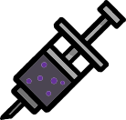
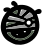

# Disorders

**Disorders** are traits similar to [Passive Abilities](/wiki/Passive_Abilities "Passive Abilities") that come with one or more ostensibly negative effects.

Cats may have up to two disorders; if a cat would gain a third, one of their disorders will be replaced instead.

Disorders often come with a so-called "silver lining" which the player can use to their advantage. Since they don't contribute to the passive ability cap, disorders represent another degree of freedom the player can utilize to build synergies.

Most of the time, disorders will remain on a cat for the rest of their life. However, they can rarely be removed through events or by spending a night in a room with a high  Health stat.

There are 126 disorders in the game.

### Curing

At the end of each day, the chance to cure disorders (if any) is equal to the room's total `Health-10`%.

- Only occurs if the cat's injury cure roll failed that night, either due to having no injuries to cure or failing the `Health`% cure chance.
- Only 1 disorder can be cured per night, per cat.

### Acquiring

- Many events can cause Disorders, either specific ones, one from a [small pool](/wiki/Disorder_Pools "Disorder Pools"), or from a pool of almost all Disorders.
- Using a [Forbidden](/wiki/Forbidden "Forbidden") spell or item.
- Inbreeding increases the likelihood of being born with a [Birth Defect Disorder](/wiki/Disorder_Pools#Birth_Defects-0 "Disorder Pools").
- Parents have a 15% chance to pass disorders down to their children via [Breeding](/wiki/Breeding "Breeding").
- At the end of each day, the chance to gain [hygiene](/wiki/Disorder_Pools#Low_Hygiene-0 "Disorder Pools") disorders is equal to the room's total negative   [Health](/wiki/Stats#In-House_Stats "Stats")%.
- Using a  [Disorder Syringe](/wiki/Ability_Syringe "Ability Syringe")   [Disorder Syringe](/wiki/Ability_Syringe "Ability Syringe") (Modifier)  Use to immediately give a cat the disorder:  obtained from the  [Organ Grinder](/wiki/Organ_Grinder "Organ Grinder") will add its disorder to a cat of the player's choosing.
- Having a [Contagious](/wiki/Contagious "Contagious") disorder spread through movement, attacking or contact.
- Non-Player [Cats](/wiki/Cats "Cats") and even destroyable objects **can** have Disorders, typically from being infected by a unit with a contagious disorder.

## Disorders

> \*\*Data table:\*\* This content is stored in the `disorders` SQLite table.
> Query with `query\_db("disorders", filters={})`.
> Columns: name, description, extra