# Mutations

[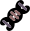](/wiki/File:UI_Mutations_Icon.svg)

** Mutations** are bodily changes that a [cat](/wiki/Cat "Cat") can acquire through various means, that can be passed down from generation to generation through [breeding](/wiki/Breeding "Breeding"). Many Mutations provide some combination of positive and negative bonuses to the player's cats, while others are strictly positive.

**Birth Defects** are a type of mutations that usually occur from a high amount of [inbreeding](/wiki/Inbreeding "Inbreeding"). These are often strictly negative, but some have positives.

There are 707 possible mutations and 53 possible birth defects.

## Acquiring

### Mutations

- Chance equal to the room's  [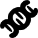](/wiki/File:UI_Mutation_Icon.svg "Mutation") [Mutation](/wiki/Stats#In-House_Stats "Stats")% as an overnight House event.
  - Up to 10  Mutation, only mutations tagged "common" (+2/-1 stat mutations) can be rolled.
  - Each  Mutation above 10 will increase the chance of rolling non-common mutations by 2.5%, guaranteed at 50  Mutation.
- Many [Events](/wiki/Events "Events") grant Mutations as a good outcome.
  - Using the Time Machine in Act 3 always adds 1 Mutation.
- Completing battles with certain effects:

  - [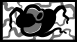](/wiki/Cancer_(Disorder) "Cancer (Disorder)") [Cancer](/wiki/Cancer_(Disorder) "Cancer (Disorder)") "Cancer (Disorder)")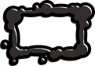 [Cancer](/wiki/Cancer_(Disorder) "Cancer (Disorder)")  At the end of each battle, lose 3 random stats permanently and gain a random mutation.
  - 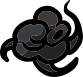 [Cancer](/wiki/Cancer_(Item) "Cancer (Item)")  "Cancer (Item)")  [Cancer](/wiki/Cancer_(Item) "Cancer (Item)") (Trinket)  At the end of each battle, gain -1 to three random stats, then gain a mutation.
  - 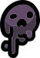 [Lil' Tumor](/wiki/Lil%27_Tumor "Lil' Tumor")   [Lil' Tumor](/wiki/Lil%27_Tumor "Lil' Tumor") (Face)  At the end of each battle, gain -1 to three random stats, then gain a mutation.
  - 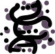 [Unstable DNA](/wiki/Unstable_DNA "Unstable DNA")   [Unstable DNA](/wiki/Unstable_DNA "Unstable DNA") (Consumable)  Use: Gain 6 random stat ups and 3 random stat downs, then gain 3 Mutations at the end of combat. , after using it.
  - 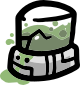 [Toxic Canister](/wiki/Toxic_Canister "Toxic Canister")   [Toxic Canister](/wiki/Toxic_Canister "Toxic Canister") (Head)  Inflict Poison 1 on all units at the start of the battle.  
    Your basic attack inflicts Poison 1.  
    Inflict Poison 1 on units that contact you. , while downed, 20% chance.
  - 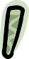 [Uranium Rod](/wiki/Uranium_Rod "Uranium Rod")   [Uranium Rod](/wiki/Uranium_Rod "Uranium Rod") (Weapon)  -6 Constitution  
    Use: A melee attack that inflicts -1 Constitution,  [Poison](/wiki/Status_Effects#Poison "Status Effects") 2 and  [Weakness](/wiki/Status_Effects#Weakness "Status Effects") 1.  
    At the end of each battle, if you are downed, gain a random mutation. , while downed.
  - [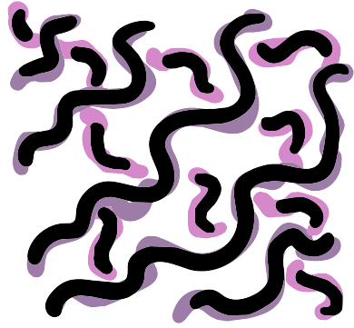](/wiki/The_Shimmer "The Shimmer") [The Shimmer](/wiki/The_Shimmer "The Shimmer") weather active.
  - [Parasite Set Bonus](/wiki/Sets#Parasite "Sets") [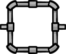](/wiki/File:UI_Set_Icon.svg)  [Parasite Set Bonus](/wiki/Sets#Parasite "Sets")  At the end of each battle, lose a random stat permanently and gain a random mutation.
  - [Radioactive Set Bonus](/wiki/Sets#Radioactive "Sets")   [Radioactive Set Bonus](/wiki/Sets#Radioactive "Sets")  Gain a random mutation at the end of each battle.  
    Explode when downed. This explosion doesn't damage you.

- Mutations of specific tags, e.g. "Animal" for 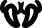 [Spider Mutation](#mouth.304)  Spider Mutation (mouth.304) Your basic attack inflicts Poison., can be obtained from certain effects:

  - Animal: [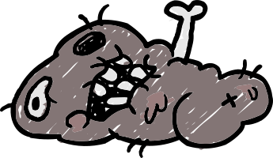](/wiki/Events#Mysterious_Creature "Events") ["Mysterious Creature" event](/wiki/Events#Mysterious_Creature "Events")
  - Bird: 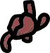 [Gizzard](/wiki/Gizzard "Gizzard")   [Gizzard](/wiki/Gizzard "Gizzard") (Consumable)  Use: Enter Mockingbird Form. Gain a random bird mutation at the end of the battle.
  - Extra: [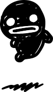](/wiki/Events#Steven_Fetus "Events") ["Steven Fetus" event](/wiki/Events#Steven_Fetus "Events")
  - Melted: [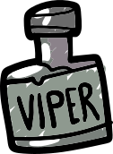](/wiki/Events#Bottle_of_Viper_Booze "Events") ["Bottle of Viper Booze" event](/wiki/Events#Bottle_of_Viper_Booze "Events") and  [Viper Bottle](/wiki/Viper_Bottle "Viper Bottle")   [Viper Bottle](/wiki/Viper_Bottle "Viper Bottle") (Consumable)  Use: Take 5 damage and gain +1 to a random stat permanently.  
    May have side effects...  (10% chance)

:   - Note: Tags serve no gameplay purpose otherwise.

### Birth Defects

- Chance scaled by a newborn kitten's [inbreeding](/wiki/Breeding#Birth-Defects "Breeding"), equal to `1.5 × inbreeding`.
- Certain [Events](/wiki/Events "Events") grant Birth Defects as a bad outcome:

  - [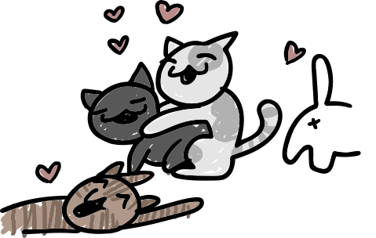](/wiki/Events#Cats_in_Heat "Events") ["Cats in Heat" event](/wiki/Events#Cats_in_Heat "Events") (The Past version)
  - [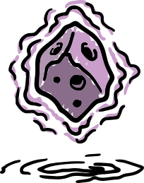](/wiki/Events#Vibrating_Meteor "Events") ["Vibrating Meteor" event](/wiki/Events#Vibrating_Meteor "Events")
  - [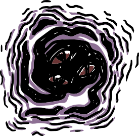](/wiki/Events#Small_Black_Hole "Events") ["Small Black Hole" event](/wiki/Events#Small_Black_Hole "Events")
  - [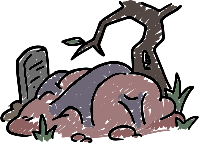](/wiki/Events#Throbbing_Artery "Events") ["Throbbing Artery" event](/wiki/Events#Throbbing_Artery "Events")
  - [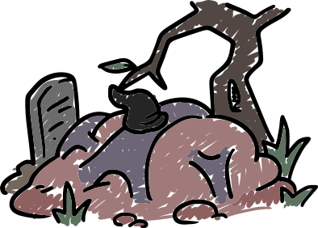](/wiki/Events#Throbbing_Artery_2 "Events") ["Throbbing Artery 2" event](/wiki/Events#Throbbing_Artery_2 "Events")

## Symmetry

Mutations are usually inherited and gained **symmetrically**, meaning left and right parts with identical mutations count as a single mutation. Because of this, most cats have up to 10 mutations for the 10 part-groups:

| Symmetric parts | Asymmetric parts |
| --- | --- |
| - Body - Head - Tail - Mouth - Fur | - Legs - Arms - Eyes - Eyebrows - Ears |

During an [adventure](/wiki/Adventure "Adventure"), cats can gain up to 15 different mutations from effects that mutate parts asymmetrically: 5 symmetric parts + 5 left parts + 5 right parts.

-  [Mutation](/wiki/Stats#In-House_Stats "Stats") stat and most adventure [events](/wiki/Events "Events") apply mutations symmetrically, but certain events can mutate asymmetrically:

  -  ["Vibrating Meteor" event](/wiki/Events#Vibrating_Meteor "Events"): Applies 3 random mutations and 3 random birth defects, all asymmetrically.
  - [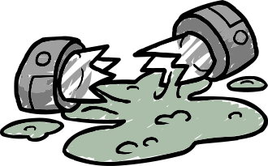](/wiki/Events#Broken_Canister "Events") ["Broken Canister" event](/wiki/Events#Broken_Canister "Events"): Mutates each eye asymmetrically.
  -  ["Small Black Hole" event](/wiki/Events#Small_Black_Hole "Events"): Mutates or removes either arm.
  -  ["Cats in Heat" event](/wiki/Events#Cats_in_Heat "Events") (Jurassic or Ice Age version): Applies 10 random birth defects asymmetrically.
  - [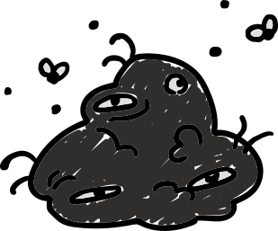](/wiki/Events#Ball_of_Cancer "Events") ["Ball of Cancer" event](/wiki/Events#Ball_of_Cancer "Events"): Removes either arm.
  - [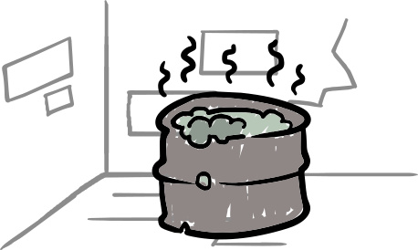](/wiki/Events#A_Vat_of_Toxic_Waste "Events") ["A Vat of Toxic Waste" event](/wiki/Events#A_Vat_of_Toxic_Waste "Events"): Can mutate a random leg or arm.

- Kittens of parents with asymmetric mutations instead inherit either side symmetrically due to the [breeding process](/wiki/Breeding#Birth-Symmetrize-Body-Parts "Breeding").

## Mutations

- Mutation appearance changes based on fur pattern and cat color. Appearances shown here are not representative of how they'll look in-game.
- Arm and Leg mutations are drawn from the same pool, referred to here as "Limbs".

> \*\*Data table:\*\* This content is stored in the `mutations` SQLite table.
> Query with `query\_db("mutations", filters={})`.
> Columns: name, description, extra (type | effects | id)

## Notes

- For changing contents of individual mutations: See each individual [grouped mutation](/wiki/Category:Mutations "Category:Mutations") page.
- All mutation names are taken from dev comments left in each mutation `.gon` file.

## Bugs

|  |  |
| --- | --- |
| [ITEM Cooties.svg](/wiki/File:ITEM_Cooties.svg)[Bug!](/wiki/Known_Bugs "Known Bugs") | mouth.301 [Hippo Teeth Mutation](#mouth.301) [mouth.301](/wiki/Mutations "mouth.301") Hippo Teeth Mutation (mouth.301) Gain 1 health when you deal damage. does not heal when dealing damage. |

## Trivia

- 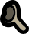 [Shrek Mutation](#ears.308)  Shrek Mutation (ears.308) **Buffs:** +1 Strength**Debuffs:** -1 [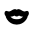](/wiki/Stats#Charisma "Charisma")Charisma resembles the ears of [Shrek](https://en.wikipedia.org/wiki/Shrek_(Character) "wikipedia:Shrek (Character)").
- 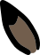 [Electric Ears Mutation](#ears.754)  Electric Ears Mutation (ears.754) Electric damage you deal is increased by 1.**Buffs:** +1 Speed resembles the ears of [Pikachu](https://bulbapedia.bulbagarden.net/wiki/Pikachu_(Pok%C3%A9mon)).
- 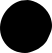 [Mouse Ears Mutation](#ears.345)  Mouse Ears Mutation (ears.345) Units that contact or attack you have a 15% chance to get Charmed. resembles the ears of  [Mickey Mouse](https://en.wikipedia.org/wiki/Mickey_Mouse "wikipedia:Mickey Mouse") .
- 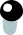 [Isaac's Eyes Mutation](#eyes.313)  Isaac's Eyes Mutation (eyes.313) Your basic attack creates water tiles.**Buffs:** +1  resembles the eyes of [Isaac](https://bindingofisaacrebirth.wiki.gg/wiki/Isaac "tboi:Isaac").
- 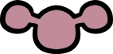 [Alien Head Mutation](#head.306)  Alien Head Mutation (head.306) **Buffs:** +1 Intelligence resembles a Carbon Dioxide molecule.
- 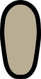 [Slender Mutation](#head.900)  Slender Mutation (head.900) +1 range. +1 reach.**Debuffs:** -1 Charisma, as well as all other mutations obtained in the [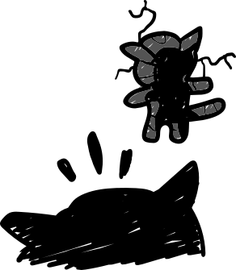](/wiki/Events#Cat-Shaped_Hole "Events") ["Cat-Shaped Hole" event](/wiki/Events#Cat-Shaped_Hole "Events") are a reference to Junji Ito’s [The Enigma of Amigara Fault.](https://junjiitomanga.fandom.com/wiki/The%20Enigma%20of%20Amigara%20Fault)
- 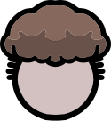 [Tyler Head Mutation](#head.753)  Tyler Head Mutation (head.753) You are immune to ice. resembles [Tyler Glaiel’s](/wiki/Tyler_Glaiel "Tyler Glaiel") head.
- 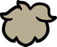 [Head Mutation](#head.424)  Head Mutation (head.424) **Buffs:** +2 Charisma**Debuffs:** -1 Constitution Is used to display fur mutations.
-  [Flesh Kid Mutation](#mouth.302)  Flesh Kid Mutation (mouth.302) +1 Health Regeneration resembles 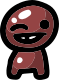 [Flesh Kid](/wiki/Flesh_Kid "Flesh Kid")   [Flesh Kid](/wiki/Flesh_Kid "Flesh Kid") (Face)  +4 Speed  
  You can't get injuries.  
  When you're downed, revive at the end of the round.  
  Your movement action is Jump. ’s mouth.
- 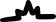 [Alien Chomp Mutation](#mouth.307)  Alien Chomp Mutation (mouth.307) Your basic attack has a 1% chance to instakill. resembles Alien Hominid's mouth.
- 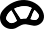 [Ash Mutation](#mouth.305)  Ash Mutation (mouth.305) +100 corpse health. resembles [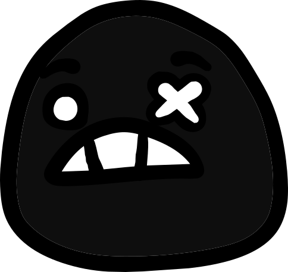](/wiki/Ash "Ash") [Ash](/wiki/Ash "Ash")'s mouth.
- 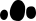 [Delirious Mutation](#mouth.303)  Delirious Mutation (mouth.303) **Buffs:** +1 Intelligence resembles [Delirium's](https://bindingofisaacrebirth.wiki.gg/wiki/Delirium "tboi:Delirium") mouth.
- 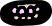 [Famine Mutation](#mouth.306)  Famine Mutation (mouth.306) 10% chance to spawn a Fly when you take damage. resembles [Famine’s](https://bindingofisaacrebirth.wiki.gg/wiki/Famine "tboi:Famine") mouth.
- 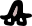 [Cleft Pallet Birth Defect](#mouth.700)  Cleft Pallet Birth Defect (mouth.700) **Debuffs:** -2 Charisma, resembles [Monstro’s](https://bindingofisaacrebirth.wiki.gg/wiki/Monstro "tboi:Monstro") mouth.
- 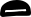 [Isaacs Mouth Mutation](#mouth.754)  Isaacs Mouth Mutation (mouth.754) Adjacent units get All Stats Down. also resembles [Isaac’s](https://bindingofisaacrebirth.wiki.gg/wiki/Isaac "tboi:Isaac") mouth.
- 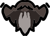 [Edmund Beard Mutation](#mouth.755)  Edmund Beard Mutation (mouth.755) Ice Immunity. resembles [Edmund’s](/wiki/Edmund_McMillen "Edmund McMillen") beard.
- 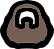 [Tylers Beard Mutation](#mouth.756)  Tylers Beard Mutation (mouth.756) **Buffs:** +1 Intelligence resembles [Tyler’s](/wiki/Tyler_Glaiel "Tyler Glaiel") beard.
- 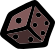 [Dice Tail Mutation](#tail.331)  Dice Tail Mutation (tail.331) You can reroll your options when you level up.**Buffs:** +1 [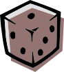](/wiki/Stats#Level_Up_Reroll "Level Up Reroll") [Level Up Reroll](/wiki/Stats#Level_Up_Reroll "Stats") resembles the [D6](https://bindingofisaacrebirth.wiki.gg/wiki/D6 "tboi:D6").
- 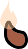 [Flame Tail Mutation](#tail.338)  Flame Tail Mutation (tail.338) Your basic attack inflicts Burn 1. resembles [Charmander’s](https://bulbapedia.bulbagarden.net/wiki/Charmander_(Pok%C3%A9mon)) tail.
- 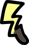 [Sonichu Tail\* Mutation](#tail.757)  Sonichu Tail\* Mutation (tail.757) Your movement action is shadowstep. also resembles [Pikachu’s](https://bulbapedia.bulbagarden.net/wiki/Pikachu_(Pok%C3%A9mon)) tail.
- 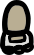 [Weapon Legs Mutation](#legs.314)  Weapon Legs Mutation (legs.314) Your weapons have +1 Damage. resembles the arms of [Heavy](https://wiki.teamfortress.com/wiki/Heavy).
- 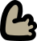 [Club Foot2 Birth Defect](#legs.705)  Club Foot2 Birth Defect (legs.705) Trample. is the only birth defect that is beneficial.

## Version History

[v1.1.21016 (Beta)](/wiki/Version_History#v1.1.21016 "Version History")

-  [Mutation](/wiki/Stats#In-House_Stats "Stats") stat will no longer reroll any existing mutations or birth defects.
-  [Mutation](/wiki/Stats#In-House_Stats "Stats") stat will now only roll mutations tagged "common" (+2/-1 stat mutations) up to 10 Mutation.
  - Each  Mutation above 10 will increase the chance of rolling mutations with effects by 2.5%.
-  [Head Mutation](#head.405)  Head Mutation (head.405) **Buffs:** +2 Strength**Debuffs:** -1 Luck,  [Limb Mutation](#legs.408)  Limb Mutation (legs.408) **Buffs:** +2 Constitution**Debuffs:** -1 Charisma, and  [Tail Mutation](#tail.410)  Tail Mutation (tail.410) **Buffs:** +2 Constitution**Debuffs:** -1 Speed's tag is replaced from "melted" to "common" and can therefore no longer roll from effects that grant "melted" mutations.
- Heads that have 1 eye/eyebrow/ear (ex.  [Cyclops](#head.704)  Cyclops (head.704) 20% miss chance. Your spells cost 1 less mana.) will no longer also count as the "Missing" birth defect for the other eye/eyebrow/ear.