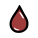

# Stats

**Stats** affect everything a [cat](/wiki/Cat "Cat") does, and can be increased throughout a cat's life. For the purposes of [breeding](/wiki/Breeding "Breeding"), only the stats a cat started with can be passed down onto their children, with the room's   [Stimulation](#In-House_Stats) stat determining whether the higher stat or the lower stat is inherited. Stray cats arriving at the house have their stats determined by the   [Appeal](#In-House_Stats) stat, with higher Appeal giving them better stats.

## Combat Stats

| Stat Name | Icon | Explanation |
| --- | --- | --- |
| Strength (Str) | [Stat Strength.svg](/wiki/File:Stat_Strength.svg) | Determines how much damage a unit deals with melee attacks. Abilities that scale with strength are usually indicated with a Active Type Melee Icon.svg Melee icon. 5 Strength is neutral. Every additional point adds 1 damage to most melee basic attacks, and every 2 additional points add 1 damage to most melee abilities, and the reverse is true with reduced points.  Affects the Strength option in events. |
| Dexterity (Dex) | [Stat Dexterity.svg](/wiki/File:Stat_Dexterity.svg) | Determines how much damage a unit will deal with ranged attacks. Abilities that scale with dexterity are usually indicated with a Active Type Ranged Icon.svg Ranged icon. 5 Dexterity is neutral. Every 2 additional points add 1 damage to *most* ranged attacks/abilities, and the reverse is true with reduced points. The formula of damage is: ⁠−52⁠ [UI Physical Damage Icon.svg](/wiki/Physical_Damage "Physical Damage").  Affects the Dexterity option in events. |
| Constitution  (Con) | [Stat Constitution.svg](/wiki/File:Stat_Constitution.svg) | Determines Max HP and post-combat regeneration. HPmax=CON⋅4, with the lowest possible value being 1 at 0 CON or lower. Affects the Constitution option in events (e.g. surviving poison, eating a really big poop). |
| Intelligence (Int) | [Stat Intelligence.svg](/wiki/File:Stat_Intelligence.svg) | How much mana an allied unit regenerates at the end of its turn. An intelligence of 0 or less will result in no mana regeneration. Negative intelligence has no unique effect in combat outside of certain skills that involve the stat in their calculation. Some skills become more powerful with low intelligence[[such as?](/wiki/Category:Articles_needing_examples "Category:Articles needing examples")]. Affects the Intelligence option in events. If a cat has 0 intelligence or less, the event text gets transformed into cavespeak[[clarify](/wiki/Category:Articles_needing_clarification "Category:Articles needing clarification")]. |
| Speed (Spd) | [Stat Speed.svg](/wiki/File:Stat_Speed.svg) | Determines how many tiles a unit can move on a turn, as well as turn order placement. See [Movement Range](#Movement_Range) & [Turn Order](#Turn_Order) for details.  Affects the Speed option in events.  For non-cat units, displayed Speed is actually their Movement Range. |
| Charisma (Cha) | [Stat Charisma.svg](/wiki/File:Stat_Charisma.svg) | How much max mana an allied unit can have, how much mana they start combat with, and how skilled they are at pairing. Maximum mana is calculated as Manamax=CHA⋅3. It's slightly more impactful on straight [UI Male Icon.svg](/wiki/Male "Male") Males than on straight [UI Female Icon.svg](/wiki/Female "Female") Females, at least with regards to breeding.  Charisma also reduces the likelihood of a cat getting into fights, if they're the initiator.  Affects the Charisma option in events. |
| Luck (Lck) | [Stat Luck.svg](/wiki/File:Stat_Luck.svg) | The primary modifier of much of the randomness within Mewgenics, as well as the main determinant behind an attack’s critical hit chance. All displayed odds in the game assume a neutral luck stat of 5. Each point away from the baseline adds a 10% chance for the game to roll an extra die when it calculates for an outcome. Extra rolls from high luck take the best result of what was rolled for that outcome, and low luck takes the worst. Additional dice stack at higher magnitudes (i.e. +1 roll at -5 and 15 luck, +2 at -15 and 25, etc).  The base critical hit chance with 5 luck is 10%, and each additional point of luck adds 2% to crit chance before extra rolls are applied.  Affects quality of items in shops and post-battle rewards.  Affects the Luck option in events. Also affects the outcome of events even if luck is not directly tested.  For a cat with [Luck](/wiki/Stats#Luck "Luck") [Luck](#Luck) L, the chance of success S is given by the following formula:  S={L≥5:1−fn(1−as)L<5:sn(1−af)  where:   - s is the base probability of success before [Luck](/wiki/Stats#Luck "Luck") [Luck](#Luck) is factored in. - f=1−s. - a=k−⌊k⌋, where k=|L−510|. - n=1+⌊k⌋.  ---   Luck calculator:  0.9 0 1 0 [Luck](/wiki/Stats#Luck "Luck") [Luck](#Luck) 5  Chance% 10  Bad outcome? 0  True chance: 10% |

Each of a cat's base stats will be between 3 and 7. [Stray cats](/wiki/Stray_cats "Stray cats") with a 3 or 7 stat will be less common if the [House](/wiki/House "House") has low   [Appeal](#In-House_Stats).

A stat of 5 is considered the baseline for most [skill checks](/wiki/Events "Events"), with a 50/50 chance of a good or bad outcome. There is a separate base 15% chance of getting a more extreme result.

- There may be other factors at play (i.e. Luck or [Difficulty](/wiki/Difficulty "Difficulty")). See [Events § Outcomes](/wiki/Events#Outcomes "Events") for more information.
- Value of a stat can never exceed the integer overflow mark of a 32-bit integer at 2.147 Billion.

### Derived Stats

| Stat Name | Icon | Explanation |
| --- | --- | --- |
| Health (HP) | [Stat Health.svg](/wiki/File:Stat_Health.svg)   [Stat Health Gain.svg](/wiki/File:Stat_Health_Gain.svg) | Health is a measure of how much damage a unit or object can receive until it is downed or destroyed.  - When a unit drops to 0% of their maximum Health, they are usually downed (or otherwise defeated). In most cases, this causes them to lose their turn and lose all [Status Effects](/wiki/Status_Effects "Status Effects") (besides [STATUS Rot Icon.svg](/wiki/Status_Effects#Rot "Status Effects") [Rot](/wiki/Status_Effects#Rot "Status Effects")). A downed unit cannot regain Health from [UI Heal Icon.svg](/wiki/Heal "Heal") healing (nor [UI Shield Icon.svg](/wiki/Shield "Shield") Shield and [UI Holy Shield Icon.svg](/wiki/Holy_Shield "Holy Shield") Holy Shield) unless revived. - Health is replaced by Corpse Health on downed units. - There are certain exceptions to a unit or object being downed:   - Many [Objects](/wiki/Objects "Objects"), [Enemies](/wiki/Enemies "Enemies") and some [Familiars](/wiki/Familiars "Familiars") have 0 Corpse Health and are destroyed (or activate their unique on-death ability) upon being reduced to 0% health.   - Downing a non-allied cat with a hit that reduces them to -100% of their maximum health causes them to be destroyed.   - Certain abilities and items (i.e. ENEMY Daddy Shark Icon.svg [Daddy Shark's](/wiki/Daddy_Shark "Daddy Shark")[ENEMY Daddy Shark Icon.svg](/wiki/Daddy_Shark "Daddy Shark") [Daddy Shark](/wiki/Daddy_Shark "Daddy Shark") Will instantly kill anything it can reach! Gains bonus turns for each bleeding unit. Focuses on bleeding units. attack and ITEM Throbbing Gristle.svg [Throbbing Gristle](/wiki/Throbbing_Gristle "Throbbing Gristle") [ITEM Throbbing Gristle.svg](/wiki/Throbbing_Gristle "Throbbing Gristle")  [Throbbing Gristle](/wiki/Throbbing_Gristle "Throbbing Gristle") (Weapon)  Take it to the Wall of Flesh in the Caves. All units die when they get downed. Use: A melee attack that turns things it kills into Meat. ) can cause the unit to be destroyed, sometimes bypassing Health entirely.   - Downing a unit that is [STATUS Infested Icon.svg](/wiki/Status_Effects#Infested "Status Effects") [Infested](/wiki/Status_Effects#Infested "Status Effects") causes them to be destroyed (and spawns a unit responsible for the infestation in its place).   Battles end when all enemy units are downed or destroyed. When this happens, allied cats will typically be revived and [UI Heal Icon.svg](/wiki/Heal "Heal") Heal for an amount of HP equal to their [Constitution](/wiki/Stats#Constitution "Constitution") [Constitution](#Constitution); but certain factors can reduce it by one or two points or even nullify it.  Outside of battle, cats' Health can never be lower than 1. Outside of specific events that kill cats, if an [Event](/wiki/Event "Event") would reduce a cat's Health to zero, it is reduced to 1 instead. |
| Mana | [Stat Mana.svg](/wiki/File:Stat_Mana.svg)   [Stat Mana Gain.svg](/wiki/File:Stat_Mana_Gain.svg) | Mana is required for using most active abilities, known in-game as *spells*. It is never necessary for any unit's primary action, known as their *basic attack* or *basic action*. Cats start each battle with an amount of Mana equal to their [Charisma](/wiki/Stats#Charisma "Charisma") [Charisma](#Charisma). At the end of each turn, they gain an amount equal to their [Intelligence](/wiki/Stats#Intelligence "Intelligence") [Intelligence](#Intelligence).  Downed cats still have and gain Mana; but most of them don't have abilities that can be used while downed, so they skip their turns automatically. |
| Damage | [Stat Damage.svg](/wiki/File:Stat_Damage.svg) | Damage dealt by a unit. Damage shown on enemies is derived from their basic attack, post-scaling from other stats. It will not change the icon depending on if it is Magic Damage or Healing.  Damage for the player is shown on spells, not cats themselves.   - **Physical Damage**: [UI Physical Damage Icon.svg](/wiki/Physical_Damage "Physical Damage") [UI Physical Magic Damage Icon.svg](/wiki/Physical_Magic_Damage "Physical Magic Damage") [UI Physical Heal Icon.svg](/wiki/Physical_Heal "Physical Heal")   - Affected by [STATUS Bruise Icon.svg](/wiki/Status_Effects#Bruise "Status Effects") [Bruise](/wiki/Status_Effects#Bruise "Status Effects"), [STATUS Marked Icon.svg](/wiki/Status_Effects#Marked "Status Effects") [Marked](/wiki/Status_Effects#Marked "Status Effects").   - Can crit.   - Can backstab.  - **Magic Damage**: [UI Magic Damage Icon.svg](/wiki/Magic_Damage "Magic Damage") [UI Physical Magic Damage Icon.svg](/wiki/Physical_Magic_Damage "Physical Magic Damage") [UI Magic Heal Icon.svg](/wiki/Magic_Heal "Magic Heal")   - Affected by [STATUS Magic Weakness Icon.svg](/wiki/Status_Effects#Magic_Weakness "Status Effects") [Magic Weakness](/wiki/Status_Effects#Magic_Weakness "Status Effects"), [STATUS Magic Damage Up Icon.svg](/wiki/Status_Effects#Magic_Damage_Up "Status Effects") [Magic Damage Up](/wiki/Status_Effects#Magic_Damage_Up "Status Effects").  - [UI Physical Magic Damage Icon.svg](/wiki/Physical_Magic_Damage "Physical Magic Damage") Physical Magic Damage gains the benefits of both, physical and magic damage.  - Some sources of damage are neither Physical nor Magical.   - [UI Knockback Damage Icon.svg](/wiki/Knockback_Damage "Knockback Damage") [Knockback Damage](/wiki/Knockback_Damage "Knockback Damage") [STATUS Thorns Icon.svg](/wiki/Status_Effects#Thorns "Status Effects") [Thorns](/wiki/Status_Effects#Thorns "Status Effects"), damage-over-time debuffs, environmental damage. - **Heal**: [UI Heal Icon.svg](/wiki/Heal "Heal") [UI Physical Heal Icon.svg](/wiki/Physical_Heal "Physical Heal") [UI Magic Heal Icon.svg](/wiki/Magic_Heal "Magic Heal")   - Healing can be Physical or Magical, which is **not** shown in it's icon.     - Healing from [ABILITY Slop the Pigs.svg](/wiki/Slop_the_Pigs "Slop the Pigs") [Slop the Pigs](/wiki/Slop_the_Pigs "Slop the Pigs") [ABILITY Slop the Pigs.svg](/wiki/Slop_the_Pigs "Slop the Pigs")  Hunter [Slop the Pigs](/wiki/Slop_the_Pigs "Slop the Pigs")  Each familiar in an area gains All Stats Up and heals 4 HP. Other units in the area gain +1 [Constitution](/wiki/Stats#Constitution "Constitution")Constitution and heal 2 HP.  is physical, and can crit naturally or with [STATUS Marked Icon.svg](/wiki/Status_Effects#Marked "Status Effects") [Marked](/wiki/Status_Effects#Marked "Status Effects")       - Backstabs and [STATUS Bruise Icon.svg](/wiki/Status_Effects#Bruise "Status Effects") [Bruise](/wiki/Status_Effects#Bruise "Status Effects") do not increase healing.     - Healing from [ABILITY Melee Attack - Heal.svg](/wiki/Melee_Attack_-_Heal "Melee Attack - Heal") [Melee Attack / Heal](/wiki/Melee_Attack_-_Heal "Melee Attack - Heal") [ABILITY Melee Attack - Heal.svg](/wiki/Melee_Attack_-_Heal "Melee Attack - Heal")  Cleric [Melee Attack / Heal](/wiki/Melee_Attack_-_Heal "Melee Attack - Heal")  Heals allies but damages enemies.  is magical, being increased by both magic status effects.   - Decreased by 1 while affected by [STATUS Poison Icon.svg](/wiki/Status_Effects#Poison "Status Effects") [Poison](/wiki/Status_Effects#Poison "Status Effects") and [STATUS Heat Wave Icon.svg](/wiki/Status_Effects#Heat_Wave "Status Effects") [Heat Wave](/wiki/Status_Effects#Heat_Wave "Status Effects").   - Healing a undead unit results in it taking an equal amount of Magic damage instead.   - Physical & Magic Heal icons are not representative of their heal type, instead representing the conditional damage they deal to enemies. |
| Movement Range | [Stat Movement Range.svg](/wiki/File:Stat_Movement_Range.svg) | Range in tiles that a unit can move. Typically equal to a unit's speed, with a minimum of 1.   - Formula: ⁠max[1,base\_movement+trunc(−52)]+BonusMovement⁠.   - For every 2 [Speed](/wiki/Stats#Speed "Speed") [Speed](#Speed) away from 5, gain / lose 1 movement range.   - `base_movement` for cats is 4. - Movement range can be modified with abilities and effects like [ABILITY One With the Wind.svg](/wiki/One_With_the_Wind "One With the Wind") [One With the Wind](/wiki/One_With_the_Wind "One With the Wind") [ABILITY One With the Wind.svg](/wiki/One_With_the_Wind "One With the Wind")  Monk [One With the Wind](/wiki/One_With_the_Wind "One With the Wind")  Gain +20 Movement Range until the end of the turn.  and [WEATHER Low Gravity.png](/wiki/Low_Gravity "Low Gravity") [Low Gravity](/wiki/Low_Gravity "Low Gravity"). - Many enemies have set Movement range. - Can be shown when right clicking on enemies or when clicking the move action on cats. |
| Initiative a.k.a. Turn Order | No Icon | Equal to twice the [Speed](/wiki/Stats#Speed "Speed") [Speed](#Speed) in most cases. Determines turn order in [Battle](/wiki/Battle "Battle").  - Many enemies have set initiative to guarantee they'll go at the beginning or the end of the round. - Exact formula: `Initiative = base_initiative + ⁠2×⁠` |
| Crit Chance | No Icon | Chance to deal [Critical](/wiki/Critical "Critical") damage. Crit Chance from items, passives & disorder will always appear as the status effect.  Certain attacks have a innate crit chance, in which case it is added additively to the units crit chance, instead of being a seperate roll.  Critical strike chance is calculated as follows:  `⁠max[0,base_crit_chance+2×]+⁠STATUS Crit Chance Up Icon.svg Crit Chance Up`  Negative luck will not reduce crit chance, below 0 for other calculations.  Only Player cats (or derived from Player Cats), ENEMY Druid's Crow Icon.svg [Druid's Crow](/wiki/Druid%27s_Crow "Druid's Crow")[ENEMY Druid's Crow Icon.svg](/wiki/Druid%27s_Crow "Druid's Crow") [Druid's Crow](/wiki/Druid%27s_Crow "Druid's Crow") Inherits its owner's stats. Basic attack modifiers on its owner also get applied to the Crow. Flying., MINIBOSS Arthur Icon.svg [Arthur](/wiki/Arthur "Arthur")[MINIBOSS Arthur Icon.svg](/wiki/Arthur "Arthur") [Arthur](/wiki/Arthur "Arthur") Who knows what he will do!? & MINIBOSS Trampy Icon.svg [Trampy](/wiki/Trampy "Trampy")[MINIBOSS Trampy Icon.svg](/wiki/Trampy "Trampy") [Trampy](/wiki/Trampy "Trampy") Does a series of seemingly random things, but not in a random order! Drunk. can randomly crit.  `base_crit_chance` is 0 for units that are allowed to randomly crit and -999 for others. |

Derived stats use a 32-bit integer for values and can reach integer overflow unlike base stats due to their appropriate multipliers, such as vitality or charisma. In that case, max HP or max mana will be 1 or 0.

### Others

| Stat Name | Icon | Explanation |
| --- | --- | --- |
| Shield | [Stat Shield.svg](/wiki/File:Stat_Shield.svg)   [Stat Shield Gain.svg](/wiki/File:Stat_Shield_Gain.svg) | **Shield** functions as temporary [Health](/wiki/Stats#Health "Health") [Health](#Health) attached to the front of one's "health bar". Unused Shield goes away at the end of each battle. Most damage affects Shield before Health, allowing it to block damage that would otherwise transition between fights.  Notable exceptions are:   - [STATUS Bleed Icon.svg](/wiki/Status_Effects#Bleed "Status Effects") [Bleed](/wiki/Status_Effects#Bleed "Status Effects") - [STATUS Poison Icon.svg](/wiki/Status_Effects#Poison "Status Effects") [Poison](/wiki/Status_Effects#Poison "Status Effects")   Any passive effect that provides Shield does so at the start of each battle. |
| Holy Shield | [Stat Holy Shield.svg](/wiki/File:Stat_Holy_Shield.svg)   [Stat Holy Shield Gain.svg](/wiki/File:Stat_Holy_Shield_Gain.svg) | **Holy Shield** functions as protection against hits, blocking full instances of damage. Unused Holy Shields go away at the end of each battle. Attacks that bypass Shield also bypass Holy Shield.  Any passive effect that provides Holy Shield does so at the start of each battle. |
| Corpse Health | [Stat Corpse Health.svg](/wiki/File:Stat_Corpse_Health.svg) | **Corpse Health** also known as **Corpse HP**, is the amount of hits a downed unit takes before being destroyed and killed *permanently*. Each instance of added [UI Heal Icon.svg](/wiki/Heal "Heal") healing, [UI Shield Icon.svg](/wiki/Shield "Shield") Shield or [UI Holy Shield Icon.svg](/wiki/Holy_Shield "Holy Shield") Holy Shield increases Corpse Health by 1, regardless of amount of healing.  Allied cats have a base value of 3, while enemies can range from 0 to 5.  If a unit's Corpse Health is reduced to 0, their body will be destroyed immediately.  Non-Player units will not leave a corpse if dealing damage equal to or higher than their current health + max health. |
| Level Up Reroll | [Stat Level Up Reroll.svg](/wiki/File:Stat_Level_Up_Reroll.svg) | **Level Up Rerolls** allow a cat to reroll its level up options, regardless of Stats, Passives or Active abilities. |

Units still require  [Health](#Health) (at least more than 0% of their max HP) to avoid death or being downed. This is relevant because  [Poison](/wiki/Status_Effects#Poison "Status Effects"),  [Bleed](/wiki/Status_Effects#Bleed "Status Effects"),  [Burn](/wiki/Status_Effects#Burn "Status Effects"), and piercing attacks bypass both types of Shields.

#### No Icons

| Stat Name | Explanation |
| --- | --- |
| Dodge Chance | Chance for incoming attacks that deal damage to miss.  [STATUS Dodge Chance Icon.svg](/wiki/Status_Effects#Dodge_Chance "Status Effects") [Dodge Chance](/wiki/Status_Effects#Dodge_Chance "Status Effects"), the status effect represent 1 chance to dodge.  While all item and passive that grant "hidden" dodge chance, are independent chances.  They are not summed up together with each other or the status effect.  Making 25% *hidden* dodge chance, multiplied 4x, not 100% dodge chance.  While 100% [STATUS Dodge Chance Icon.svg](/wiki/Status_Effects#Dodge_Chance "Status Effects") [Dodge Chance](/wiki/Status_Effects#Dodge_Chance "Status Effects"), will make all attacks that can miss, miss. |
| Reach | Increases how far a unit's melee actions can hit. |
| Range | Increases how far a unit's ranged actions can be cast. |
| Area | Increases how many tiles are targeted by area-of-effect actions. |
| Mana Regen | Increases mana gained on turn end, similar to [Intelligence](/wiki/Stats#Intelligence "Intelligence") [Intelligence](#Intelligence). |

## In-House Stats

Stats that are more prominent or exclusively used in the [House](/wiki/House "House") part of the game.

### Room Stats

- Stats affected by [Furniture](/wiki/Furniture "Furniture"), Overcrowding & Dead Bodies.

| Name | Icon | Description |
| --- | --- | --- |
| Appeal | [UI Appeal Icon.svg](/wiki/File:UI_Appeal_Icon.svg) | Increases the stat quality and ability diversity of new strays.  This applies to the entire house, not just to a single room.  *See [Stray Cats](/wiki/Stray_Cats "Stray Cats") for more info.* |
| Comfort | [UI Comfort Icon.svg](/wiki/File:UI_Comfort_Icon.svg) | If it's **high**, it increases the odds of breeding overnight.  If it's **low**, it increases the odds of fighting overnight.  *See [Breeding](/wiki/Breeding "Breeding") and [Fighting](/wiki/Fighting "Fighting") for more info.*  Comfort is lowered by 1 for each cat in a room above 4. |
| Stimulation | [UI Stimulation Icon.svg](/wiki/File:UI_Stimulation_Icon.svg) | If it's **high**, kittens will inherit more and better things from their parents.  If it's **low**, kittens have a lower chance of inheriting anything.  *See [Breeding](/wiki/Breeding "Breeding") for more info.* |
| Health | [UI Health Icon.svg](/wiki/File:UI_Health_Icon.svg) | If it's **high**:   - Cats take longer to become old and are less likely to die of old age. - Cats have a chance of recovering from Injuries and Disorders overnight.   If it's **low**:   - Cats become old sooner. - Cats have a chance of developing [hygiene disorders](https://mewgenics.wiki.gg/wiki/Disorder_Pools#Low_Hygiene-0) overnight.   *See [Age](#Age), [Injuries](/wiki/Injuries "Injuries") and [Disorders](/wiki/Disorders "Disorders") for more info.* |
| Mutation | [UI Mutation Icon.svg](/wiki/File:UI_Mutation_Icon.svg) | Increases the chance for cats to develop Mutations overnight.  *See [Mutations](/wiki/Mutations "Mutations") for more info.*  *Also known as Evolution internally* |

### Breeding & Living

The following are primarily important in the [House](/wiki/House "House") & [Breeding](/wiki/Breeding "Breeding") section of the game.

| Stat | | Explanation |
| --- | --- | --- |
| Age | | Each new in-game Day, all living cats age by 1.  - All [strays](/wiki/Strays "Strays") encountered start at an age of 2. - Cats with an age of 1 are Kittens. - Cats above age 2 are young adults and can be used for [breeding](/wiki/Breeding "Breeding"), [fighting](/wiki/Fighting "Fighting") other cats, [adventures](/wiki/Adventures "Adventures"), and defending against [House Bosses](/wiki/House_Bosses "House Bosses"). - Cats above age 5 can be sent to [NPC Tracy Icon.svg](/wiki/Tracy "Tracy") [Tracy](/wiki/Tracy "Tracy").   Cats can have their age reverted to 1 by the [EVENTS Fountain.svg](/wiki/Events#Fountain "Events") ["Fountain" event](/wiki/Events#Fountain "Events"), or triggering ITEM Cat Rib.svg [Cat Rib](/wiki/Cat_Rib "Cat Rib") [ITEM Cat Rib.svg](/wiki/Cat_Rib "Cat Rib")  [Cat Rib](/wiki/Cat_Rib "Cat Rib") (Trinket)  When your body is destroyed, you are reborn as a kitten! , or permanently while having [DISORDER Eternal Youth.svg](/wiki/Eternal_Youth "Eternal Youth") [Eternal Youth](/wiki/Eternal_Youth "Eternal Youth")[DISORDER Eternal Youth.svg](/wiki/Eternal_Youth "Eternal Youth")Disorder Frame.svg [Eternal Youth](/wiki/Eternal_Youth "Eternal Youth")  You are a kitten... forever! +1 [Comfort](/wiki/File:UI_Comfort_Icon.svg "Comfort") , +1 [Stimulation](/wiki/File:UI_Stimulation_Icon.svg "Stimulation") , +1 [Appeal](/wiki/File:UI_Appeal_Icon.svg "Appeal")   [disorder](/wiki/Disorder "Disorder") (until the disorder is cured).   - This does not reset their hidden aging progress, meaning they may directly become adults and grow old again sooner than expected.   A low [UI Health Icon.svg](/wiki/Health "Health") Health stat causes cats become old sooner, while high [UI Health Icon.svg](/wiki/Health "Health") Health increases their average lifespan.   - Young adults must become adults before they can become [UI Old Icon.svg](/wiki/File:UI_Old_Icon.svg) Old. This occurs at a [UI Health Icon.svg](/wiki/Health "Health") Health-based age threshold, as early as age 5 ([UI Health Icon.svg](/wiki/Health "Health") ≤-568) and as late as age 35. - Adult cats have a further chance of becoming [UI Old Icon.svg](/wiki/File:UI_Old_Icon.svg) Old each night, between `6%` to `16%`. - Cats cannot become old the same night they become an adult. - Aging benefits are effectively maximized at 55 [UI Health Icon.svg](/wiki/Health "Health") Health.  ---   Aging calculator:  18 18.0118 0 1  [UI Health Icon.svg](/wiki/Health "Health") Health 0  18.0118 Adult age threshold: `18.0118 (19)` ⁠20+15tanh⁡((−4)/30)⁠  Chance to become Old: `11%` ⁠11−5tanh⁡(/10)⁠  Chance to die of old age: `16.5%` ⁠16.5−5tanh⁡(/10)⁠ |
| Kitten | [UI Kitten Icon.svg](/wiki/File:UI_Kitten_Icon.svg) | Cats with an Age of 1 are Kittens. Kittens cannot be used to go on [adventures](/wiki/Adventure "Adventure") or defend against [House Bosses](/wiki/House_Boss "House Boss").  Kittens can be sent to [NPC Tink Icon.svg](/wiki/Tink "Tink") [Tink](/wiki/Tink "Tink").  Kittens become adults if their age is increased to 2, which usually happens after 1 in-game day.  Kittens have -2 to each stat while they are on adventures, cannot level up, and will not become retired upon returning home. |
| Old | [UI Old Icon.svg](/wiki/File:UI_Old_Icon.svg) | An old cat's lifespan varies depending on which room they live in and random chance. Old cats have a chance to die of old age as an overnight event, which cannot happen on the same night they get old.  Depending on the room's [UI Health Icon.svg](/wiki/Health "Health") Health stat, this chance can be as low as `11.5%` and as high as `21.5%`.  Old cats become [STATUS Exhaustion Icon.svg](/wiki/Status_Effects#Exhaustion "Status Effects") [exhausted](/wiki/Status_Effects#Exhaustion "Status Effects") starting at Round 5, instead of Round 10.  This *can* be beneficial due to [STATUS Adrenaline Icon.svg](/wiki/Status_Effects#Adrenaline "Status Effects") [Adrenaline](/wiki/Status_Effects#Adrenaline "Status Effects") |
| [Hunger](/wiki/Hunger "Hunger") | [UI Hungry Icon.svg](/wiki/File:UI_Hungry_Icon.svg) | When passing the day, each cat will consume 1 unit of food, unless the cat is [DISORDER Vegan.svg](/wiki/Vegan "Vegan") [Vegan](/wiki/Vegan "Vegan")[DISORDER Vegan.svg](/wiki/Vegan "Vegan")Disorder Frame.svg [Vegan](/wiki/Vegan "Vegan")  You don't eat meat. , has the [No Mouth Birth Defect](/wiki/Mutations#mouth.-2 "Mutations") [mouth.-2](/wiki/Mutations "mouth.-2") [No Mouth Birth Defect](/wiki/Mutations "Mutations") (mouth.-2) Can't eat food, use consumables, or use musical abilities. or mouth.328 [Bandage Mouth Mutation](/wiki/Mutations#mouth.328 "Mutations") [mouth.328](/wiki/Mutations "mouth.328") [Bandage Mouth Mutation](/wiki/Mutations "Mutations") (mouth.328) Can't eat food, use consumables, or use musical abilities. +2 Health Regeneration.  If the player has less food available than there are cats, some of the cats will become hungry.  Hungry cats suffer -1 to all stats and have a chance to cannibalize corpses, eat poop or die if left without food for another night. They will also be more aggressive and have a higher chance of [fighting](/wiki/Fighting#Hostility "Fighting").  Once fed, stats and chance of death return to normal. |
| Retired | [UI Retired Icon.svg](/wiki/File:UI_Retired_Icon.svg)  [UI Super Retired Icon.svg](/wiki/File:UI_Super_Retired_Icon.svg) | Cats become Retired upon finishing an [adventure](/wiki/Adventure "Adventure"), as long as they did not turn into a Kitten during it.  Retired cats cannot be used to go onto another adventure, and can be sent to [NPC Frank Icon.svg](/wiki/Frank "Frank") [Frank](/wiki/Frank "Frank").  Depending on the adventure, [NPC Butch Icon.svg](/wiki/Butch "Butch") [Butch](/wiki/Butch "Butch") will also accept them.  Retired Cats wear a Crown, with the size depending Chapter and color on Act beaten.  Cats become "Super Retired" upon defeating a [House Boss](/wiki/House_Boss "House Boss"), regardless of if they were "regular" retired.  Super Retired cats cannot be used for another House Boss or adventure, and gain a red flame effect over their crown. |
| Sex a.k.a. Gender | [UI Male Icon.svg](/wiki/File:UI_Male_Icon.svg) Male  [UI Female Icon.svg](/wiki/File:UI_Female_Icon.svg) Female  [UI Neutral Gender Icon.svg](/wiki/File:UI_Neutral_Gender_Icon.svg) Neutral | Gender determines which partners a cat wants to [breed](/wiki/Breed "Breed") with, and whether offspring can be produced. Any cat can initiate breeding regardless of their gender. In male-female pairings, the male is treated as the initiator when determining the outcome. In other pairings, such as those with [UI Neutral Gender Icon.svg](/wiki/Neutral_Gender "Neutral Gender") Neutral Gender cats, either one is equally likely to be the initiator.  Male-male and female-female pairings will not produce offspring. [UI Neutral Gender Icon.svg](/wiki/Neutral_Gender "Neutral Gender") Neutral Gender cats can produce offspring with both [UI Male Icon.svg](/wiki/Male "Male") Male and [UI Female Icon.svg](/wiki/Female "Female") Female cats.  Only 10% of cats are born as [UI Neutral Gender Icon.svg](/wiki/Neutral_Gender "Neutral Gender") Neutral Gender.  ([UI Neutral Gender Icon.svg](/wiki/Neutral_Gender "Neutral Gender") Neutral Gender is referred to as Neutral in files & has been *inconsistently* referred to as Non-Binary & Ditto Gender by the developers) |
| [Sexuality](/wiki/Breeding#Sexuality "Breeding") (Gayness) | [UI Gay Icon.svg](/wiki/File:UI_Gay_Icon.svg) Gay  [UI Bi Icon.svg](/wiki/File:UI_Bi_Icon.svg) Bi | A cat's Gayness is a percentage that affects how [compatible](/wiki/Breeding#Compatibility "Breeding") it is for breeding/rejecting fighting with other cats based on their genders.  - [UI Neutral Gender Icon.svg](/wiki/Neutral_Gender "Neutral Gender") Neutral Gender cats ignore gayness entirely regardless if they're the initiator or target, making them highly compatible with all cats. - In general, gayness affects how likely a male or female cat will *reject* breeding with a cat of the opposite sex (male or female). - Ending a day with multiple cats having same-sex breeding increases the chances of [Gay Strays](/wiki/Gay_Stray "Gay Stray") appearing.   Besides gay strays, all other cats' sexuality follows a distribution:   - `81.9%` are Straight. - `7.2%` are Bisexual. - `10.9%` are Gay.   [Pride flags](https://en.wikipedia.org/wiki/Pride_flag) are used as indicators.  The "Gaydar" (Gayness indicator) is unlocked by getting [NPC Tink Icon.svg](/wiki/Tink "Tink") [Mr. Tinkles](/wiki/Tink "Tink") to Favor level 4. |
| [Inbredness](/wiki/Breeding#Inbreeding "Breeding") | [UI Not Inbred Icon.svg](/wiki/File:UI_Not_Inbred_Icon.svg) Normal  [UI Slightly Inbred Icon.svg](/wiki/File:UI_Slightly_Inbred_Icon.svg)  >10%  [UI Moderately Inbred Icon.svg](/wiki/File:UI_Moderately_Inbred_Icon.svg)  >25%  [UI Highly Inbred Icon.svg](/wiki/File:UI_Highly_Inbred_Icon.svg)  >50%  [UI Extremely Inbred Icon.svg](/wiki/File:UI_Extremely_Inbred_Icon.svg)  >80% | When a cat is born, their Inbredness determines if they develop Birth Defects.  - A cat has to be *at least* 5% Inbred to develop [Birth Defects](/wiki/Birth_Defect "Birth Defect"), which function similar to [Mutations](/wiki/Mutations "Mutations") with mostly-negative effects. - All cats have a base 2% chance to be born with not-inherited birth defect [disorders](/wiki/Disorder "Disorder"), such as [DISORDER Autism.svg](/wiki/Autism "Autism") [Autism](/wiki/Autism "Autism")[DISORDER Autism.svg](/wiki/Autism "Autism")Disorder Frame.svg [Autism](/wiki/Autism "Autism")  +2 [Intelligence](/wiki/Stats#Intelligence "Intelligence")Intelligence, -2 [Charisma](/wiki/Stats#Charisma "Charisma")Charisma The abilities you were born with cost 2 less mana. Your other spells cost 1 more mana. . However, the chance increases linearly up to 32% for cats who are 100% Inbred, at a rate of 0.4% per inbredness.   Inbreeding between relatives compounds on both parents' inbred scores, along with any shared ancestry.  Strays are never inbred, and always have kittens who are [UI Not Inbred Icon.svg](/wiki/File:UI_Not_Inbred_Icon.svg) not Inbred due to not sharing ancestry with any other cats.  Inbredness indicators are unlocked by getting [NPC Tink Icon.svg](/wiki/Tink "Tink") [Mr. Tinkles](/wiki/Tink "Tink") to Favor level 3.  This comes with a Family Tree option, which displays a cat's five previous generations. This is useful for manually calculating inbreeding, as distant relatives effect to a kitten's inbreeding score decrease exponentially the further the relationship is. |
| [Libido](/wiki/Breeding#Libido "Breeding") | [UI High Libido Icon.svg](/wiki/File:UI_High_Libido_Icon.svg)  >70%  [UI Average Libido Icon.svg](/wiki/File:UI_Average_Libido_Icon.svg) Normal  [UI Low Libido Icon.svg](/wiki/File:UI_Low_Libido_Icon.svg)  <30% | Libido impacts how likely a cat is to **accept** [breeding](/wiki/Breeding "Breeding") and **skip out on** [fighting](/wiki/Fighting "Fighting"). It scales from 0% to 100%, and acts as a multiplier of **the other cat's** [Charisma](/wiki/Stats#Charisma "Charisma") [Charisma](#Charisma).  It's slightly more impactful on straight [UI Female Icon.svg](/wiki/Female "Female") Females than on straight [UI Male Icon.svg](/wiki/Male "Male") Males, at least with regards to breeding.  Libido indicators are unlocked by getting [NPC Tink Icon.svg](/wiki/Tink "Tink") [Mr. Tinkles](/wiki/Tink "Tink") to Favor level 4. |
| [Aggression](/wiki/Fighting#Hostility "Fighting") | [UI Low Aggression Icon.svg](/wiki/File:UI_Low_Aggression_Icon.svg)  <30%  [UI Average Aggression Icon.svg](/wiki/File:UI_Average_Aggression_Icon.svg) Normal  [UI High Aggression Icon.svg](/wiki/File:UI_High_Aggression_Icon.svg)  >70% | Aggression impacts the chance for a cat to initiate [cat-fights](/wiki/Fighting "Fighting"). It's not the only factor in if a fight occurs; virtually every stat that encourages breeding will discourage fighting, and vice-versa.  It has no effect on the *outcome* of the fight. Victory depends on [Strength](/wiki/Stats#Strength "Strength") [Strength](#Strength) and [Luck](/wiki/Stats#Luck "Luck") [Luck](#Luck); survival depends on [Constitution](/wiki/Stats#Constitution "Constitution") [Constitution](#Constitution), though [Strength](/wiki/Stats#Strength "Strength") [Strength](#Strength) and [Luck](/wiki/Stats#Luck "Luck") [Luck](#Luck) also help.  Aggression indicator is unlocked by getting [NPC Tink Icon.svg](/wiki/Tink "Tink") [Mr. Tinkles](/wiki/Tink "Tink") to Favor level 6. |
| Relationships | | Cats can form one "love" relationship, and one "hate" relationship. Their "love" never changes, but their "hate" can.   - If a cat is chosen to breed, they will more likely try to breed with the cat they love.   - When a cat is propositioned, they will be less likely to accept breeding with a cat they *don't* love. - If a cat is chosen to fight, they will more likely try to fight with the cat they hate.   - [UI Comfort Icon.svg](/wiki/Comfort "Comfort") Comfort over 13 has no extra effect on stopping fights between haters.   - Cats with rivals are less likely to fight cats who *aren't* their rivals, even if those rivals aren't present.   Love/hate relationships don't necessarily have to be reciprocated. In fact, a cat may love another cat that hates it.  They are values that build up through repeated breeding/fighting (or just breeding for love), up to a maximum of 1.  Relationship indicators are unlocked by getting [NPC Tink Icon.svg](/wiki/Tink "Tink") [Mr. Tinkles](/wiki/Tink "Tink") to Favor level 7. |

## Injuries

Injuries are permanent stat decreases applied to a cat whenever they are downed or from other unique events such as [Cat Fights](/wiki/Fighting "Fighting") in the [House](/wiki/House "House"). Some effects can also heal injuries, provide immunity to some or all injuries, force all injuries to convert to a specific type, or trigger unique bonuses based on possessed injuries.

At the end of each day, the chance to cure injuries (if any) is equal to the room's total   [Health](#In-House_Stats)%.

### Basic Injuries

These injuries are applied by any event that chooses a "random" injury, such as death, but can also be chosen non-randomly from certain events.

| Icon | Name | Stats | Notes |
| --- | --- | --- | --- |
| [STATUS Broken Paw Icon.svg](/wiki/File:STATUS_Broken_Paw_Icon.svg) | Broken Paw | -1 [Strength](/wiki/Stats#Strength "Strength") [Strength](#Strength) | Inflicted by [ABILITY Paw Breaker.svg](/wiki/Paw_Breaker "Paw Breaker") [Paw Breaker](/wiki/Paw_Breaker "Paw Breaker") [ABILITY Paw Breaker.svg](/wiki/Paw_Breaker "Paw Breaker")  Fighter [Paw Breaker](/wiki/Paw_Breaker "Paw Breaker")  A huge punch that breaks your paw... (You get -1 [Strength](/wiki/Stats#Strength "Strength")Strength permanently.) |
| [STATUS Torn Tendon Icon.svg](/wiki/File:STATUS_Torn_Tendon_Icon.svg) | Torn Tendon | -1 [Dexterity](/wiki/Stats#Dexterity "Dexterity") [Dexterity](#Dexterity) |  |
| [STATUS Broken Rib Icon.svg](/wiki/File:STATUS_Broken_Rib_Icon.svg) | Broken Rib | -1 [Constitution](/wiki/Stats#Constitution "Constitution") [Constitution](#Constitution) |  |
| [STATUS Concussion Icon.svg](/wiki/File:STATUS_Concussion_Icon.svg) | Concussion | -1 [Intelligence](/wiki/Stats#Intelligence "Intelligence") [Intelligence](#Intelligence) | Replaces all injuries on cats with the [ABILITY Thick Skull.svg](/wiki/Thick_Skull "Thick Skull") [Thick Skull](/wiki/Thick_Skull "Thick Skull") [ABILITY Thick Skull.svg](/wiki/Thick_Skull "Thick Skull")  Fighter [Thick Skull](/wiki/Thick_Skull "Thick Skull")  All injuries you get are Concussions. You get +3 Shield for each concussion you have. This caps at 30 Shield.  passive. Inflicted by BOSS Lord Bunga Icon.svg [Lord Bunga](/wiki/Lord_Bunga "Lord Bunga")[BOSS Lord Bunga Icon.svg](/wiki/Lord_Bunga "Lord Bunga") [Lord Bunga](/wiki/Lord_Bunga "Lord Bunga") Retaliates when hit. Consumes adjacent units at the start of his turn. Blind to units behind him. |
| [STATUS Disfigured Icon.svg](/wiki/File:STATUS_Disfigured_Icon.svg) | Disfigured | -1 [Charisma](/wiki/Stats#Charisma "Charisma") [Charisma](#Charisma) | Replaces all injuries on cats with the [ABILITY Mad Visage.svg](/wiki/Mad_Visage "Mad Visage") [Mad Visage](/wiki/Mad_Visage "Mad Visage") [ABILITY Mad Visage.svg](/wiki/Mad_Visage "Mad Visage")  Psychic [Mad Visage](/wiki/Mad_Visage "Mad Visage")  All injuries you get are Disfigured. While at full mana, your basic action inflicts [STATUS Madness Icon.svg](/wiki/Status_Effects#Madness "Status Effects") [Madness](/wiki/Status_Effects#Madness "Status Effects"). While you have 0 or less [Charisma](/wiki/Stats#Charisma "Charisma")Charisma you can attack an additional time each turn.  passive. |
| [STATUS Broken Leg Icon.svg](/wiki/File:STATUS_Broken_Leg_Icon.svg) | Broken Leg | -1 [Speed](/wiki/Stats#Speed "Speed") [Speed](#Speed) | Replaces all injuries on cats with the [ABILITY My Leg!.svg](/wiki/My_Leg! "My Leg!") [My Leg!](/wiki/My_Leg! "My Leg!") [ABILITY My Leg!.svg](/wiki/My_Leg! "My Leg!")  Tank [My Leg!](/wiki/My_Leg! "My Leg!")  All injuries you get are Broken Legs. If you have four broken legs, gain +4 [STATUS Thorns Icon.svg](/wiki/Status_Effects#Thorns "Status Effects") [Thorns](/wiki/Status_Effects#Thorns "Status Effects"), [STATUS Trample Icon.svg](/wiki/Keywords#Trample "Keywords") [Trample](/wiki/Keywords#Trample "Keywords"), and adjacent allies have Toss as a bonus ability.  passive. |
| [STATUS Jinxed Icon.svg](/wiki/File:STATUS_Jinxed_Icon.svg) | Jinxed | -1 [Luck](/wiki/Stats#Luck "Luck") [Luck](#Luck) | Replaces all injuries on cats with the [ABILITY Eternal Health.svg](/wiki/Eternal_Health "Eternal Health") [Eternal Health](/wiki/Eternal_Health "Eternal Health") [ABILITY Eternal Health.svg](/wiki/Eternal_Health "Eternal Health")  Necromancer [Eternal Health](/wiki/Eternal_Health "Eternal Health")  Suffer only Jinxed when downed. When your party wins a battle, if you were downed, heal to full.  passive. |

- Cats with multiple of the above `ForceInjury`-type passives will instead gain a random one of the forced injuries.

### Special Injuries

These injuries can only be obtained from specific events, and not as a "random" injury.

| Icon | Name | Stats | Notes |
| --- | --- | --- | --- |
| [STATUS Immolated Icon.svg](/wiki/File:STATUS_Immolated_Icon.svg) | Immolated | -1 [Charisma](/wiki/Stats#Charisma "Charisma") [Charisma](#Charisma) -1 [Luck](/wiki/Stats#Luck "Luck") [Luck](#Luck) | Obtained by being downed by [STATUS Burn Icon.svg](/wiki/Status_Effects#Burn "Status Effects") [Burn](/wiki/Status_Effects#Burn "Status Effects") damage. |
| [STATUS Exsanguinated Icon.svg](/wiki/File:STATUS_Exsanguinated_Icon.svg) | Exsanguinated | -1 [Strength](/wiki/Stats#Strength "Strength") [Strength](#Strength) -1 [Dexterity](/wiki/Stats#Dexterity "Dexterity") [Dexterity](#Dexterity) | Obtained by being downed by [STATUS Bleed Icon.svg](/wiki/Status_Effects#Bleed "Status Effects") [Bleed](/wiki/Status_Effects#Bleed "Status Effects") damage. |
| [STATUS Poisoned Icon.svg](/wiki/File:STATUS_Poisoned_Icon.svg) | Poisoned | -1 [Constitution](/wiki/Stats#Constitution "Constitution") [Constitution](#Constitution) -1 [Intelligence](/wiki/Stats#Intelligence "Intelligence") [Intelligence](#Intelligence) | Obtained by being downed by [STATUS Poison Icon.svg](/wiki/Status_Effects#Poison "Status Effects") [Poison](/wiki/Status_Effects#Poison "Status Effects") damage. |
| [STATUS Cursed (Injury) Icon.svg](/wiki/File:STATUS_Cursed_(Injury)_Icon.svg) | Cursed | -2 [Luck](/wiki/Stats#Luck "Luck") [Luck](#Luck) | Sometimes inflicted by certain events. |
| [STATUS Radiated Icon.svg](/wiki/File:STATUS_Radiated_Icon.svg) | Radiated | -1 [Constitution](/wiki/Stats#Constitution "Constitution") [Constitution](#Constitution) | Sometimes inflicted by the [EVENTS Elephant's Foot.svg](/wiki/Events#Elephant's_Foot "Events") ["Elephant's Foot" event](/wiki/Events#Elephant's_Foot "Events"). |

- Fade appears like a injury on certain shade copies. This is just a purely cosmetic effect.

### Unimplemented Injuries

These injuries are referred to as "todo" injuries in data comments, but do not actually exist yet as distinct injuries. They may be added in later.

| Name | Stats | Notes |
| --- | --- | --- |
| **Cracked Tooth** | -1 melee damage | Instead just gives -1 [Strength](/wiki/Stats#Strength "Strength") [Strength](#Strength), but not as the "Broken Paw" injury |
| **Broken Jaw** | -1 damage   Can't eat food | Instead just gives the "Disfigured" injury |